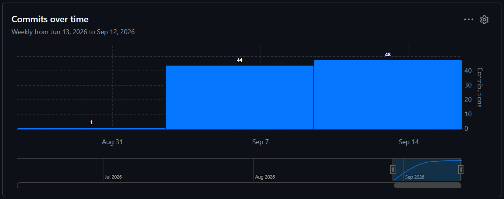
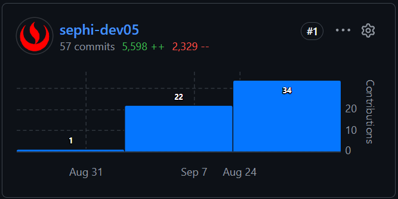
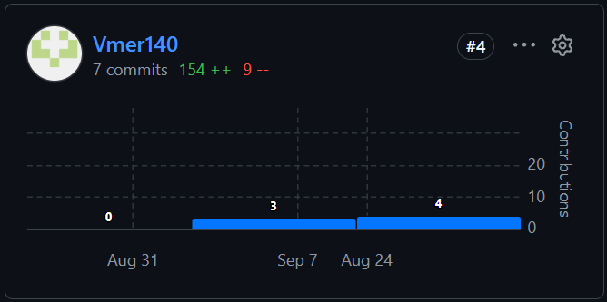
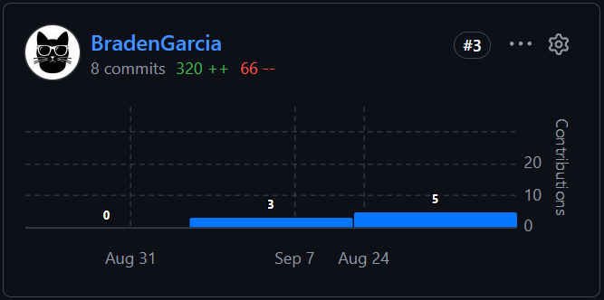
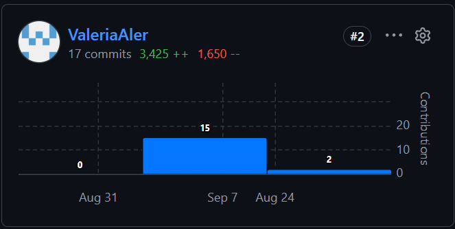
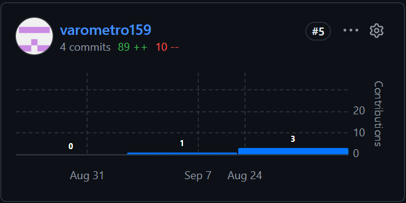

# **Project Report Collaboration Insights**

Esta sección presenta la organización del trabajo colaborativo realizado durante la entrega <strong>AV1</strong>, así como las evidencias de participación de los integrantes del equipo en la elaboración del informe. La información expuesta guarda correspondencia con las responsabilidades asignadas y con el <em>Report Version Log</em>.

<table style="width: 100%; border-collapse: collapse; table-layout: fixed; margin: 16px 0 22px 0;">
  <thead>
    <tr style="background-color: #1f4e78; color: #ffffff;">
      <th style="width: 30%; border: 1px solid #808080; padding: 10px; text-align: left;">Recurso</th>
      <th style="width: 70%; border: 1px solid #808080; padding: 10px; text-align: left;">Enlace</th>
    </tr>
  </thead>
  <tbody>
    <tr>
      <td style="border: 1px solid #808080; padding: 10px;"><strong>Organización de GitHub</strong></td>
      <td style="border: 1px solid #808080; padding: 10px; word-break: break-word;"><a href="https://github.com/meditrack-mobile-app-1acc0238-2620-4949">MediTrack Mobile App</a></td>
    </tr>
    <tr style="background-color: #f4f7fa;">
      <td style="border: 1px solid #808080; padding: 10px;"><strong>Repositorio del informe</strong></td>
      <td style="border: 1px solid #808080; padding: 10px; word-break: break-word;"><a href="https://github.com/meditrack-mobile-app-1acc0238-2620-4949/safelab-report">safelab-report</a></td>
    </tr>
  </tbody>
</table>

## **AV1**

### **Desarrollo de las actividades del informe**

Para la primera entrega, el equipo distribuyó las secciones del informe de acuerdo con los bloques temáticos definidos en el plan de trabajo. Cada integrante desarrolló el contenido asignado en Markdown, incorporó sus avances al repositorio del informe y registró los cambios mediante commits. Posteriormente, se revisó la consistencia entre las secciones, las evidencias, el reporte de participación y el registro de versiones. Este flujo permitió mantener trazabilidad sobre la autoría de los aportes y consolidar el documento de manera progresiva.

<table style="width: 100%; border-collapse: collapse; table-layout: fixed; margin: 16px 0 22px 0; font-size: 0.94em;">
  <thead>
    <tr style="background-color: #1f4e78; color: #ffffff;">
      <th style="width: 28%; border: 1px solid #808080; padding: 9px; text-align: left;">Integrante</th>
      <th style="width: 72%; border: 1px solid #808080; padding: 9px; text-align: left;">Aporte principal en AV1</th>
    </tr>
  </thead>
  <tbody>
    <tr>
      <td style="border: 1px solid #808080; padding: 9px;">Carlos Lavado, Ever Giusephi</td>
      <td style="border: 1px solid #808080; padding: 9px; text-align: justify;">Elaboración del <em>Startup Profile</em>, <em>Event Storming</em>, <em>Ubiquitous Language</em>, diseño estratégico y táctico basado en DDD, contextos delimitados y diagramas de arquitectura, componentes, código y base de datos.</td>
    </tr>
    <tr style="background-color: #f4f7fa;">
      <td style="border: 1px solid #808080; padding: 9px;">Espino Rossi, Victor Manuel</td>
      <td style="border: 1px solid #808080; padding: 9px; text-align: justify;">Desarrollo del proceso <em>Lean UX</em>, análisis de competidores, estrategias frente a la competencia y conclusiones del informe.</td>
    </tr>
    <tr>
      <td style="border: 1px solid #808080; padding: 9px;">García Cerpa, Braden Raid</td>
      <td style="border: 1px solid #808080; padding: 9px; text-align: justify;">Diseño, registro y análisis de entrevistas, organización de las evidencias de investigación y preparación de los anexos.</td>
    </tr>
    <tr style="background-color: #f4f7fa;">
      <td style="border: 1px solid #808080; padding: 9px;">Rojas Gomez, Valeria Alexandra</td>
      <td style="border: 1px solid #808080; padding: 9px; text-align: justify;">Definición del problema y de los segmentos objetivo, elaboración de las historias de usuario, <em>Impact Mapping</em> y organización del <em>Product Backlog</em>.</td>
    </tr>
    <tr>
      <td style="border: 1px solid #808080; padding: 9px;">Vara Velásquez, Oscar Fernando</td>
      <td style="border: 1px solid #808080; padding: 9px; text-align: justify;">Elaboración de <em>User Personas</em>, <em>User Task Matrix</em>, <em>User Journey Mapping</em> y <em>Empathy Mapping</em>, además de la organización de la bibliografía.</td>
    </tr>
  </tbody>
</table>

### **Analítica general de colaboración**

  
  
<strong>Figura 1.</strong> Evolución de commits realizados por los integrantes del equipo.

La analítica general permite observar la incorporación progresiva de aportes al repositorio durante la preparación de la AV1. La evidencia debe interpretarse junto con el registro de versiones, pues cada commit representa una modificación concreta del informe y no únicamente una medida cuantitativa de participación. En consecuencia, la evaluación de la colaboración considera tanto la presencia de contribuciones como su relación con las responsabilidades asignadas.

### **Evidencias de commits por integrante**

  
  
<strong>Figura 2.</strong> Historial de contribuciones de Carlos Lavado, Ever Giusephi.

Los commits asociados a Carlos evidencian la incorporación y actualización de los contenidos de arquitectura y diseño dirigido por el dominio, en concordancia con el bloque técnico que le fue asignado para la entrega.

  
  
<strong>Figura 3.</strong> Historial de contribuciones de Espino Rossi, Victor Manuel.

Los commits asociados a Victor respaldan el desarrollo y refinamiento del proceso <em>Lean UX</em>, el análisis competitivo y la consolidación de las conclusiones correspondientes a la AV1.

  
  
<strong>Figura 4.</strong> Historial de contribuciones de García Cerpa, Braden Raid.

Los commits asociados a Braden muestran la integración de los artefactos de entrevistas, sus evidencias y análisis, así como la organización de los anexos que sustentan la investigación realizada.

  
  
<strong>Figura 5.</strong> Historial de contribuciones de Rojas Gomez, Valeria Alexandra.

Los commits asociados a Valeria reflejan la incorporación de la definición del problema, los segmentos objetivo y los artefactos de requisitos que orientan el alcance funcional del producto.

  
  
<strong>Figura 6.</strong> Historial de contribuciones de Vara Velásquez, Oscar Fernando.

Los commits asociados a Oscar respaldan la elaboración de los artefactos de investigación centrados en el usuario y la organización de las fuentes bibliográficas empleadas en el informe.

### **Conclusión de colaboración de la AV1**

Las evidencias recopiladas muestran la participación de los cinco integrantes en la construcción del informe de la AV1. La distribución por bloques permitió cubrir los componentes de negocio, investigación de usuarios, requisitos, experiencia de usuario y arquitectura de software. Asimismo, el uso del repositorio proporcionó trazabilidad sobre los cambios realizados y facilitó contrastar cada aporte con el <em>Report Version Log</em>.
