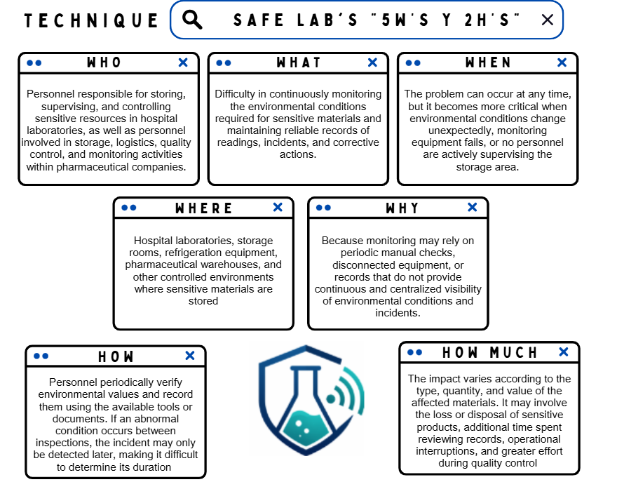

# **Chapter I: Introduction**
## **1.1. Startup Profile**
### **1.1.1. Startup Description**

  SafeLab is a technology startup dedicated to the digital transformation and operational safety of the bioclinical and pharmaceutical sectors. Our organization was born out of the need to address a critical vulnerability in the healthcare industry: the uncertainty and inefficiencies associated with the storage of highly sensitive biological materials. As a startup, we channeled all our technical and strategic efforts into our first major market deployment: the development of an innovative digital ecosystem that guarantees the absolute preservation of the clinical cold chain. At SafeLab, we don't just develop software; we build trusted infrastructures that safeguard diagnostic quality and the sustainability of medical resources.

  The core of our value proposition is a comprehensive automated environmental monitoring platform, specifically designed for the rigorous demands of laboratories, hospitals, and pharmacy networks. Through the integration of hardware devices with a centralized dashboard, SafeLab's product replaces vulnerable, intermittent human oversight with continuous and predictive monitoring. Our solution allows healthcare professionals to configure precise alert and automatic mitigation rules, actively preventing the chemical degradation of reagents and vaccines. Our mission is to empower clinical staff by eliminating the burden associated with repetitive documentation tasks, allowing them to focus their time and expertise exclusively on analytical management and patient care.

  From an operational and commercial perspective, SafeLab structures its services under a B2B (Business-to-Business) model supported by a SaaS (Software as a Service) architecture. This approach allows us to provide healthcare institutions with a highly scalable and rapidly deployable solution, where a corporate subscription guarantees uninterrupted access to real-time auditing tools, automated reports for regulatory compliance, and complete immutability in the retention of historical data. SafeLab's long-term vision is to become the regional standard for the intelligent management of biological inventories, driving healthcare institutions toward an operational model guided by pragmatic innovation and an unwavering commitment to a "Zero Waste" culture.

### **1.1.2. Team Member Profiles**

<table style="width: 100%;">
  <!-- MEMBER 1 -->
  <tr>
    <td style="text-align: center; width: 40%; vertical-align: center;">
      
    </td>
    <td style="text-align: justify; width: 60%; vertical-align: top;">
      <h3>Carlos Lavado, Ever Giusephi</h3>
      

        <b>Student code:</b> U202224867
      

      

        <b>Age:</b> 21
      

      

        <b>Degree:</b> Software engineering
      

      

        <b>About me:</b> I am 21 years old and I am currently studying software engineering at the UPC. I am fascinated by how technology has evolved over the years and that is why I chose this career. In my free time, I enjoy playing video games and hope to improve my way of thinking before programming, as well as my programming skills.
      

    </td>
  </tr>

  <!-- MEMBER 2 -->
  <tr>
    <td style="text-align: center; width: 40%; vertical-align: center;">
      
    </td>
    <td style="text-align: justify; width: 60%; vertical-align: top;">
      <h3>Espino Rossi, Victor Manuel</h3>
      

        <b>Student code:</b> U202411567
      

      

        <b>Age:</b> xx
      

      

        <b>Degree:</b> ... engineering
      

      

        <b>About me:</b> I ...
      

    </td>
  </tr>

  <!-- MEMBER 3 -->
  <tr>
    <td style="text-align: center; width: 40%; vertical-align: center;">
      
    </td>
    <td style="text-align: justify; width: 60%; vertical-align: top;">
      <h3>Garcia Cerpa, Braden Raid</h3>
      

        <b>Student code:</b> U202415618
      

      

        <b>Age:</b> 21
      

      

        <b>Degree:</b> Software engineering
      

      

        <b>About me:</b> I am a Software Engineering student with an interest in developing technological solutions. I focus on applying good programming practices and teamwork to solve real problems. In this project, I aim to contribute innovative ideas to achieve high-quality results.
      

    </td>
  </tr>

 <!-- MEMBER 4 -->
<tr>
  <td style="text-align: center; width: 40%; vertical-align: center;">
    
  </td>
  <td style="text-align: justify; width: 60%; vertical-align: top;">
    <h3>Rojas Gómez, Valeria Alexandra</h3>
    

      <b>Student code:</b> U202411373
    

    

      <b>Age:</b> 19
    

    

      <b>Degree:</b> Software engineering
    

    

      <b>About me:</b> I have knowledge of frontend and backend development technologies such as Angular, Java, Spring Boot, and REST APIs, as well as experience working with SQL and NoSQL databases. Regarding my skills, I strive to stay organized, listen to others' opinions, and contribute to teamwork while meeting the deadlines agreed upon by the team.
    

  </td>
</tr>

  <!-- MEMBER 5 -->
  <tr>
    <td style="text-align: center; width: 40%; vertical-align: center;">
      
    </td>
    <td style="text-align: justify; width: 60%; vertical-align: top;">
      <h3>Vara Velásquez, Oscar Fernando</h3>
      

        <b>Student code:</b> U202411622
      

      

        <b>Age:</b>21
      

        <b>Degree:</b> Software engineering
      

      

        <b>About me:</b> I am a software engineering student focused on creating technological solutions tailored to user needs. I possess a knack for quickly acquiring new knowledge and excel at teamwork.
      

    </td>
  </tr>
</table>

## **1.2. Solution Profile**
### **1.2.1. Background and Problem Statement**

  Hospital laboratories and pharmaceutical companies manage samples, reagents, medicines, supplies, and other sensitive resources that require specific environmental conditions during storage. Variables such as temperature and humidity can directly affect the stability, quality, and usability of these materials when they remain outside their required ranges for extended periods. Because these resources are involved in laboratory operations, pharmaceutical storage, quality control, and distribution processes, maintaining appropriate environmental conditions is an important part of their proper management.

  In many cases, the supervision of these conditions still depends on periodic inspections, manual records, isolated monitoring devices, or information that is reviewed only after an incident has occurred. This creates periods in which personnel do not have continuous visibility of what is happening inside storage areas or equipment, especially outside regular working hours or when unexpected environmental variations or equipment failures occur.

  For hospital laboratories, inadequate monitoring can affect the preservation of samples, reagents, and laboratory supplies required for daily operations. In pharmaceutical companies, similar situations can compromise medicines, pharmaceutical products, and other sensitive materials during storage. In both cases, detecting an environmental deviation too late can lead to material losses, additional operational work, interruptions in normal activities, and difficulties when reviewing historical information for quality control or audit processes.

  Another relevant issue is the fragmentation of information. Environmental readings, incidents, equipment conditions, and corrective actions may be registered through different tools or documents. As a result, personnel may have difficulty determining what happened, when the incident occurred, how long an abnormal condition lasted, which resources may have been affected, and what actions were taken in response.

  To obtain a clearer understanding of the problem, the 5W’s and 2H’s technique was applied. The following figure summarizes the main elements identified regarding the actors involved, the nature of the problem, the environments where it occurs, the circumstances in which it becomes critical, its causes, the current monitoring process, and its potential impact.

  

  <em>Figure 1. SafeLab 5W’s and 2H’s analysis.</em>

### **1.2.2. Lean UX Process**
#### **1.2.2.1. Lean UX Problem Statements**
#### **1.2.2.2. Lean UX Assumptions**
#### **1.2.2.3. Lean UX Hypothesis Statements**
#### **1.2.2.4. Lean UX Canvas**
## **1.3. Target Segments**
