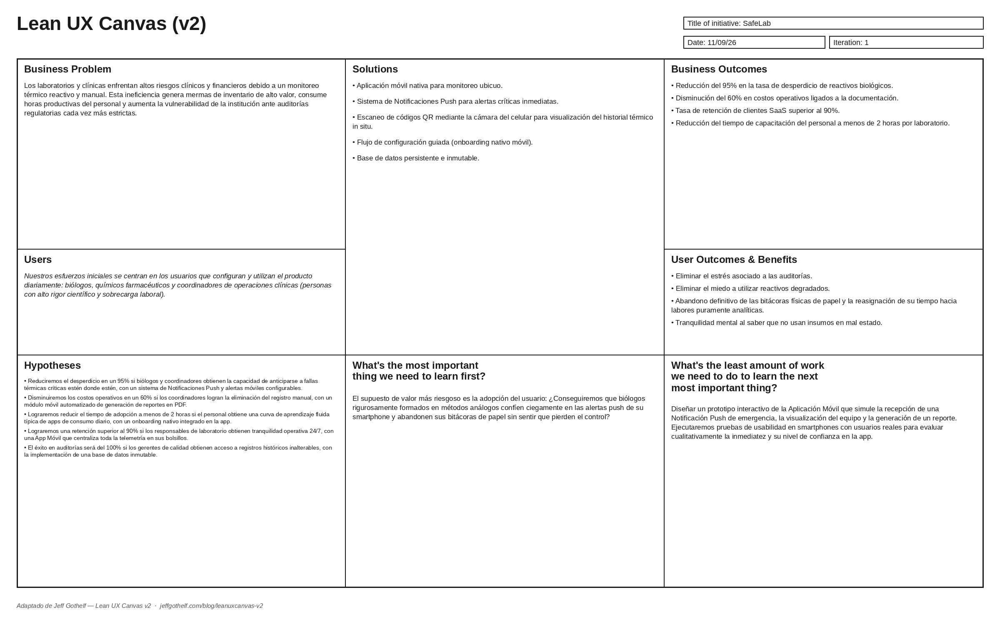

# **Chapter I: Introduction**

## **1.1. Startup Profile**

### **1.1.1. Startup Description**

  SafeLab es una startup tecnológica dedicada a la transformación digital y a la seguridad operativa de los sectores bioclínico y farmacéutico. Nuestra organización surgió de la necesidad de abordar una vulnerabilidad crítica en el sector sanitario: la incertidumbre y las ineficiencias asociadas al almacenamiento de materiales biológicos altamente sensibles. Como startup, concentramos todos nuestros esfuerzos técnicos y estratégicos en nuestro primer gran despliegue en el mercado: el desarrollo de un ecosistema digital innovador que garantiza la preservación absoluta de la cadena de frío clínica. En SafeLab no solo desarrollamos software; construimos infraestructuras de confianza que salvaguardan la calidad del diagnóstico y la sostenibilidad de los recursos médicos.

  El núcleo de nuestra propuesta de valor es una plataforma integral y automatizada de monitoreo ambiental, diseñada específicamente para satisfacer las rigurosas exigencias de laboratorios, hospitales y redes de farmacias. Mediante la integración de dispositivos de hardware con un panel de control centralizado, el producto de SafeLab sustituye la supervisión humana —vulnerable e intermitente— por un monitoreo continuo y predictivo. Nuestra solución permite a los profesionales de la salud configurar reglas precisas de alerta y mitigación automática, previniendo así activamente la degradación química de reactivos y vacunas. Nuestra misión es empoderar al personal clínico eliminando la carga que suponen las tareas repetitivas de documentación, lo que les permite dedicar su tiempo y experiencia exclusivamente a la gestión analítica y a la atención del paciente.

  Desde una perspectiva operativa y comercial, SafeLab estructura sus servicios bajo un modelo B2B (<i>Business-to-Business</i>) respaldado por una arquitectura SaaS (<i>Software as a Service</i>). Este enfoque nos permite ofrecer a las instituciones sanitarias una solución altamente escalable y de rápida implementación, en la que una suscripción corporativa garantiza el acceso ininterrumpido a herramientas de auditoría en tiempo real, informes automatizados para el cumplimiento normativo y una inmutabilidad total en la conservación de datos históricos. La visión a largo plazo de SafeLab es convertirse en el estándar regional para la gestión inteligente de inventarios biológicos, impulsando a las instituciones sanitarias hacia un modelo operativo guiado por la innovación pragmática y un compromiso inquebrantable con una cultura de «cero residuos».

### **1.1.2. Team Member Profiles**

<table style="width: 94%; margin: 0 auto; border-collapse: collapse;">
  <!-- MEMBER 1 -->
  <tr style="page-break-inside: avoid; break-inside: avoid;">
    <td style="text-align: center; width: 35%; vertical-align: middle; padding: 16px 12px; border-bottom: 1px solid #d9d9d9;">
      
    </td>
    <td style="text-align: justify; width: 65%; vertical-align: top; padding: 16px 14px; border-bottom: 1px solid #d9d9d9;">
      <h3 style="text-align: left; margin: 0 0 10px 0;">Carlos Lavado, Ever Giusephi</h3>
      
<b>Código de estudiante:</b> U202224867

      
<b>Edad:</b> 21

      
<b>Carrera:</b> Ingeniería de Software

      
<b>Acerca de mí:</b> Estudio Ingeniería de Software en la UPC. Siempre me ha fascinado la evolución de la tecnología y su impacto en la vida cotidiana, lo cual me motivó a elegir esta carrera. A lo largo de mis estudios, he desarrollado competencias técnicas en desarrollo web e ingeniería de software, trabajando con tecnologías como HTML, CSS, JavaScript, Vue.js, Vite, C#, ASP.NET Core, Git y GitHub. También cuento con experiencia en la aplicación de prácticas de control de versiones, el trabajo con API RESTful y la creación de documentación técnica mediante Markdown. Además de mis conocimientos técnicos, me considero una persona responsable, adaptable y colaborativa, con una gran capacidad para la resolución de problemas y el aprendizaje continuo. En mi tiempo libre disfruto de los videojuegos, actividad que también me ayuda a desarrollar el pensamiento estratégico y la creatividad. Mi objetivo principal es seguir perfeccionando mi pensamiento analítico, así como mis habilidades de diseño y programación de software, para crear soluciones eficientes y bien estructuradas.

    </td>
  </tr>

  <!-- MEMBER 2 -->
  <tr style="page-break-inside: avoid; break-inside: avoid;">
    <td style="text-align: center; width: 35%; vertical-align: middle; padding: 16px 12px; border-bottom: 1px solid #d9d9d9;">
      
    </td>
    <td style="text-align: justify; width: 65%; vertical-align: top; padding: 16px 14px; border-bottom: 1px solid #d9d9d9;">
      <h3 style="text-align: left; margin: 0 0 10px 0;">Espino Rossi, Victor Manuel</h3>
      
<b>Código de estudiante:</b> U202411567

      
<b>Edad:</b> 19

      
<b>Carrera:</b> Ingeniería de Software

      
<b>Acerca de mí:</b> Soy un estudiante de Ingeniería de Software proactivo en la UPC, siempre dispuesto a tomar la iniciativa y poner las cosas en marcha. Me interesa especialmente la ciberseguridad y disfruto explorando cómo proteger los sistemas frente a amenazas.

    </td>
  </tr>

  <!-- MEMBER 3 -->
  <tr style="page-break-inside: avoid; break-inside: avoid;">
    <td style="text-align: center; width: 35%; vertical-align: middle; padding: 16px 12px; border-bottom: 1px solid #d9d9d9;">
      
    </td>
    <td style="text-align: justify; width: 65%; vertical-align: top; padding: 16px 14px; border-bottom: 1px solid #d9d9d9;">
      <h3 style="text-align: left; margin: 0 0 10px 0;">Garcia Cerpa, Braden Raid</h3>
      
<b>Código de estudiante:</b> U202415618

      
<b>Edad:</b> 21

      
<b>Carrera:</b> Ingeniería de Software

      
<b>Acerca de mí:</b> Soy estudiante de Ingeniería de Software interesado en desarrollar soluciones tecnológicas. Me centro en aplicar buenas prácticas de programación y el trabajo en equipo para resolver problemas reales. En este proyecto, busco aportar ideas innovadoras para lograr resultados de alta calidad.

    </td>
  </tr>

  <!-- MEMBER 4 -->
  <tr style="page-break-inside: avoid; break-inside: avoid;">
    <td style="text-align: center; width: 35%; vertical-align: middle; padding: 16px 12px; border-bottom: 1px solid #d9d9d9;">
      
    </td>
    <td style="text-align: justify; width: 65%; vertical-align: top; padding: 16px 14px; border-bottom: 1px solid #d9d9d9;">
      <h3 style="text-align: left; margin: 0 0 10px 0;">Rojas Gómez, Valeria Alexandra</h3>
      
<b>Código de estudiante:</b> U202411373

      
<b>Edad:</b> 19

      
<b>Carrera:</b> Ingeniería de Software

      
<b>Acerca de mí:</b> Poseo conocimientos en tecnologías de desarrollo frontend y backend, tales como Angular, Java, Spring Boot y API REST, así como experiencia trabajando con bases de datos SQL y NoSQL. En cuanto a mis habilidades, me esfuerzo por mantenerme organizado, escuchar las opiniones de los demás y contribuir al trabajo en equipo, cumpliendo al mismo tiempo con los plazos acordados por el grupo.

    </td>
  </tr>

  <!-- MEMBER 5 -->
  <tr style="page-break-inside: avoid; break-inside: avoid;">
    <td style="text-align: center; width: 35%; vertical-align: middle; padding: 16px 12px; border-bottom: 1px solid #d9d9d9;">
      
    </td>
    <td style="text-align: justify; width: 65%; vertical-align: top; padding: 16px 14px; border-bottom: 1px solid #d9d9d9;">
      <h3 style="text-align: left; margin: 0 0 10px 0;">Vara Velásquez, Oscar Fernando</h3>
      
<b>Código de estudiante:</b> U202411622

      
<b>Edad:</b> 21

      
<b>Carrera:</b> Ingeniería de Software

      
<b>Acerca de mí:</b> Soy estudiante de Ingeniería de Software y me centro en crear soluciones tecnológicas adaptadas a las necesidades de los usuarios. Poseo facilidad para adquirir nuevos conocimientos rápidamente y destaco en el trabajo en equipo.

    </td>
  </tr>
</table>

## **1.2. Solution Profile**

### **1.2.1. Background and Problem Statement**

  Los laboratorios hospitalarios y las empresas farmacéuticas gestionan muestras, reactivos, medicamentos, insumos y otros recursos sensibles que requieren condiciones ambientales específicas durante su almacenamiento. Variables como la temperatura y la humedad pueden afectar directamente a la estabilidad, la calidad y la utilidad de estos materiales cuando permanecen fuera de los rangos requeridos durante periodos prolongados. Dado que estos recursos intervienen en las operaciones de laboratorio, el almacenamiento farmacéutico, el control de calidad y los procesos de distribución, mantener unas condiciones ambientales adecuadas es un aspecto fundamental de su correcta gestión.

  En muchos casos, la supervisión de estas condiciones sigue dependiendo de inspecciones periódicas, registros manuales, dispositivos de monitoreo aislados o información que solo se revisa una vez ocurrido un incidente. Esto genera periodos en los que el personal carece de visibilidad continua sobre lo que sucede en las áreas de almacenamiento o en los equipos, especialmente fuera del horario laboral habitual o cuando se producen variaciones ambientales imprevistas o fallos en los equipos.

  En los laboratorios hospitalarios, una supervisión inadecuada puede afectar a la conservación de muestras, reactivos y suministros de laboratorio necesarios para las operaciones diarias. En las empresas farmacéuticas, situaciones similares pueden comprometer medicamentos, productos farmacéuticos y otros materiales sensibles durante su almacenamiento. En ambos casos, detectar una desviación ambiental con retraso puede derivar en pérdidas de material, carga de trabajo operativa adicional, interrupciones en las actividades habituales y dificultades al revisar información histórica para procesos de control de calidad o auditoría.

  Otro aspecto relevante es la fragmentación de la información. Las lecturas ambientales, los incidentes, el estado de los equipos y las acciones correctivas pueden registrarse mediante diferentes herramientas o documentos. Como resultado, al personal puede resultarle difícil determinar qué sucedió, cuándo ocurrió el incidente, cuánto tiempo persistió una condición anómala, qué recursos pudieron verse afectados y qué medidas se adoptaron en respuesta.

  Para comprender mejor el problema, se aplicó la técnica de las 5W y 2H. La siguiente figura resume los elementos principales identificados en relación con los actores involucrados, la naturaleza del problema, los entornos en los que se manifiesta, las circunstancias en las que se torna crítico, sus causas, el proceso de monitoreo actual y su impacto potencial.

  

  <em>Figura 1. Análisis 5W y 2H de SafeLab.</em>

### **1.2.2. Lean UX Process**

#### **1.2.2.1. Lean UX Problem Statements**

  <b>Contexto:</b> Las instituciones de salud, como laboratorios clínicos y farmacias hospitalarias, dependen de la integridad de inventarios biológicos —reactivos, vacunas y muestras— que requieren un control estricto de temperatura, generalmente entre 2 °C y 8 °C. La precisión de los diagnósticos médicos y la rentabilidad institucional están directamente ligadas a la estabilidad de estos suministros.

  <b>Observación del problema:</b> El proceso actual de control de la cadena de frío es, en gran parte, manual y reactivo, y suele depender de lecturas físicas o registradores de datos (<i>data loggers</i>) locales, como dispositivos USB, que no reportan información en tiempo real. Profesionales altamente especializados dedican hasta el 25 % de su jornada laboral a la transcripción de datos térmicos. Este método crea «puntos ciegos» críticos durante la madrugada y los fines de semana debido a la <b>falta de inmediatez y portabilidad de la información</b>, dejándolos sin capacidad de respuesta remota ante fallas de infraestructura o cortes de energía.

  <b>Impacto:</b> Esta deficiencia operativa y la falta de alertas móviles inmediatas representan un alto riesgo clínico por el uso potencial de insumos degradados, generando pérdidas económicas que pueden alcanzar miles de dólares por incidente. Además, la falta de trazabilidad digital inmutable expone a las instituciones a sanciones de entidades como DIGEMID o la FDA, poniendo en riesgo certificaciones de calidad como ISO 15189 (Kumru et al., 2014; OMS, 2020).

#### **1.2.2.2. Lean UX Assumptions**

<b>Supuestos sobre los usuarios</b>

<ul style="text-align: justify; margin: 0 3% 14px 4%; padding-left: 18px; line-height: 1.5;">
  <li>Creemos que nuestros usuarios son biólogos y coordinadores de laboratorio con cargas de trabajo excesivas y altos niveles de estrés.</li>
  <li>Creemos que estos profesionales valoran la inmediatez y precisión de los datos sobre las tareas administrativas.</li>
  <li>Creemos que el personal tiene una desconfianza profunda hacia las bitácoras manuales por su margen de error inherente.</li>
  <li>Creemos que los usuarios tienen alta familiaridad con el uso de aplicaciones móviles en su día a día, lo que reducirá la fricción al adoptar una herramienta de monitoreo en sus teléfonos inteligentes.</li>
  <li>Creemos que los laboratorios e instalaciones cuentan con redes Wi-Fi o conectividad móvil estable para soportar la telemetría continua hacia los dispositivos móviles.</li>
  <li>Creemos que las auditorías externas y el cumplimiento regulatorio representan la principal fuente de preocupación laboral del personal.</li>
</ul>

<b>Supuestos sobre los resultados para los usuarios</b>

<ul style="text-align: justify; margin: 0 3% 14px 4%; padding-left: 18px; line-height: 1.5;">
  <li>Creemos que los usuarios obtendrán tranquilidad al recibir alertas críticas inmediatas en sus dispositivos móviles, logrando visibilidad de sus equipos de refrigeración 24/7 sin importar dónde se encuentren.</li>
  <li>Creemos que el éxito del sistema para el usuario depende de la eliminación total de bitácoras en papel y errores de transcripción.</li>
  <li>Creemos que el personal podrá actuar preventivamente antes de que un reactivo sufra una degradación irreversible gracias a las notificaciones tempranas.</li>
  <li>Creemos que los usuarios lograrán una adopción técnica inmediata sin depender de manuales complejos o del departamento de TI.</li>
  <li>Creemos que la automatización liberará tiempo valioso del personal para enfocarse en tareas analíticas clínicas.</li>
</ul>

<b>Supuestos de negocio</b>

<ul style="text-align: justify; margin: 0 3% 14px 4%; padding-left: 18px; line-height: 1.5;">
  <li>Creemos que las pérdidas económicas por desperdicio de reactivos son significativamente mayores que el costo de suscripción de nuestro software.</li>
  <li>Creemos que los laboratorios medianos optarán por un modelo B2B SaaS si el ROI es demostrable de manera tangible en los primeros 3 a 6 meses de uso.</li>
  <li>Creemos que la usabilidad y la inmediatez de una solución móvil son vitales para evitar la resistencia operativa en entornos clínicos tradicionales.</li>
  <li>Creemos que el creciente rigor de los organismos reguladores de salud actuará como el principal motor de ventas.</li>
  <li>Creemos que la reputación de SafeLab se fortalecerá mediante la reducción comprobada de pérdidas entre los primeros clientes o usuarios pioneros (<i>early adopters</i>).</li>
</ul>

<b>Supuestos sobre los resultados de negocio</b>

<ul style="text-align: justify; margin: 0 3% 14px 4%; padding-left: 18px; line-height: 1.5;">
  <li>Creemos que la plataforma reducirá el desperdicio de material biológico en un 95 % durante el primer año de implementación.</li>
  <li>Creemos que lograremos una tasa de retención de clientes superior al 90 % anual gracias al valor crítico que ofrece el sistema.</li>
  <li>Creemos que los costos operativos de gestión de calidad en clínicas disminuirán un 60 % al automatizar la recolección de datos.</li>
  <li>Creemos que la experiencia de usuario nativa reducirá el tiempo de capacitación a menos de 2 horas por laboratorio.</li>
  <li>Creemos que la acumulación de datos históricos nos permitirá ofrecer servicios de analítica predictiva a futuro.</li>
</ul>

<b>Supuestos sobre las funcionalidades</b>

<ul style="text-align: justify; margin: 0 3% 14px 4%; padding-left: 18px; line-height: 1.5;">
  <li>Creemos que una aplicación móvil es la interfaz más eficiente para asegurar el acceso ubicuo y la respuesta rápida a incidentes, superando las limitaciones físicas de un software de escritorio.</li>
  <li>Creemos que la integración de notificaciones <i>push</i> reducirá el tiempo de respuesta del personal ante desviaciones térmicas a menos de 1 minuto.</li>
  <li>Creemos que la función de escanear códigos QR con la cámara del celular en los equipos de refrigeración acelerará la visualización del historial térmico <i>in situ</i>.</li>
  <li>Creemos que un motor de alertas con umbrales configurables permitirá adaptar la aplicación a la sensibilidad de cada reactivo.</li>
  <li>Creemos que un módulo móvil para la exportación y distribución de reportes PDF garantizará el cumplimiento fluido de estándares de auditoría.</li>
  <li>Creemos que una base de datos inmutable es esencial para garantizar la exactitud legal de la trazabilidad.</li>
</ul>

#### **1.2.2.3. Lean UX Hypothesis Statements**

<ol style="text-align: justify; margin: 0 3% 14px 4%; padding-left: 20px; line-height: 1.5;">
  <li style="margin-bottom: 8px;"><b>Creemos que</b> reduciremos el desperdicio de material biológico en un 95 % — <b>si</b> biólogos y coordinadores de laboratorio <b>obtienen</b> la capacidad de anticiparse a fallas térmicas críticas estén donde estén, <b>con</b> un sistema de notificaciones <i>push</i> y alertas móviles en tiempo real configurables por umbrales.</li>
  <li style="margin-bottom: 8px;"><b>Creemos que</b> reduciremos los costos operativos administrativos en un 60 % — <b>si</b> los coordinadores de operaciones clínicas <b>obtienen</b> la eliminación total del registro manual y la transcripción física, <b>con</b> el módulo móvil automatizado de generación y compartición de reportes normativos en PDF.</li>
  <li style="margin-bottom: 8px;"><b>Creemos que</b> lograremos reducir el tiempo de capacitación y adopción a menos de 2 horas por laboratorio — <b>si</b> el personal de salud <b>obtiene</b> una curva de aprendizaje fluida, similar a la de las aplicaciones de consumo diario, <b>con</b> un flujo de configuración guiada (<i>onboarding</i> nativo móvil) integrado en la aplicación.</li>
  <li style="margin-bottom: 8px;"><b>Creemos que</b> lograremos una retención de clientes superior al 90 % anual — <b>si</b> los responsables de laboratorio y biólogos <b>obtienen</b> tranquilidad operativa y visibilidad absoluta de su infraestructura 24/7, <b>con</b> una aplicación móvil que centraliza toda la telemetría directamente en sus dispositivos personales.</li>
  <li><b>Creemos que</b> reduciremos a cero las no conformidades documentales por falta de trazabilidad térmica durante auditorías — <b>si</b> los gerentes de calidad y entes reguladores <b>obtienen</b> acceso a registros históricos de temperatura inalterables, <b>con</b> la implementación de una base de datos persistente e inmutable accesible desde el ecosistema SafeLab.</li>
</ol>

#### **1.2.2.4. Lean UX Canvas**

  

  <em>Figura 2. Lean UX Canvas de SafeLab.</em>

## **1.3. Target Segments**

  SafeLab se centra en dos segmentos objetivo relacionados con el almacenamiento y la supervisión de recursos sensibles que requieren condiciones ambientales específicas. El primer segmento está compuesto por personal que trabaja en laboratorios hospitalarios, mientras que el segundo corresponde a empresas farmacéuticas que necesitan monitorear las condiciones de almacenamiento de medicamentos, productos farmacéuticos y otros materiales sensibles. Ambos segmentos operan en entornos donde la preservación de estos recursos depende de mantener condiciones de almacenamiento adecuadas y de llevar registros fiables de su monitoreo.

### **Segmento 1: Laboratorios Hospitalarios**

  Este segmento está integrado por el personal responsable de almacenar, supervisar y controlar muestras, reactivos, insumos y otros recursos sensibles en los laboratorios hospitalarios. Estos materiales requieren condiciones ambientales específicas para su correcta conservación, por lo que el monitoreo de variables como la temperatura y la humedad constituye una actividad importante en su labor diaria.

  En cuanto a las características demográficas, las entrevistas realizadas para SafeLab incluirán a profesionales de laboratorios hospitalarios de entre 20 y 70 años que trabajan en laboratorios y cuentan con distintos niveles de experiencia profesional.

  La magnitud de la infraestructura sanitaria en el Perú también respalda la relevancia de este segmento. Según el Instituto Nacional de Estadística e Informática (INEI, 2025), el Perú registró 23.217 establecimientos de salud en 2024, incluidos 637 hospitales distribuidos por todo el país. Si bien esta cifra no representa específicamente el número de laboratorios hospitalarios, ofrece una referencia cuantitativa del entorno institucional en el que opera este segmento objetivo.

### **Segmento 2: Empresas Farmacéuticas**

  Este segmento está compuesto por empresas farmacéuticas que necesitan supervisar las condiciones de almacenamiento de medicamentos, productos farmacéuticos y otros materiales sensibles. Estas organizaciones requieren trazabilidad de las condiciones ambientales, alertas ante desviaciones significativas y registros que puedan consultarse posteriormente para actividades de control y auditoría.

  Dado que este segmento es de carácter organizacional, sus características demográficas se representan a través del personal que participa en las actividades de almacenamiento y supervisión. Las entrevistas que se llevarán a cabo para el proyecto incluirán a personal en puestos relacionados con la logística, con edades comprendidas entre los 18 y los 50 años, abarcando tanto funciones operativas como de supervisión.

  La información estadística de la Dirección General de Medicamentos, Insumos y Drogas (DIGEMID, 2025) también evidencia la presencia de este sector en el Perú. Al 30 de junio de 2025, existían 35.726 establecimientos farmacéuticos privados activos y autorizados por la DIGEMID. De este total, 5.166 eran droguerías y 191 eran laboratorios farmacéuticos, lo que representa el 14,5 % y el 0,5 % del total, respectivamente. Estas categorías abarcan 5.357 establecimientos y son las más afines al perfil de empresa farmacéutica considerado por SafeLab, debido a su participación en actividades como el almacenamiento, la distribución y la producción de productos farmacéuticos.

