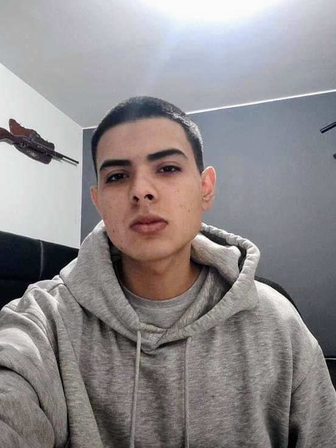

# **Chapter I: Introduction**
## **1.1. Startup Profile**
### **1.1.1. Startup Description**

  SafeLab is a technology startup dedicated to the digital transformation and operational safety of the bioclinical and pharmaceutical sectors. Our organization was born out of the need to address a critical vulnerability in the healthcare industry: the uncertainty and inefficiencies associated with the storage of highly sensitive biological materials. As a startup, we channeled all our technical and strategic efforts into our first major market deployment: the development of an innovative digital ecosystem that guarantees the absolute preservation of the clinical cold chain. At SafeLab, we don't just develop software; we build trusted infrastructures that safeguard diagnostic quality and the sustainability of medical resources.

  The core of our value proposition is a comprehensive automated environmental monitoring platform, specifically designed for the rigorous demands of laboratories, hospitals, and pharmacy networks. Through the integration of hardware devices with a centralized dashboard, SafeLab's product replaces vulnerable, intermittent human oversight with continuous and predictive monitoring. Our solution allows healthcare professionals to configure precise alert and automatic mitigation rules, actively preventing the chemical degradation of reagents and vaccines. Our mission is to empower clinical staff by eliminating the burden associated with repetitive documentation tasks, allowing them to focus their time and expertise exclusively on analytical management and patient care.

  From an operational and commercial perspective, SafeLab structures its services under a B2B (Business-to-Business) model supported by a SaaS (Software as a Service) architecture. This approach allows us to provide healthcare institutions with a highly scalable and rapidly deployable solution, where a corporate subscription guarantees uninterrupted access to real-time auditing tools, automated reports for regulatory compliance, and complete immutability in the retention of historical data. SafeLab's long-term vision is to become the regional standard for the intelligent management of biological inventories, driving healthcare institutions toward an operational model guided by pragmatic innovation and an unwavering commitment to a "Zero Waste" culture.

### **1.1.2. Team Member Profiles**

<table style="width: 100%;">
  <!-- MEMBER 1 -->
  <tr>
    <td style="text-align: center; width: 40%; vertical-align: center;">
      
    </td>
    <td style="text-align: justify; width: 60%; vertical-align: top;">
      <h3>Carlos Lavado, Ever Giusephi</h3>
      

        <b>Student code:</b> U202224867
      

      

        <b>Age:</b> 21
      

      

        <b>Degree:</b> Software engineering
      

      

        <b>About me:</b> I am 21 years old and I am currently studying software engineering at the UPC. I am fascinated by how technology has evolved over the years and that is why I chose this career. In my free time, I enjoy playing video games and hope to improve my way of thinking before programming, as well as my programming skills.
      

    </td>
  </tr>

  <!-- MEMBER 2 -->
  <tr>
    <td style="text-align: center; width: 40%; vertical-align: center;">
      
    </td>
    <td style="text-align: justify; width: 60%; vertical-align: top;">
      <h3>Espino Rossi, Victor Manuel</h3>
      

        <b>Student code:</b> U202411567
      

      

        <b>Age:</b> xx
      

      

        <b>Degree:</b> ... engineering
      

      

        <b>About me:</b> I ...
      

    </td>
  </tr>

  <!-- MEMBER 3 -->
  <tr>
    <td style="text-align: center; width: 40%; vertical-align: center;">
      
    </td>
    <td style="text-align: justify; width: 60%; vertical-align: top;">
      <h3>Garcia Cerpa, Braden Raid</h3>
      

        <b>Student code:</b> U202415618
      

      

        <b>Age:</b> 21
      

      

        <b>Degree:</b> Software engineering
      

      

        <b>About me:</b> I am a Software Engineering student with an interest in developing technological solutions. I focus on applying good programming practices and teamwork to solve real problems. In this project, I aim to contribute innovative ideas to achieve high-quality results.

      

    </td>
  </tr>

  <!-- MEMBER 4 -->
  <tr>
    <td style="text-align: center; width: 40%; vertical-align: center;">
      
    </td>
    <td style="text-align: justify; width: 60%; vertical-align: top;">
      <h3>Rojas Gomez, Valeria Alexandra</h3>
      

        <b>Student code:</b> U202411373
      

      

        <b>Age:</b> xx
      

      

        <b>Degree:</b> ... engineering
      

      

        <b>About me:</b> I ...
      

    </td>
  </tr>

  <!-- MEMBER 5 -->
  <tr>
    <td style="text-align: center; width: 40%; vertical-align: center;">
      
    </td>
    <td style="text-align: justify; width: 60%; vertical-align: top;">
      <h3>Vara Velásquez, Oscar Fernando</h3>
      

        <b>Student code:</b> U202411622
      

      

        <b>Age:</b> xx
      

        <b>Degree:</b> ... engineering
      

      

        <b>About me:</b> I ...
      

    </td>
  </tr>
</table>

## **1.2. Solution Profile**
### **1.2.1. Background and Problem Statement**
### **1.2.2. Lean UX Process**
#### **1.2.2.1. Lean UX Problem Statements**
#### **1.2.2.2. Lean UX Assumptions**
#### **1.2.2.3. Lean UX Hypothesis Statements**
#### **1.2.2.4. Lean UX Canvas**
## **1.3. Target Segments**
