# **Chapter II: Requirements Development and Software Solution Design**

## **2.1. Competitors**

### **2.1.1. Competitive Analysis**

  <b>¿Por qué realizar este análisis?</b>

  Identificar las barreras de entrada, tanto tecnológicas como económicas, impuestas por los líderes globales de monitoreo IoT, con el fin de validar la existencia de un nicho desatendido en instituciones de salud medianas y pequeñas. Este análisis permitirá posicionar a SafeLab como una alternativa ágil, clínicamente específica y económicamente accesible.

<table border="1" style="width: 100%; border-collapse: collapse;">
  <thead>
    <tr>
      <th style="text-align: center; vertical-align: middle; padding: 6px;">Atributo</th>
      <th style="text-align: center; vertical-align: middle; padding: 6px;">SafeLab</th>
      <th style="text-align: center; vertical-align: middle; padding: 6px;">SmartSense</th>
      <th style="text-align: center; vertical-align: middle; padding: 6px;">SenseAnywhere</th>
      <th style="text-align: center; vertical-align: middle; padding: 6px;">Monnit</th>
    </tr>
  </thead>
  <tbody>
    <tr>
      <td style="text-align: center; vertical-align: middle; padding: 6px;"><b>Descripción general</b></td>
      <td style="text-align: justify; vertical-align: top; padding: 6px;">Startup B2B SaaS enfocada en erradicar el desperdicio biológico mediante automatización ágil y accesible.</td>
      <td style="text-align: justify; vertical-align: top; padding: 6px;">Plataforma IoT corporativa de alto nivel para trazabilidad y cumplimiento normativo en redes hospitalarias y farmacéuticas.</td>
      <td style="text-align: justify; vertical-align: top; padding: 6px;">Sistema europeo de monitoreo en la nube enfocado en hardware de alta durabilidad y logística de cadena de frío.</td>
      <td style="text-align: justify; vertical-align: top; padding: 6px;">Proveedor global de soluciones de monitoreo remoto con sensores inalámbricos para múltiples industrias.</td>
    </tr>
    <tr>
      <td style="text-align: center; vertical-align: middle; padding: 6px;"><b>Ventaja competitiva</b></td>
      <td style="text-align: justify; vertical-align: top; padding: 6px;">Plataforma agnóstica de hardware, altamente contextualizada al flujo de trabajo de los biólogos.</td>
      <td style="text-align: justify; vertical-align: top; padding: 6px;">Capacidad de escala masiva e integración con sistemas ERP y estricto cumplimiento regulatorio (FDA).</td>
      <td style="text-align: justify; vertical-align: top; padding: 6px;">Fiabilidad extrema del hardware y registro ininterrumpido en la nube sin mantenimiento local.</td>
      <td style="text-align: justify; vertical-align: top; padding: 6px;">Accesibilidad económica inicial y alta personalización para monitorear múltiples variables.</td>
    </tr>
    <tr>
      <td style="text-align: center; vertical-align: middle; padding: 6px;"><b>Mercado objetivo</b></td>
      <td style="text-align: justify; vertical-align: top; padding: 6px;">Laboratorios clínicos y farmacias hospitalarias en ciudades emergentes o periféricas.</td>
      <td style="text-align: justify; vertical-align: top; padding: 6px;">Grandes hospitales, cadenas farmacéuticas nacionales y logística farmacéutica global.</td>
      <td style="text-align: justify; vertical-align: top; padding: 6px;">Almacenes de alta tecnología, laboratorios farmacéuticos y empresas de transporte logístico.</td>
      <td style="text-align: justify; vertical-align: top; padding: 6px;">Pequeñas y medianas empresas (PYMES) de agricultura, TI, alimentos, clínicas y otros sectores.</td>
    </tr>
    <tr>
      <td style="text-align: center; vertical-align: middle; padding: 6px;"><b>Estrategias de marketing</b></td>
      <td style="text-align: justify; vertical-align: top; padding: 6px;">Marketing de atracción (inbound) enfocado en la cultura de cero residuos y la simplificación de auditorías de calidad locales.</td>
      <td style="text-align: justify; vertical-align: top; padding: 6px;">Ventas corporativas B2B enfocadas en el retorno de inversión (ROI) mediante mitigación de riesgos legales.</td>
      <td style="text-align: justify; vertical-align: top; padding: 6px;">Presencia en ferias comerciales farmacéuticas globales.</td>
      <td style="text-align: justify; vertical-align: top; padding: 6px;">Marketing digital masivo, comercio electrónico directo y posicionamiento en motores de búsqueda a bajo costo.</td>
    </tr>
    <tr>
      <td style="text-align: center; vertical-align: middle; padding: 6px;"><b>Productos y servicios</b></td>
      <td style="text-align: justify; vertical-align: top; padding: 6px;">Aplicación web SPA e integración de API con hardware genérico y asequible de terceros.</td>
      <td style="text-align: justify; vertical-align: top; padding: 6px;">Software empresarial, gateways y sensores IoT propietarios.</td>
      <td style="text-align: justify; vertical-align: top; padding: 6px;">SenseAnywhere Cloud y AiroSensors, bajo un modelo de hardware propietario cerrado.</td>
      <td style="text-align: justify; vertical-align: top; padding: 6px;">Plataforma iMonnit y sensores inalámbricos ALTA.</td>
    </tr>
    <tr>
      <td style="text-align: center; vertical-align: middle; padding: 6px;"><b>Precios y costos</b></td>
      <td style="text-align: justify; vertical-align: top; padding: 6px;">Bajo. Modelo SaaS puro con pagos mensuales o anuales, permitiendo la reutilización de equipos genéricos.</td>
      <td style="text-align: justify; vertical-align: top; padding: 6px;">Muy alto. Contratos corporativos anuales que incluyen hardware costoso e instalación.</td>
      <td style="text-align: justify; vertical-align: top; padding: 6px;">Medio-Alto. Depende de sensores europeos especializados importados.</td>
      <td style="text-align: justify; vertical-align: top; padding: 6px;">Bajo-Medio. Hardware asequible y suscripciones mensuales o anuales por niveles.</td>
    </tr>
    <tr>
      <td style="text-align: center; vertical-align: middle; padding: 6px;"><b>Canales de distribución</b></td>
      <td style="text-align: justify; vertical-align: top; padding: 6px;">Ventas directas B2B y autorregistro (self-onboarding).</td>
      <td style="text-align: justify; vertical-align: top; padding: 6px;">Ventas corporativas directas. Plataforma web y aplicación móvil.</td>
      <td style="text-align: justify; vertical-align: top; padding: 6px;">Red de distribuidores oficiales. Plataforma web SaaS.</td>
      <td style="text-align: justify; vertical-align: top; padding: 6px;">Tienda en línea propia y distribuidores. Plataforma web y móvil.</td>
    </tr>
    <tr>
      <td style="text-align: center; vertical-align: middle; padding: 6px;"><b>Fortalezas</b></td>
      <td style="text-align: justify; vertical-align: top; padding: 6px;">Alta agilidad para pivotar, bajo costo estructural e interfaz diseñada específicamente para el usuario clínico.</td>
      <td style="text-align: justify; vertical-align: top; padding: 6px;">Fuerte reputación de marca y certificaciones internacionales.</td>
      <td style="text-align: justify; vertical-align: top; padding: 6px;">Hardware líder en el mercado, con hasta diez años sin necesidad de carga, y software altamente estable.</td>
      <td style="text-align: justify; vertical-align: top; padding: 6px;">Amplio catálogo de sensores e interfaz altamente personalizable.</td>
    </tr>
    <tr>
      <td style="text-align: center; vertical-align: middle; padding: 6px;"><b>Oportunidades</b></td>
      <td style="text-align: justify; vertical-align: top; padding: 6px;">Gran mercado de laboratorios medianos que aún utilizan procesos en papel porque no pueden costear a los competidores principales.</td>
      <td style="text-align: justify; vertical-align: top; padding: 6px;">Absorción de competidores más pequeños y contratos gubernamentales.</td>
      <td style="text-align: justify; vertical-align: top; padding: 6px;">Expansión en mercados emergentes y mejora en la integración de API.</td>
      <td style="text-align: justify; vertical-align: top; padding: 6px;">Crecimiento constante en la digitalización pospandemia de clínicas medianas.</td>
    </tr>
    <tr>
      <td style="text-align: center; vertical-align: middle; padding: 6px;"><b>Debilidades</b></td>
      <td style="text-align: justify; vertical-align: top; padding: 6px;">Falta de hardware propietario y de reconocimiento de marca en la etapa inicial.</td>
      <td style="text-align: justify; vertical-align: top; padding: 6px;">Inaccesible para clínicas pequeñas y requiere procesos de implementación corporativa lentos.</td>
      <td style="text-align: justify; vertical-align: top; padding: 6px;">Modelo de hardware cerrado; si un sensor se daña, debe importarse otro del fabricante.</td>
      <td style="text-align: justify; vertical-align: top; padding: 6px;">Plataforma demasiado genérica y no diseñada específicamente para flujos de trabajo del sector salud.</td>
    </tr>
    <tr>
      <td style="text-align: center; vertical-align: middle; padding: 6px;"><b>Amenazas</b></td>
      <td style="text-align: justify; vertical-align: top; padding: 6px;">Desconfianza inicial del sector salud hacia nuevas plataformas o ingreso de una gran empresa tecnológica al mercado de bajo costo.</td>
      <td style="text-align: justify; vertical-align: top; padding: 6px;">Aparición de startups ágiles y asequibles en mercados locales.</td>
      <td style="text-align: justify; vertical-align: top; padding: 6px;">Problemas en las cadenas globales de suministro de microchips que aumenten los costos de hardware.</td>
      <td style="text-align: justify; vertical-align: top; padding: 6px;">Soluciones especializadas que capten clientes del sector salud mediante interfaces más específicas.</td>
    </tr>
  </tbody>
</table>

### **2.1.2. Strategies and Tactics Against Competitors**

#### **Estrategias ofensivas**

  <b>Penetración mediante hiper-especialización y bajo costo.</b> Al cruzar nuestra fortaleza de contar con una arquitectura de software agnóstica, sin hardware propietario, con el mercado desatendido en ciudades de menos de 250 000 habitantes, nuestra táctica principal será ofrecer un modelo SaaS enfocado en el flujo de trabajo clínico. Mientras los competidores obligan a adquirir paquetes de sensores cerrados y costosos, SafeLab permitirá a los laboratorios medianos digitalizar sus procesos utilizando sensores locales genéricos, democratizando el acceso a tecnología de calidad y facilitando la entrada a este nicho.

#### **Estrategias adaptativas**

  <b>Alianzas estratégicas de distribución B2B.</b> Para contrarrestar nuestra principal debilidad, asociada a la falta de hardware propietario y al bajo reconocimiento de marca inicial, se aprovechará la creciente necesidad de digitalización mediante alianzas con distribuidores locales de refrigeradores médicos y proveedores de sensores IoT genéricos. SafeLab se ofrecerá como un valor agregado de software dentro de sus ventas, permitiendo llegar al cliente final a través de canales que ya cuentan con su confianza y reduciendo el costo de adquisición.

#### **Estrategias defensivas**

  <b>Diferenciación mediante usabilidad clínica (self-onboarding).</b> Frente a la desconfianza del sector salud hacia nuevas tecnologías o a la posible entrada de grandes empresas tecnológicas con soluciones de bajo costo, se aprovechará la agilidad y el diseño centrado en el usuario clínico. La táctica consiste en construir un flujo de incorporación Plug & Play y una interfaz con dashboard y reportes adaptados al contexto de auditorías locales, como ISO 15189, de modo que una plataforma genérica resulte menos adecuada para las necesidades específicas de los usuarios clínicos.

#### **Estrategias de supervivencia**

  <b>Validación temprana y cumplimiento normativo estricto.</b> La combinación de ser una marca nueva en un sector altamente regulado representa uno de los principales riesgos para la startup. Para reducir esta barrera, el software se diseñará considerando los formatos requeridos por las entidades regulatorias de salud. Asimismo, se implementarán programas piloto en laboratorios de ciudades secundarias para generar casos de éxito verificables y métricas de ROI, de manera que la falta de reputación inicial pueda compensarse con evidencia obtenida durante la validación.

## **2.2. Interviews**

### **2.2.1. Interview Design**

#### **Segmento 1: Laboratorios de Hospitales**

1. ¿Podrías contarnos tu nombre, edad, estado civil y el distrito donde vives?
2. Cuéntanos un poco sobre ti y qué sueles hacer en tu tiempo libre. ¿Cómo te describirías en tres palabras?
3. ¿Cuál es tu puesto actual en el laboratorio y cuántos años de experiencia tienes en este rol?
4. En tu día a día, ¿qué dispositivos tecnológicos usas más, y qué sistema operativo y navegador prefieres?
5. ¿Cómo es actualmente el proceso de monitoreo y control de muestras, reactivos e insumos en tu laboratorio, en el día a día?
6. ¿Cuánto tiempo estimas que dedican a registrar estos datos y a consolidar la información en reportes?
7. Cuéntame sobre la última vez que tuvieron un incidente crítico, como una desviación de temperatura, un corte de luz o pérdida de reactivos.
8. ¿Qué es lo que más te frustra o estresa de esta parte de tu trabajo actualmente?
9. Si existiera un sistema ideal para resolver estos problemas, ¿cómo sería?
10. Si un sistema detectara que una refrigeradora o congeladora está fallando, ¿preferirías solo recibir una notificación, o que el sistema intente una acción de contingencia automática?
11. Para que confíes al 100% en un sistema así, ¿qué información o garantías necesitarías que te muestre?
12. ¿Hay algo más sobre tu trabajo con muestras e insumos sensibles que consideres importante mencionar?

#### **Segmento 2: Empresas Farmacéuticas**

1. ¿Podrías contarnos tu nombre, edad, estado civil y el distrito donde vives?
2. Cuéntanos un poco sobre ti y qué sueles hacer en tu tiempo libre. ¿Cómo te describirías en tres palabras?
3. ¿Cuál es tu puesto actual dentro de la empresa y cuántos años de experiencia tienes en roles de almacenamiento, calidad o logística?
4. En tu día a día, ¿qué dispositivos tecnológicos usas más, y qué sistema operativo y navegador prefieres?
5. ¿Cómo es actualmente el proceso de monitoreo de condiciones de almacenamiento de medicamentos, incluyendo trazabilidad y registros para auditoría?
6. ¿Cuánto tiempo estima tu equipo que dedica a consolidar los registros ambientales y preparar documentación para auditorías regulatorias?
7. Cuéntame sobre la última vez que tuvieron un incidente crítico, como una excursión de temperatura durante el almacenamiento o transporte que puso en riesgo un lote.
8. ¿Qué es lo que más te frustra o estresa de mantener la trazabilidad y el cumplimiento normativo actualmente?
9. Si existiera un sistema ideal para resolver estos problemas, ¿cómo sería?
10. Si un sistema detectara una desviación en una sala de almacenamiento o durante el transporte, ¿preferirías solo recibir una notificación, o que el sistema también active una acción de mitigación automática?
11. Para que confíes al 100% en un sistema así para auditorías regulatorias, ¿qué información o garantías necesitarías que te muestre?
12. ¿Hay algo más sobre trazabilidad, cumplimiento o monitoreo de la cadena de suministro que consideres importante mencionar?

### **2.2.2. Interview Recording**

  Para recopilar información cualitativa de ambos segmentos objetivo, se realizaron entrevistas que fueron consolidadas en el enlace mostrado a continuación, siguiendo el formato y la estructura definidos para esta sección.

  <b>Enlace:</b> <a href="https://youtu.be/5nNHZnFrHPo">https://youtu.be/5nNHZnFrHPo</a>

#### **Segmento 1: Laboratorios de Hospitales**

##### **Entrevista 1: Rosa Elena Campos Idme**

  <b>Fecha:</b> 3 de septiembre de 2026 
  <b>Inicia en:</b> 00:00 
  <b>Duración:</b> 06:06

  

  Rosa Elena Campos Idme tiene 34 años, es casada y vive en el Cercado de Arequipa. Es bióloga y trabaja como Jefa del Laboratorio Clínico en un hospital de nivel II, donde supervisa el banco de sangre, los reactivos y los insumos sensibles. Se describe como meticulosa, responsable y tranquila bajo presión.

  Su proceso de monitoreo consiste en revisar manualmente tres refrigeradoras y dos congeladoras, tres veces por turno, utilizando un termómetro digital independiente y registrando cada lectura en una hoja de papel que posteriormente se transcribe a Excel al final del día, lo cual toma aproximadamente diez minutos por revisión. Recuerda un incidente crítico en el que la puerta de una congeladora quedó mal cerrada durante la noche, provocando una subida de seis grados que dañó un lote de reactivos valorizado en varios miles de soles y que fue descubierto recién a la mañana siguiente. Lo que más le frustra es que los registros en papel se pierden o se dañan y son difíciles de correlacionar históricamente, sobre todo cuando las auditorías de DIGESA/DIRESA exigen carpetas completas de registros físicos.

  Le gustaría contar con un sistema automatizado con alertas en tiempo real al celular y un registro de auditoría digital y exportable. Prefiere que el sistema le notifique de inmediato e incluya una acción recomendada para muestras críticas, en lugar de actuar de forma autónoma, aunque aceptaría ajustes automáticos menores para parámetros no críticos, como la humedad. Para confiar plenamente en el sistema, necesitaría evidencia de la calibración de los sensores, redundancia de energía de respaldo y cumplimiento de la normativa de salud local.

##### **Entrevista 2: Diego Armando Salazar Ttito**

  <b>Fecha:</b> 2 de septiembre de 2026 
  <b>Inicia en:</b> <a href="https://youtu.be/5nNHZnFrHPo?si=b9f9cZEKH0qweBCt&t=366">06:06</a> 
  <b>Duración:</b> 03:25

  

  Diego Armando Salazar Ttito tiene 27 años, es soltero y vive en Yanahuara, Arequipa. Trabaja como técnico de laboratorio en el turno noche del mismo hospital y se describe como responsable, tranquilo y algo «búho nocturno».

  Su rutina consiste en revisar los equipos de cadena de frío cada cuatro horas en dos pisos distintos, registrando los resultados en una hoja con papel carbón. Al ser el único técnico de guardia durante la noche, en una ocasión omitió una ronda programada debido al exceso de carga de trabajo y una desviación de temperatura no fue detectada hasta la llegada del turno siguiente. Lo que más le frustra es la falta de personal durante la noche y no contar con respaldo o retroalimentación si ocurre un problema mientras está solo.

  Su sistema ideal sería una aplicación móvil sencilla que le recuerde cuándo corresponden las rondas y le permita registrar la información con una sola acción, incorporando una escalación automática hacia un supervisor de guardia si no responde dentro de un tiempo determinado. Confiaría en un sistema que funcione de forma confiable incluso cuando el Wi-Fi del hospital sea inestable y que ofrezca un modo offline como respaldo.

#### **Segmento 2: Empresas Farmacéuticas**

##### **Entrevista 3: Camilo Paredes**

  <b>Fecha:</b> 3 de septiembre de 2026 
  <b>Inicia en:</b> <a href="https://youtu.be/5nNHZnFrHPo?si=Xt10dgSjdkz1G1WU&t=570">09:30</a> 
  <b>Duración:</b> 05:09

  

  Camilo Paredes Vites tiene 31 años, vive en Los Olivos, Lima, y señaló estar casada. Es profesional de Ingeniería Química y trabaja como Supervisor de Control de Calidad en una planta farmacéutica, supervisando las salas de frío y el almacén de vacunas y medicamentos. Se describe como una persona detallista, disciplinada y proactiva.

  Su equipo depende actualmente de dataloggers semi-manuales que deben descargarse físicamente mediante USB y procesarse en Excel cada semana para mantener la trazabilidad exigida por DIGEMID, incluyendo lotes, fechas de vencimiento y registros de temperatura. Recuerda un incidente crítico en el que un lote de insulina tuvo que ser destruido después de que una auditoría revelara un vacío de datos causado por un corte de energía que el datalogger no registró a tiempo, generando una pérdida económica considerable y una observación regulatoria. Lo que más le frustra son las horas semanales dedicadas a consolidar datos manualmente y la dificultad de unificar la información de la cadena de custodia, dividida entre papel y hojas de cálculo.

  Imagina un dashboard en la nube conectado en tiempo real a los sensores, capaz de generar automáticamente reportes conformes al formato de DIGEMID y mantener un registro de auditoría inalterable. Recibiría con agrado tanto notificaciones instantáneas como acciones de mitigación automáticas, por ejemplo, activar un generador de respaldo, siempre que cada acción automatizada quede registrada para fines de auditoría. Para confiar en el sistema, necesitaría validación de la integridad de los datos alineada con los principios ALCOA+, redundancia de infraestructura y la capacidad de exportar registros para envíos regulatorios.

##### **Entrevista 4: Diego Gabriel Huamaní Ríos**

  <b>Fecha:</b> 4 de septiembre de 2026 
  <b>Inicia en:</b> <a href="https://youtu.be/5nNHZnFrHPo?si=-vB8kZTB4MGwcUlY&t=879">14:39</a> 
  <b>Duración:</b> 04:25

  

  Diego Gabriel Huamaní Ríos es un ingeniero recién egresado de 24 años, soltero y residente de San Borja, que trabaja como Analista Junior de Calidad. Cuenta con casi dos años de experiencia enfocados en temas de almacenamiento y cadena de frío. En su tiempo libre disfruta de los videojuegos, la tecnología y el ciclismo, y se describe a sí mismo como curioso, tecnológico y analítico.

  En su día a día, trabaja con un proceso de monitoreo de temperatura altamente manual y desactualizado. Su equipo invierte entre 10 y 12 horas semanales desplazándose físicamente a los refrigeradores, extrayendo dataloggers por USB y trasladando los datos a Excel para generar gráficas orientadas a auditorías regulatorias. Lo que más le frustra y estresa es realizar trabajo repetitivo de «copiar y pegar», sumado a la falta de visibilidad en tiempo real, que ocasiona que los problemas se conozcan cuando ya han ocurrido. Las consecuencias de este sistema se evidenciaron en un incidente reciente: un sábado por la noche falló la refrigeradora principal. Aunque la alarma sonora local se activó, no había personal en las instalaciones para escucharla y el correo de alerta llegó con retraso, lo que obligó a poner en cuarentena un lote grande de medicamentos termosensibles.

  Para resolver esta problemática, Diego visualiza un sistema ideal basado en la nube, moderno y fácil de usar, equipado con sensores inalámbricos y una aplicación móvil nativa. Considera vital recibir notificaciones al instante y poder exportar reportes de auditoría con una sola acción. Sin embargo, su principal expectativa es que la plataforma sea proactiva: prefiere un sistema que active acciones de mitigación automática, como encender un equipo de enfriamiento de respaldo al detectar una desviación, en lugar de limitarse a enviar una alerta al celular.

##### **Entrevista 5: Carlos Montero**

  <b>Fecha:</b> 5 de septiembre de 2026 
  <b>Inicia en:</b> <a href="https://youtu.be/5nNHZnFrHPo?si=SMuOglMlLqDQZkDf&t=1144">19:04</a> 
  <b>Duración:</b> 05:43

  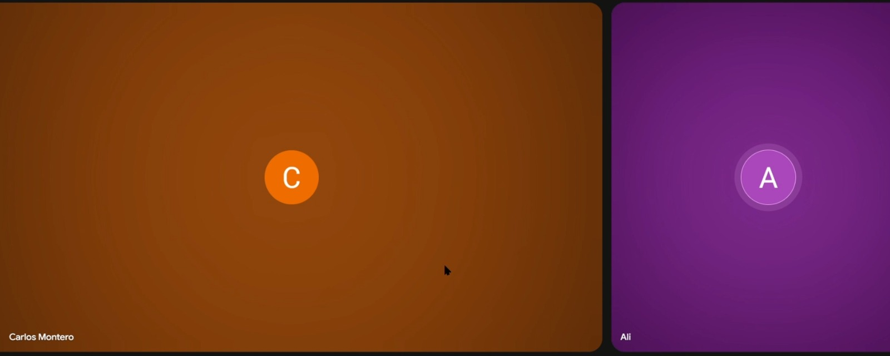

  Carlos Montero tiene 24 años, es soltero y vive en Surquillo, Lima. Trabaja como Asistente de Logística con alrededor de dos años de experiencia, encargándose de apoyar en la recepción de productos, el control de inventario, la coordinación de despachos y la revisión de las condiciones del almacén. Se describe como minucioso y aficionado a los videojuegos.

  Actualmente, el monitoreo que realiza es manual: utiliza dataloggers que deben descargarse físicamente mediante USB, lo que le resulta frustrante por la pérdida de tiempo asociada a tener que desplazarse para revisarlos. Además, el cierre de mes se vuelve pesado al tener que consolidar información repartida en diferentes archivos. Recuerda un incidente crítico en el que una variación de temperatura puso en riesgo un lote y el equipo no lo detectó hasta que el daño ya se había producido.

  Imagina un sistema en la nube que centralice las conexiones de todas las zonas del almacén y muestre la temperatura y la humedad en tiempo real mediante actualizaciones automáticas. Necesita que este sistema envíe alertas rápidas y preventivas antes de que se superen los límites establecidos. Para confiar plenamente en la plataforma, requiere que genere reportes de forma sencilla y mantenga un historial inalterable y seguro, asegurando que cualquier modificación quede registrada para facilitar las auditorías y garantizar el cumplimiento normativo.

### **2.2.3. Interview Analysis**

#### **Segmento 1: Laboratorios de Hospitales**

##### **Características**

- **Sexo:** Femenino (50%), Masculino (50%).
- **Edad:** 27–34 años.
- **Dispositivos:** Smartphone (100%), laptop/computadora (50%, equipo compartido del hospital).
- **Sistemas operativos:** Android, Windows.
- **Navegadores:** Chrome.
- **Influencia de marcas:** Equipos de refrigeración (Haier Biomedical, Thermo Fisher) y comunicación (WhatsApp).

##### **Objetivos comunes**

- Dejar de depender de procesos manuales y en papel para el monitoreo de muestras e insumos sensibles.
- Tener visibilidad confiable y en tiempo real sobre el estado de los equipos de refrigeración.
- Reducir el tiempo dedicado a registrar y consolidar datos.
- Superar auditorías regulatorias sin tener que preparar registros físicos a último momento.

##### **Motivaciones comunes**

- Proteger la integridad de las muestras biológicas y reactivos para evitar pérdidas.
- Evitar ser responsabilizados por incidentes prevenibles causados por vacíos en la supervisión manual.
- Sentirse respaldados, especialmente durante turnos aislados con poco personal.

##### **Frustraciones comunes**

- Procesos de monitoreo manuales y propensos a errores.
- Dificultad para correlacionar datos históricos almacenados en registros de papel.
- Falta de apoyo o escalamiento cuando ocurren incidentes en turnos con poco personal.

#### **Segmento 2: Empresas Farmacéuticas**

##### **Características**

- **Sexo:** Femenino (0%), Masculino (100%).
- **Edad:** 24–31 años.
- **Dispositivos:** Smartphone (100%), laptop/computadora (100%, corporativa en el caso de Control de Calidad y Logística).
- **Sistemas operativos:** Windows, iOS.
- **Navegadores:** Chrome, Brave.
- **Influencia de marcas:** Marco regulatorio (DIGEMID), proveedores de dataloggers USB y sistemas ERP.

##### **Objetivos comunes**

- Eliminar la dependencia de dataloggers USB y registros en papel que deben extraerse y consolidarse manualmente.
- Tener una única fuente de verdad que unifique la información actualmente repartida entre distintos archivos, hojas de cálculo y ubicaciones.
- Automatizar la generación de reportes de auditoría y trazabilidad conforme a la normativa de DIGEMID.
- Contar con un sistema que avise de forma proactiva ante una desviación, antes de que el problema se agrave, y no únicamente después de superado el límite.

##### **Motivaciones comunes**

- Evitar pérdidas económicas por lotes de producto dañados, puestos en riesgo o destruidos.
- Mantener el estatus regulatorio de la empresa y superar auditorías sin contratiempos ni documentación preparada a último momento.
- Reducir la carga de trabajo manual y repetitiva asociada a la documentación de cumplimiento, como la extracción de dataloggers, la consolidación en Excel y los cierres de mes.
- Evitar que el personal sea señalado individualmente por errores o incidentes originados en procesos manuales deficientes y no en su desempeño.

##### **Frustraciones comunes**

- Procesos de monitoreo manuales, como dataloggers USB y revisiones físicas, que consumen varias horas a la semana y generan trabajo repetitivo de «copiar y pegar».
- Visibilidad nula o tardía en tiempo real: los problemas, como una desviación de temperatura o un lote en riesgo, se descubren cuando el daño ya ocurrió.
- Información fragmentada entre distintos archivos, documentos y ubicaciones, lo que complica especialmente el cierre de mes y la preparación de auditorías.
- Falta de consenso sobre el nivel de autonomía deseado del sistema: mientras algunos usuarios confiarían en acciones de mitigación totalmente automáticas, otros prefieren que determinadas acciones críticas pasen primero por la revisión y aprobación de una persona.

## **2.3. Needfinding**

  En esta sección se presentan los artefactos resultantes del análisis de la información recolectada en las entrevistas de la sección 2.2.3 y en el análisis competitivo de la sección 2.1.1. A partir de las características demográficas, objetivos, motivaciones y frustraciones identificadas para cada segmento objetivo, se construyeron los User Personas, el User Task Matrix, los User Journey Maps y los Empathy Maps correspondientes mediante la herramienta UXPressia.

### **2.3.1. User Personas**

  Se elaboró una ficha de User Persona para cada segmento objetivo, considerando las características demográficas y subjetivas más representativas identificadas en el análisis de entrevistas, así como el posicionamiento frente a la competencia de la sección 2.1.1, que evidencia la necesidad de una solución ágil y de bajo costo para laboratorios e instituciones de salud medianas.

#### **Segmento 1: Laboratorios de Hospitales**

  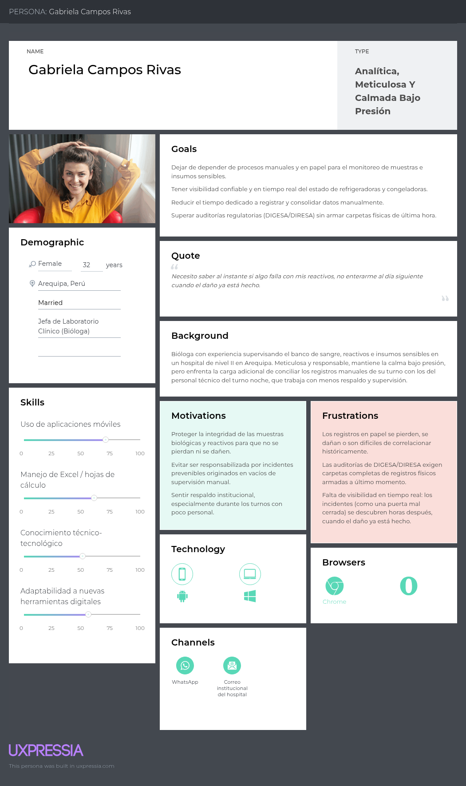

  Gabriela Campos Rivas representa al personal de laboratorio clínico responsable de la supervisión del banco de sangre, reactivos e insumos sensibles. Su perfil refleja la dependencia de procesos manuales de monitoreo y la necesidad de contar con visibilidad en tiempo real para prevenir incidentes críticos.

#### **Segmento 2: Empresas Farmacéuticas**

  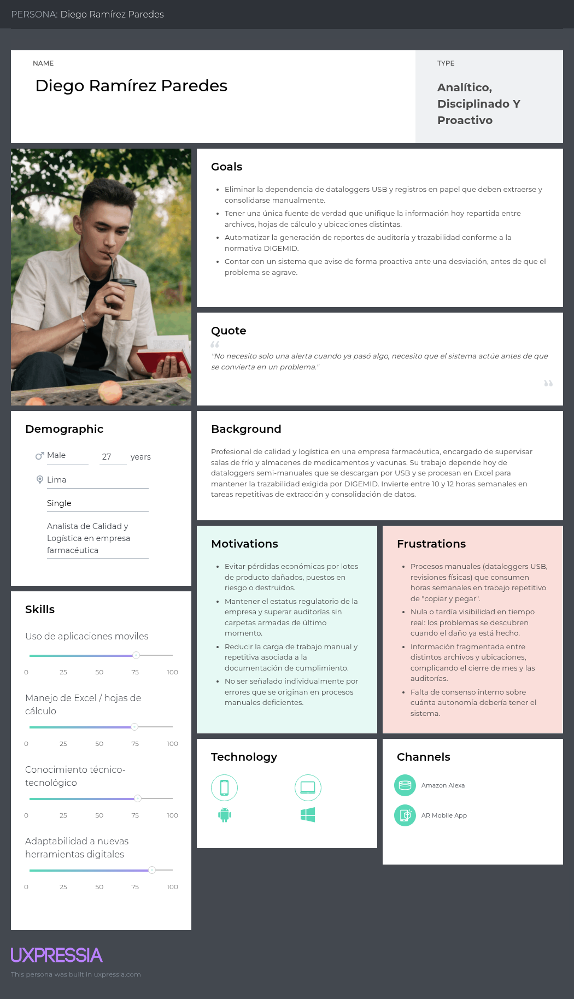

  Diego Ramírez Paredes representa al personal de calidad y logística responsable de la trazabilidad regulatoria de DIGEMID en el almacenamiento de medicamentos y vacunas. Su perfil refleja la carga operativa asociada a la consolidación manual de datos y la necesidad de automatizar el cumplimiento normativo.

### **2.3.2. User Task Matrix**

  El siguiente User Task Matrix concentra las tareas que realizan los dos segmentos objetivo identificados para el proyecto SafeLab, representados por sus respectivos User Personas: <b>Gabriela Campos Rivas</b> (Segmento 1: Laboratorios de Hospitales) y <b>Diego Ramírez Paredes</b> (Segmento 2: Empresas Farmacéuticas). Las tareas corresponden a actividades que ambos perfiles realizan actualmente de forma manual, independientemente de la existencia de una solución de software, y fueron identificadas a partir del análisis de las entrevistas registradas en la sección 2.2.3.

<table border="1" style="width: 100%; border-collapse: collapse;">
  <thead>
    <tr>
      <th style="text-align: center; vertical-align: middle; padding: 6px;">Tarea</th>
      <th style="text-align: center; vertical-align: middle; padding: 6px;">Gabriela Campos Rivas Frecuencia</th>
      <th style="text-align: center; vertical-align: middle; padding: 6px;">Gabriela Campos Rivas Importancia</th>
      <th style="text-align: center; vertical-align: middle; padding: 6px;">Diego Ramírez Paredes Frecuencia</th>
      <th style="text-align: center; vertical-align: middle; padding: 6px;">Diego Ramírez Paredes Importancia</th>
    </tr>
  </thead>
  <tbody>
    <tr><td style="text-align: justify; vertical-align: top; padding: 6px;">Monitorear manualmente la temperatura y humedad de refrigeradoras y congeladoras.</td><td style="text-align: center; vertical-align: middle; padding: 6px;">Diaria</td><td style="text-align: center; vertical-align: middle; padding: 6px;">Alta</td><td style="text-align: center; vertical-align: middle; padding: 6px;">Diaria</td><td style="text-align: center; vertical-align: middle; padding: 6px;">Alta</td></tr>
    <tr><td style="text-align: justify; vertical-align: top; padding: 6px;">Registrar lecturas de monitoreo en papel y transcribirlas a Excel.</td><td style="text-align: center; vertical-align: middle; padding: 6px;">Diaria</td><td style="text-align: center; vertical-align: middle; padding: 6px;">Alta</td><td style="text-align: center; vertical-align: middle; padding: 6px;">No aplica</td><td style="text-align: center; vertical-align: middle; padding: 6px;">—</td></tr>
    <tr><td style="text-align: justify; vertical-align: top; padding: 6px;">Descargar datos de dataloggers mediante USB.</td><td style="text-align: center; vertical-align: middle; padding: 6px;">No aplica</td><td style="text-align: center; vertical-align: middle; padding: 6px;">—</td><td style="text-align: center; vertical-align: middle; padding: 6px;">Semanal</td><td style="text-align: center; vertical-align: middle; padding: 6px;">Alta</td></tr>
    <tr><td style="text-align: justify; vertical-align: top; padding: 6px;">Consolidar información dispersa en archivos y hojas de cálculo.</td><td style="text-align: center; vertical-align: middle; padding: 6px;">Mensual</td><td style="text-align: center; vertical-align: middle; padding: 6px;">Media</td><td style="text-align: center; vertical-align: middle; padding: 6px;">Semanal</td><td style="text-align: center; vertical-align: middle; padding: 6px;">Alta</td></tr>
    <tr><td style="text-align: justify; vertical-align: top; padding: 6px;">Realizar rondas de inspección física de los equipos de refrigeración.</td><td style="text-align: center; vertical-align: middle; padding: 6px;">Diaria</td><td style="text-align: center; vertical-align: middle; padding: 6px;">Alta</td><td style="text-align: center; vertical-align: middle; padding: 6px;">Semanal</td><td style="text-align: center; vertical-align: middle; padding: 6px;">Media</td></tr>
    <tr><td style="text-align: justify; vertical-align: top; padding: 6px;">Preparar documentación para auditorías regulatorias de DIGESA/DIRESA/DIGEMID.</td><td style="text-align: center; vertical-align: middle; padding: 6px;">Esporádica</td><td style="text-align: center; vertical-align: middle; padding: 6px;">Alta</td><td style="text-align: center; vertical-align: middle; padding: 6px;">Esporádica</td><td style="text-align: center; vertical-align: middle; padding: 6px;">Alta</td></tr>
    <tr><td style="text-align: justify; vertical-align: top; padding: 6px;">Responder ante incidentes de desviación de temperatura.</td><td style="text-align: center; vertical-align: middle; padding: 6px;">Esporádica</td><td style="text-align: center; vertical-align: middle; padding: 6px;">Alta</td><td style="text-align: center; vertical-align: middle; padding: 6px;">Esporádica</td><td style="text-align: center; vertical-align: middle; padding: 6px;">Alta</td></tr>
    <tr><td style="text-align: justify; vertical-align: top; padding: 6px;">Escalar incidentes críticos a un supervisor o equipo de guardia.</td><td style="text-align: center; vertical-align: middle; padding: 6px;">Esporádica</td><td style="text-align: center; vertical-align: middle; padding: 6px;">Alta</td><td style="text-align: center; vertical-align: middle; padding: 6px;">Esporádica</td><td style="text-align: center; vertical-align: middle; padding: 6px;">Media</td></tr>
    <tr><td style="text-align: justify; vertical-align: top; padding: 6px;">Generar reportes de trazabilidad y cumplimiento normativo.</td><td style="text-align: center; vertical-align: middle; padding: 6px;">Mensual</td><td style="text-align: center; vertical-align: middle; padding: 6px;">Media</td><td style="text-align: center; vertical-align: middle; padding: 6px;">Semanal</td><td style="text-align: center; vertical-align: middle; padding: 6px;">Alta</td></tr>
    <tr><td style="text-align: justify; vertical-align: top; padding: 6px;">Coordinar despachos e inventario del almacén.</td><td style="text-align: center; vertical-align: middle; padding: 6px;">No aplica</td><td style="text-align: center; vertical-align: middle; padding: 6px;">—</td><td style="text-align: center; vertical-align: middle; padding: 6px;">Semanal</td><td style="text-align: center; vertical-align: middle; padding: 6px;">Media</td></tr>
  </tbody>
</table>

  <b>Análisis del cuadro.</b> Las tareas con mayor frecuencia e importancia para ambos segmentos son el <b>monitoreo manual de temperatura y humedad</b> y la <b>respuesta ante incidentes de desviación</b>, lo que confirma que la necesidad central de ambos perfiles es la falta de visibilidad en tiempo real sobre el estado de sus equipos de refrigeración. Asimismo, <b>preparar documentación para auditorías regulatorias</b> aparece como una tarea esporádica, pero de alta importancia en ambos casos. Esto refleja que el cumplimiento normativo —DIGESA/DIRESA para el sector salud y DIGEMID para el sector farmacéutico— constituye un factor crítico compartido, aunque el marco regulatorio específico sea diferente.

  La principal diferencia entre ambos User Personas se encuentra en el método de registro: Gabriela depende de un <b>proceso en papel</b> que se transcribe diariamente a Excel, mientras que Diego depende de la <b>extracción periódica de dataloggers USB</b>, una tarea que no aplica al segmento hospitalario. Esto también se refleja en la frecuencia de consolidación de datos y generación de reportes, que es más constante en el caso de Diego debido al volumen de información regulatoria que exige su rol, frente a una consolidación más espaciada en el caso de Gabriela. Finalmente, la coordinación logística de despachos e inventario constituye una tarea propia del segmento farmacéutico y no tiene un equivalente directo en el entorno hospitalario.

### **2.3.3. User Journey Mapping**

  Se elaboraron los User Journey Maps en su versión As-Is, ilustrando el recorrido completo de cada segmento objetivo desde el inicio de su proceso de monitoreo hasta el cierre de auditoría, dentro de la situación actual y sin la existencia de la solución SafeLab. Cada User Journey Map se encuentra vinculado con su respectivo User Persona en UXPressia.

#### **Segmento 1: Laboratorios de Hospitales**

  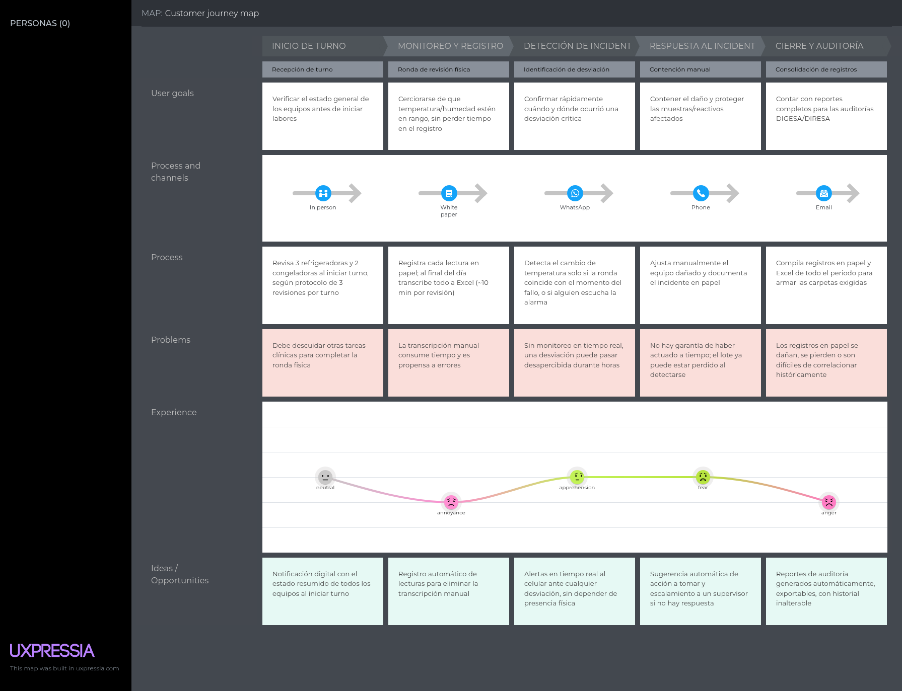

  El recorrido de Gabriela Campos Rivas inicia con la recepción de turno y la ronda de revisión física de refrigeradoras y congeladoras, continúa con el registro manual en papel y su posterior transcripción a Excel, y se ve interrumpido cuando ocurre una desviación de temperatura que, debido a la falta de monitoreo en tiempo real, puede pasar desapercibida durante horas. El journey culmina con la consolidación de registros físicos para las auditorías de DIGESA/DIRESA, un proceso que genera frustración debido a la fragilidad y dispersión de los registros en papel.

#### **Segmento 2: Empresas Farmacéuticas**

  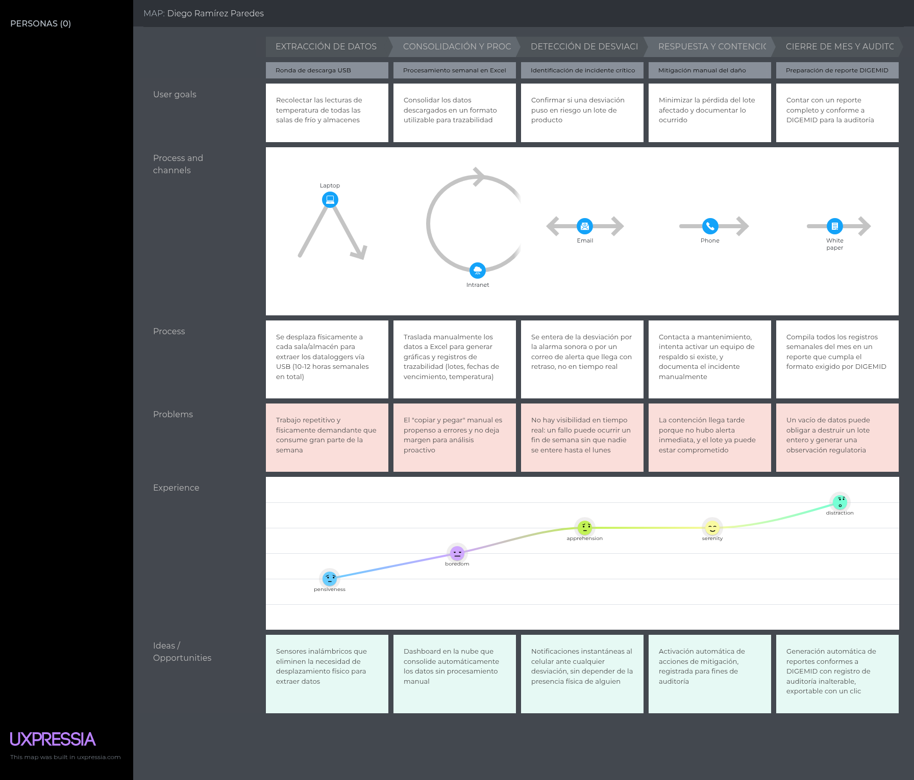

  El recorrido de Diego Ramírez Paredes inicia con el desplazamiento físico a cada sala o almacén para extraer dataloggers mediante USB, continúa con el procesamiento semanal de la información en Excel para fines de trazabilidad y se ve afectado cuando una desviación no detectada a tiempo, por falta de visibilidad en tiempo real, pone en riesgo un lote de producto. El journey culmina con el cierre de mes y la preparación del reporte conforme a DIGEMID, proceso en el que un vacío de datos puede derivar en la pérdida total de un lote y en una observación regulatoria.

### **2.3.4. Empathy Mapping**

  Se elaboraron los Empathy Maps para cada User Persona, colocando al usuario representado en el centro y completando cada cuadrante a partir de las observaciones del equipo sobre la información recolectada en las entrevistas. Para ello, se consideró qué necesita hacer, qué dice, qué ve, qué hace, qué escucha, qué piensa y siente, además de identificar sus Pains y Gains.

#### **Segmento 1: Laboratorios de Hospitales**

  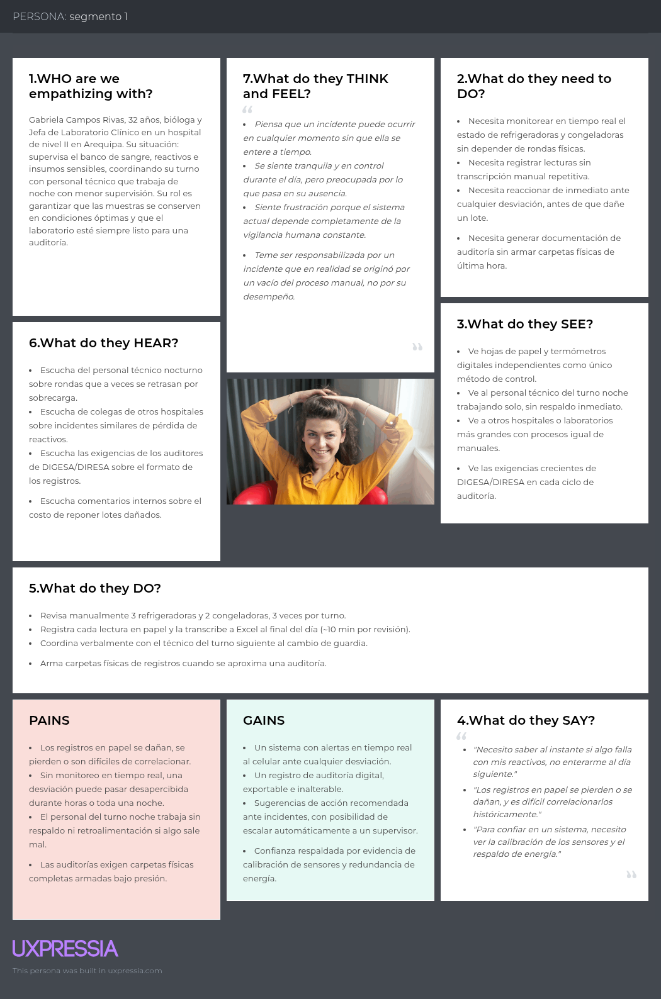

  El Empathy Map de Gabriela Campos Rivas evidencia una tensión entre la tranquilidad que siente al controlar el proceso durante su turno y la preocupación constante por lo que puede ocurrir en su ausencia. Sus principales Pains giran en torno a la fragilidad de los registros en papel y la falta de respaldo durante turnos con poco personal, mientras que sus Gains se concentran en alertas en tiempo real y un registro de auditoría digital e inalterable.

#### **Segmento 2: Empresas Farmacéuticas**

  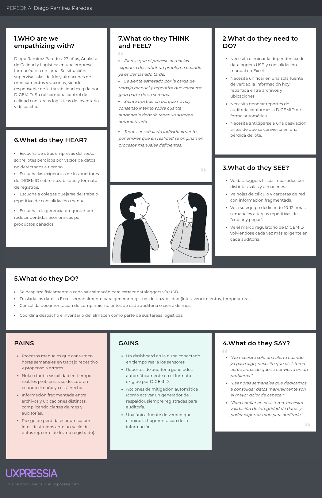

  El Empathy Map de Diego Ramírez Paredes evidencia el estrés generado por la carga de trabajo manual y repetitivo, así como el temor a ser señalado individualmente por errores originados en procesos deficientes que no dependen de su desempeño. Sus principales Pains están relacionados con la falta de visibilidad en tiempo real y la fragmentación de la información, mientras que sus Gains apuntan a un dashboard centralizado en la nube y a reportes automáticos conformes a DIGEMID.

### **2.3.5. Big Picture Event Storming**

### **2.3.6. Ubiquitous Language**

El Ubiquitous Language de SafeLab reúne los términos del dominio utilizados de manera consistente para describir el monitoreo de la cadena de frío, la gestión de desviaciones, el mantenimiento de equipos, la trazabilidad y el cumplimiento regulatorio.

<table style="margin: auto; width: 100%; border-collapse: collapse;" border="1">
  <thead>
    <tr>
      <th style="text-align: center; vertical-align: middle; padding: 6px;">Ubiquitous Term</th>
      <th style="text-align: center; vertical-align: middle; padding: 6px;">Definición</th>
    </tr>
  </thead>
  <tbody>
    <tr>
      <td style="text-align: center; vertical-align: middle; padding: 6px;">Cold Chain</td>
      <td style="text-align: justify; vertical-align: top; padding: 6px;">Proceso continuo de conservación de productos, muestras o insumos sensibles dentro de condiciones de temperatura controlada durante su almacenamiento y manipulación.</td>
    </tr>
    <tr>
      <td style="text-align: center; vertical-align: middle; padding: 6px;">Monitoring Site</td>
      <td style="text-align: justify; vertical-align: top; padding: 6px;">Instalación física, como un laboratorio, planta o almacén, en la que SafeLab organiza y supervisa las áreas y equipos sujetos a monitoreo.</td>
    </tr>
    <tr>
      <td style="text-align: center; vertical-align: middle; padding: 6px;">Storage Area</td>
      <td style="text-align: justify; vertical-align: top; padding: 6px;">Zona física dentro de un Monitoring Site destinada al almacenamiento controlado y en la que se encuentran uno o más equipos monitoreados.</td>
    </tr>
    <tr>
      <td style="text-align: center; vertical-align: middle; padding: 6px;">Monitored Equipment</td>
      <td style="text-align: justify; vertical-align: top; padding: 6px;">Equipo de refrigeración, congelación o conservación cuyas condiciones ambientales y estado operativo son supervisados por SafeLab.</td>
    </tr>
    <tr>
      <td style="text-align: center; vertical-align: middle; padding: 6px;">Environmental Sensor</td>
      <td style="text-align: justify; vertical-align: top; padding: 6px;">Dispositivo asociado a un equipo monitoreado que captura variables ambientales, principalmente temperatura y humedad.</td>
    </tr>
    <tr>
      <td style="text-align: center; vertical-align: middle; padding: 6px;">Environmental Reading</td>
      <td style="text-align: justify; vertical-align: top; padding: 6px;">Medición de una variable ambiental registrada por un sensor en una fecha y hora determinadas y asociada al equipo correspondiente.</td>
    </tr>
    <tr>
      <td style="text-align: center; vertical-align: middle; padding: 6px;">Environmental Threshold</td>
      <td style="text-align: justify; vertical-align: top; padding: 6px;">Límite mínimo o máximo configurado para una variable ambiental de un equipo, utilizado para determinar si una lectura se encuentra dentro de las condiciones permitidas.</td>
    </tr>
    <tr>
      <td style="text-align: center; vertical-align: middle; padding: 6px;">Thermal Excursion</td>
      <td style="text-align: justify; vertical-align: top; padding: 6px;">Desviación en la que la temperatura registrada se encuentra fuera del rango permitido durante un periodo determinado y puede comprometer la cadena de frío.</td>
    </tr>
    <tr>
      <td style="text-align: center; vertical-align: middle; padding: 6px;">Alert</td>
      <td style="text-align: justify; vertical-align: top; padding: 6px;">Registro generado cuando SafeLab detecta una condición que requiere atención, como la superación de un Environmental Threshold o una anomalía del equipo.</td>
    </tr>
    <tr>
      <td style="text-align: center; vertical-align: middle; padding: 6px;">Incident</td>
      <td style="text-align: justify; vertical-align: top; padding: 6px;">Evento de seguimiento formal asociado a una desviación o alerta que requiere investigación, atención y registro de las acciones realizadas.</td>
    </tr>
    <tr>
      <td style="text-align: center; vertical-align: middle; padding: 6px;">Corrective Action</td>
      <td style="text-align: justify; vertical-align: top; padding: 6px;">Acción ejecutada por el personal para contener, corregir o reducir el impacto de un Incident, manteniendo evidencia de quién la realizó y cuándo.</td>
    </tr>
    <tr>
      <td style="text-align: center; vertical-align: middle; padding: 6px;">Equipment Condition</td>
      <td style="text-align: justify; vertical-align: top; padding: 6px;">Estado evaluado de un equipo a partir de sus lecturas, disponibilidad e historial, utilizado para identificar funcionamiento normal, advertencias o condiciones críticas.</td>
    </tr>
    <tr>
      <td style="text-align: center; vertical-align: middle; padding: 6px;">Maintenance Record</td>
      <td style="text-align: justify; vertical-align: top; padding: 6px;">Registro de una actividad de mantenimiento, calibración, inspección o reparación realizada sobre un equipo monitoreado.</td>
    </tr>
    <tr>
      <td style="text-align: center; vertical-align: middle; padding: 6px;">Traceability Record</td>
      <td style="text-align: justify; vertical-align: top; padding: 6px;">Conjunto ordenado de evidencias que permite reconstruir los eventos y acciones relacionados con un equipo, una alerta o un incidente.</td>
    </tr>
    <tr>
      <td style="text-align: center; vertical-align: middle; padding: 6px;">Audit Entry</td>
      <td style="text-align: justify; vertical-align: top; padding: 6px;">Registro de auditoría que identifica una acción relevante, el actor involucrado, el objeto afectado y la fecha y hora en que ocurrió.</td>
    </tr>
    <tr>
      <td style="text-align: center; vertical-align: middle; padding: 6px;">Compliance Report</td>
      <td style="text-align: justify; vertical-align: top; padding: 6px;">Documento que consolida información histórica de monitoreo, incidentes, acciones y trazabilidad para sustentar actividades de control y auditorías regulatorias.</td>
    </tr>
  </tbody>
</table>

## **2.4. Requirements Specification**

### **2.4.1. User Stories**

  Esta sección presenta las Epics, User Stories, Technical Stories y Spike Stories identificadas para SafeLab, de acuerdo con las necesidades de los laboratorios hospitalarios y las empresas farmacéuticas. Los Acceptance Criteria se redactan utilizando la estructura de Gherkin <b>Given-When-Then</b> para establecer condiciones verificables para cada requisito, sin depender de detalles específicos de la interfaz de usuario.

#### **Epics**

<table border="1" style="width: 100%; border-collapse: collapse;">
  <thead>
    <tr>
      <th style="text-align: center; vertical-align: middle; padding: 6px;">Epic ID</th>
      <th style="text-align: center; vertical-align: middle; padding: 6px;">Title</th>
      <th style="text-align: center; vertical-align: middle; padding: 6px;">Description</th>
    </tr>
  </thead>
  <tbody>
  <tr><td style="text-align: center; vertical-align: top; padding: 6px;">EP01</td><td style="text-align: justify; vertical-align: top; padding: 6px;">Organización del monitoreo</td><td style="text-align: justify; vertical-align: top; padding: 6px;">Gestionar sitios de monitoreo, áreas de almacenamiento y equipos para organizar el monitoreo ambiental entre distintas ubicaciones.</td></tr>
  <tr><td style="text-align: center; vertical-align: top; padding: 6px;">EP02</td><td style="text-align: justify; vertical-align: top; padding: 6px;">Monitoreo en tiempo real</td><td style="text-align: justify; vertical-align: top; padding: 6px;">Visualizar automáticamente la temperatura, la humedad, el estado de los equipos y la información de monitoreo sin depender de registros manuales.</td></tr>
  <tr><td style="text-align: center; vertical-align: top; padding: 6px;">EP03</td><td style="text-align: justify; vertical-align: top; padding: 6px;">Alertas y notificaciones</td><td style="text-align: justify; vertical-align: top; padding: 6px;">Recibir, visualizar y gestionar alertas relacionadas con las condiciones ambientales y los equipos monitoreados.</td></tr>
  <tr><td style="text-align: center; vertical-align: top; padding: 6px;">EP04</td><td style="text-align: justify; vertical-align: top; padding: 6px;">Reportes y análisis de datos</td><td style="text-align: justify; vertical-align: top; padding: 6px;">Acceder a datos históricos, comparar periodos y generar reportes que apoyen el monitoreo, el control y las auditorías.</td></tr>
  <tr><td style="text-align: center; vertical-align: top; padding: 6px;">EP05</td><td style="text-align: justify; vertical-align: top; padding: 6px;">Condición y mantenimiento de equipos</td><td style="text-align: justify; vertical-align: top; padding: 6px;">Monitorear la condición, confiabilidad e historial de mantenimiento de los equipos para identificar posibles fallas.</td></tr>
  <tr><td style="text-align: center; vertical-align: top; padding: 6px;">EP06</td><td style="text-align: justify; vertical-align: top; padding: 6px;">Dashboard y vista general del sistema</td><td style="text-align: justify; vertical-align: top; padding: 6px;">Proporcionar un resumen centralizado de la información de monitoreo, las alertas y los indicadores relevantes.</td></tr>
  <tr><td style="text-align: center; vertical-align: top; padding: 6px;">EP07</td><td style="text-align: justify; vertical-align: top; padding: 6px;">Acceso de usuarios y roles</td><td style="text-align: justify; vertical-align: top; padding: 6px;">Permitir que los usuarios accedan a SafeLab y gestionen la información de sus cuentas y accesos.</td></tr>
  <tr><td style="text-align: center; vertical-align: top; padding: 6px;">EP08</td><td style="text-align: justify; vertical-align: top; padding: 6px;">Landing Page</td><td style="text-align: justify; vertical-align: top; padding: 6px;">Presentar SafeLab y la información de su producto mediante la Landing Page estática.</td></tr>
  </tbody>
</table>

 

#### **User Stories**

##### **US01 - Registrar sitio de monitoreo**

<table border="1" style="width: 100%; border-collapse: collapse;">
  <tr><th style="text-align: center; vertical-align: middle; padding: 6px;">Story ID</th><td style="text-align: center; vertical-align: top; padding: 6px;">US01</td><th style="text-align: center; vertical-align: middle; padding: 6px;">User</th><td style="text-align: center; vertical-align: top; padding: 6px;">Personal de Laboratorio Hospitalario / Empresa Farmacéutica</td></tr>
  <tr><th style="text-align: center; vertical-align: middle; padding: 6px;">Priority</th><td style="text-align: center; vertical-align: top; padding: 6px;">Alta</td><th style="text-align: center; vertical-align: middle; padding: 6px;">Epic</th><td style="text-align: center; vertical-align: top; padding: 6px;">EP01</td></tr>
  <tr><th style="text-align: center; vertical-align: middle; padding: 6px;">Title</th><td colspan="3" style="text-align: justify; vertical-align: top; padding: 6px;">Registrar sitio de monitoreo</td></tr>
  <tr><th style="text-align: center; vertical-align: middle; padding: 6px;">Description</th><td colspan="3" style="text-align: justify; vertical-align: top; padding: 6px;">Como miembro del personal de un laboratorio hospitalario o de una empresa farmacéutica, quiero registrar un sitio de monitoreo con su nombre y ubicación para organizar el monitoreo.</td></tr>
  <tr>
    <th style="text-align: center; vertical-align: middle; padding: 6px;">Acceptance Criteria</th>
    <td colspan="3" style="text-align: justify; vertical-align: top; padding: 6px;">
      <b>Scenario 1: Registro exitoso</b> 
      <b>Given</b> que se proporciona información válida del sitio 
      <b>When</b> el usuario registra el sitio de monitoreo 
      <b>Then</b> el sistema almacena la información del sitio.  
      <b>Scenario 2: Falta información requerida</b> 
      <b>Given</b> que la información requerida del sitio está incompleta 
      <b>When</b> el usuario intenta registrar el sitio de monitoreo 
      <b>Then</b> el sistema rechaza el registro.
    </td>
  </tr>
</table>

##### **US02 - Visualizar sitios de monitoreo**

<table border="1" style="width: 100%; border-collapse: collapse;">
  <tr><th style="text-align: center; vertical-align: middle; padding: 6px;">Story ID</th><td style="text-align: center; vertical-align: top; padding: 6px;">US02</td><th style="text-align: center; vertical-align: middle; padding: 6px;">User</th><td style="text-align: center; vertical-align: top; padding: 6px;">Personal de Laboratorio Hospitalario / Empresa Farmacéutica</td></tr>
  <tr><th style="text-align: center; vertical-align: middle; padding: 6px;">Priority</th><td style="text-align: center; vertical-align: top; padding: 6px;">Alta</td><th style="text-align: center; vertical-align: middle; padding: 6px;">Epic</th><td style="text-align: center; vertical-align: top; padding: 6px;">EP01</td></tr>
  <tr><th style="text-align: center; vertical-align: middle; padding: 6px;">Title</th><td colspan="3" style="text-align: justify; vertical-align: top; padding: 6px;">Visualizar sitios de monitoreo</td></tr>
  <tr><th style="text-align: center; vertical-align: middle; padding: 6px;">Description</th><td colspan="3" style="text-align: justify; vertical-align: top; padding: 6px;">Como miembro del personal de un laboratorio hospitalario o de una empresa farmacéutica, quiero visualizar los sitios de monitoreo registrados para poder gestionarlos.</td></tr>
  <tr>
    <th style="text-align: center; vertical-align: middle; padding: 6px;">Acceptance Criteria</th>
    <td colspan="3" style="text-align: justify; vertical-align: top; padding: 6px;">
      <b>Scenario 1: Existen sitios registrados</b> 
      <b>Given</b> que existen sitios de monitoreo registrados 
      <b>When</b> el usuario solicita los sitios registrados 
      <b>Then</b> el sistema proporciona los sitios disponibles.  
      <b>Scenario 2: No existen sitios registrados</b> 
      <b>Given</b> que no existen sitios de monitoreo registrados 
      <b>When</b> el usuario solicita los sitios registrados 
      <b>Then</b> el sistema indica que no hay sitios disponibles.
    </td>
  </tr>
</table>

##### **US03 - Crear área de almacenamiento**

<table border="1" style="width: 100%; border-collapse: collapse;">
  <tr><th style="text-align: center; vertical-align: middle; padding: 6px;">Story ID</th><td style="text-align: center; vertical-align: top; padding: 6px;">US03</td><th style="text-align: center; vertical-align: middle; padding: 6px;">User</th><td style="text-align: center; vertical-align: top; padding: 6px;">Personal de Laboratorio Hospitalario / Empresa Farmacéutica</td></tr>
  <tr><th style="text-align: center; vertical-align: middle; padding: 6px;">Priority</th><td style="text-align: center; vertical-align: top; padding: 6px;">Alta</td><th style="text-align: center; vertical-align: middle; padding: 6px;">Epic</th><td style="text-align: center; vertical-align: top; padding: 6px;">EP01</td></tr>
  <tr><th style="text-align: center; vertical-align: middle; padding: 6px;">Title</th><td colspan="3" style="text-align: justify; vertical-align: top; padding: 6px;">Crear área de almacenamiento</td></tr>
  <tr><th style="text-align: center; vertical-align: middle; padding: 6px;">Description</th><td colspan="3" style="text-align: justify; vertical-align: top; padding: 6px;">Como miembro del personal de un laboratorio hospitalario o de una empresa farmacéutica, quiero crear áreas de almacenamiento con un nombre y tipo para organizar los equipos.</td></tr>
  <tr>
    <th style="text-align: center; vertical-align: middle; padding: 6px;">Acceptance Criteria</th>
    <td colspan="3" style="text-align: justify; vertical-align: top; padding: 6px;">
      <b>Scenario 1: Creación exitosa</b> 
      <b>Given</b> que se proporciona información válida del área de almacenamiento 
      <b>When</b> el usuario crea el área de almacenamiento 
      <b>Then</b> el sistema almacena la nueva área de almacenamiento.  
      <b>Scenario 2: Falta información requerida</b> 
      <b>Given</b> que la información requerida del área de almacenamiento está incompleta 
      <b>When</b> el usuario intenta crear el área de almacenamiento 
      <b>Then</b> el sistema rechaza la creación.
    </td>
  </tr>
</table>

##### **US04 - Visualizar áreas de almacenamiento**

<table border="1" style="width: 100%; border-collapse: collapse;">
  <tr><th style="text-align: center; vertical-align: middle; padding: 6px;">Story ID</th><td style="text-align: center; vertical-align: top; padding: 6px;">US04</td><th style="text-align: center; vertical-align: middle; padding: 6px;">User</th><td style="text-align: center; vertical-align: top; padding: 6px;">Personal de Laboratorio Hospitalario / Empresa Farmacéutica</td></tr>
  <tr><th style="text-align: center; vertical-align: middle; padding: 6px;">Priority</th><td style="text-align: center; vertical-align: top; padding: 6px;">Media</td><th style="text-align: center; vertical-align: middle; padding: 6px;">Epic</th><td style="text-align: center; vertical-align: top; padding: 6px;">EP01</td></tr>
  <tr><th style="text-align: center; vertical-align: middle; padding: 6px;">Title</th><td colspan="3" style="text-align: justify; vertical-align: top; padding: 6px;">Visualizar áreas de almacenamiento</td></tr>
  <tr><th style="text-align: center; vertical-align: middle; padding: 6px;">Description</th><td colspan="3" style="text-align: justify; vertical-align: top; padding: 6px;">Como miembro del personal de un laboratorio hospitalario o de una empresa farmacéutica, quiero visualizar las áreas de almacenamiento para comprender cómo están organizados los equipos monitoreados.</td></tr>
  <tr>
    <th style="text-align: center; vertical-align: middle; padding: 6px;">Acceptance Criteria</th>
    <td colspan="3" style="text-align: justify; vertical-align: top; padding: 6px;">
      <b>Scenario 1: Existen áreas de almacenamiento</b> 
      <b>Given</b> que existen áreas de almacenamiento registradas 
      <b>When</b> el usuario solicita las áreas de almacenamiento 
      <b>Then</b> el sistema proporciona las áreas de almacenamiento registradas.  
      <b>Scenario 2: No existen áreas de almacenamiento</b> 
      <b>Given</b> que no existen áreas de almacenamiento registradas 
      <b>When</b> el usuario solicita las áreas de almacenamiento 
      <b>Then</b> el sistema indica que no hay áreas de almacenamiento disponibles.
    </td>
  </tr>
</table>

##### **US05 - Registrar equipo**

<table border="1" style="width: 100%; border-collapse: collapse;">
  <tr><th style="text-align: center; vertical-align: middle; padding: 6px;">Story ID</th><td style="text-align: center; vertical-align: top; padding: 6px;">US05</td><th style="text-align: center; vertical-align: middle; padding: 6px;">User</th><td style="text-align: center; vertical-align: top; padding: 6px;">Personal de Laboratorio Hospitalario / Empresa Farmacéutica</td></tr>
  <tr><th style="text-align: center; vertical-align: middle; padding: 6px;">Priority</th><td style="text-align: center; vertical-align: top; padding: 6px;">Alta</td><th style="text-align: center; vertical-align: middle; padding: 6px;">Epic</th><td style="text-align: center; vertical-align: top; padding: 6px;">EP01</td></tr>
  <tr><th style="text-align: center; vertical-align: middle; padding: 6px;">Title</th><td colspan="3" style="text-align: justify; vertical-align: top; padding: 6px;">Registrar equipo</td></tr>
  <tr><th style="text-align: center; vertical-align: middle; padding: 6px;">Description</th><td colspan="3" style="text-align: justify; vertical-align: top; padding: 6px;">Como miembro del personal de un laboratorio hospitalario o de una empresa farmacéutica, quiero registrar equipos con su nombre, tipo e identificador para que puedan ser monitoreados.</td></tr>
  <tr>
    <th style="text-align: center; vertical-align: middle; padding: 6px;">Acceptance Criteria</th>
    <td colspan="3" style="text-align: justify; vertical-align: top; padding: 6px;">
      <b>Scenario 1: Registro exitoso</b> 
      <b>Given</b> que se proporciona información válida del equipo 
      <b>When</b> el usuario registra el equipo 
      <b>Then</b> el sistema almacena la información del equipo.  
      <b>Scenario 2: Falta información requerida</b> 
      <b>Given</b> que la información requerida del equipo está incompleta 
      <b>When</b> el usuario intenta registrar el equipo 
      <b>Then</b> el sistema rechaza el registro.
    </td>
  </tr>
</table>

##### **US06 - Visualizar lista de equipos**

<table border="1" style="width: 100%; border-collapse: collapse;">
  <tr><th style="text-align: center; vertical-align: middle; padding: 6px;">Story ID</th><td style="text-align: center; vertical-align: top; padding: 6px;">US06</td><th style="text-align: center; vertical-align: middle; padding: 6px;">User</th><td style="text-align: center; vertical-align: top; padding: 6px;">Personal de Laboratorio Hospitalario / Empresa Farmacéutica</td></tr>
  <tr><th style="text-align: center; vertical-align: middle; padding: 6px;">Priority</th><td style="text-align: center; vertical-align: top; padding: 6px;">Alta</td><th style="text-align: center; vertical-align: middle; padding: 6px;">Epic</th><td style="text-align: center; vertical-align: top; padding: 6px;">EP01</td></tr>
  <tr><th style="text-align: center; vertical-align: middle; padding: 6px;">Title</th><td colspan="3" style="text-align: justify; vertical-align: top; padding: 6px;">Visualizar lista de equipos</td></tr>
  <tr><th style="text-align: center; vertical-align: middle; padding: 6px;">Description</th><td colspan="3" style="text-align: justify; vertical-align: top; padding: 6px;">Como miembro del personal de un laboratorio hospitalario o de una empresa farmacéutica, quiero visualizar los equipos registrados para poder gestionarlos.</td></tr>
  <tr>
    <th style="text-align: center; vertical-align: middle; padding: 6px;">Acceptance Criteria</th>
    <td colspan="3" style="text-align: justify; vertical-align: top; padding: 6px;">
      <b>Scenario 1: Existen equipos</b> 
      <b>Given</b> que existen equipos registrados 
      <b>When</b> el usuario solicita la lista de equipos 
      <b>Then</b> el sistema proporciona los equipos registrados.  
      <b>Scenario 2: No existen equipos</b> 
      <b>Given</b> que no existen equipos registrados 
      <b>When</b> el usuario solicita la lista de equipos 
      <b>Then</b> el sistema indica que no hay equipos disponibles.
    </td>
  </tr>
</table>

##### **US07 - Asignar equipo a un área**

<table border="1" style="width: 100%; border-collapse: collapse;">
  <tr><th style="text-align: center; vertical-align: middle; padding: 6px;">Story ID</th><td style="text-align: center; vertical-align: top; padding: 6px;">US07</td><th style="text-align: center; vertical-align: middle; padding: 6px;">User</th><td style="text-align: center; vertical-align: top; padding: 6px;">Personal de Laboratorio Hospitalario / Empresa Farmacéutica</td></tr>
  <tr><th style="text-align: center; vertical-align: middle; padding: 6px;">Priority</th><td style="text-align: center; vertical-align: top; padding: 6px;">Alta</td><th style="text-align: center; vertical-align: middle; padding: 6px;">Epic</th><td style="text-align: center; vertical-align: top; padding: 6px;">EP01</td></tr>
  <tr><th style="text-align: center; vertical-align: middle; padding: 6px;">Title</th><td colspan="3" style="text-align: justify; vertical-align: top; padding: 6px;">Asignar equipo a un área</td></tr>
  <tr><th style="text-align: center; vertical-align: middle; padding: 6px;">Description</th><td colspan="3" style="text-align: justify; vertical-align: top; padding: 6px;">Como miembro del personal de un laboratorio hospitalario o de una empresa farmacéutica, quiero asignar un equipo a un área de almacenamiento para conocer su ubicación.</td></tr>
  <tr>
    <th style="text-align: center; vertical-align: middle; padding: 6px;">Acceptance Criteria</th>
    <td colspan="3" style="text-align: justify; vertical-align: top; padding: 6px;">
      <b>Scenario 1: Se proporcionan un equipo y un área válidos</b> 
      <b>Given</b> que existen un equipo registrado y un área de almacenamiento registrada 
      <b>When</b> el usuario asigna el equipo al área de almacenamiento 
      <b>Then</b> el sistema asocia el equipo con dicha área.  
      <b>Scenario 2: La información requerida no está disponible</b> 
      <b>Given</b> que el equipo o el área de almacenamiento no están disponibles 
      <b>When</b> el usuario intenta crear la asignación 
      <b>Then</b> el sistema rechaza la asignación.
    </td>
  </tr>
</table>

##### **US08 - Buscar equipo por nombre**

<table border="1" style="width: 100%; border-collapse: collapse;">
  <tr><th style="text-align: center; vertical-align: middle; padding: 6px;">Story ID</th><td style="text-align: center; vertical-align: top; padding: 6px;">US08</td><th style="text-align: center; vertical-align: middle; padding: 6px;">User</th><td style="text-align: center; vertical-align: top; padding: 6px;">Personal de Laboratorio Hospitalario / Empresa Farmacéutica</td></tr>
  <tr><th style="text-align: center; vertical-align: middle; padding: 6px;">Priority</th><td style="text-align: center; vertical-align: top; padding: 6px;">Media</td><th style="text-align: center; vertical-align: middle; padding: 6px;">Epic</th><td style="text-align: center; vertical-align: top; padding: 6px;">EP01</td></tr>
  <tr><th style="text-align: center; vertical-align: middle; padding: 6px;">Title</th><td colspan="3" style="text-align: justify; vertical-align: top; padding: 6px;">Buscar equipo por nombre</td></tr>
  <tr><th style="text-align: center; vertical-align: middle; padding: 6px;">Description</th><td colspan="3" style="text-align: justify; vertical-align: top; padding: 6px;">Como miembro del personal de un laboratorio hospitalario o de una empresa farmacéutica, quiero buscar equipos por nombre para encontrarlos rápidamente.</td></tr>
  <tr>
    <th style="text-align: center; vertical-align: middle; padding: 6px;">Acceptance Criteria</th>
    <td colspan="3" style="text-align: justify; vertical-align: top; padding: 6px;">
      <b>Scenario 1: Existe un equipo coincidente</b> 
      <b>Given</b> que un equipo registrado coincide con el nombre proporcionado 
      <b>When</b> el usuario realiza la búsqueda 
      <b>Then</b> el sistema proporciona el equipo coincidente.  
      <b>Scenario 2: No existe un equipo coincidente</b> 
      <b>Given</b> que ningún equipo registrado coincide con el nombre proporcionado 
      <b>When</b> el usuario realiza la búsqueda 
      <b>Then</b> el sistema indica que no existe un equipo coincidente disponible.
    </td>
  </tr>
</table>

##### **US09 - Visualizar valores de temperatura**

<table border="1" style="width: 100%; border-collapse: collapse;">
  <tr><th style="text-align: center; vertical-align: middle; padding: 6px;">Story ID</th><td style="text-align: center; vertical-align: top; padding: 6px;">US09</td><th style="text-align: center; vertical-align: middle; padding: 6px;">User</th><td style="text-align: center; vertical-align: top; padding: 6px;">Personal de Laboratorio Hospitalario / Empresa Farmacéutica</td></tr>
  <tr><th style="text-align: center; vertical-align: middle; padding: 6px;">Priority</th><td style="text-align: center; vertical-align: top; padding: 6px;">Alta</td><th style="text-align: center; vertical-align: middle; padding: 6px;">Epic</th><td style="text-align: center; vertical-align: top; padding: 6px;">EP02</td></tr>
  <tr><th style="text-align: center; vertical-align: middle; padding: 6px;">Title</th><td colspan="3" style="text-align: justify; vertical-align: top; padding: 6px;">Visualizar valores de temperatura</td></tr>
  <tr><th style="text-align: center; vertical-align: middle; padding: 6px;">Description</th><td colspan="3" style="text-align: justify; vertical-align: top; padding: 6px;">Como miembro del personal de un laboratorio hospitalario o de una empresa farmacéutica, quiero visualizar los valores de temperatura para monitorear las condiciones de almacenamiento.</td></tr>
  <tr>
    <th style="text-align: center; vertical-align: middle; padding: 6px;">Acceptance Criteria</th>
    <td colspan="3" style="text-align: justify; vertical-align: top; padding: 6px;">
      <b>Scenario 1: Los datos de temperatura están disponibles</b> 
      <b>Given</b> que el equipo monitoreado dispone de datos de temperatura 
      <b>When</b> el usuario solicita su información de monitoreo 
      <b>Then</b> el sistema proporciona el valor de temperatura disponible.  
      <b>Scenario 2: Los datos de temperatura no están disponibles</b> 
      <b>Given</b> que el equipo monitoreado no dispone de datos de temperatura 
      <b>When</b> el usuario solicita su información de monitoreo 
      <b>Then</b> el sistema indica que los datos de temperatura no están disponibles.
    </td>
  </tr>
</table>

##### **US10 - Visualizar valores de humedad**

<table border="1" style="width: 100%; border-collapse: collapse;">
  <tr><th style="text-align: center; vertical-align: middle; padding: 6px;">Story ID</th><td style="text-align: center; vertical-align: top; padding: 6px;">US10</td><th style="text-align: center; vertical-align: middle; padding: 6px;">User</th><td style="text-align: center; vertical-align: top; padding: 6px;">Personal de Laboratorio Hospitalario / Empresa Farmacéutica</td></tr>
  <tr><th style="text-align: center; vertical-align: middle; padding: 6px;">Priority</th><td style="text-align: center; vertical-align: top; padding: 6px;">Alta</td><th style="text-align: center; vertical-align: middle; padding: 6px;">Epic</th><td style="text-align: center; vertical-align: top; padding: 6px;">EP02</td></tr>
  <tr><th style="text-align: center; vertical-align: middle; padding: 6px;">Title</th><td colspan="3" style="text-align: justify; vertical-align: top; padding: 6px;">Visualizar valores de humedad</td></tr>
  <tr><th style="text-align: center; vertical-align: middle; padding: 6px;">Description</th><td colspan="3" style="text-align: justify; vertical-align: top; padding: 6px;">Como miembro del personal de un laboratorio hospitalario o de una empresa farmacéutica, quiero visualizar los valores de humedad para monitorear las condiciones de almacenamiento.</td></tr>
  <tr>
    <th style="text-align: center; vertical-align: middle; padding: 6px;">Acceptance Criteria</th>
    <td colspan="3" style="text-align: justify; vertical-align: top; padding: 6px;">
      <b>Scenario 1: Los datos de humedad están disponibles</b> 
      <b>Given</b> que el equipo monitoreado dispone de datos de humedad 
      <b>When</b> el usuario solicita su información de monitoreo 
      <b>Then</b> el sistema proporciona el valor de humedad disponible.  
      <b>Scenario 2: Los datos de humedad no están disponibles</b> 
      <b>Given</b> que el equipo monitoreado no dispone de datos de humedad 
      <b>When</b> el usuario solicita su información de monitoreo 
      <b>Then</b> el sistema indica que los datos de humedad no están disponibles.
    </td>
  </tr>
</table>

##### **US11 - Visualizar estado operativo del equipo**

<table border="1" style="width: 100%; border-collapse: collapse;">
  <tr><th style="text-align: center; vertical-align: middle; padding: 6px;">Story ID</th><td style="text-align: center; vertical-align: top; padding: 6px;">US11</td><th style="text-align: center; vertical-align: middle; padding: 6px;">User</th><td style="text-align: center; vertical-align: top; padding: 6px;">Personal de Laboratorio Hospitalario / Empresa Farmacéutica</td></tr>
  <tr><th style="text-align: center; vertical-align: middle; padding: 6px;">Priority</th><td style="text-align: center; vertical-align: top; padding: 6px;">Alta</td><th style="text-align: center; vertical-align: middle; padding: 6px;">Epic</th><td style="text-align: center; vertical-align: top; padding: 6px;">EP02</td></tr>
  <tr><th style="text-align: center; vertical-align: middle; padding: 6px;">Title</th><td colspan="3" style="text-align: justify; vertical-align: top; padding: 6px;">Visualizar estado operativo del equipo</td></tr>
  <tr><th style="text-align: center; vertical-align: middle; padding: 6px;">Description</th><td colspan="3" style="text-align: justify; vertical-align: top; padding: 6px;">Como miembro del personal de un laboratorio hospitalario o de una empresa farmacéutica, quiero saber si un equipo monitoreado está funcionando para detectar problemas.</td></tr>
  <tr>
    <th style="text-align: center; vertical-align: middle; padding: 6px;">Acceptance Criteria</th>
    <td colspan="3" style="text-align: justify; vertical-align: top; padding: 6px;">
      <b>Scenario 1: El equipo está proporcionando datos</b> 
      <b>Given</b> que el equipo está proporcionando datos de monitoreo 
      <b>When</b> el usuario solicita su estado 
      <b>Then</b> el sistema identifica el equipo como operativo.  
      <b>Scenario 2: El equipo no está proporcionando datos</b> 
      <b>Given</b> que el equipo no está proporcionando datos de monitoreo 
      <b>When</b> el usuario solicita su estado 
      <b>Then</b> el sistema identifica que el equipo no está funcionando con normalidad.
    </td>
  </tr>
</table>

##### **US12 - Visualizar detalles del equipo**

<table border="1" style="width: 100%; border-collapse: collapse;">
  <tr><th style="text-align: center; vertical-align: middle; padding: 6px;">Story ID</th><td style="text-align: center; vertical-align: top; padding: 6px;">US12</td><th style="text-align: center; vertical-align: middle; padding: 6px;">User</th><td style="text-align: center; vertical-align: top; padding: 6px;">Personal de Laboratorio Hospitalario / Empresa Farmacéutica</td></tr>
  <tr><th style="text-align: center; vertical-align: middle; padding: 6px;">Priority</th><td style="text-align: center; vertical-align: top; padding: 6px;">Alta</td><th style="text-align: center; vertical-align: middle; padding: 6px;">Epic</th><td style="text-align: center; vertical-align: top; padding: 6px;">EP02</td></tr>
  <tr><th style="text-align: center; vertical-align: middle; padding: 6px;">Title</th><td colspan="3" style="text-align: justify; vertical-align: top; padding: 6px;">Visualizar detalles del equipo</td></tr>
  <tr><th style="text-align: center; vertical-align: middle; padding: 6px;">Description</th><td colspan="3" style="text-align: justify; vertical-align: top; padding: 6px;">Como miembro del personal de un laboratorio hospitalario o de una empresa farmacéutica, quiero visualizar los detalles de un equipo para revisar su temperatura, humedad y estado.</td></tr>
  <tr>
    <th style="text-align: center; vertical-align: middle; padding: 6px;">Acceptance Criteria</th>
    <td colspan="3" style="text-align: justify; vertical-align: top; padding: 6px;">
      <b>Scenario 1: El equipo existe</b> 
      <b>Given</b> que existe un equipo registrado 
      <b>When</b> el usuario solicita sus detalles 
      <b>Then</b> el sistema proporciona la información disponible de temperatura, humedad y estado.  
      <b>Scenario 2: El equipo no existe</b> 
      <b>Given</b> que el equipo solicitado no está registrado 
      <b>When</b> se solicitan sus detalles 
      <b>Then</b> el sistema indica que el equipo no está disponible.
    </td>
  </tr>
</table>

##### **US13 - Visualizar lista de equipos con datos en tiempo real**

<table border="1" style="width: 100%; border-collapse: collapse;">
  <tr><th style="text-align: center; vertical-align: middle; padding: 6px;">Story ID</th><td style="text-align: center; vertical-align: top; padding: 6px;">US13</td><th style="text-align: center; vertical-align: middle; padding: 6px;">User</th><td style="text-align: center; vertical-align: top; padding: 6px;">Personal de Laboratorio Hospitalario / Empresa Farmacéutica</td></tr>
  <tr><th style="text-align: center; vertical-align: middle; padding: 6px;">Priority</th><td style="text-align: center; vertical-align: top; padding: 6px;">Alta</td><th style="text-align: center; vertical-align: middle; padding: 6px;">Epic</th><td style="text-align: center; vertical-align: top; padding: 6px;">EP02</td></tr>
  <tr><th style="text-align: center; vertical-align: middle; padding: 6px;">Title</th><td colspan="3" style="text-align: justify; vertical-align: top; padding: 6px;">Visualizar lista de equipos con datos en tiempo real</td></tr>
  <tr><th style="text-align: center; vertical-align: middle; padding: 6px;">Description</th><td colspan="3" style="text-align: justify; vertical-align: top; padding: 6px;">Como miembro del personal de un laboratorio hospitalario o de una empresa farmacéutica, quiero visualizar los equipos junto con sus valores actuales de monitoreo para supervisar rápidamente sus condiciones.</td></tr>
  <tr>
    <th style="text-align: center; vertical-align: middle; padding: 6px;">Acceptance Criteria</th>
    <td colspan="3" style="text-align: justify; vertical-align: top; padding: 6px;">
      <b>Scenario 1: Los datos actuales de monitoreo están disponibles</b> 
      <b>Given</b> que los equipos registrados disponen de datos actuales de monitoreo 
      <b>When</b> el usuario solicita la información de los equipos 
      <b>Then</b> el sistema proporciona los equipos junto con sus valores actuales disponibles.  
      <b>Scenario 2: Los datos actuales no están disponibles</b> 
      <b>Given</b> que algunos equipos registrados no disponen de datos actuales 
      <b>When</b> el usuario solicita la información de los equipos 
      <b>Then</b> el sistema indica qué equipos no disponen de datos actuales.
    </td>
  </tr>
</table>

##### **US14 - Filtrar equipos por área de almacenamiento**

<table border="1" style="width: 100%; border-collapse: collapse;">
  <tr><th style="text-align: center; vertical-align: middle; padding: 6px;">Story ID</th><td style="text-align: center; vertical-align: top; padding: 6px;">US14</td><th style="text-align: center; vertical-align: middle; padding: 6px;">User</th><td style="text-align: center; vertical-align: top; padding: 6px;">Personal de Laboratorio Hospitalario / Empresa Farmacéutica</td></tr>
  <tr><th style="text-align: center; vertical-align: middle; padding: 6px;">Priority</th><td style="text-align: center; vertical-align: top; padding: 6px;">Media</td><th style="text-align: center; vertical-align: middle; padding: 6px;">Epic</th><td style="text-align: center; vertical-align: top; padding: 6px;">EP02</td></tr>
  <tr><th style="text-align: center; vertical-align: middle; padding: 6px;">Title</th><td colspan="3" style="text-align: justify; vertical-align: top; padding: 6px;">Filtrar equipos por área de almacenamiento</td></tr>
  <tr><th style="text-align: center; vertical-align: middle; padding: 6px;">Description</th><td colspan="3" style="text-align: justify; vertical-align: top; padding: 6px;">Como miembro del personal de un laboratorio hospitalario o de una empresa farmacéutica, quiero filtrar los equipos por área de almacenamiento para concentrarme en una ubicación específica.</td></tr>
  <tr>
    <th style="text-align: center; vertical-align: middle; padding: 6px;">Acceptance Criteria</th>
    <td colspan="3" style="text-align: justify; vertical-align: top; padding: 6px;">
      <b>Scenario 1: Existen equipos en el área seleccionada</b> 
      <b>Given</b> que existen equipos asignados al área de almacenamiento seleccionada 
      <b>When</b> el usuario filtra los equipos por dicha área 
      <b>Then</b> el sistema proporciona los equipos asignados a ella.  
      <b>Scenario 2: No existen equipos en el área seleccionada</b> 
      <b>Given</b> que no existen equipos asignados al área de almacenamiento seleccionada 
      <b>When</b> el usuario aplica el filtro 
      <b>Then</b> el sistema indica que no hay equipos disponibles para dicha área.
    </td>
  </tr>
</table>

##### **US15 - Identificar equipos sin datos recientes**

<table border="1" style="width: 100%; border-collapse: collapse;">
  <tr><th style="text-align: center; vertical-align: middle; padding: 6px;">Story ID</th><td style="text-align: center; vertical-align: top; padding: 6px;">US15</td><th style="text-align: center; vertical-align: middle; padding: 6px;">User</th><td style="text-align: center; vertical-align: top; padding: 6px;">Personal de Laboratorio Hospitalario / Empresa Farmacéutica</td></tr>
  <tr><th style="text-align: center; vertical-align: middle; padding: 6px;">Priority</th><td style="text-align: center; vertical-align: top; padding: 6px;">Alta</td><th style="text-align: center; vertical-align: middle; padding: 6px;">Epic</th><td style="text-align: center; vertical-align: top; padding: 6px;">EP02</td></tr>
  <tr><th style="text-align: center; vertical-align: middle; padding: 6px;">Title</th><td colspan="3" style="text-align: justify; vertical-align: top; padding: 6px;">Identificar equipos sin datos recientes</td></tr>
  <tr><th style="text-align: center; vertical-align: middle; padding: 6px;">Description</th><td colspan="3" style="text-align: justify; vertical-align: top; padding: 6px;">Como miembro del personal de un laboratorio hospitalario o de una empresa farmacéutica, quiero identificar los equipos que no tienen datos recientes para detectar interrupciones en el monitoreo.</td></tr>
  <tr>
    <th style="text-align: center; vertical-align: middle; padding: 6px;">Acceptance Criteria</th>
    <td colspan="3" style="text-align: justify; vertical-align: top; padding: 6px;">
      <b>Scenario 1: El equipo no tiene datos recientes</b> 
      <b>Given</b> que un equipo registrado no ha proporcionado datos recientes de monitoreo 
      <b>When</b> el sistema evalúa sus lecturas disponibles 
      <b>Then</b> el equipo se identifica como un equipo sin datos recientes.  
      <b>Scenario 2: El equipo tiene datos recientes</b> 
      <b>Given</b> que un equipo registrado dispone de datos recientes de monitoreo 
      <b>When</b> el sistema evalúa sus lecturas disponibles 
      <b>Then</b> el equipo no se identifica como un equipo con datos recientes faltantes.
    </td>
  </tr>
</table>

##### **US16 - Recolección automática de datos**

<table border="1" style="width: 100%; border-collapse: collapse;">
  <tr><th style="text-align: center; vertical-align: middle; padding: 6px;">Story ID</th><td style="text-align: center; vertical-align: top; padding: 6px;">US16</td><th style="text-align: center; vertical-align: middle; padding: 6px;">User</th><td style="text-align: center; vertical-align: top; padding: 6px;">Personal de Laboratorio Hospitalario / Empresa Farmacéutica</td></tr>
  <tr><th style="text-align: center; vertical-align: middle; padding: 6px;">Priority</th><td style="text-align: center; vertical-align: top; padding: 6px;">Alta</td><th style="text-align: center; vertical-align: middle; padding: 6px;">Epic</th><td style="text-align: center; vertical-align: top; padding: 6px;">EP02</td></tr>
  <tr><th style="text-align: center; vertical-align: middle; padding: 6px;">Title</th><td colspan="3" style="text-align: justify; vertical-align: top; padding: 6px;">Recolección automática de datos</td></tr>
  <tr><th style="text-align: center; vertical-align: middle; padding: 6px;">Description</th><td colspan="3" style="text-align: justify; vertical-align: top; padding: 6px;">Como miembro del personal de un laboratorio hospitalario o de una empresa farmacéutica, quiero que los datos de monitoreo se recolecten automáticamente para no tener que registrarlos de forma manual.</td></tr>
  <tr>
    <th style="text-align: center; vertical-align: middle; padding: 6px;">Acceptance Criteria</th>
    <td colspan="3" style="text-align: justify; vertical-align: top; padding: 6px;">
      <b>Scenario 1: Se reciben datos de monitoreo</b> 
      <b>Given</b> que el equipo monitoreado está proporcionando datos 
      <b>When</b> el sistema recibe una nueva lectura 
      <b>Then</b> la lectura se registra automáticamente.  
      <b>Scenario 2: No se reciben datos de monitoreo</b> 
      <b>Given</b> que el equipo monitoreado no proporciona datos 
      <b>When</b> el sistema espera una lectura de monitoreo 
      <b>Then</b> el sistema identifica que no se recibió un nuevo dato.
    </td>
  </tr>
</table>

##### **US17 - Visualizar datos en dispositivo móvil**

<table border="1" style="width: 100%; border-collapse: collapse;">
  <tr><th style="text-align: center; vertical-align: middle; padding: 6px;">Story ID</th><td style="text-align: center; vertical-align: top; padding: 6px;">US17</td><th style="text-align: center; vertical-align: middle; padding: 6px;">User</th><td style="text-align: center; vertical-align: top; padding: 6px;">Personal de Laboratorio Hospitalario / Empresa Farmacéutica</td></tr>
  <tr><th style="text-align: center; vertical-align: middle; padding: 6px;">Priority</th><td style="text-align: center; vertical-align: top; padding: 6px;">Alta</td><th style="text-align: center; vertical-align: middle; padding: 6px;">Epic</th><td style="text-align: center; vertical-align: top; padding: 6px;">EP02</td></tr>
  <tr><th style="text-align: center; vertical-align: middle; padding: 6px;">Title</th><td colspan="3" style="text-align: justify; vertical-align: top; padding: 6px;">Visualizar datos en dispositivo móvil</td></tr>
  <tr><th style="text-align: center; vertical-align: middle; padding: 6px;">Description</th><td colspan="3" style="text-align: justify; vertical-align: top; padding: 6px;">Como miembro del personal de un laboratorio hospitalario o de una empresa farmacéutica, quiero visualizar los datos de monitoreo desde un dispositivo móvil para acceder a la información desde la aplicación móvil.</td></tr>
  <tr>
    <th style="text-align: center; vertical-align: middle; padding: 6px;">Acceptance Criteria</th>
    <td colspan="3" style="text-align: justify; vertical-align: top; padding: 6px;">
      <b>Scenario 1: Los datos de monitoreo están disponibles</b> 
      <b>Given</b> que el usuario tiene acceso a SafeLab y existen datos de monitoreo disponibles 
      <b>When</b> el usuario solicita información de monitoreo desde la aplicación móvil 
      <b>Then</b> el sistema proporciona los datos de monitoreo disponibles.  
      <b>Scenario 2: Los datos de monitoreo no pueden obtenerse</b> 
      <b>Given</b> que los datos de monitoreo no están disponibles 
      <b>When</b> el usuario solicita la información de monitoreo 
      <b>Then</b> el sistema indica que los datos solicitados no pueden obtenerse.
    </td>
  </tr>
</table>

##### **US18 - Recibir alertas de temperatura**

<table border="1" style="width: 100%; border-collapse: collapse;">
  <tr><th style="text-align: center; vertical-align: middle; padding: 6px;">Story ID</th><td style="text-align: center; vertical-align: top; padding: 6px;">US18</td><th style="text-align: center; vertical-align: middle; padding: 6px;">User</th><td style="text-align: center; vertical-align: top; padding: 6px;">Personal de Laboratorio Hospitalario / Empresa Farmacéutica</td></tr>
  <tr><th style="text-align: center; vertical-align: middle; padding: 6px;">Priority</th><td style="text-align: center; vertical-align: top; padding: 6px;">Alta</td><th style="text-align: center; vertical-align: middle; padding: 6px;">Epic</th><td style="text-align: center; vertical-align: top; padding: 6px;">EP03</td></tr>
  <tr><th style="text-align: center; vertical-align: middle; padding: 6px;">Title</th><td colspan="3" style="text-align: justify; vertical-align: top; padding: 6px;">Recibir alertas de temperatura</td></tr>
  <tr><th style="text-align: center; vertical-align: middle; padding: 6px;">Description</th><td colspan="3" style="text-align: justify; vertical-align: top; padding: 6px;">Como miembro del personal de un laboratorio hospitalario o de una empresa farmacéutica, quiero recibir alertas cuando la temperatura supere los límites establecidos para responder ante la desviación.</td></tr>
  <tr>
    <th style="text-align: center; vertical-align: middle; padding: 6px;">Acceptance Criteria</th>
    <td colspan="3" style="text-align: justify; vertical-align: top; padding: 6px;">
      <b>Scenario 1: La temperatura supera un límite establecido</b> 
      <b>Given</b> que se ha definido un límite de temperatura 
      <b>When</b> una temperatura registrada supera dicho límite 
      <b>Then</b> el sistema genera una alerta de temperatura.  
      <b>Scenario 2: La temperatura se mantiene dentro de los límites establecidos</b> 
      <b>Given</b> que se ha definido un límite de temperatura 
      <b>When</b> una temperatura registrada se mantiene dentro de los límites establecidos 
      <b>Then</b> el sistema no genera una alerta por desviación de temperatura.
    </td>
  </tr>
</table>

##### **US19 - Recibir alertas de humedad**

<table border="1" style="width: 100%; border-collapse: collapse;">
  <tr><th style="text-align: center; vertical-align: middle; padding: 6px;">Story ID</th><td style="text-align: center; vertical-align: top; padding: 6px;">US19</td><th style="text-align: center; vertical-align: middle; padding: 6px;">User</th><td style="text-align: center; vertical-align: top; padding: 6px;">Personal de Laboratorio Hospitalario / Empresa Farmacéutica</td></tr>
  <tr><th style="text-align: center; vertical-align: middle; padding: 6px;">Priority</th><td style="text-align: center; vertical-align: top; padding: 6px;">Alta</td><th style="text-align: center; vertical-align: middle; padding: 6px;">Epic</th><td style="text-align: center; vertical-align: top; padding: 6px;">EP03</td></tr>
  <tr><th style="text-align: center; vertical-align: middle; padding: 6px;">Title</th><td colspan="3" style="text-align: justify; vertical-align: top; padding: 6px;">Recibir alertas de humedad</td></tr>
  <tr><th style="text-align: center; vertical-align: middle; padding: 6px;">Description</th><td colspan="3" style="text-align: justify; vertical-align: top; padding: 6px;">Como miembro del personal de un laboratorio hospitalario o de una empresa farmacéutica, quiero recibir alertas cuando la humedad supere los límites establecidos para responder ante la desviación.</td></tr>
  <tr>
    <th style="text-align: center; vertical-align: middle; padding: 6px;">Acceptance Criteria</th>
    <td colspan="3" style="text-align: justify; vertical-align: top; padding: 6px;">
      <b>Scenario 1: La humedad supera un límite establecido</b> 
      <b>Given</b> que se ha definido un límite de humedad 
      <b>When</b> un valor de humedad registrado supera dicho límite 
      <b>Then</b> el sistema genera una alerta de humedad.  
      <b>Scenario 2: La humedad se mantiene dentro de los límites establecidos</b> 
      <b>Given</b> que se ha definido un límite de humedad 
      <b>When</b> un valor de humedad registrado se mantiene dentro de los límites establecidos 
      <b>Then</b> el sistema no genera una alerta por desviación de humedad.
    </td>
  </tr>
</table>

##### **US20 - Visualizar lista de alertas**

<table border="1" style="width: 100%; border-collapse: collapse;">
  <tr><th style="text-align: center; vertical-align: middle; padding: 6px;">Story ID</th><td style="text-align: center; vertical-align: top; padding: 6px;">US20</td><th style="text-align: center; vertical-align: middle; padding: 6px;">User</th><td style="text-align: center; vertical-align: top; padding: 6px;">Personal de Laboratorio Hospitalario / Empresa Farmacéutica</td></tr>
  <tr><th style="text-align: center; vertical-align: middle; padding: 6px;">Priority</th><td style="text-align: center; vertical-align: top; padding: 6px;">Alta</td><th style="text-align: center; vertical-align: middle; padding: 6px;">Epic</th><td style="text-align: center; vertical-align: top; padding: 6px;">EP03</td></tr>
  <tr><th style="text-align: center; vertical-align: middle; padding: 6px;">Title</th><td colspan="3" style="text-align: justify; vertical-align: top; padding: 6px;">Visualizar lista de alertas</td></tr>
  <tr><th style="text-align: center; vertical-align: middle; padding: 6px;">Description</th><td colspan="3" style="text-align: justify; vertical-align: top; padding: 6px;">Como miembro del personal de un laboratorio hospitalario o de una empresa farmacéutica, quiero visualizar las alertas generadas para gestionar los incidentes detectados.</td></tr>
  <tr>
    <th style="text-align: center; vertical-align: middle; padding: 6px;">Acceptance Criteria</th>
    <td colspan="3" style="text-align: justify; vertical-align: top; padding: 6px;">
      <b>Scenario 1: Existen alertas</b> 
      <b>Given</b> que se han generado alertas 
      <b>When</b> el usuario solicita la información de alertas 
      <b>Then</b> el sistema proporciona las alertas disponibles.  
      <b>Scenario 2: No existen alertas</b> 
      <b>Given</b> que no se han generado alertas 
      <b>When</b> el usuario solicita la información de alertas 
      <b>Then</b> el sistema indica que no hay alertas disponibles.
    </td>
  </tr>
</table>

##### **US21 - Visualizar detalles de una alerta**

<table border="1" style="width: 100%; border-collapse: collapse;">
  <tr><th style="text-align: center; vertical-align: middle; padding: 6px;">Story ID</th><td style="text-align: center; vertical-align: top; padding: 6px;">US21</td><th style="text-align: center; vertical-align: middle; padding: 6px;">User</th><td style="text-align: center; vertical-align: top; padding: 6px;">Personal de Laboratorio Hospitalario / Empresa Farmacéutica</td></tr>
  <tr><th style="text-align: center; vertical-align: middle; padding: 6px;">Priority</th><td style="text-align: center; vertical-align: top; padding: 6px;">Alta</td><th style="text-align: center; vertical-align: middle; padding: 6px;">Epic</th><td style="text-align: center; vertical-align: top; padding: 6px;">EP03</td></tr>
  <tr><th style="text-align: center; vertical-align: middle; padding: 6px;">Title</th><td colspan="3" style="text-align: justify; vertical-align: top; padding: 6px;">Visualizar detalles de una alerta</td></tr>
  <tr><th style="text-align: center; vertical-align: middle; padding: 6px;">Description</th><td colspan="3" style="text-align: justify; vertical-align: top; padding: 6px;">Como miembro del personal de un laboratorio hospitalario o de una empresa farmacéutica, quiero visualizar los detalles de una alerta para comprender el problema detectado.</td></tr>
  <tr>
    <th style="text-align: center; vertical-align: middle; padding: 6px;">Acceptance Criteria</th>
    <td colspan="3" style="text-align: justify; vertical-align: top; padding: 6px;">
      <b>Scenario 1: La alerta existe</b> 
      <b>Given</b> que existe una alerta generada 
      <b>When</b> el usuario solicita sus detalles 
      <b>Then</b> el sistema proporciona el equipo relacionado, el valor registrado y la información de fecha y hora.  
      <b>Scenario 2: La alerta no existe</b> 
      <b>Given</b> que la alerta solicitada no está disponible 
      <b>When</b> se solicitan sus detalles 
      <b>Then</b> el sistema indica que la alerta no puede encontrarse.
    </td>
  </tr>
</table>

##### **US22 - Confirmar atención de una alerta**

<table border="1" style="width: 100%; border-collapse: collapse;">
  <tr><th style="text-align: center; vertical-align: middle; padding: 6px;">Story ID</th><td style="text-align: center; vertical-align: top; padding: 6px;">US22</td><th style="text-align: center; vertical-align: middle; padding: 6px;">User</th><td style="text-align: center; vertical-align: top; padding: 6px;">Personal de Laboratorio Hospitalario / Empresa Farmacéutica</td></tr>
  <tr><th style="text-align: center; vertical-align: middle; padding: 6px;">Priority</th><td style="text-align: center; vertical-align: top; padding: 6px;">Alta</td><th style="text-align: center; vertical-align: middle; padding: 6px;">Epic</th><td style="text-align: center; vertical-align: top; padding: 6px;">EP03</td></tr>
  <tr><th style="text-align: center; vertical-align: middle; padding: 6px;">Title</th><td colspan="3" style="text-align: justify; vertical-align: top; padding: 6px;">Confirmar atención de una alerta</td></tr>
  <tr><th style="text-align: center; vertical-align: middle; padding: 6px;">Description</th><td colspan="3" style="text-align: justify; vertical-align: top; padding: 6px;">Como miembro del personal de un laboratorio hospitalario o de una empresa farmacéutica, quiero confirmar la atención de una alerta para llevar un control de las alertas que ya fueron gestionadas.</td></tr>
  <tr>
    <th style="text-align: center; vertical-align: middle; padding: 6px;">Acceptance Criteria</th>
    <td colspan="3" style="text-align: justify; vertical-align: top; padding: 6px;">
      <b>Scenario 1: Se confirma la atención de una alerta activa</b> 
      <b>Given</b> que una alerta aún no ha sido confirmada como atendida 
      <b>When</b> el usuario confirma la atención de la alerta 
      <b>Then</b> el sistema registra su estado como atendida.  
      <b>Scenario 2: La alerta ya fue confirmada como atendida</b> 
      <b>Given</b> que una alerta ya fue confirmada como atendida 
      <b>When</b> se solicita nuevamente su confirmación 
      <b>Then</b> el sistema conserva su estado de atención.
    </td>
  </tr>
</table>

##### **US23 - Visualizar alertas ordenadas por severidad**

<table border="1" style="width: 100%; border-collapse: collapse;">
  <tr><th style="text-align: center; vertical-align: middle; padding: 6px;">Story ID</th><td style="text-align: center; vertical-align: top; padding: 6px;">US23</td><th style="text-align: center; vertical-align: middle; padding: 6px;">User</th><td style="text-align: center; vertical-align: top; padding: 6px;">Personal de Laboratorio Hospitalario / Empresa Farmacéutica</td></tr>
  <tr><th style="text-align: center; vertical-align: middle; padding: 6px;">Priority</th><td style="text-align: center; vertical-align: top; padding: 6px;">Media</td><th style="text-align: center; vertical-align: middle; padding: 6px;">Epic</th><td style="text-align: center; vertical-align: top; padding: 6px;">EP03</td></tr>
  <tr><th style="text-align: center; vertical-align: middle; padding: 6px;">Title</th><td colspan="3" style="text-align: justify; vertical-align: top; padding: 6px;">Visualizar alertas ordenadas por severidad</td></tr>
  <tr><th style="text-align: center; vertical-align: middle; padding: 6px;">Description</th><td colspan="3" style="text-align: justify; vertical-align: top; padding: 6px;">Como miembro del personal de un laboratorio hospitalario o de una empresa farmacéutica, quiero visualizar las alertas según su severidad para poder priorizarlas.</td></tr>
  <tr>
    <th style="text-align: center; vertical-align: middle; padding: 6px;">Acceptance Criteria</th>
    <td colspan="3" style="text-align: justify; vertical-align: top; padding: 6px;">
      <b>Scenario 1: Existen alertas con distintos niveles de severidad</b> 
      <b>Given</b> que existen múltiples alertas con diferentes niveles de severidad 
      <b>When</b> el usuario solicita las alertas ordenadas por severidad 
      <b>Then</b> el sistema proporciona las alertas de acuerdo con su severidad.  
      <b>Scenario 2: Las alertas tienen la misma severidad</b> 
      <b>Given</b> que las alertas disponibles tienen el mismo nivel de severidad 
      <b>When</b> el usuario solicita que se ordenen por severidad 
      <b>Then</b> el sistema proporciona dichas alertas sin modificar su clasificación de severidad.
    </td>
  </tr>
</table>

##### **US24 - Recibir alertas en un dispositivo móvil**

<table border="1" style="width: 100%; border-collapse: collapse;">
  <tr><th style="text-align: center; vertical-align: middle; padding: 6px;">Story ID</th><td style="text-align: center; vertical-align: top; padding: 6px;">US24</td><th style="text-align: center; vertical-align: middle; padding: 6px;">User</th><td style="text-align: center; vertical-align: top; padding: 6px;">Personal de Laboratorio Hospitalario / Empresa Farmacéutica</td></tr>
  <tr><th style="text-align: center; vertical-align: middle; padding: 6px;">Priority</th><td style="text-align: center; vertical-align: top; padding: 6px;">Alta</td><th style="text-align: center; vertical-align: middle; padding: 6px;">Epic</th><td style="text-align: center; vertical-align: top; padding: 6px;">EP03</td></tr>
  <tr><th style="text-align: center; vertical-align: middle; padding: 6px;">Title</th><td colspan="3" style="text-align: justify; vertical-align: top; padding: 6px;">Recibir alertas en un dispositivo móvil</td></tr>
  <tr><th style="text-align: center; vertical-align: middle; padding: 6px;">Description</th><td colspan="3" style="text-align: justify; vertical-align: top; padding: 6px;">Como miembro del personal de un laboratorio hospitalario o de una empresa farmacéutica, quiero recibir las alertas de SafeLab en un dispositivo móvil para enterarme de los incidentes detectados.</td></tr>
  <tr>
    <th style="text-align: center; vertical-align: middle; padding: 6px;">Acceptance Criteria</th>
    <td colspan="3" style="text-align: justify; vertical-align: top; padding: 6px;">
      <b>Scenario 1: Una alerta requiere notificación móvil</b> 
      <b>Given</b> que el sistema genera una alerta que debe comunicarse al usuario 
      <b>When</b> se ejecuta el proceso de notificación 
      <b>Then</b> la información de la alerta se envía al dispositivo móvil registrado.  
      <b>Scenario 2: La entrega no puede completarse</b> 
      <b>Given</b> que la información de la alerta no puede entregarse al dispositivo 
      <b>When</b> se ejecuta el proceso de notificación 
      <b>Then</b> el sistema conserva la información de la alerta generada.
    </td>
  </tr>
</table>

##### **US25 - Configurar límites de alerta por equipo**

<table border="1" style="width: 100%; border-collapse: collapse;">
  <tr><th style="text-align: center; vertical-align: middle; padding: 6px;">Story ID</th><td style="text-align: center; vertical-align: top; padding: 6px;">US25</td><th style="text-align: center; vertical-align: middle; padding: 6px;">User</th><td style="text-align: center; vertical-align: top; padding: 6px;">Personal de Laboratorio Hospitalario / Empresa Farmacéutica</td></tr>
  <tr><th style="text-align: center; vertical-align: middle; padding: 6px;">Priority</th><td style="text-align: center; vertical-align: top; padding: 6px;">Alta</td><th style="text-align: center; vertical-align: middle; padding: 6px;">Epic</th><td style="text-align: center; vertical-align: top; padding: 6px;">EP03</td></tr>
  <tr><th style="text-align: center; vertical-align: middle; padding: 6px;">Title</th><td colspan="3" style="text-align: justify; vertical-align: top; padding: 6px;">Configurar límites de alerta por equipo</td></tr>
  <tr><th style="text-align: center; vertical-align: middle; padding: 6px;">Description</th><td colspan="3" style="text-align: justify; vertical-align: top; padding: 6px;">Como miembro del personal de un laboratorio hospitalario o de una empresa farmacéutica, quiero definir límites de temperatura y humedad para cada equipo monitoreado para que se generen alertas cuando esos límites sean superados.</td></tr>
  <tr>
    <th style="text-align: center; vertical-align: middle; padding: 6px;">Acceptance Criteria</th>
    <td colspan="3" style="text-align: justify; vertical-align: top; padding: 6px;">
      <b>Scenario 1: Se proporcionan límites válidos</b> 
      <b>Given</b> que se proporcionan límites ambientales válidos para un equipo registrado 
      <b>When</b> el usuario guarda los límites 
      <b>Then</b> el sistema almacena los límites configurados para dicho equipo.  
      <b>Scenario 2: Se proporcionan límites inválidos</b> 
      <b>Given</b> que los límites proporcionados son inválidos o están incompletos 
      <b>When</b> el usuario intenta guardarlos 
      <b>Then</b> el sistema rechaza la configuración.
    </td>
  </tr>
</table>

##### **US26 - Compartir alertas con el equipo de trabajo**

<table border="1" style="width: 100%; border-collapse: collapse;">
  <tr><th style="text-align: center; vertical-align: middle; padding: 6px;">Story ID</th><td style="text-align: center; vertical-align: top; padding: 6px;">US26</td><th style="text-align: center; vertical-align: middle; padding: 6px;">User</th><td style="text-align: center; vertical-align: top; padding: 6px;">Personal de Laboratorio Hospitalario / Empresa Farmacéutica</td></tr>
  <tr><th style="text-align: center; vertical-align: middle; padding: 6px;">Priority</th><td style="text-align: center; vertical-align: top; padding: 6px;">Media</td><th style="text-align: center; vertical-align: middle; padding: 6px;">Epic</th><td style="text-align: center; vertical-align: top; padding: 6px;">EP03</td></tr>
  <tr><th style="text-align: center; vertical-align: middle; padding: 6px;">Title</th><td colspan="3" style="text-align: justify; vertical-align: top; padding: 6px;">Compartir alertas con el equipo de trabajo</td></tr>
  <tr><th style="text-align: center; vertical-align: middle; padding: 6px;">Description</th><td colspan="3" style="text-align: justify; vertical-align: top; padding: 6px;">Como miembro del personal de un laboratorio hospitalario o de una empresa farmacéutica, quiero que las alertas estén disponibles para el equipo de trabajo para coordinar la atención de los incidentes de monitoreo.</td></tr>
  <tr>
    <th style="text-align: center; vertical-align: middle; padding: 6px;">Acceptance Criteria</th>
    <td colspan="3" style="text-align: justify; vertical-align: top; padding: 6px;">
      <b>Scenario 1: La alerta está disponible</b> 
      <b>Given</b> que se ha generado una alerta 
      <b>When</b> los miembros autorizados del equipo solicitan la información de la alerta 
      <b>Then</b> el sistema proporciona la misma información registrada de la alerta.  
      <b>Scenario 2: La alerta no está disponible</b> 
      <b>Given</b> que la alerta solicitada no existe 
      <b>When</b> un miembro del equipo solicita su información 
      <b>Then</b> el sistema indica que la alerta no está disponible.
    </td>
  </tr>
</table>

##### **US27 - Visualizar datos históricos**

<table border="1" style="width: 100%; border-collapse: collapse;">
  <tr><th style="text-align: center; vertical-align: middle; padding: 6px;">Story ID</th><td style="text-align: center; vertical-align: top; padding: 6px;">US27</td><th style="text-align: center; vertical-align: middle; padding: 6px;">User</th><td style="text-align: center; vertical-align: top; padding: 6px;">Personal de Laboratorio Hospitalario / Empresa Farmacéutica</td></tr>
  <tr><th style="text-align: center; vertical-align: middle; padding: 6px;">Priority</th><td style="text-align: center; vertical-align: top; padding: 6px;">Alta</td><th style="text-align: center; vertical-align: middle; padding: 6px;">Epic</th><td style="text-align: center; vertical-align: top; padding: 6px;">EP04</td></tr>
  <tr><th style="text-align: center; vertical-align: middle; padding: 6px;">Title</th><td colspan="3" style="text-align: justify; vertical-align: top; padding: 6px;">Visualizar datos históricos</td></tr>
  <tr><th style="text-align: center; vertical-align: middle; padding: 6px;">Description</th><td colspan="3" style="text-align: justify; vertical-align: top; padding: 6px;">Como miembro del personal de un laboratorio hospitalario o de una empresa farmacéutica, quiero visualizar datos históricos de monitoreo para analizar condiciones pasadas.</td></tr>
  <tr>
    <th style="text-align: center; vertical-align: middle; padding: 6px;">Acceptance Criteria</th>
    <td colspan="3" style="text-align: justify; vertical-align: top; padding: 6px;">
      <b>Scenario 1: Existen datos históricos</b> 
      <b>Given</b> que se almacenan datos históricos de monitoreo para un equipo 
      <b>When</b> el usuario solicita su historial 
      <b>Then</b> el sistema proporciona los datos históricos disponibles.  
      <b>Scenario 2: No existen datos históricos</b> 
      <b>Given</b> que no existen datos históricos de monitoreo almacenados para el equipo solicitado 
      <b>When</b> el usuario solicita su historial 
      <b>Then</b> el sistema indica que no hay datos históricos disponibles.
    </td>
  </tr>
</table>

##### **US28 - Seleccionar un rango de fechas para los datos**

<table border="1" style="width: 100%; border-collapse: collapse;">
  <tr><th style="text-align: center; vertical-align: middle; padding: 6px;">Story ID</th><td style="text-align: center; vertical-align: top; padding: 6px;">US28</td><th style="text-align: center; vertical-align: middle; padding: 6px;">User</th><td style="text-align: center; vertical-align: top; padding: 6px;">Personal de Laboratorio Hospitalario / Empresa Farmacéutica</td></tr>
  <tr><th style="text-align: center; vertical-align: middle; padding: 6px;">Priority</th><td style="text-align: center; vertical-align: top; padding: 6px;">Media</td><th style="text-align: center; vertical-align: middle; padding: 6px;">Epic</th><td style="text-align: center; vertical-align: top; padding: 6px;">EP04</td></tr>
  <tr><th style="text-align: center; vertical-align: middle; padding: 6px;">Title</th><td colspan="3" style="text-align: justify; vertical-align: top; padding: 6px;">Seleccionar un rango de fechas para los datos</td></tr>
  <tr><th style="text-align: center; vertical-align: middle; padding: 6px;">Description</th><td colspan="3" style="text-align: justify; vertical-align: top; padding: 6px;">Como miembro del personal de un laboratorio hospitalario o de una empresa farmacéutica, quiero seleccionar un rango de fechas para revisar la información de monitoreo de un periodo específico.</td></tr>
  <tr>
    <th style="text-align: center; vertical-align: middle; padding: 6px;">Acceptance Criteria</th>
    <td colspan="3" style="text-align: justify; vertical-align: top; padding: 6px;">
      <b>Scenario 1: Se proporciona un rango de fechas válido</b> 
      <b>Given</b> que se proporcionan una fecha de inicio y una fecha de fin válidas 
      <b>When</b> el usuario solicita datos de monitoreo para ese rango 
      <b>Then</b> el sistema proporciona los datos correspondientes al periodo seleccionado.  
      <b>Scenario 2: Se proporciona un rango de fechas inválido</b> 
      <b>Given</b> que el rango de fechas proporcionado es inválido 
      <b>When</b> se solicitan datos de monitoreo 
      <b>Then</b> el sistema rechaza el rango de fechas.
    </td>
  </tr>
</table>

##### **US29 - Comparar datos entre periodos**

<table border="1" style="width: 100%; border-collapse: collapse;">
  <tr><th style="text-align: center; vertical-align: middle; padding: 6px;">Story ID</th><td style="text-align: center; vertical-align: top; padding: 6px;">US29</td><th style="text-align: center; vertical-align: middle; padding: 6px;">User</th><td style="text-align: center; vertical-align: top; padding: 6px;">Personal de Laboratorio Hospitalario / Empresa Farmacéutica</td></tr>
  <tr><th style="text-align: center; vertical-align: middle; padding: 6px;">Priority</th><td style="text-align: center; vertical-align: top; padding: 6px;">Media</td><th style="text-align: center; vertical-align: middle; padding: 6px;">Epic</th><td style="text-align: center; vertical-align: top; padding: 6px;">EP04</td></tr>
  <tr><th style="text-align: center; vertical-align: middle; padding: 6px;">Title</th><td colspan="3" style="text-align: justify; vertical-align: top; padding: 6px;">Comparar datos entre periodos</td></tr>
  <tr><th style="text-align: center; vertical-align: middle; padding: 6px;">Description</th><td colspan="3" style="text-align: justify; vertical-align: top; padding: 6px;">Como miembro del personal de un laboratorio hospitalario o de una empresa farmacéutica, quiero comparar los datos de monitoreo entre periodos para identificar variaciones.</td></tr>
  <tr>
    <th style="text-align: center; vertical-align: middle; padding: 6px;">Acceptance Criteria</th>
    <td colspan="3" style="text-align: justify; vertical-align: top; padding: 6px;">
      <b>Scenario 1: Ambos periodos contienen datos</b> 
      <b>Given</b> que se proporcionan dos periodos válidos con datos de monitoreo 
      <b>When</b> el usuario solicita la comparación 
      <b>Then</b> el sistema proporciona la información de monitoreo de ambos periodos.  
      <b>Scenario 2: La información requerida para la comparación está incompleta</b> 
      <b>Given</b> que los periodos requeridos no están completamente definidos 
      <b>When</b> el usuario solicita la comparación 
      <b>Then</b> el sistema rechaza la solicitud de comparación.
    </td>
  </tr>
</table>

##### **US30 - Generar reporte por equipo y fecha**

<table border="1" style="width: 100%; border-collapse: collapse;">
  <tr><th style="text-align: center; vertical-align: middle; padding: 6px;">Story ID</th><td style="text-align: center; vertical-align: top; padding: 6px;">US30</td><th style="text-align: center; vertical-align: middle; padding: 6px;">User</th><td style="text-align: center; vertical-align: top; padding: 6px;">Personal de Laboratorio Hospitalario / Empresa Farmacéutica</td></tr>
  <tr><th style="text-align: center; vertical-align: middle; padding: 6px;">Priority</th><td style="text-align: center; vertical-align: top; padding: 6px;">Alta</td><th style="text-align: center; vertical-align: middle; padding: 6px;">Epic</th><td style="text-align: center; vertical-align: top; padding: 6px;">EP04</td></tr>
  <tr><th style="text-align: center; vertical-align: middle; padding: 6px;">Title</th><td colspan="3" style="text-align: justify; vertical-align: top; padding: 6px;">Generar reporte por equipo y fecha</td></tr>
  <tr><th style="text-align: center; vertical-align: middle; padding: 6px;">Description</th><td colspan="3" style="text-align: justify; vertical-align: top; padding: 6px;">Como miembro del personal de un laboratorio hospitalario o de una empresa farmacéutica, quiero generar reportes por equipo y fecha para utilizar los registros de monitoreo en actividades de control y auditoría.</td></tr>
  <tr>
    <th style="text-align: center; vertical-align: middle; padding: 6px;">Acceptance Criteria</th>
    <td colspan="3" style="text-align: justify; vertical-align: top; padding: 6px;">
      <b>Scenario 1: La información requerida para el reporte está disponible</b> 
      <b>Given</b> que se proporcionan información válida del equipo y de la fecha 
      <b>When</b> el usuario solicita un reporte 
      <b>Then</b> el sistema genera un reporte utilizando la información de monitoreo disponible.  
      <b>Scenario 2: La información requerida está incompleta</b> 
      <b>Given</b> que falta información requerida para el reporte 
      <b>When</b> el usuario solicita un reporte 
      <b>Then</b> el sistema rechaza la solicitud del reporte.
    </td>
  </tr>
</table>

##### **US31 - Descargar archivo de reporte**

<table border="1" style="width: 100%; border-collapse: collapse;">
  <tr><th style="text-align: center; vertical-align: middle; padding: 6px;">Story ID</th><td style="text-align: center; vertical-align: top; padding: 6px;">US31</td><th style="text-align: center; vertical-align: middle; padding: 6px;">User</th><td style="text-align: center; vertical-align: top; padding: 6px;">Personal de Laboratorio Hospitalario / Empresa Farmacéutica</td></tr>
  <tr><th style="text-align: center; vertical-align: middle; padding: 6px;">Priority</th><td style="text-align: center; vertical-align: top; padding: 6px;">Alta</td><th style="text-align: center; vertical-align: middle; padding: 6px;">Epic</th><td style="text-align: center; vertical-align: top; padding: 6px;">EP04</td></tr>
  <tr><th style="text-align: center; vertical-align: middle; padding: 6px;">Title</th><td colspan="3" style="text-align: justify; vertical-align: top; padding: 6px;">Descargar archivo de reporte</td></tr>
  <tr><th style="text-align: center; vertical-align: middle; padding: 6px;">Description</th><td colspan="3" style="text-align: justify; vertical-align: top; padding: 6px;">Como miembro del personal de un laboratorio hospitalario o de una empresa farmacéutica, quiero descargar los reportes generados para utilizarlos o compartirlos fuera de SafeLab.</td></tr>
  <tr>
    <th style="text-align: center; vertical-align: middle; padding: 6px;">Acceptance Criteria</th>
    <td colspan="3" style="text-align: justify; vertical-align: top; padding: 6px;">
      <b>Scenario 1: Existe un reporte generado</b> 
      <b>Given</b> que se ha generado un reporte 
      <b>When</b> el usuario solicita su descarga 
      <b>Then</b> el sistema proporciona el archivo del reporte generado.  
      <b>Scenario 2: No existe un reporte generado</b> 
      <b>Given</b> que no hay un reporte generado disponible 
      <b>When</b> el usuario solicita descargar un reporte 
      <b>Then</b> el sistema indica que no hay ningún reporte disponible.
    </td>
  </tr>
</table>

##### **US32 - Visualizar historial de incidentes**

<table border="1" style="width: 100%; border-collapse: collapse;">
  <tr><th style="text-align: center; vertical-align: middle; padding: 6px;">Story ID</th><td style="text-align: center; vertical-align: top; padding: 6px;">US32</td><th style="text-align: center; vertical-align: middle; padding: 6px;">User</th><td style="text-align: center; vertical-align: top; padding: 6px;">Personal de Laboratorio Hospitalario / Empresa Farmacéutica</td></tr>
  <tr><th style="text-align: center; vertical-align: middle; padding: 6px;">Priority</th><td style="text-align: center; vertical-align: top; padding: 6px;">Alta</td><th style="text-align: center; vertical-align: middle; padding: 6px;">Epic</th><td style="text-align: center; vertical-align: top; padding: 6px;">EP04</td></tr>
  <tr><th style="text-align: center; vertical-align: middle; padding: 6px;">Title</th><td colspan="3" style="text-align: justify; vertical-align: top; padding: 6px;">Visualizar historial de incidentes</td></tr>
  <tr><th style="text-align: center; vertical-align: middle; padding: 6px;">Description</th><td colspan="3" style="text-align: justify; vertical-align: top; padding: 6px;">Como miembro del personal de un laboratorio hospitalario o de una empresa farmacéutica, quiero visualizar el historial de incidentes para revisar alertas y eventos anteriores.</td></tr>
  <tr>
    <th style="text-align: center; vertical-align: middle; padding: 6px;">Acceptance Criteria</th>
    <td colspan="3" style="text-align: justify; vertical-align: top; padding: 6px;">
      <b>Scenario 1: Existe un historial de incidentes</b> 
      <b>Given</b> que se han registrado alertas o incidentes anteriores 
      <b>When</b> el usuario solicita el historial de incidentes 
      <b>Then</b> el sistema proporciona la información histórica disponible de los incidentes.  
      <b>Scenario 2: No existe un historial de incidentes</b> 
      <b>Given</b> que no se han registrado alertas ni incidentes anteriores 
      <b>When</b> el usuario solicita el historial de incidentes 
      <b>Then</b> el sistema indica que no hay un historial de incidentes disponible.
    </td>
  </tr>
</table>

##### **US33 - Exportar archivo de datos**

<table border="1" style="width: 100%; border-collapse: collapse;">
  <tr><th style="text-align: center; vertical-align: middle; padding: 6px;">Story ID</th><td style="text-align: center; vertical-align: top; padding: 6px;">US33</td><th style="text-align: center; vertical-align: middle; padding: 6px;">User</th><td style="text-align: center; vertical-align: top; padding: 6px;">Personal de Laboratorio Hospitalario / Empresa Farmacéutica</td></tr>
  <tr><th style="text-align: center; vertical-align: middle; padding: 6px;">Priority</th><td style="text-align: center; vertical-align: top; padding: 6px;">Media</td><th style="text-align: center; vertical-align: middle; padding: 6px;">Epic</th><td style="text-align: center; vertical-align: top; padding: 6px;">EP04</td></tr>
  <tr><th style="text-align: center; vertical-align: middle; padding: 6px;">Title</th><td colspan="3" style="text-align: justify; vertical-align: top; padding: 6px;">Exportar archivo de datos</td></tr>
  <tr><th style="text-align: center; vertical-align: middle; padding: 6px;">Description</th><td colspan="3" style="text-align: justify; vertical-align: top; padding: 6px;">Como miembro del personal de un laboratorio hospitalario o de una empresa farmacéutica, quiero exportar los datos de monitoreo para utilizarlos fuera del sistema.</td></tr>
  <tr>
    <th style="text-align: center; vertical-align: middle; padding: 6px;">Acceptance Criteria</th>
    <td colspan="3" style="text-align: justify; vertical-align: top; padding: 6px;">
      <b>Scenario 1: Los datos están disponibles</b> 
      <b>Given</b> que existen datos de monitoreo disponibles para exportación 
      <b>When</b> el usuario solicita la exportación 
      <b>Then</b> el sistema genera un archivo de exportación utilizando los datos disponibles.  
      <b>Scenario 2: Los datos no están disponibles</b> 
      <b>Given</b> que no existen datos de monitoreo disponibles para exportación 
      <b>When</b> el usuario solicita la exportación 
      <b>Then</b> el sistema indica que no hay datos disponibles.
    </td>
  </tr>
</table>

##### **US34 - Comparar datos semanales y mensuales**

<table border="1" style="width: 100%; border-collapse: collapse;">
  <tr><th style="text-align: center; vertical-align: middle; padding: 6px;">Story ID</th><td style="text-align: center; vertical-align: top; padding: 6px;">US34</td><th style="text-align: center; vertical-align: middle; padding: 6px;">User</th><td style="text-align: center; vertical-align: top; padding: 6px;">Personal de Laboratorio Hospitalario / Empresa Farmacéutica</td></tr>
  <tr><th style="text-align: center; vertical-align: middle; padding: 6px;">Priority</th><td style="text-align: center; vertical-align: top; padding: 6px;">Media</td><th style="text-align: center; vertical-align: middle; padding: 6px;">Epic</th><td style="text-align: center; vertical-align: top; padding: 6px;">EP04</td></tr>
  <tr><th style="text-align: center; vertical-align: middle; padding: 6px;">Title</th><td colspan="3" style="text-align: justify; vertical-align: top; padding: 6px;">Comparar datos semanales y mensuales</td></tr>
  <tr><th style="text-align: center; vertical-align: middle; padding: 6px;">Description</th><td colspan="3" style="text-align: justify; vertical-align: top; padding: 6px;">Como miembro del personal de un laboratorio hospitalario o de una empresa farmacéutica, quiero comparar datos de monitoreo semanales y mensuales para identificar variaciones entre periodos.</td></tr>
  <tr>
    <th style="text-align: center; vertical-align: middle; padding: 6px;">Acceptance Criteria</th>
    <td colspan="3" style="text-align: justify; vertical-align: top; padding: 6px;">
      <b>Scenario 1: Los datos semanales y mensuales están disponibles</b> 
      <b>Given</b> que existe información de monitoreo para la semana y el mes seleccionados 
      <b>When</b> el usuario solicita la comparación 
      <b>Then</b> el sistema proporciona la información correspondiente a ambos periodos.  
      <b>Scenario 2: La información requerida del periodo está incompleta</b> 
      <b>Given</b> que la semana o el mes no están completamente definidos 
      <b>When</b> el usuario solicita la comparación 
      <b>Then</b> el sistema rechaza la solicitud de comparación.
    </td>
  </tr>
</table>

##### **US35 - Visualizar condición del equipo**

<table border="1" style="width: 100%; border-collapse: collapse;">
  <tr><th style="text-align: center; vertical-align: middle; padding: 6px;">Story ID</th><td style="text-align: center; vertical-align: top; padding: 6px;">US35</td><th style="text-align: center; vertical-align: middle; padding: 6px;">User</th><td style="text-align: center; vertical-align: top; padding: 6px;">Personal de Laboratorio Hospitalario / Empresa Farmacéutica</td></tr>
  <tr><th style="text-align: center; vertical-align: middle; padding: 6px;">Priority</th><td style="text-align: center; vertical-align: top; padding: 6px;">Alta</td><th style="text-align: center; vertical-align: middle; padding: 6px;">Epic</th><td style="text-align: center; vertical-align: top; padding: 6px;">EP05</td></tr>
  <tr><th style="text-align: center; vertical-align: middle; padding: 6px;">Title</th><td colspan="3" style="text-align: justify; vertical-align: top; padding: 6px;">Visualizar condición del equipo</td></tr>
  <tr><th style="text-align: center; vertical-align: middle; padding: 6px;">Description</th><td colspan="3" style="text-align: justify; vertical-align: top; padding: 6px;">Como miembro del personal de un laboratorio hospitalario o de una empresa farmacéutica, quiero visualizar la condición de un equipo para identificar posibles fallas.</td></tr>
  <tr>
    <th style="text-align: center; vertical-align: middle; padding: 6px;">Acceptance Criteria</th>
    <td colspan="3" style="text-align: justify; vertical-align: top; padding: 6px;">
      <b>Scenario 1: El equipo funciona con normalidad</b> 
      <b>Given</b> que el equipo funciona dentro de las condiciones esperadas 
      <b>When</b> el usuario solicita conocer su condición 
      <b>Then</b> el sistema identifica su condición como normal.  
      <b>Scenario 2: Se detecta una condición anómala</b> 
      <b>Given</b> que se ha detectado una condición anómala en el equipo 
      <b>When</b> el usuario solicita conocer su condición 
      <b>Then</b> el sistema identifica la condición anómala detectada.
    </td>
  </tr>
</table>

##### **US36 - Visualizar valores anómalos**

<table border="1" style="width: 100%; border-collapse: collapse;">
  <tr><th style="text-align: center; vertical-align: middle; padding: 6px;">Story ID</th><td style="text-align: center; vertical-align: top; padding: 6px;">US36</td><th style="text-align: center; vertical-align: middle; padding: 6px;">User</th><td style="text-align: center; vertical-align: top; padding: 6px;">Personal de Laboratorio Hospitalario / Empresa Farmacéutica</td></tr>
  <tr><th style="text-align: center; vertical-align: middle; padding: 6px;">Priority</th><td style="text-align: center; vertical-align: top; padding: 6px;">Alta</td><th style="text-align: center; vertical-align: middle; padding: 6px;">Epic</th><td style="text-align: center; vertical-align: top; padding: 6px;">EP05</td></tr>
  <tr><th style="text-align: center; vertical-align: middle; padding: 6px;">Title</th><td colspan="3" style="text-align: justify; vertical-align: top; padding: 6px;">Visualizar valores anómalos</td></tr>
  <tr><th style="text-align: center; vertical-align: middle; padding: 6px;">Description</th><td colspan="3" style="text-align: justify; vertical-align: top; padding: 6px;">Como miembro del personal de un laboratorio hospitalario o de una empresa farmacéutica, quiero identificar valores ambientales fuera de los límites establecidos para detectar problemas.</td></tr>
  <tr>
    <th style="text-align: center; vertical-align: middle; padding: 6px;">Acceptance Criteria</th>
    <td colspan="3" style="text-align: justify; vertical-align: top; padding: 6px;">
      <b>Scenario 1: El valor supera los límites establecidos</b> 
      <b>Given</b> que los límites ambientales están definidos 
      <b>When</b> un valor registrado se encuentra fuera de dichos límites 
      <b>Then</b> el sistema identifica el valor como anómalo.  
      <b>Scenario 2: El valor se mantiene dentro de los límites</b> 
      <b>Given</b> que los límites ambientales están definidos 
      <b>When</b> un valor registrado se mantiene dentro de dichos límites 
      <b>Then</b> el sistema no identifica el valor como anómalo.
    </td>
  </tr>
</table>

##### **US37 - Recibir alertas de advertencia del equipo**

<table border="1" style="width: 100%; border-collapse: collapse;">
  <tr><th style="text-align: center; vertical-align: middle; padding: 6px;">Story ID</th><td style="text-align: center; vertical-align: top; padding: 6px;">US37</td><th style="text-align: center; vertical-align: middle; padding: 6px;">User</th><td style="text-align: center; vertical-align: top; padding: 6px;">Personal de Laboratorio Hospitalario / Empresa Farmacéutica</td></tr>
  <tr><th style="text-align: center; vertical-align: middle; padding: 6px;">Priority</th><td style="text-align: center; vertical-align: top; padding: 6px;">Alta</td><th style="text-align: center; vertical-align: middle; padding: 6px;">Epic</th><td style="text-align: center; vertical-align: top; padding: 6px;">EP05</td></tr>
  <tr><th style="text-align: center; vertical-align: middle; padding: 6px;">Title</th><td colspan="3" style="text-align: justify; vertical-align: top; padding: 6px;">Recibir alertas de advertencia del equipo</td></tr>
  <tr><th style="text-align: center; vertical-align: middle; padding: 6px;">Description</th><td colspan="3" style="text-align: justify; vertical-align: top; padding: 6px;">Como miembro del personal de un laboratorio hospitalario o de una empresa farmacéutica, quiero recibir advertencias sobre los equipos para identificar posibles fallas.</td></tr>
  <tr>
    <th style="text-align: center; vertical-align: middle; padding: 6px;">Acceptance Criteria</th>
    <td colspan="3" style="text-align: justify; vertical-align: top; padding: 6px;">
      <b>Scenario 1: Se detecta una condición anómala del equipo</b> 
      <b>Given</b> que el sistema detecta una condición anómala en un equipo 
      <b>When</b> la condición cumple los criterios para generar una advertencia 
      <b>Then</b> el sistema genera una advertencia del equipo.  
      <b>Scenario 2: El equipo funciona con normalidad</b> 
      <b>Given</b> que no se detecta ninguna condición anómala en el equipo 
      <b>When</b> el equipo es monitoreado 
      <b>Then</b> el sistema no genera una advertencia del equipo.
    </td>
  </tr>
</table>

##### **US38 - Visualizar datos de rendimiento del equipo**

<table border="1" style="width: 100%; border-collapse: collapse;">
  <tr><th style="text-align: center; vertical-align: middle; padding: 6px;">Story ID</th><td style="text-align: center; vertical-align: top; padding: 6px;">US38</td><th style="text-align: center; vertical-align: middle; padding: 6px;">User</th><td style="text-align: center; vertical-align: top; padding: 6px;">Personal de Laboratorio Hospitalario / Empresa Farmacéutica</td></tr>
  <tr><th style="text-align: center; vertical-align: middle; padding: 6px;">Priority</th><td style="text-align: center; vertical-align: top; padding: 6px;">Media</td><th style="text-align: center; vertical-align: middle; padding: 6px;">Epic</th><td style="text-align: center; vertical-align: top; padding: 6px;">EP05</td></tr>
  <tr><th style="text-align: center; vertical-align: middle; padding: 6px;">Title</th><td colspan="3" style="text-align: justify; vertical-align: top; padding: 6px;">Visualizar datos de rendimiento del equipo</td></tr>
  <tr><th style="text-align: center; vertical-align: middle; padding: 6px;">Description</th><td colspan="3" style="text-align: justify; vertical-align: top; padding: 6px;">Como miembro del personal de un laboratorio hospitalario o de una empresa farmacéutica, quiero visualizar el rendimiento de los equipos a lo largo del tiempo para evaluar su funcionamiento.</td></tr>
  <tr>
    <th style="text-align: center; vertical-align: middle; padding: 6px;">Acceptance Criteria</th>
    <td colspan="3" style="text-align: justify; vertical-align: top; padding: 6px;">
      <b>Scenario 1: Existen datos de rendimiento</b> 
      <b>Given</b> que existen datos históricos del equipo disponibles 
      <b>When</b> el usuario solicita información sobre el rendimiento del equipo 
      <b>Then</b> el sistema proporciona los datos de rendimiento disponibles.  
      <b>Scenario 2: No existen datos de rendimiento</b> 
      <b>Given</b> que no existen datos de rendimiento disponibles 
      <b>When</b> el usuario solicita información sobre el rendimiento del equipo 
      <b>Then</b> el sistema indica que no hay datos de rendimiento disponibles.
    </td>
  </tr>
</table>

##### **US39 - Visualizar datos de uso del equipo**

<table border="1" style="width: 100%; border-collapse: collapse;">
  <tr><th style="text-align: center; vertical-align: middle; padding: 6px;">Story ID</th><td style="text-align: center; vertical-align: top; padding: 6px;">US39</td><th style="text-align: center; vertical-align: middle; padding: 6px;">User</th><td style="text-align: center; vertical-align: top; padding: 6px;">Personal de Laboratorio Hospitalario / Empresa Farmacéutica</td></tr>
  <tr><th style="text-align: center; vertical-align: middle; padding: 6px;">Priority</th><td style="text-align: center; vertical-align: top; padding: 6px;">Media</td><th style="text-align: center; vertical-align: middle; padding: 6px;">Epic</th><td style="text-align: center; vertical-align: top; padding: 6px;">EP05</td></tr>
  <tr><th style="text-align: center; vertical-align: middle; padding: 6px;">Title</th><td colspan="3" style="text-align: justify; vertical-align: top; padding: 6px;">Visualizar datos de uso del equipo</td></tr>
  <tr><th style="text-align: center; vertical-align: middle; padding: 6px;">Description</th><td colspan="3" style="text-align: justify; vertical-align: top; padding: 6px;">Como miembro del personal de un laboratorio hospitalario o de una empresa farmacéutica, quiero visualizar datos de uso de los equipos para gestionar los recursos monitoreados.</td></tr>
  <tr>
    <th style="text-align: center; vertical-align: middle; padding: 6px;">Acceptance Criteria</th>
    <td colspan="3" style="text-align: justify; vertical-align: top; padding: 6px;">
      <b>Scenario 1: Existen datos de uso</b> 
      <b>Given</b> que existen datos de uso del equipo disponibles 
      <b>When</b> el usuario solicita información de uso 
      <b>Then</b> el sistema proporciona los datos de uso disponibles.  
      <b>Scenario 2: No existen datos de uso</b> 
      <b>Given</b> que no existen datos de uso disponibles 
      <b>When</b> el usuario solicita información de uso 
      <b>Then</b> el sistema indica que no hay datos de uso disponibles.
    </td>
  </tr>
</table>

##### **US40 - Registrar mantenimiento**

<table border="1" style="width: 100%; border-collapse: collapse;">
  <tr><th style="text-align: center; vertical-align: middle; padding: 6px;">Story ID</th><td style="text-align: center; vertical-align: top; padding: 6px;">US40</td><th style="text-align: center; vertical-align: middle; padding: 6px;">User</th><td style="text-align: center; vertical-align: top; padding: 6px;">Personal de Laboratorio Hospitalario / Empresa Farmacéutica</td></tr>
  <tr><th style="text-align: center; vertical-align: middle; padding: 6px;">Priority</th><td style="text-align: center; vertical-align: top; padding: 6px;">Alta</td><th style="text-align: center; vertical-align: middle; padding: 6px;">Epic</th><td style="text-align: center; vertical-align: top; padding: 6px;">EP05</td></tr>
  <tr><th style="text-align: center; vertical-align: middle; padding: 6px;">Title</th><td colspan="3" style="text-align: justify; vertical-align: top; padding: 6px;">Registrar mantenimiento</td></tr>
  <tr><th style="text-align: center; vertical-align: middle; padding: 6px;">Description</th><td colspan="3" style="text-align: justify; vertical-align: top; padding: 6px;">Como miembro del personal de un laboratorio hospitalario o de una empresa farmacéutica, quiero registrar información de mantenimiento de los equipos para conservar su historial de mantenimiento.</td></tr>
  <tr>
    <th style="text-align: center; vertical-align: middle; padding: 6px;">Acceptance Criteria</th>
    <td colspan="3" style="text-align: justify; vertical-align: top; padding: 6px;">
      <b>Scenario 1: Se proporciona información válida de mantenimiento</b> 
      <b>Given</b> que se proporciona información válida de mantenimiento para un equipo registrado 
      <b>When</b> el usuario registra el mantenimiento 
      <b>Then</b> el sistema almacena la información de mantenimiento.  
      <b>Scenario 2: La información de mantenimiento está incompleta</b> 
      <b>Given</b> que falta información requerida de mantenimiento 
      <b>When</b> el usuario intenta registrar el mantenimiento 
      <b>Then</b> el sistema rechaza el registro.
    </td>
  </tr>
</table>

##### **US41 - Visualizar historial de mantenimiento**

<table border="1" style="width: 100%; border-collapse: collapse;">
  <tr><th style="text-align: center; vertical-align: middle; padding: 6px;">Story ID</th><td style="text-align: center; vertical-align: top; padding: 6px;">US41</td><th style="text-align: center; vertical-align: middle; padding: 6px;">User</th><td style="text-align: center; vertical-align: top; padding: 6px;">Personal de Laboratorio Hospitalario / Empresa Farmacéutica</td></tr>
  <tr><th style="text-align: center; vertical-align: middle; padding: 6px;">Priority</th><td style="text-align: center; vertical-align: top; padding: 6px;">Alta</td><th style="text-align: center; vertical-align: middle; padding: 6px;">Epic</th><td style="text-align: center; vertical-align: top; padding: 6px;">EP05</td></tr>
  <tr><th style="text-align: center; vertical-align: middle; padding: 6px;">Title</th><td colspan="3" style="text-align: justify; vertical-align: top; padding: 6px;">Visualizar historial de mantenimiento</td></tr>
  <tr><th style="text-align: center; vertical-align: middle; padding: 6px;">Description</th><td colspan="3" style="text-align: justify; vertical-align: top; padding: 6px;">Como miembro del personal de un laboratorio hospitalario o de una empresa farmacéutica, quiero visualizar el historial de mantenimiento de un equipo para revisar los mantenimientos realizados previamente.</td></tr>
  <tr>
    <th style="text-align: center; vertical-align: middle; padding: 6px;">Acceptance Criteria</th>
    <td colspan="3" style="text-align: justify; vertical-align: top; padding: 6px;">
      <b>Scenario 1: Existen registros de mantenimiento</b> 
      <b>Given</b> que se han registrado mantenimientos para un equipo 
      <b>When</b> el usuario solicita su historial de mantenimiento 
      <b>Then</b> el sistema proporciona los registros de mantenimiento disponibles.  
      <b>Scenario 2: No existen registros de mantenimiento</b> 
      <b>Given</b> que no se han registrado mantenimientos 
      <b>When</b> el usuario solicita el historial de mantenimiento 
      <b>Then</b> el sistema indica que no hay registros de mantenimiento disponibles.
    </td>
  </tr>
</table>

##### **US42 - Visualizar confiabilidad del equipo**

<table border="1" style="width: 100%; border-collapse: collapse;">
  <tr><th style="text-align: center; vertical-align: middle; padding: 6px;">Story ID</th><td style="text-align: center; vertical-align: top; padding: 6px;">US42</td><th style="text-align: center; vertical-align: middle; padding: 6px;">User</th><td style="text-align: center; vertical-align: top; padding: 6px;">Personal de Laboratorio Hospitalario / Empresa Farmacéutica</td></tr>
  <tr><th style="text-align: center; vertical-align: middle; padding: 6px;">Priority</th><td style="text-align: center; vertical-align: top; padding: 6px;">Alta</td><th style="text-align: center; vertical-align: middle; padding: 6px;">Epic</th><td style="text-align: center; vertical-align: top; padding: 6px;">EP05</td></tr>
  <tr><th style="text-align: center; vertical-align: middle; padding: 6px;">Title</th><td colspan="3" style="text-align: justify; vertical-align: top; padding: 6px;">Visualizar confiabilidad del equipo</td></tr>
  <tr><th style="text-align: center; vertical-align: middle; padding: 6px;">Description</th><td colspan="3" style="text-align: justify; vertical-align: top; padding: 6px;">Como miembro del personal de un laboratorio hospitalario o de una empresa farmacéutica, quiero visualizar la estabilidad de un equipo a lo largo del tiempo para evaluar su confiabilidad.</td></tr>
  <tr>
    <th style="text-align: center; vertical-align: middle; padding: 6px;">Acceptance Criteria</th>
    <td colspan="3" style="text-align: justify; vertical-align: top; padding: 6px;">
      <b>Scenario 1: Existen datos históricos del equipo</b> 
      <b>Given</b> que existen datos históricos del equipo disponibles 
      <b>When</b> el usuario solicita información de confiabilidad 
      <b>Then</b> el sistema proporciona la información de estabilidad disponible a lo largo del tiempo.  
      <b>Scenario 2: No existen datos históricos del equipo</b> 
      <b>Given</b> que no existen datos históricos del equipo disponibles 
      <b>When</b> el usuario solicita información de confiabilidad 
      <b>Then</b> el sistema indica que la información de confiabilidad no está disponible.
    </td>
  </tr>
</table>

##### **US43 - Visualizar dashboard**

<table border="1" style="width: 100%; border-collapse: collapse;">
  <tr><th style="text-align: center; vertical-align: middle; padding: 6px;">Story ID</th><td style="text-align: center; vertical-align: top; padding: 6px;">US43</td><th style="text-align: center; vertical-align: middle; padding: 6px;">User</th><td style="text-align: center; vertical-align: top; padding: 6px;">Personal de Laboratorio Hospitalario / Empresa Farmacéutica</td></tr>
  <tr><th style="text-align: center; vertical-align: middle; padding: 6px;">Priority</th><td style="text-align: center; vertical-align: top; padding: 6px;">Alta</td><th style="text-align: center; vertical-align: middle; padding: 6px;">Epic</th><td style="text-align: center; vertical-align: top; padding: 6px;">EP06</td></tr>
  <tr><th style="text-align: center; vertical-align: middle; padding: 6px;">Title</th><td colspan="3" style="text-align: justify; vertical-align: top; padding: 6px;">Visualizar dashboard</td></tr>
  <tr><th style="text-align: center; vertical-align: middle; padding: 6px;">Description</th><td colspan="3" style="text-align: justify; vertical-align: top; padding: 6px;">Como miembro del personal de un laboratorio hospitalario o de una empresa farmacéutica, quiero visualizar la información clave de SafeLab para comprender el estado actual del monitoreo.</td></tr>
  <tr>
    <th style="text-align: center; vertical-align: middle; padding: 6px;">Acceptance Criteria</th>
    <td colspan="3" style="text-align: justify; vertical-align: top; padding: 6px;">
      <b>Scenario 1: La información del sistema está disponible</b> 
      <b>Given</b> que SafeLab contiene información de monitoreo 
      <b>When</b> el usuario solicita la vista general del sistema 
      <b>Then</b> el sistema proporciona la información clave de monitoreo disponible.  
      <b>Scenario 2: La información del sistema no está disponible</b> 
      <b>Given</b> que actualmente no existe información de monitoreo disponible 
      <b>When</b> el usuario solicita la vista general del sistema 
      <b>Then</b> el sistema indica que no hay información de monitoreo disponible.
    </td>
  </tr>
</table>

##### **US44 - Visualizar alertas críticas**

<table border="1" style="width: 100%; border-collapse: collapse;">
  <tr><th style="text-align: center; vertical-align: middle; padding: 6px;">Story ID</th><td style="text-align: center; vertical-align: top; padding: 6px;">US44</td><th style="text-align: center; vertical-align: middle; padding: 6px;">User</th><td style="text-align: center; vertical-align: top; padding: 6px;">Personal de Laboratorio Hospitalario / Empresa Farmacéutica</td></tr>
  <tr><th style="text-align: center; vertical-align: middle; padding: 6px;">Priority</th><td style="text-align: center; vertical-align: top; padding: 6px;">Alta</td><th style="text-align: center; vertical-align: middle; padding: 6px;">Epic</th><td style="text-align: center; vertical-align: top; padding: 6px;">EP06</td></tr>
  <tr><th style="text-align: center; vertical-align: middle; padding: 6px;">Title</th><td colspan="3" style="text-align: justify; vertical-align: top; padding: 6px;">Visualizar alertas críticas</td></tr>
  <tr><th style="text-align: center; vertical-align: middle; padding: 6px;">Description</th><td colspan="3" style="text-align: justify; vertical-align: top; padding: 6px;">Como miembro del personal de un laboratorio hospitalario o de una empresa farmacéutica, quiero visualizar las alertas críticas para priorizar las situaciones que requieren atención.</td></tr>
  <tr>
    <th style="text-align: center; vertical-align: middle; padding: 6px;">Acceptance Criteria</th>
    <td colspan="3" style="text-align: justify; vertical-align: top; padding: 6px;">
      <b>Scenario 1: Existen alertas críticas</b> 
      <b>Given</b> que existen alertas clasificadas como críticas 
      <b>When</b> el usuario solicita las alertas críticas 
      <b>Then</b> el sistema proporciona las alertas críticas disponibles.  
      <b>Scenario 2: No existen alertas críticas</b> 
      <b>Given</b> que no existen alertas clasificadas como críticas 
      <b>When</b> el usuario solicita las alertas críticas 
      <b>Then</b> el sistema indica que no hay alertas críticas disponibles.
    </td>
  </tr>
</table>

##### **US45 - Visualizar resumen con totales**

<table border="1" style="width: 100%; border-collapse: collapse;">
  <tr><th style="text-align: center; vertical-align: middle; padding: 6px;">Story ID</th><td style="text-align: center; vertical-align: top; padding: 6px;">US45</td><th style="text-align: center; vertical-align: middle; padding: 6px;">User</th><td style="text-align: center; vertical-align: top; padding: 6px;">Personal de Laboratorio Hospitalario / Empresa Farmacéutica</td></tr>
  <tr><th style="text-align: center; vertical-align: middle; padding: 6px;">Priority</th><td style="text-align: center; vertical-align: top; padding: 6px;">Alta</td><th style="text-align: center; vertical-align: middle; padding: 6px;">Epic</th><td style="text-align: center; vertical-align: top; padding: 6px;">EP06</td></tr>
  <tr><th style="text-align: center; vertical-align: middle; padding: 6px;">Title</th><td colspan="3" style="text-align: justify; vertical-align: top; padding: 6px;">Visualizar resumen con totales</td></tr>
  <tr><th style="text-align: center; vertical-align: middle; padding: 6px;">Description</th><td colspan="3" style="text-align: justify; vertical-align: top; padding: 6px;">Como miembro del personal de un laboratorio hospitalario o de una empresa farmacéutica, quiero visualizar un resumen de equipos y alertas para obtener una visión general del entorno monitoreado.</td></tr>
  <tr>
    <th style="text-align: center; vertical-align: middle; padding: 6px;">Acceptance Criteria</th>
    <td colspan="3" style="text-align: justify; vertical-align: top; padding: 6px;">
      <b>Scenario 1: Existe información para el resumen</b> 
      <b>Given</b> que existe información de equipos o alertas disponible 
      <b>When</b> el usuario solicita el resumen de monitoreo 
      <b>Then</b> el sistema proporciona los totales disponibles.  
      <b>Scenario 2: No existe información para el resumen</b> 
      <b>Given</b> que no existe información de equipos ni alertas disponible 
      <b>When</b> el usuario solicita el resumen de monitoreo 
      <b>Then</b> el sistema indica que la información del resumen no está disponible.
    </td>
  </tr>
</table>

##### **US46 - Visualizar equipos con alertas activas**

<table border="1" style="width: 100%; border-collapse: collapse;">
  <tr><th style="text-align: center; vertical-align: middle; padding: 6px;">Story ID</th><td style="text-align: center; vertical-align: top; padding: 6px;">US46</td><th style="text-align: center; vertical-align: middle; padding: 6px;">User</th><td style="text-align: center; vertical-align: top; padding: 6px;">Personal de Laboratorio Hospitalario / Empresa Farmacéutica</td></tr>
  <tr><th style="text-align: center; vertical-align: middle; padding: 6px;">Priority</th><td style="text-align: center; vertical-align: top; padding: 6px;">Alta</td><th style="text-align: center; vertical-align: middle; padding: 6px;">Epic</th><td style="text-align: center; vertical-align: top; padding: 6px;">EP06</td></tr>
  <tr><th style="text-align: center; vertical-align: middle; padding: 6px;">Title</th><td colspan="3" style="text-align: justify; vertical-align: top; padding: 6px;">Visualizar equipos con alertas activas</td></tr>
  <tr><th style="text-align: center; vertical-align: middle; padding: 6px;">Description</th><td colspan="3" style="text-align: justify; vertical-align: top; padding: 6px;">Como miembro del personal de un laboratorio hospitalario o de una empresa farmacéutica, quiero identificar los equipos con alertas activas para concentrarme en aquellos que presentan problemas detectados.</td></tr>
  <tr>
    <th style="text-align: center; vertical-align: middle; padding: 6px;">Acceptance Criteria</th>
    <td colspan="3" style="text-align: justify; vertical-align: top; padding: 6px;">
      <b>Scenario 1: Existen equipos con alertas activas</b> 
      <b>Given</b> que existen equipos registrados con alertas activas 
      <b>When</b> el usuario solicita los equipos con alertas activas 
      <b>Then</b> el sistema proporciona los equipos correspondientes.  
      <b>Scenario 2: Ningún equipo tiene alertas activas</b> 
      <b>Given</b> que ningún equipo registrado tiene alertas activas 
      <b>When</b> el usuario solicita los equipos con alertas activas 
      <b>Then</b> el sistema indica que no hay equipos afectados disponibles.
    </td>
  </tr>
</table>

##### **US48 - Visualizar tendencias de alertas**

<table border="1" style="width: 100%; border-collapse: collapse;">
  <tr><th style="text-align: center; vertical-align: middle; padding: 6px;">Story ID</th><td style="text-align: center; vertical-align: top; padding: 6px;">US48</td><th style="text-align: center; vertical-align: middle; padding: 6px;">User</th><td style="text-align: center; vertical-align: top; padding: 6px;">Personal de Laboratorio Hospitalario / Empresa Farmacéutica</td></tr>
  <tr><th style="text-align: center; vertical-align: middle; padding: 6px;">Priority</th><td style="text-align: center; vertical-align: top; padding: 6px;">Media</td><th style="text-align: center; vertical-align: middle; padding: 6px;">Epic</th><td style="text-align: center; vertical-align: top; padding: 6px;">EP06</td></tr>
  <tr><th style="text-align: center; vertical-align: middle; padding: 6px;">Title</th><td colspan="3" style="text-align: justify; vertical-align: top; padding: 6px;">Visualizar tendencias de alertas</td></tr>
  <tr><th style="text-align: center; vertical-align: middle; padding: 6px;">Description</th><td colspan="3" style="text-align: justify; vertical-align: top; padding: 6px;">Como miembro del personal de un laboratorio hospitalario o de una empresa farmacéutica, quiero visualizar las tendencias de las alertas para analizar su comportamiento a lo largo del tiempo.</td></tr>
  <tr>
    <th style="text-align: center; vertical-align: middle; padding: 6px;">Acceptance Criteria</th>
    <td colspan="3" style="text-align: justify; vertical-align: top; padding: 6px;">
      <b>Scenario 1: Existe historial de alertas</b> 
      <b>Given</b> que existe información histórica de alertas disponible 
      <b>When</b> el usuario solicita las tendencias de alertas 
      <b>Then</b> el sistema proporciona información de tendencias utilizando el historial de alertas disponible.  
      <b>Scenario 2: No existe historial de alertas</b> 
      <b>Given</b> que no existe información histórica de alertas disponible 
      <b>When</b> el usuario solicita las tendencias de alertas 
      <b>Then</b> el sistema indica que la información de tendencias no está disponible.
    </td>
  </tr>
</table>

##### **US49 - Visualizar tendencias de temperatura**

<table border="1" style="width: 100%; border-collapse: collapse;">
  <tr><th style="text-align: center; vertical-align: middle; padding: 6px;">Story ID</th><td style="text-align: center; vertical-align: top; padding: 6px;">US49</td><th style="text-align: center; vertical-align: middle; padding: 6px;">User</th><td style="text-align: center; vertical-align: top; padding: 6px;">Personal de Laboratorio Hospitalario / Empresa Farmacéutica</td></tr>
  <tr><th style="text-align: center; vertical-align: middle; padding: 6px;">Priority</th><td style="text-align: center; vertical-align: top; padding: 6px;">Media</td><th style="text-align: center; vertical-align: middle; padding: 6px;">Epic</th><td style="text-align: center; vertical-align: top; padding: 6px;">EP06</td></tr>
  <tr><th style="text-align: center; vertical-align: middle; padding: 6px;">Title</th><td colspan="3" style="text-align: justify; vertical-align: top; padding: 6px;">Visualizar tendencias de temperatura</td></tr>
  <tr><th style="text-align: center; vertical-align: middle; padding: 6px;">Description</th><td colspan="3" style="text-align: justify; vertical-align: top; padding: 6px;">Como miembro del personal de un laboratorio hospitalario o de una empresa farmacéutica, quiero visualizar las tendencias de temperatura para analizar sus cambios a lo largo del tiempo.</td></tr>
  <tr>
    <th style="text-align: center; vertical-align: middle; padding: 6px;">Acceptance Criteria</th>
    <td colspan="3" style="text-align: justify; vertical-align: top; padding: 6px;">
      <b>Scenario 1: Existe historial de temperatura</b> 
      <b>Given</b> que existen datos históricos de temperatura disponibles 
      <b>When</b> el usuario solicita las tendencias de temperatura 
      <b>Then</b> el sistema proporciona información de tendencias utilizando los datos históricos disponibles.  
      <b>Scenario 2: No existe historial de temperatura</b> 
      <b>Given</b> que los datos históricos de temperatura no están disponibles 
      <b>When</b> el usuario solicita las tendencias de temperatura 
      <b>Then</b> el sistema indica que la información de tendencias de temperatura no está disponible.
    </td>
  </tr>
</table>

##### **US50 - Visualizar tendencias de humedad**

<table border="1" style="width: 100%; border-collapse: collapse;">
  <tr><th style="text-align: center; vertical-align: middle; padding: 6px;">Story ID</th><td style="text-align: center; vertical-align: top; padding: 6px;">US50</td><th style="text-align: center; vertical-align: middle; padding: 6px;">User</th><td style="text-align: center; vertical-align: top; padding: 6px;">Personal de Laboratorio Hospitalario / Empresa Farmacéutica</td></tr>
  <tr><th style="text-align: center; vertical-align: middle; padding: 6px;">Priority</th><td style="text-align: center; vertical-align: top; padding: 6px;">Media</td><th style="text-align: center; vertical-align: middle; padding: 6px;">Epic</th><td style="text-align: center; vertical-align: top; padding: 6px;">EP06</td></tr>
  <tr><th style="text-align: center; vertical-align: middle; padding: 6px;">Title</th><td colspan="3" style="text-align: justify; vertical-align: top; padding: 6px;">Visualizar tendencias de humedad</td></tr>
  <tr><th style="text-align: center; vertical-align: middle; padding: 6px;">Description</th><td colspan="3" style="text-align: justify; vertical-align: top; padding: 6px;">Como miembro del personal de un laboratorio hospitalario o de una empresa farmacéutica, quiero visualizar las tendencias de humedad para analizar sus cambios a lo largo del tiempo.</td></tr>
  <tr>
    <th style="text-align: center; vertical-align: middle; padding: 6px;">Acceptance Criteria</th>
    <td colspan="3" style="text-align: justify; vertical-align: top; padding: 6px;">
      <b>Scenario 1: Existe historial de humedad</b> 
      <b>Given</b> que existen datos históricos de humedad disponibles 
      <b>When</b> el usuario solicita las tendencias de humedad 
      <b>Then</b> el sistema proporciona información de tendencias utilizando los datos históricos disponibles.  
      <b>Scenario 2: No existe historial de humedad</b> 
      <b>Given</b> que los datos históricos de humedad no están disponibles 
      <b>When</b> el usuario solicita las tendencias de humedad 
      <b>Then</b> el sistema indica que la información de tendencias de humedad no está disponible.
    </td>
  </tr>
</table>

##### **US51 - Iniciar sesión con una cuenta de Google**

<table border="1" style="width: 100%; border-collapse: collapse;">
  <tr><th style="text-align: center; vertical-align: middle; padding: 6px;">Story ID</th><td style="text-align: center; vertical-align: top; padding: 6px;">US51</td><th style="text-align: center; vertical-align: middle; padding: 6px;">User</th><td style="text-align: center; vertical-align: top; padding: 6px;">Personal de Laboratorio Hospitalario / Empresa Farmacéutica</td></tr>
  <tr><th style="text-align: center; vertical-align: middle; padding: 6px;">Priority</th><td style="text-align: center; vertical-align: top; padding: 6px;">Alta</td><th style="text-align: center; vertical-align: middle; padding: 6px;">Epic</th><td style="text-align: center; vertical-align: top; padding: 6px;">EP07</td></tr>
  <tr><th style="text-align: center; vertical-align: middle; padding: 6px;">Title</th><td colspan="3" style="text-align: justify; vertical-align: top; padding: 6px;">Iniciar sesión con una cuenta de Google</td></tr>
  <tr><th style="text-align: center; vertical-align: middle; padding: 6px;">Description</th><td colspan="3" style="text-align: justify; vertical-align: top; padding: 6px;">Como miembro del personal de un laboratorio hospitalario o de una empresa farmacéutica, quiero iniciar sesión utilizando una cuenta de Google para acceder a SafeLab.</td></tr>
  <tr>
    <th style="text-align: center; vertical-align: middle; padding: 6px;">Acceptance Criteria</th>
    <td colspan="3" style="text-align: justify; vertical-align: top; padding: 6px;">
      <b>Scenario 1: La autenticación es exitosa</b> 
      <b>Given</b> que se proporciona información válida de autenticación de Google 
      <b>When</b> el usuario solicita acceso a SafeLab 
      <b>Then</b> el sistema concede acceso a la cuenta correspondiente.  
      <b>Scenario 2: La autenticación no es exitosa</b> 
      <b>Given</b> que la autenticación de Google no puede validarse 
      <b>When</b> el usuario solicita acceso a SafeLab 
      <b>Then</b> el sistema no concede el acceso.
    </td>
  </tr>
</table>

##### **US52 - Iniciar sesión con correo electrónico y contraseña**

<table border="1" style="width: 100%; border-collapse: collapse;">
  <tr><th style="text-align: center; vertical-align: middle; padding: 6px;">Story ID</th><td style="text-align: center; vertical-align: top; padding: 6px;">US52</td><th style="text-align: center; vertical-align: middle; padding: 6px;">User</th><td style="text-align: center; vertical-align: top; padding: 6px;">Personal de Laboratorio Hospitalario / Empresa Farmacéutica</td></tr>
  <tr><th style="text-align: center; vertical-align: middle; padding: 6px;">Priority</th><td style="text-align: center; vertical-align: top; padding: 6px;">Alta</td><th style="text-align: center; vertical-align: middle; padding: 6px;">Epic</th><td style="text-align: center; vertical-align: top; padding: 6px;">EP07</td></tr>
  <tr><th style="text-align: center; vertical-align: middle; padding: 6px;">Title</th><td colspan="3" style="text-align: justify; vertical-align: top; padding: 6px;">Iniciar sesión con correo electrónico y contraseña</td></tr>
  <tr><th style="text-align: center; vertical-align: middle; padding: 6px;">Description</th><td colspan="3" style="text-align: justify; vertical-align: top; padding: 6px;">Como miembro del personal de un laboratorio hospitalario o de una empresa farmacéutica, quiero iniciar sesión utilizando correo electrónico y contraseña para acceder a mi cuenta de SafeLab.</td></tr>
  <tr>
    <th style="text-align: center; vertical-align: middle; padding: 6px;">Acceptance Criteria</th>
    <td colspan="3" style="text-align: justify; vertical-align: top; padding: 6px;">
      <b>Scenario 1: Las credenciales son válidas</b> 
      <b>Given</b> que se proporcionan credenciales válidas de la cuenta 
      <b>When</b> el usuario solicita acceso 
      <b>Then</b> el sistema concede acceso a la cuenta correspondiente.  
      <b>Scenario 2: Las credenciales son inválidas</b> 
      <b>Given</b> que se proporcionan credenciales inválidas de la cuenta 
      <b>When</b> el usuario solicita acceso 
      <b>Then</b> el sistema no concede el acceso.
    </td>
  </tr>
</table>

##### **US53 - Recuperar contraseña por correo electrónico**

<table border="1" style="width: 100%; border-collapse: collapse;">
  <tr><th style="text-align: center; vertical-align: middle; padding: 6px;">Story ID</th><td style="text-align: center; vertical-align: top; padding: 6px;">US53</td><th style="text-align: center; vertical-align: middle; padding: 6px;">User</th><td style="text-align: center; vertical-align: top; padding: 6px;">Personal de Laboratorio Hospitalario / Empresa Farmacéutica</td></tr>
  <tr><th style="text-align: center; vertical-align: middle; padding: 6px;">Priority</th><td style="text-align: center; vertical-align: top; padding: 6px;">Media</td><th style="text-align: center; vertical-align: middle; padding: 6px;">Epic</th><td style="text-align: center; vertical-align: top; padding: 6px;">EP07</td></tr>
  <tr><th style="text-align: center; vertical-align: middle; padding: 6px;">Title</th><td colspan="3" style="text-align: justify; vertical-align: top; padding: 6px;">Recuperar contraseña por correo electrónico</td></tr>
  <tr><th style="text-align: center; vertical-align: middle; padding: 6px;">Description</th><td colspan="3" style="text-align: justify; vertical-align: top; padding: 6px;">Como miembro del personal de un laboratorio hospitalario o de una empresa farmacéutica, quiero recuperar el acceso a mi cuenta mediante correo electrónico para volver a ingresar cuando no pueda utilizar mi contraseña.</td></tr>
  <tr>
    <th style="text-align: center; vertical-align: middle; padding: 6px;">Acceptance Criteria</th>
    <td colspan="3" style="text-align: justify; vertical-align: top; padding: 6px;">
      <b>Scenario 1: Se proporciona un correo electrónico registrado</b> 
      <b>Given</b> que el correo electrónico proporcionado pertenece a una cuenta registrada 
      <b>When</b> el usuario solicita la recuperación de contraseña 
      <b>Then</b> el sistema inicia el proceso de recuperación de contraseña para dicho correo electrónico.  
      <b>Scenario 2: Se proporciona un correo electrónico no registrado</b> 
      <b>Given</b> que el correo electrónico proporcionado no pertenece a una cuenta registrada 
      <b>When</b> se solicita la recuperación de contraseña 
      <b>Then</b> el sistema no inicia la recuperación para una cuenta que no existe.
    </td>
  </tr>
</table>

##### **US54 - Cerrar sesión en el sistema**

<table border="1" style="width: 100%; border-collapse: collapse;">
  <tr><th style="text-align: center; vertical-align: middle; padding: 6px;">Story ID</th><td style="text-align: center; vertical-align: top; padding: 6px;">US54</td><th style="text-align: center; vertical-align: middle; padding: 6px;">User</th><td style="text-align: center; vertical-align: top; padding: 6px;">Personal de Laboratorio Hospitalario / Empresa Farmacéutica</td></tr>
  <tr><th style="text-align: center; vertical-align: middle; padding: 6px;">Priority</th><td style="text-align: center; vertical-align: top; padding: 6px;">Alta</td><th style="text-align: center; vertical-align: middle; padding: 6px;">Epic</th><td style="text-align: center; vertical-align: top; padding: 6px;">EP07</td></tr>
  <tr><th style="text-align: center; vertical-align: middle; padding: 6px;">Title</th><td colspan="3" style="text-align: justify; vertical-align: top; padding: 6px;">Cerrar sesión en el sistema</td></tr>
  <tr><th style="text-align: center; vertical-align: middle; padding: 6px;">Description</th><td colspan="3" style="text-align: justify; vertical-align: top; padding: 6px;">Como miembro del personal de un laboratorio hospitalario o de una empresa farmacéutica, quiero cerrar sesión para finalizar mi sesión activa en SafeLab.</td></tr>
  <tr>
    <th style="text-align: center; vertical-align: middle; padding: 6px;">Acceptance Criteria</th>
    <td colspan="3" style="text-align: justify; vertical-align: top; padding: 6px;">
      <b>Scenario 1: Existe una sesión activa</b> 
      <b>Given</b> que el usuario tiene una sesión activa 
      <b>When</b> el usuario solicita cerrar sesión 
      <b>Then</b> el sistema finaliza la sesión activa.  
      <b>Scenario 2: La sesión ya no está activa</b> 
      <b>Given</b> que la sesión del usuario ya expiró 
      <b>When</b> se solicita acceso a información protegida 
      <b>Then</b> el sistema requiere autenticación nuevamente.
    </td>
  </tr>
</table>

##### **US55 - Asignar rol de usuario**

<table border="1" style="width: 100%; border-collapse: collapse;">
  <tr><th style="text-align: center; vertical-align: middle; padding: 6px;">Story ID</th><td style="text-align: center; vertical-align: top; padding: 6px;">US55</td><th style="text-align: center; vertical-align: middle; padding: 6px;">User</th><td style="text-align: center; vertical-align: top; padding: 6px;">Personal de Laboratorio Hospitalario / Empresa Farmacéutica</td></tr>
  <tr><th style="text-align: center; vertical-align: middle; padding: 6px;">Priority</th><td style="text-align: center; vertical-align: top; padding: 6px;">Alta</td><th style="text-align: center; vertical-align: middle; padding: 6px;">Epic</th><td style="text-align: center; vertical-align: top; padding: 6px;">EP07</td></tr>
  <tr><th style="text-align: center; vertical-align: middle; padding: 6px;">Title</th><td colspan="3" style="text-align: justify; vertical-align: top; padding: 6px;">Asignar rol de usuario</td></tr>
  <tr><th style="text-align: center; vertical-align: middle; padding: 6px;">Description</th><td colspan="3" style="text-align: justify; vertical-align: top; padding: 6px;">Como miembro del personal de un laboratorio hospitalario o de una empresa farmacéutica con responsabilidad de gestión de usuarios, quiero asignar roles para que los usuarios registrados tengan los accesos correspondientes.</td></tr>
  <tr>
    <th style="text-align: center; vertical-align: middle; padding: 6px;">Acceptance Criteria</th>
    <td colspan="3" style="text-align: justify; vertical-align: top; padding: 6px;">
      <b>Scenario 1: Existe un usuario registrado</b> 
      <b>Given</b> que existe un usuario registrado 
      <b>When</b> un usuario autorizado asigna un rol válido 
      <b>Then</b> el sistema asocia el rol con dicho usuario.  
      <b>Scenario 2: El usuario solicitado no existe</b> 
      <b>Given</b> que el usuario solicitado no está registrado 
      <b>When</b> se solicita una asignación de rol 
      <b>Then</b> el sistema rechaza la asignación.
    </td>
  </tr>
</table>

##### **US56 - Visualizar la Landing Page de SafeLab**

<table border="1" style="width: 100%; border-collapse: collapse;">
  <tr><th style="text-align: center; vertical-align: middle; padding: 6px;">Story ID</th><td style="text-align: center; vertical-align: top; padding: 6px;">US56</td><th style="text-align: center; vertical-align: middle; padding: 6px;">User</th><td style="text-align: center; vertical-align: top; padding: 6px;">Personal de Laboratorio Hospitalario / Empresa Farmacéutica</td></tr>
  <tr><th style="text-align: center; vertical-align: middle; padding: 6px;">Priority</th><td style="text-align: center; vertical-align: top; padding: 6px;">Alta</td><th style="text-align: center; vertical-align: middle; padding: 6px;">Epic</th><td style="text-align: center; vertical-align: top; padding: 6px;">EP08</td></tr>
  <tr><th style="text-align: center; vertical-align: middle; padding: 6px;">Title</th><td colspan="3" style="text-align: justify; vertical-align: top; padding: 6px;">Visualizar la Landing Page de SafeLab</td></tr>
  <tr><th style="text-align: center; vertical-align: middle; padding: 6px;">Description</th><td colspan="3" style="text-align: justify; vertical-align: top; padding: 6px;">Como miembro del personal de un laboratorio hospitalario o de una empresa farmacéutica, quiero acceder a la Landing Page de SafeLab para conocer el producto.</td></tr>
  <tr>
    <th style="text-align: center; vertical-align: middle; padding: 6px;">Acceptance Criteria</th>
    <td colspan="3" style="text-align: justify; vertical-align: top; padding: 6px;">
      <b>Scenario 1: La Landing Page está disponible</b> 
      <b>Given</b> que la Landing Page de SafeLab está disponible públicamente 
      <b>When</b> un visitante accede a ella 
      <b>Then</b> el sitio proporciona la información disponible del producto SafeLab.  
      <b>Scenario 2: El recurso solicitado de la Landing Page no está disponible</b> 
      <b>Given</b> que un recurso solicitado de la Landing Page no puede obtenerse 
      <b>When</b> el visitante accede a dicho recurso 
      <b>Then</b> el sitio no presenta contenido inválido como si fuera información disponible.
    </td>
  </tr>
</table>

##### **US57 - Cambiar el idioma de la Landing Page**

<table border="1" style="width: 100%; border-collapse: collapse;">
  <tr><th style="text-align: center; vertical-align: middle; padding: 6px;">Story ID</th><td style="text-align: center; vertical-align: top; padding: 6px;">US57</td><th style="text-align: center; vertical-align: middle; padding: 6px;">User</th><td style="text-align: center; vertical-align: top; padding: 6px;">Personal de Laboratorio Hospitalario / Empresa Farmacéutica</td></tr>
  <tr><th style="text-align: center; vertical-align: middle; padding: 6px;">Priority</th><td style="text-align: center; vertical-align: top; padding: 6px;">Media</td><th style="text-align: center; vertical-align: middle; padding: 6px;">Epic</th><td style="text-align: center; vertical-align: top; padding: 6px;">EP08</td></tr>
  <tr><th style="text-align: center; vertical-align: middle; padding: 6px;">Title</th><td colspan="3" style="text-align: justify; vertical-align: top; padding: 6px;">Cambiar el idioma de la Landing Page</td></tr>
  <tr><th style="text-align: center; vertical-align: middle; padding: 6px;">Description</th><td colspan="3" style="text-align: justify; vertical-align: top; padding: 6px;">Como miembro del personal de un laboratorio hospitalario o de una empresa farmacéutica, quiero acceder al contenido de la Landing Page en los idiomas soportados para comprender la información presentada.</td></tr>
  <tr>
    <th style="text-align: center; vertical-align: middle; padding: 6px;">Acceptance Criteria</th>
    <td colspan="3" style="text-align: justify; vertical-align: top; padding: 6px;">
      <b>Scenario 1: Se selecciona un idioma soportado</b> 
      <b>Given</b> que la Landing Page soporta inglés (en_US) y español latinoamericano (es_419) 
      <b>When</b> el visitante selecciona un idioma soportado 
      <b>Then</b> el contenido disponible de la Landing Page se proporciona en el idioma seleccionado.  
      <b>Scenario 2: No se selecciona un idioma alternativo</b> 
      <b>Given</b> que el visitante no ha seleccionado otro idioma soportado 
      <b>When</b> se accede a la Landing Page 
      <b>Then</b> el contenido se proporciona en inglés (en_US), que es el idioma predeterminado.
    </td>
  </tr>
</table>

##### **US58 - Acceder a los Términos y Condiciones**

<table border="1" style="width: 100%; border-collapse: collapse;">
  <tr><th style="text-align: center; vertical-align: middle; padding: 6px;">Story ID</th><td style="text-align: center; vertical-align: top; padding: 6px;">US58</td><th style="text-align: center; vertical-align: middle; padding: 6px;">User</th><td style="text-align: center; vertical-align: top; padding: 6px;">Personal de Laboratorio Hospitalario / Empresa Farmacéutica</td></tr>
  <tr><th style="text-align: center; vertical-align: middle; padding: 6px;">Priority</th><td style="text-align: center; vertical-align: top; padding: 6px;">Media</td><th style="text-align: center; vertical-align: middle; padding: 6px;">Epic</th><td style="text-align: center; vertical-align: top; padding: 6px;">EP08</td></tr>
  <tr><th style="text-align: center; vertical-align: middle; padding: 6px;">Title</th><td colspan="3" style="text-align: justify; vertical-align: top; padding: 6px;">Acceder a los Términos y Condiciones</td></tr>
  <tr><th style="text-align: center; vertical-align: middle; padding: 6px;">Description</th><td colspan="3" style="text-align: justify; vertical-align: top; padding: 6px;">Como miembro del personal de un laboratorio hospitalario o de una empresa farmacéutica, quiero acceder a los Términos y Condiciones de SafeLab para revisar las condiciones asociadas al servicio.</td></tr>
  <tr>
    <th style="text-align: center; vertical-align: middle; padding: 6px;">Acceptance Criteria</th>
    <td colspan="3" style="text-align: justify; vertical-align: top; padding: 6px;">
      <b>Scenario 1: Se solicitan los Términos y Condiciones desde la Landing Page</b> 
      <b>Given</b> que los Términos y Condiciones de SafeLab están disponibles 
      <b>When</b> un visitante los solicita desde la Landing Page 
      <b>Then</b> el sitio proporciona los Términos y Condiciones.  
      <b>Scenario 2: Se solicitan los Términos y Condiciones durante el registro de una cuenta</b> 
      <b>Given</b> que un usuario está registrando una cuenta de SafeLab 
      <b>When</b> se solicitan los Términos y Condiciones 
      <b>Then</b> la aplicación proporciona acceso a los Términos y Condiciones.
    </td>
  </tr>
</table>

##### **US59 - Registrar cuenta de usuario**

<table border="1" style="width: 100%; border-collapse: collapse;">
  <tr><th style="text-align: center; vertical-align: middle; padding: 6px;">Story ID</th><td style="text-align: center; vertical-align: top; padding: 6px;">US59</td><th style="text-align: center; vertical-align: middle; padding: 6px;">User</th><td style="text-align: center; vertical-align: top; padding: 6px;">Personal de Laboratorio Hospitalario / Empresa Farmacéutica</td></tr>
  <tr><th style="text-align: center; vertical-align: middle; padding: 6px;">Priority</th><td style="text-align: center; vertical-align: top; padding: 6px;">Alta</td><th style="text-align: center; vertical-align: middle; padding: 6px;">Epic</th><td style="text-align: center; vertical-align: top; padding: 6px;">EP07</td></tr>
  <tr><th style="text-align: center; vertical-align: middle; padding: 6px;">Title</th><td colspan="3" style="text-align: justify; vertical-align: top; padding: 6px;">Registrar cuenta de usuario</td></tr>
  <tr><th style="text-align: center; vertical-align: middle; padding: 6px;">Description</th><td colspan="3" style="text-align: justify; vertical-align: top; padding: 6px;">Como miembro del personal de un laboratorio hospitalario o de una empresa farmacéutica, quiero registrar una cuenta de SafeLab para acceder al servicio.</td></tr>
  <tr>
    <th style="text-align: center; vertical-align: middle; padding: 6px;">Acceptance Criteria</th>
    <td colspan="3" style="text-align: justify; vertical-align: top; padding: 6px;">
      <b>Scenario 1: Se proporciona información válida de registro</b> 
      <b>Given</b> que la información requerida de la cuenta es válida 
      <b>When</b> el usuario solicita el registro de la cuenta 
      <b>Then</b> el sistema crea la cuenta.  
      <b>Scenario 2: La información requerida de registro es inválida o está incompleta</b> 
      <b>Given</b> que la información requerida de la cuenta es inválida o está incompleta 
      <b>When</b> el usuario solicita el registro de la cuenta 
      <b>Then</b> el sistema rechaza el registro de la cuenta.
    </td>
  </tr>
</table>

##### **US60 - Proporcionar servicios de organización del monitoreo**

<table border="1" style="width: 100%; border-collapse: collapse;">
  <tr><th style="text-align: center; vertical-align: middle; padding: 6px;">Story ID</th><td style="text-align: center; vertical-align: top; padding: 6px;">US60</td><th style="text-align: center; vertical-align: middle; padding: 6px;">User</th><td style="text-align: center; vertical-align: top; padding: 6px;">Developer</td></tr>
  <tr><th style="text-align: center; vertical-align: middle; padding: 6px;">Priority</th><td style="text-align: center; vertical-align: top; padding: 6px;">Alta</td><th style="text-align: center; vertical-align: middle; padding: 6px;">Epic</th><td style="text-align: center; vertical-align: top; padding: 6px;">EP01</td></tr>
  <tr><th style="text-align: center; vertical-align: middle; padding: 6px;">Title</th><td colspan="3" style="text-align: justify; vertical-align: top; padding: 6px;">Proporcionar servicios de organización del monitoreo</td></tr>
  <tr><th style="text-align: center; vertical-align: middle; padding: 6px;">Description</th><td colspan="3" style="text-align: justify; vertical-align: top; padding: 6px;">Como Developer, quiero que la RESTful API proporcione operaciones para sitios de monitoreo, áreas de almacenamiento y equipos, de modo que las aplicaciones de SafeLab puedan utilizar la información correspondiente a la organización del monitoreo.</td></tr>
  <tr>
    <th style="text-align: center; vertical-align: middle; padding: 6px;">Acceptance Criteria</th>
    <td colspan="3" style="text-align: justify; vertical-align: top; padding: 6px;">
      <b>Scenario 1: Se recibe una solicitud válida</b> 
      <b>Given</b> que se recibe una solicitud válida de datos soportados para la organización del monitoreo 
      <b>When</b> el servicio RESTful procesa la solicitud 
      <b>Then</b> el servicio devuelve la respuesta exitosa correspondiente.  
      <b>Scenario 2: El recurso solicitado no existe</b> 
      <b>Given</b> que el recurso solicitado de organización del monitoreo no existe 
      <b>When</b> el servicio RESTful procesa la solicitud 
      <b>Then</b> el servicio devuelve una respuesta indicando que el recurso no fue encontrado.
    </td>
  </tr>
</table>

##### **US61 - Proporcionar servicios de monitoreo ambiental**

<table border="1" style="width: 100%; border-collapse: collapse;">
  <tr><th style="text-align: center; vertical-align: middle; padding: 6px;">Story ID</th><td style="text-align: center; vertical-align: top; padding: 6px;">US61</td><th style="text-align: center; vertical-align: middle; padding: 6px;">User</th><td style="text-align: center; vertical-align: top; padding: 6px;">Developer</td></tr>
  <tr><th style="text-align: center; vertical-align: middle; padding: 6px;">Priority</th><td style="text-align: center; vertical-align: top; padding: 6px;">Alta</td><th style="text-align: center; vertical-align: middle; padding: 6px;">Epic</th><td style="text-align: center; vertical-align: top; padding: 6px;">EP02</td></tr>
  <tr><th style="text-align: center; vertical-align: middle; padding: 6px;">Title</th><td colspan="3" style="text-align: justify; vertical-align: top; padding: 6px;">Proporcionar servicios de monitoreo ambiental</td></tr>
  <tr><th style="text-align: center; vertical-align: middle; padding: 6px;">Description</th><td colspan="3" style="text-align: justify; vertical-align: top; padding: 6px;">Como Developer, quiero que la RESTful API proporcione datos de monitoreo ambiental para que las aplicaciones de SafeLab puedan consumir información de temperatura, humedad y estado de los equipos.</td></tr>
  <tr>
    <th style="text-align: center; vertical-align: middle; padding: 6px;">Acceptance Criteria</th>
    <td colspan="3" style="text-align: justify; vertical-align: top; padding: 6px;">
      <b>Scenario 1: Existen datos de monitoreo</b> 
      <b>Given</b> que existe información de monitoreo disponible para el equipo solicitado 
      <b>When</b> se procesa una solicitud válida 
      <b>Then</b> el servicio devuelve la información de monitoreo disponible.  
      <b>Scenario 2: El equipo solicitado no existe</b> 
      <b>Given</b> que el equipo solicitado no está registrado 
      <b>When</b> se procesa una solicitud de monitoreo 
      <b>Then</b> el servicio devuelve una respuesta indicando que el equipo no fue encontrado.
    </td>
  </tr>
</table>

##### **US62 - Proporcionar servicios de alertas e incidentes**

<table border="1" style="width: 100%; border-collapse: collapse;">
  <tr><th style="text-align: center; vertical-align: middle; padding: 6px;">Story ID</th><td style="text-align: center; vertical-align: top; padding: 6px;">US62</td><th style="text-align: center; vertical-align: middle; padding: 6px;">User</th><td style="text-align: center; vertical-align: top; padding: 6px;">Developer</td></tr>
  <tr><th style="text-align: center; vertical-align: middle; padding: 6px;">Priority</th><td style="text-align: center; vertical-align: top; padding: 6px;">Alta</td><th style="text-align: center; vertical-align: middle; padding: 6px;">Epic</th><td style="text-align: center; vertical-align: top; padding: 6px;">EP03</td></tr>
  <tr><th style="text-align: center; vertical-align: middle; padding: 6px;">Title</th><td colspan="3" style="text-align: justify; vertical-align: top; padding: 6px;">Proporcionar servicios de alertas e incidentes</td></tr>
  <tr><th style="text-align: center; vertical-align: middle; padding: 6px;">Description</th><td colspan="3" style="text-align: justify; vertical-align: top; padding: 6px;">Como Developer, quiero que la RESTful API proporcione información de alertas e incidentes para que las aplicaciones de SafeLab puedan utilizar las alertas generadas y sus estados.</td></tr>
  <tr>
    <th style="text-align: center; vertical-align: middle; padding: 6px;">Acceptance Criteria</th>
    <td colspan="3" style="text-align: justify; vertical-align: top; padding: 6px;">
      <b>Scenario 1: Se recibe una solicitud válida de alerta</b> 
      <b>Given</b> que existe la información de la alerta solicitada 
      <b>When</b> el servicio RESTful procesa una solicitud válida 
      <b>Then</b> el servicio devuelve la información correspondiente de la alerta.  
      <b>Scenario 2: La alerta solicitada no existe</b> 
      <b>Given</b> que la alerta solicitada no está disponible 
      <b>When</b> el servicio RESTful procesa la solicitud 
      <b>Then</b> el servicio devuelve una respuesta indicando que la alerta no fue encontrada.
    </td>
  </tr>
</table>

##### **US63 - Proporcionar servicios de datos históricos y reportes**

<table border="1" style="width: 100%; border-collapse: collapse;">
  <tr><th style="text-align: center; vertical-align: middle; padding: 6px;">Story ID</th><td style="text-align: center; vertical-align: top; padding: 6px;">US63</td><th style="text-align: center; vertical-align: middle; padding: 6px;">User</th><td style="text-align: center; vertical-align: top; padding: 6px;">Developer</td></tr>
  <tr><th style="text-align: center; vertical-align: middle; padding: 6px;">Priority</th><td style="text-align: center; vertical-align: top; padding: 6px;">Media</td><th style="text-align: center; vertical-align: middle; padding: 6px;">Epic</th><td style="text-align: center; vertical-align: top; padding: 6px;">EP04</td></tr>
  <tr><th style="text-align: center; vertical-align: middle; padding: 6px;">Title</th><td colspan="3" style="text-align: justify; vertical-align: top; padding: 6px;">Proporcionar servicios de datos históricos y reportes</td></tr>
  <tr><th style="text-align: center; vertical-align: middle; padding: 6px;">Description</th><td colspan="3" style="text-align: justify; vertical-align: top; padding: 6px;">Como Developer, quiero que la RESTful API proporcione datos históricos de monitoreo e información de reportes para que las aplicaciones de SafeLab puedan soportar funcionalidades de análisis y generación de reportes.</td></tr>
  <tr>
    <th style="text-align: center; vertical-align: middle; padding: 6px;">Acceptance Criteria</th>
    <td colspan="3" style="text-align: justify; vertical-align: top; padding: 6px;">
      <b>Scenario 1: Existe la información histórica solicitada</b> 
      <b>Given</b> que existe información histórica de monitoreo para una solicitud válida 
      <b>When</b> el servicio RESTful procesa la solicitud 
      <b>Then</b> el servicio devuelve la información histórica disponible.  
      <b>Scenario 2: La información histórica no está disponible</b> 
      <b>Given</b> que no existe información para los criterios solicitados 
      <b>When</b> el servicio RESTful procesa la solicitud 
      <b>Then</b> el servicio devuelve una respuesta indicando que no hay información correspondiente disponible.
    </td>
  </tr>
</table>

##### **US64 - Proporcionar servicios de acceso de usuario**

<table border="1" style="width: 100%; border-collapse: collapse;">
  <tr><th style="text-align: center; vertical-align: middle; padding: 6px;">Story ID</th><td style="text-align: center; vertical-align: top; padding: 6px;">US64</td><th style="text-align: center; vertical-align: middle; padding: 6px;">User</th><td style="text-align: center; vertical-align: top; padding: 6px;">Developer</td></tr>
  <tr><th style="text-align: center; vertical-align: middle; padding: 6px;">Priority</th><td style="text-align: center; vertical-align: top; padding: 6px;">Alta</td><th style="text-align: center; vertical-align: middle; padding: 6px;">Epic</th><td style="text-align: center; vertical-align: top; padding: 6px;">EP07</td></tr>
  <tr><th style="text-align: center; vertical-align: middle; padding: 6px;">Title</th><td colspan="3" style="text-align: justify; vertical-align: top; padding: 6px;">Proporcionar servicios de acceso de usuario</td></tr>
  <tr><th style="text-align: center; vertical-align: middle; padding: 6px;">Description</th><td colspan="3" style="text-align: justify; vertical-align: top; padding: 6px;">Como Developer, quiero que la RESTful API soporte operaciones de cuenta y acceso de SafeLab para que las aplicaciones móviles puedan utilizar las capacidades de acceso de usuario requeridas.</td></tr>
  <tr>
    <th style="text-align: center; vertical-align: middle; padding: 6px;">Acceptance Criteria</th>
    <td colspan="3" style="text-align: justify; vertical-align: top; padding: 6px;">
      <b>Scenario 1: Se recibe una solicitud válida de acceso</b> 
      <b>Given</b> que se proporciona información válida de la cuenta 
      <b>When</b> el servicio RESTful procesa una solicitud de acceso soportada 
      <b>Then</b> el servicio devuelve la respuesta exitosa correspondiente.  
      <b>Scenario 2: Se proporciona información inválida de la cuenta</b> 
      <b>Given</b> que la información proporcionada de la cuenta no puede validarse 
      <b>When</b> el servicio RESTful procesa la solicitud 
      <b>Then</b> el servicio devuelve una respuesta indicando que la operación no puede completarse.
    </td>
  </tr>
</table>

##### **US65 - Soportar almacenamiento local de datos en el dispositivo móvil**

<table border="1" style="width: 100%; border-collapse: collapse;">
  <tr><th style="text-align: center; vertical-align: middle; padding: 6px;">Story ID</th><td style="text-align: center; vertical-align: top; padding: 6px;">US65</td><th style="text-align: center; vertical-align: middle; padding: 6px;">User</th><td style="text-align: center; vertical-align: top; padding: 6px;">Developer</td></tr>
  <tr><th style="text-align: center; vertical-align: middle; padding: 6px;">Priority</th><td style="text-align: center; vertical-align: top; padding: 6px;">Alta</td><th style="text-align: center; vertical-align: middle; padding: 6px;">Epic</th><td style="text-align: center; vertical-align: top; padding: 6px;">EP02</td></tr>
  <tr><th style="text-align: center; vertical-align: middle; padding: 6px;">Title</th><td colspan="3" style="text-align: justify; vertical-align: top; padding: 6px;">Soportar almacenamiento local de datos en el dispositivo móvil</td></tr>
  <tr><th style="text-align: center; vertical-align: middle; padding: 6px;">Description</th><td colspan="3" style="text-align: justify; vertical-align: top; padding: 6px;">Como Developer, quiero que la aplicación móvil soporte el almacenamiento local de información seleccionada de SafeLab para persistir y recuperar información de monitoreo en el dispositivo.</td></tr>
  <tr>
    <th style="text-align: center; vertical-align: middle; padding: 6px;">Acceptance Criteria</th>
    <td colspan="3" style="text-align: justify; vertical-align: top; padding: 6px;">
      <b>Scenario 1: Se selecciona información para persistencia local</b> 
      <b>Given</b> que se ha definido información de SafeLab para almacenamiento local 
      <b>When</b> la aplicación móvil almacena dicha información 
      <b>Then</b> la información permanece persistida en el dispositivo de acuerdo con el comportamiento de almacenamiento definido.  
      <b>Scenario 2: Se solicita información almacenada</b> 
      <b>Given</b> que se ha almacenado localmente información seleccionada de SafeLab 
      <b>When</b> la aplicación móvil solicita la información almacenada 
      <b>Then</b> la información persistida localmente puede recuperarse.
    </td>
  </tr>
</table>

 

#### **Spike Stories**

##### **SP01 - Investigar opciones de integración para autenticación con Google**

  <b>Context:</b> SafeLab incluye el inicio de sesión con una cuenta de Google mediante la US51 - Iniciar sesión con una cuenta de Google. La solución móvil contempla aplicaciones nativas y cross-platform que interactúan con servicios RESTful desarrollados internamente. Antes de desarrollar el flujo completo de autenticación, el equipo de desarrollo necesita evaluar el enfoque de integración, la compatibilidad móvil, los requisitos del backend y las consideraciones técnicas necesarias para validar a los usuarios autenticados.

  <b>Spike Story:</b> 
  Como equipo de desarrollo, 
  queremos investigar y prototipar la integración de autenticación con una cuenta de Google en las aplicaciones móviles y los servicios RESTful de SafeLab, 
  para comprender los requisitos técnicos, dependencias, riesgos y esfuerzo requeridos antes de implementar la US51 - Iniciar sesión con una cuenta de Google.

  <b>Acceptance Criteria:</b>

  <b>Scenario 1: Se revisa la documentación oficial de autenticación</b> 
  <b>Given</b> que SafeLab requiere que los usuarios se autentiquen mediante una cuenta de Google 
  <b>When</b> el Developer revisa la documentación oficial relacionada con la autenticación de Google 
  <b>Then</b> se documentan el flujo de autenticación, las configuraciones requeridas y los principales requisitos de integración.

  <b>Scenario 2: Se evalúa la compatibilidad con la aplicación móvil nativa</b> 
  <b>Given</b> que SafeLab debe incluir una aplicación móvil nativa 
  <b>When</b> el Developer evalúa la integración de autenticación para la implementación nativa 
  <b>Then</b> se documentan la configuración requerida, las dependencias y el flujo de autenticación.

  <b>Scenario 3: Se evalúa la compatibilidad cross-platform</b> 
  <b>Given</b> que SafeLab también debe incluir una aplicación móvil cross-platform 
  <b>When</b> el Developer evalúa la integración de autenticación para la implementación cross-platform 
  <b>Then</b> se documentan los requisitos de compatibilidad y las diferencias de integración identificadas.

  <b>Scenario 4: Se evalúan los requisitos de autenticación del backend</b> 
  <b>Given</b> que SafeLab utiliza servicios RESTful desarrollados internamente 
  <b>When</b> el Developer analiza cómo debe validarse en el backend la información de un usuario autenticado 
  <b>Then</b> se documenta la interacción requerida entre la aplicación móvil y los servicios RESTful.

  <b>Scenario 5: Se identifican las consideraciones de seguridad</b> 
  <b>Given</b> que la autenticación proporciona acceso a información y funcionalidades de los usuarios de SafeLab 
  <b>When</b> el Developer analiza el flujo de autenticación 
  <b>Then</b> se documentan las principales consideraciones de seguridad y los pasos de validación requeridos.

  <b>Scenario 6: Se prototipa la integración de autenticación</b> 
  <b>Given</b> que se ha seleccionado un enfoque de integración para su evaluación 
  <b>When</b> el Developer crea un Proof of Concept mínimo 
  <b>Then</b> el prototipo verifica si una cuenta de Google puede autenticarse y ser reconocida por SafeLab.

  <b>Scenario 7: Se estima el esfuerzo de implementación</b> 
  <b>Given</b> que se han identificado los requisitos y dependencias de autenticación 
  <b>When</b> el equipo de desarrollo revisa el trabajo requerido para la implementación completa 
  <b>Then</b> se documentan las principales tareas de implementación y una estimación aproximada del esfuerzo.

  <b>Scenario 8: Se documentan y revisan los hallazgos</b> 
  <b>Given</b> que la investigación y la validación técnica han finalizado 
  <b>When</b> el equipo de desarrollo revisa los hallazgos recopilados 
  <b>Then</b> se documentan el enfoque seleccionado, los requisitos, las dependencias, los riesgos y las consideraciones de implementación para el refinamiento de la US51.

  <b>Definition of Done:</b> 
  - Se revisó la documentación oficial de autenticación. 
  - Se documentaron los requisitos de integración nativa, cross-platform y de backend. 
  - Se identificaron las consideraciones de seguridad y las dependencias. 
  - Se completó un Proof of Concept mínimo de autenticación. 
  - Se estimó el esfuerzo de implementación. 
  - Los hallazgos fueron revisados por el equipo de desarrollo y utilizados para refinar la US51.

##### **SP02 - Investigar opciones de almacenamiento local para datos de monitoreo**

  <b>Context:</b> SafeLab gestiona información de monitoreo ambiental, como temperatura, humedad y estado de los equipos, e incluye persistencia local mediante la US65 - Soportar almacenamiento local de datos en el dispositivo móvil. Antes de implementar el mecanismo completo de persistencia, el equipo de desarrollo necesita evaluar un enfoque adecuado de almacenamiento local y verificar que la información de monitoreo de SafeLab pueda almacenarse y recuperarse correctamente.

  <b>Spike Story:</b> 
  Como equipo de desarrollo, 
  queremos investigar y prototipar alternativas de almacenamiento local para los datos de monitoreo de SafeLab, 
  para seleccionar un enfoque de persistencia apropiado y comprender sus requisitos, limitaciones, dependencias y esfuerzo de implementación antes de desarrollar la US65.

  <b>Acceptance Criteria:</b>

  <b>Scenario 1: Se investigan alternativas de almacenamiento local</b> 
  <b>Given</b> que SafeLab debe persistir determinada información de forma local en el dispositivo móvil 
  <b>When</b> el Developer investiga alternativas de almacenamiento compatibles con la solución móvil 
  <b>Then</b> se documentan las alternativas disponibles y sus principales características.

  <b>Scenario 2: Se evalúa la compatibilidad con la aplicación móvil nativa</b> 
  <b>Given</b> que SafeLab debe incluir una aplicación móvil nativa 
  <b>When</b> el Developer evalúa las alternativas candidatas de persistencia 
  <b>Then</b> se documentan su compatibilidad y sus requisitos de integración para la implementación nativa.

  <b>Scenario 3: Se evalúa la compatibilidad cross-platform</b> 
  <b>Given</b> que SafeLab debe incluir una aplicación móvil cross-platform 
  <b>When</b> el Developer evalúa las alternativas candidatas de persistencia 
  <b>Then</b> se documentan su compatibilidad y sus requisitos de integración para la implementación cross-platform.

  <b>Scenario 4: Se define la información de monitoreo para el prototipo</b> 
  <b>Given</b> que SafeLab gestiona información de temperatura, humedad y estado de los equipos 
  <b>When</b> el Developer define los datos requeridos para la prueba de persistencia 
  <b>Then</b> se documenta la información de monitoreo que utilizará el Proof of Concept.

  <b>Scenario 5: Se prototipa la persistencia local</b> 
  <b>Given</b> que se ha seleccionado un enfoque candidato de almacenamiento 
  <b>When</b> el Developer almacena en el dispositivo información de monitoreo de ejemplo de SafeLab 
  <b>Then</b> el prototipo verifica que la información seleccionada permanezca persistida localmente.

  <b>Scenario 6: Se recupera la información de monitoreo almacenada</b> 
  <b>Given</b> que la información de monitoreo de SafeLab ha sido persistida localmente 
  <b>When</b> el prototipo solicita la información almacenada 
  <b>Then</b> la información previamente almacenada puede recuperarse correctamente.

  <b>Scenario 7: Se evalúa la persistencia después de reiniciar la aplicación</b> 
  <b>Given</b> que la información de monitoreo ha sido almacenada localmente 
  <b>When</b> la aplicación se cierra y vuelve a iniciarse 
  <b>Then</b> el prototipo verifica si la información persistida continúa disponible.

  <b>Scenario 8: Se documentan el esfuerzo de implementación y los hallazgos</b> 
  <b>Given</b> que se han evaluado las alternativas de almacenamiento y el Proof of Concept 
  <b>When</b> el equipo de desarrollo revisa los resultados 
  <b>Then</b> se documentan el enfoque seleccionado, las dependencias, las limitaciones, las tareas de implementación y una estimación aproximada del esfuerzo para el refinamiento de la US65.

  <b>Definition of Done:</b> 
  - Se revisaron alternativas compatibles de almacenamiento local. 
  - Se documentaron los requisitos de integración nativa y cross-platform. 
  - Se identificó la información de monitoreo utilizada para la validación técnica. 
  - Un Proof of Concept mínimo almacena y recupera información de monitoreo de forma local. 
  - Se validó la persistencia después de reiniciar la aplicación. 
  - Se estimó el esfuerzo de implementación. 
  - Los hallazgos fueron revisados por el equipo de desarrollo y utilizados para refinar la US65.

##### **SP03 - Investigar opciones de entrega de alertas móviles**

  <b>Context:</b> SafeLab incluye alertas relacionadas con temperatura, humedad y condiciones de los equipos, así como la recepción móvil de alertas mediante la US24 - Recibir alertas en un dispositivo móvil. Antes de implementar el mecanismo completo de entrega, el equipo de desarrollo necesita investigar cómo pueden comunicarse las alertas de SafeLab a los dispositivos móviles y cómo este proceso interactúa con las aplicaciones móviles y los servicios RESTful desarrollados internamente.

  <b>Spike Story:</b> 
  Como equipo de desarrollo, 
  queremos investigar y prototipar alternativas para la entrega de alertas móviles de SafeLab, 
  para seleccionar un enfoque adecuado y comprender sus requisitos técnicos, dependencias, riesgos y esfuerzo de implementación antes de desarrollar la US24.

  <b>Acceptance Criteria:</b>

  <b>Scenario 1: Se investigan alternativas de entrega de alertas</b> 
  <b>Given</b> que SafeLab necesita comunicar las alertas generadas a los usuarios móviles 
  <b>When</b> el Developer investiga alternativas técnicamente viables para la entrega de alertas móviles 
  <b>Then</b> se documentan las alternativas disponibles y sus principales requisitos de integración.

  <b>Scenario 2: Se evalúa la compatibilidad con la aplicación móvil nativa</b> 
  <b>Given</b> que SafeLab debe incluir una aplicación móvil nativa 
  <b>When</b> el Developer evalúa las alternativas candidatas de entrega de alertas 
  <b>Then</b> se documentan su compatibilidad y los requisitos de configuración para la aplicación móvil nativa.

  <b>Scenario 3: Se evalúa la compatibilidad cross-platform</b> 
  <b>Given</b> que SafeLab debe incluir una aplicación móvil cross-platform 
  <b>When</b> el Developer evalúa las alternativas candidatas de entrega de alertas 
  <b>Then</b> se documentan su compatibilidad y los requisitos de configuración para la implementación cross-platform.

  <b>Scenario 4: Se analiza la integración con las alertas de SafeLab</b> 
  <b>Given</b> que SafeLab genera alertas a partir de las condiciones de temperatura, humedad y de los equipos 
  <b>When</b> el Developer analiza el proceso de entrega de alertas móviles 
  <b>Then</b> se documenta la interacción requerida entre las alertas generadas, los servicios RESTful y las aplicaciones móviles.

  <b>Scenario 5: Se identifican las dependencias y configuraciones requeridas</b> 
  <b>Given</b> que la entrega de alertas móviles puede requerir configuraciones o dependencias adicionales 
  <b>When</b> el Developer evalúa la alternativa seleccionada 
  <b>Then</b> se documentan las dependencias requeridas, los pasos de configuración y las limitaciones identificadas.

  <b>Scenario 6: Se prototipa la entrega de alertas</b> 
  <b>Given</b> que se ha seleccionado una alternativa de entrega de alertas para su evaluación 
  <b>When</b> el Developer genera y envía una alerta de prueba de SafeLab 
  <b>Then</b> el Proof of Concept verifica si la alerta puede entregarse a un dispositivo móvil.

  <b>Scenario 7: Se estima el esfuerzo de implementación</b> 
  <b>Given</b> que se han identificado los requisitos técnicos y las dependencias 
  <b>When</b> el equipo de desarrollo revisa el trabajo requerido para la entrega de alertas móviles 
  <b>Then</b> se documentan las principales tareas de implementación y una estimación aproximada del esfuerzo.

  <b>Scenario 8: Se documentan y revisan los hallazgos</b> 
  <b>Given</b> que la evaluación técnica ha finalizado 
  <b>When</b> el equipo de desarrollo revisa los resultados 
  <b>Then</b> se documentan el enfoque seleccionado, los requisitos de integración, las dependencias, las limitaciones, los riesgos y las consideraciones de implementación para el refinamiento de la US24.

  <b>Definition of Done:</b> 
  - Se evaluaron alternativas de entrega de alertas móviles. 
  - Se documentó la compatibilidad nativa y cross-platform. 
  - Se identificaron los requisitos de integración con las alertas de SafeLab y los servicios RESTful. 
  - Se completó un Proof of Concept mínimo utilizando una alerta de prueba de SafeLab. 
  - Se documentaron las dependencias técnicas, las limitaciones y los riesgos. 
  - Se estimó el esfuerzo de implementación. 
  - Los hallazgos fueron revisados por el equipo de desarrollo y utilizados para refinar la US24.

##### **SP04 - Investigar opciones de visualización de tendencias de monitoreo**

  <b>Context:</b> SafeLab incluye el análisis de tendencias de alertas, temperatura y humedad mediante las US48 - Visualizar tendencias de alertas, US49 - Visualizar tendencias de temperatura y US50 - Visualizar tendencias de humedad. Estas funcionalidades utilizan información histórica de monitoreo para representar cambios a lo largo del tiempo. Antes de implementar las visualizaciones de tendencias en las aplicaciones móviles, el equipo de desarrollo necesita evaluar alternativas de visualización compatibles y validar cómo pueden representarse los datos históricos de monitoreo de SafeLab.

  <b>Spike Story:</b> 
  Como equipo de desarrollo, 
  queremos investigar y prototipar alternativas de visualización para las tendencias de monitoreo de SafeLab, 
  para seleccionar un enfoque adecuado que permita representar información histórica de alertas, temperatura y humedad antes de implementar las US48, US49 y US50.

  <b>Acceptance Criteria:</b>

  <b>Scenario 1: Se investigan alternativas de visualización</b> 
  <b>Given</b> que SafeLab necesita representar información histórica de alertas, temperatura y humedad 
  <b>When</b> el Developer investiga alternativas de visualización compatibles con la solución móvil 
  <b>Then</b> se documentan las alternativas disponibles y sus principales características.

  <b>Scenario 2: Se evalúa la compatibilidad con la aplicación móvil nativa</b> 
  <b>Given</b> que SafeLab debe incluir una aplicación móvil nativa 
  <b>When</b> el Developer evalúa las alternativas candidatas de visualización 
  <b>Then</b> se documentan su compatibilidad y los requisitos de integración para la implementación nativa.

  <b>Scenario 3: Se evalúa la compatibilidad cross-platform</b> 
  <b>Given</b> que SafeLab debe incluir una aplicación móvil cross-platform 
  <b>When</b> el Developer evalúa las alternativas candidatas de visualización 
  <b>Then</b> se documentan su compatibilidad y los requisitos de integración para la implementación cross-platform.

  <b>Scenario 4: Se evalúan los datos históricos de SafeLab</b> 
  <b>Given</b> que SafeLab almacena información histórica relacionada con alertas, temperatura y humedad 
  <b>When</b> el Developer analiza los datos requeridos por las funcionalidades de tendencias 
  <b>Then</b> se documenta la información requerida para el prototipo de visualización.

  <b>Scenario 5: Se prototipa la visualización de tendencias de temperatura</b> 
  <b>Given</b> que existen datos históricos de temperatura disponibles para la validación técnica 
  <b>When</b> el Developer utiliza la alternativa de visualización seleccionada 
  <b>Then</b> el prototipo representa la información de temperatura a lo largo del periodo evaluado.

  <b>Scenario 6: Se valida la visualización de tendencias de humedad y alertas</b> 
  <b>Given</b> que existen datos históricos de humedad y alertas disponibles para la validación técnica 
  <b>When</b> el Developer utiliza la alternativa de visualización seleccionada 
  <b>Then</b> el prototipo verifica que la información histórica requerida también pueda representarse.

  <b>Scenario 7: Se estima el esfuerzo de implementación</b> 
  <b>Given</b> que se han evaluado las alternativas candidatas de visualización 
  <b>When</b> el equipo de desarrollo compara sus requisitos de implementación 
  <b>Then</b> se documentan las principales tareas de implementación y una estimación aproximada del esfuerzo.

  <b>Scenario 8: Se documentan y revisan los hallazgos</b> 
  <b>Given</b> que el prototipo de visualización ha sido evaluado 
  <b>When</b> el equipo de desarrollo revisa los resultados 
  <b>Then</b> se documentan el enfoque seleccionado, los requisitos, las limitaciones y las consideraciones de implementación para el refinamiento de las US48, US49 y US50.

  <b>Definition of Done:</b> 
  - Se evaluaron alternativas de visualización compatibles. 
  - Se documentaron los requisitos de integración nativa y cross-platform. 
  - Se identificó la información histórica requerida para el prototipo. 
  - Se completó un prototipo mínimo de visualización de tendencias. 
  - La información de temperatura, humedad y alertas puede representarse en la validación técnica. 
  - Se estimó el esfuerzo de implementación. 
  - Los hallazgos fueron revisados por el equipo de desarrollo y utilizados para refinar las US48, US49 y US50.

### **2.4.2. Impact Mapping**

  El Impact Mapping de SafeLab conecta los objetivos de negocio del producto digital con el comportamiento esperado de sus User Personas, los Deliverables que respaldan dichos comportamientos y las User Stories que permiten su implementación.

  El primer objetivo de negocio se enfoca en reducir el tiempo requerido por el personal de laboratorio para consultar información actualizada de temperatura, humedad y estado de los equipos. Para contribuir con este objetivo, se espera que el User Persona supervise continuamente las condiciones ambientales e identifique con rapidez las interrupciones o condiciones anómalas de los equipos monitoreados. Estos impactos se respaldan mediante capacidades de monitoreo ambiental en tiempo real y detección de problemas de monitoreo.

  El segundo objetivo de negocio se orienta a asegurar que las alertas ambientales generadas en SafeLab sean revisadas y confirmadas dentro de un tiempo de respuesta adecuado. Para contribuir con este objetivo, se espera que el User Persona del segmento farmacéutico revise rápidamente las alertas generadas, comprenda los incidentes detectados, priorice las alertas críticas y registre aquellas que ya fueron atendidas. Estos impactos se respaldan mediante capacidades de consulta, seguimiento, priorización y gestión de alertas.

  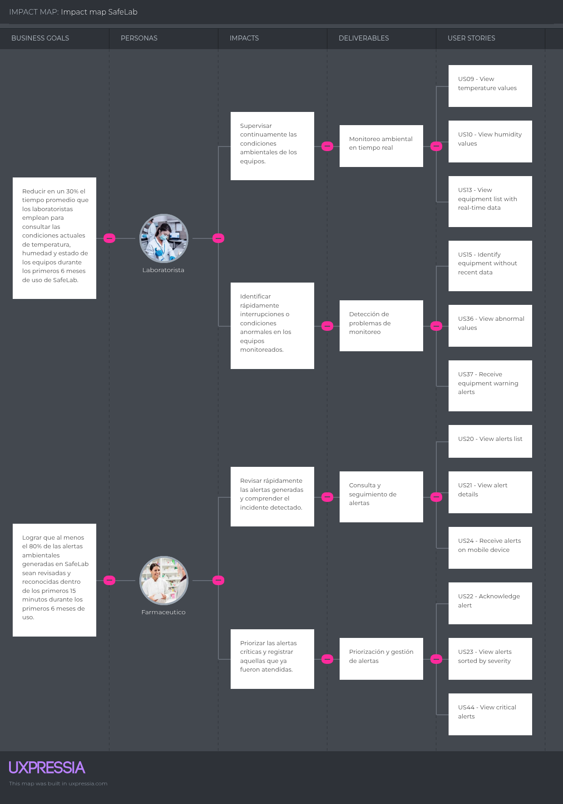

  <b>Figura X. Impact Mapping de SafeLab.</b> 
  <i>Fuente: Elaboración propia utilizando UXPressia.</i>

### **2.4.3. Product Backlog**

  El siguiente Product Backlog organiza las User Stories de SafeLab según su prioridad de negocio, estimación en Story Points y Sprint planificado. La secuencia considera primero las funcionalidades vinculadas con el monitoreo ambiental, la detección de desviaciones y la organización básica del entorno monitoreado; posteriormente incorpora funcionalidades móviles, históricas, de autenticación, análisis y mantenimiento.

<table border="1" style="width: 100%; border-collapse: collapse;">
  <thead>
    <tr>
      <th style="text-align: center; vertical-align: middle; padding: 6px;"># Order</th>
      <th style="text-align: center; vertical-align: middle; padding: 6px;">User Story ID</th>
      <th style="text-align: center; vertical-align: middle; padding: 6px;">Title</th>
      <th style="text-align: center; vertical-align: middle; padding: 6px;">Story Points</th>
      <th style="text-align: center; vertical-align: middle; padding: 6px;">Sprint</th>
    </tr>
  </thead>
  <tbody>
    <tr><td style="text-align: center; vertical-align: middle; padding: 6px;">1</td><td style="text-align: center; vertical-align: middle; padding: 6px;">US16</td><td style="text-align: justify; vertical-align: top; padding: 6px;">Recolección automática de datos</td><td style="text-align: center; vertical-align: middle; padding: 6px;">8</td><td style="text-align: center; vertical-align: middle; padding: 6px;">Sprint 1</td></tr>
    <tr><td style="text-align: center; vertical-align: middle; padding: 6px;">2</td><td style="text-align: center; vertical-align: middle; padding: 6px;">US09</td><td style="text-align: justify; vertical-align: top; padding: 6px;">Visualizar valores de temperatura</td><td style="text-align: center; vertical-align: middle; padding: 6px;">3</td><td style="text-align: center; vertical-align: middle; padding: 6px;">Sprint 1</td></tr>
    <tr><td style="text-align: center; vertical-align: middle; padding: 6px;">3</td><td style="text-align: center; vertical-align: middle; padding: 6px;">US10</td><td style="text-align: justify; vertical-align: top; padding: 6px;">Visualizar valores de humedad</td><td style="text-align: center; vertical-align: middle; padding: 6px;">3</td><td style="text-align: center; vertical-align: middle; padding: 6px;">Sprint 1</td></tr>
    <tr><td style="text-align: center; vertical-align: middle; padding: 6px;">4</td><td style="text-align: center; vertical-align: middle; padding: 6px;">US13</td><td style="text-align: justify; vertical-align: top; padding: 6px;">Visualizar lista de equipos con datos en tiempo real</td><td style="text-align: center; vertical-align: middle; padding: 6px;">3</td><td style="text-align: center; vertical-align: middle; padding: 6px;">Sprint 1</td></tr>
    <tr><td style="text-align: center; vertical-align: middle; padding: 6px;">5</td><td style="text-align: center; vertical-align: middle; padding: 6px;">US18</td><td style="text-align: justify; vertical-align: top; padding: 6px;">Recibir alertas de temperatura</td><td style="text-align: center; vertical-align: middle; padding: 6px;">5</td><td style="text-align: center; vertical-align: middle; padding: 6px;">Sprint 1</td></tr>
    <tr><td style="text-align: center; vertical-align: middle; padding: 6px;">6</td><td style="text-align: center; vertical-align: middle; padding: 6px;">US19</td><td style="text-align: justify; vertical-align: top; padding: 6px;">Recibir alertas de humedad</td><td style="text-align: center; vertical-align: middle; padding: 6px;">5</td><td style="text-align: center; vertical-align: middle; padding: 6px;">Sprint 1</td></tr>
    <tr><td style="text-align: center; vertical-align: middle; padding: 6px;">7</td><td style="text-align: center; vertical-align: middle; padding: 6px;">US20</td><td style="text-align: justify; vertical-align: top; padding: 6px;">Visualizar lista de alertas</td><td style="text-align: center; vertical-align: middle; padding: 6px;">3</td><td style="text-align: center; vertical-align: middle; padding: 6px;">Sprint 1</td></tr>
    <tr><td style="text-align: center; vertical-align: middle; padding: 6px;">8</td><td style="text-align: center; vertical-align: middle; padding: 6px;">US15</td><td style="text-align: justify; vertical-align: top; padding: 6px;">Identificar equipos sin datos recientes</td><td style="text-align: center; vertical-align: middle; padding: 6px;">3</td><td style="text-align: center; vertical-align: middle; padding: 6px;">Sprint 1</td></tr>
    <tr><td style="text-align: center; vertical-align: middle; padding: 6px;">9</td><td style="text-align: center; vertical-align: middle; padding: 6px;">US05</td><td style="text-align: justify; vertical-align: top; padding: 6px;">Registrar equipo</td><td style="text-align: center; vertical-align: middle; padding: 6px;">5</td><td style="text-align: center; vertical-align: middle; padding: 6px;">Sprint 1</td></tr>
    <tr><td style="text-align: center; vertical-align: middle; padding: 6px;">10</td><td style="text-align: center; vertical-align: middle; padding: 6px;">US07</td><td style="text-align: justify; vertical-align: top; padding: 6px;">Asignar equipo a un área</td><td style="text-align: center; vertical-align: middle; padding: 6px;">3</td><td style="text-align: center; vertical-align: middle; padding: 6px;">Sprint 1</td></tr>
    <tr><td style="text-align: center; vertical-align: middle; padding: 6px;">11</td><td style="text-align: center; vertical-align: middle; padding: 6px;">US03</td><td style="text-align: justify; vertical-align: top; padding: 6px;">Crear área de almacenamiento</td><td style="text-align: center; vertical-align: middle; padding: 6px;">3</td><td style="text-align: center; vertical-align: middle; padding: 6px;">Sprint 1</td></tr>
    <tr><td style="text-align: center; vertical-align: middle; padding: 6px;">12</td><td style="text-align: center; vertical-align: middle; padding: 6px;">US01</td><td style="text-align: justify; vertical-align: top; padding: 6px;">Registrar sitio de monitoreo</td><td style="text-align: center; vertical-align: middle; padding: 6px;">3</td><td style="text-align: center; vertical-align: middle; padding: 6px;">Sprint 1</td></tr>
    <tr><td style="text-align: center; vertical-align: middle; padding: 6px;">13</td><td style="text-align: center; vertical-align: middle; padding: 6px;">US56</td><td style="text-align: justify; vertical-align: top; padding: 6px;">Visualizar la Landing Page de SafeLab</td><td style="text-align: center; vertical-align: middle; padding: 6px;">2</td><td style="text-align: center; vertical-align: middle; padding: 6px;">Sprint 1</td></tr>
    <tr><td style="text-align: center; vertical-align: middle; padding: 6px;">14</td><td style="text-align: center; vertical-align: middle; padding: 6px;">US57</td><td style="text-align: justify; vertical-align: top; padding: 6px;">Cambiar el idioma de la Landing Page</td><td style="text-align: center; vertical-align: middle; padding: 6px;">3</td><td style="text-align: center; vertical-align: middle; padding: 6px;">Sprint 1</td></tr>
    <tr><td style="text-align: center; vertical-align: middle; padding: 6px;">15</td><td style="text-align: center; vertical-align: middle; padding: 6px;">US58</td><td style="text-align: justify; vertical-align: top; padding: 6px;">Acceder a los Términos y Condiciones</td><td style="text-align: center; vertical-align: middle; padding: 6px;">2</td><td style="text-align: center; vertical-align: middle; padding: 6px;">Sprint 1</td></tr>
    <tr><td style="text-align: center; vertical-align: middle; padding: 6px;">16</td><td style="text-align: center; vertical-align: middle; padding: 6px;">US61</td><td style="text-align: justify; vertical-align: top; padding: 6px;">Proporcionar servicios de monitoreo ambiental</td><td style="text-align: center; vertical-align: middle; padding: 6px;">5</td><td style="text-align: center; vertical-align: middle; padding: 6px;">Sprint 1</td></tr>
    <tr><td style="text-align: center; vertical-align: middle; padding: 6px;">17</td><td style="text-align: center; vertical-align: middle; padding: 6px;">US60</td><td style="text-align: justify; vertical-align: top; padding: 6px;">Proporcionar servicios de organización del monitoreo</td><td style="text-align: center; vertical-align: middle; padding: 6px;">8</td><td style="text-align: center; vertical-align: middle; padding: 6px;">Sprint 1</td></tr>
    <tr><td style="text-align: center; vertical-align: middle; padding: 6px;">18</td><td style="text-align: center; vertical-align: middle; padding: 6px;">US62</td><td style="text-align: justify; vertical-align: top; padding: 6px;">Proporcionar servicios de alertas e incidentes</td><td style="text-align: center; vertical-align: middle; padding: 6px;">5</td><td style="text-align: center; vertical-align: middle; padding: 6px;">Sprint 1</td></tr>
    <tr><td style="text-align: center; vertical-align: middle; padding: 6px;">19</td><td style="text-align: center; vertical-align: middle; padding: 6px;">US11</td><td style="text-align: justify; vertical-align: top; padding: 6px;">Visualizar estado operativo del equipo</td><td style="text-align: center; vertical-align: middle; padding: 6px;">3</td><td style="text-align: center; vertical-align: middle; padding: 6px;">Sprint 1</td></tr>
    <tr><td style="text-align: center; vertical-align: middle; padding: 6px;">20</td><td style="text-align: center; vertical-align: middle; padding: 6px;">US12</td><td style="text-align: justify; vertical-align: top; padding: 6px;">Visualizar detalles del equipo</td><td style="text-align: center; vertical-align: middle; padding: 6px;">2</td><td style="text-align: center; vertical-align: middle; padding: 6px;">Sprint 1</td></tr>
    <tr><td style="text-align: center; vertical-align: middle; padding: 6px;">21</td><td style="text-align: center; vertical-align: middle; padding: 6px;">US02</td><td style="text-align: justify; vertical-align: top; padding: 6px;">Visualizar sitios de monitoreo</td><td style="text-align: center; vertical-align: middle; padding: 6px;">2</td><td style="text-align: center; vertical-align: middle; padding: 6px;">Sprint 1</td></tr>
    <tr><td style="text-align: center; vertical-align: middle; padding: 6px;">22</td><td style="text-align: center; vertical-align: middle; padding: 6px;">US04</td><td style="text-align: justify; vertical-align: top; padding: 6px;">Visualizar áreas de almacenamiento</td><td style="text-align: center; vertical-align: middle; padding: 6px;">2</td><td style="text-align: center; vertical-align: middle; padding: 6px;">Sprint 1</td></tr>
    <tr><td style="text-align: center; vertical-align: middle; padding: 6px;">23</td><td style="text-align: center; vertical-align: middle; padding: 6px;">US06</td><td style="text-align: justify; vertical-align: top; padding: 6px;">Visualizar lista de equipos</td><td style="text-align: center; vertical-align: middle; padding: 6px;">3</td><td style="text-align: center; vertical-align: middle; padding: 6px;">Sprint 1</td></tr>
    <tr><td style="text-align: center; vertical-align: middle; padding: 6px;">24</td><td style="text-align: center; vertical-align: middle; padding: 6px;">US08</td><td style="text-align: justify; vertical-align: top; padding: 6px;">Buscar equipo por nombre</td><td style="text-align: center; vertical-align: middle; padding: 6px;">2</td><td style="text-align: center; vertical-align: middle; padding: 6px;">Sprint 1</td></tr>
    <tr><td style="text-align: center; vertical-align: middle; padding: 6px;">25</td><td style="text-align: center; vertical-align: middle; padding: 6px;">US14</td><td style="text-align: justify; vertical-align: top; padding: 6px;">Filtrar equipos por área de almacenamiento</td><td style="text-align: center; vertical-align: middle; padding: 6px;">2</td><td style="text-align: center; vertical-align: middle; padding: 6px;">Sprint 1</td></tr>
    <tr><td style="text-align: center; vertical-align: middle; padding: 6px;">26</td><td style="text-align: center; vertical-align: middle; padding: 6px;">US25</td><td style="text-align: justify; vertical-align: top; padding: 6px;">Configurar límites de alerta por equipo</td><td style="text-align: center; vertical-align: middle; padding: 6px;">5</td><td style="text-align: center; vertical-align: middle; padding: 6px;">Sprint 2</td></tr>
    <tr><td style="text-align: center; vertical-align: middle; padding: 6px;">27</td><td style="text-align: center; vertical-align: middle; padding: 6px;">US24</td><td style="text-align: justify; vertical-align: top; padding: 6px;">Recibir alertas en un dispositivo móvil</td><td style="text-align: center; vertical-align: middle; padding: 6px;">5</td><td style="text-align: center; vertical-align: middle; padding: 6px;">Sprint 2</td></tr>
    <tr><td style="text-align: center; vertical-align: middle; padding: 6px;">28</td><td style="text-align: center; vertical-align: middle; padding: 6px;">US21</td><td style="text-align: justify; vertical-align: top; padding: 6px;">Visualizar detalles de una alerta</td><td style="text-align: center; vertical-align: middle; padding: 6px;">2</td><td style="text-align: center; vertical-align: middle; padding: 6px;">Sprint 2</td></tr>
    <tr><td style="text-align: center; vertical-align: middle; padding: 6px;">29</td><td style="text-align: center; vertical-align: middle; padding: 6px;">US22</td><td style="text-align: justify; vertical-align: top; padding: 6px;">Confirmar atención de una alerta</td><td style="text-align: center; vertical-align: middle; padding: 6px;">2</td><td style="text-align: center; vertical-align: middle; padding: 6px;">Sprint 2</td></tr>
    <tr><td style="text-align: center; vertical-align: middle; padding: 6px;">30</td><td style="text-align: center; vertical-align: middle; padding: 6px;">US23</td><td style="text-align: justify; vertical-align: top; padding: 6px;">Visualizar alertas ordenadas por severidad</td><td style="text-align: center; vertical-align: middle; padding: 6px;">2</td><td style="text-align: center; vertical-align: middle; padding: 6px;">Sprint 2</td></tr>
    <tr><td style="text-align: center; vertical-align: middle; padding: 6px;">31</td><td style="text-align: center; vertical-align: middle; padding: 6px;">US44</td><td style="text-align: justify; vertical-align: top; padding: 6px;">Visualizar alertas críticas</td><td style="text-align: center; vertical-align: middle; padding: 6px;">3</td><td style="text-align: center; vertical-align: middle; padding: 6px;">Sprint 2</td></tr>
    <tr><td style="text-align: center; vertical-align: middle; padding: 6px;">32</td><td style="text-align: center; vertical-align: middle; padding: 6px;">US46</td><td style="text-align: justify; vertical-align: top; padding: 6px;">Visualizar equipos con alertas activas</td><td style="text-align: center; vertical-align: middle; padding: 6px;">2</td><td style="text-align: center; vertical-align: middle; padding: 6px;">Sprint 2</td></tr>
    <tr><td style="text-align: center; vertical-align: middle; padding: 6px;">33</td><td style="text-align: center; vertical-align: middle; padding: 6px;">US36</td><td style="text-align: justify; vertical-align: top; padding: 6px;">Visualizar valores anómalos</td><td style="text-align: center; vertical-align: middle; padding: 6px;">3</td><td style="text-align: center; vertical-align: middle; padding: 6px;">Sprint 2</td></tr>
    <tr><td style="text-align: center; vertical-align: middle; padding: 6px;">34</td><td style="text-align: center; vertical-align: middle; padding: 6px;">US37</td><td style="text-align: justify; vertical-align: top; padding: 6px;">Recibir alertas de advertencia del equipo</td><td style="text-align: center; vertical-align: middle; padding: 6px;">3</td><td style="text-align: center; vertical-align: middle; padding: 6px;">Sprint 2</td></tr>
    <tr><td style="text-align: center; vertical-align: middle; padding: 6px;">35</td><td style="text-align: center; vertical-align: middle; padding: 6px;">US17</td><td style="text-align: justify; vertical-align: top; padding: 6px;">Visualizar datos en dispositivo móvil</td><td style="text-align: center; vertical-align: middle; padding: 6px;">5</td><td style="text-align: center; vertical-align: middle; padding: 6px;">Sprint 2</td></tr>
    <tr><td style="text-align: center; vertical-align: middle; padding: 6px;">36</td><td style="text-align: center; vertical-align: middle; padding: 6px;">US65</td><td style="text-align: justify; vertical-align: top; padding: 6px;">Soportar almacenamiento local de datos en el dispositivo móvil</td><td style="text-align: center; vertical-align: middle; padding: 6px;">5</td><td style="text-align: center; vertical-align: middle; padding: 6px;">Sprint 2</td></tr>
    <tr><td style="text-align: center; vertical-align: middle; padding: 6px;">37</td><td style="text-align: center; vertical-align: middle; padding: 6px;">US43</td><td style="text-align: justify; vertical-align: top; padding: 6px;">Visualizar dashboard</td><td style="text-align: center; vertical-align: middle; padding: 6px;">5</td><td style="text-align: center; vertical-align: middle; padding: 6px;">Sprint 2</td></tr>
    <tr><td style="text-align: center; vertical-align: middle; padding: 6px;">38</td><td style="text-align: center; vertical-align: middle; padding: 6px;">US45</td><td style="text-align: justify; vertical-align: top; padding: 6px;">Visualizar resumen con totales</td><td style="text-align: center; vertical-align: middle; padding: 6px;">3</td><td style="text-align: center; vertical-align: middle; padding: 6px;">Sprint 2</td></tr>
    <tr><td style="text-align: center; vertical-align: middle; padding: 6px;">39</td><td style="text-align: center; vertical-align: middle; padding: 6px;">US27</td><td style="text-align: justify; vertical-align: top; padding: 6px;">Visualizar datos históricos</td><td style="text-align: center; vertical-align: middle; padding: 6px;">5</td><td style="text-align: center; vertical-align: middle; padding: 6px;">Sprint 2</td></tr>
    <tr><td style="text-align: center; vertical-align: middle; padding: 6px;">40</td><td style="text-align: center; vertical-align: middle; padding: 6px;">US28</td><td style="text-align: justify; vertical-align: top; padding: 6px;">Seleccionar un rango de fechas para los datos</td><td style="text-align: center; vertical-align: middle; padding: 6px;">2</td><td style="text-align: center; vertical-align: middle; padding: 6px;">Sprint 2</td></tr>
    <tr><td style="text-align: center; vertical-align: middle; padding: 6px;">41</td><td style="text-align: center; vertical-align: middle; padding: 6px;">US30</td><td style="text-align: justify; vertical-align: top; padding: 6px;">Generar reporte por equipo y fecha</td><td style="text-align: center; vertical-align: middle; padding: 6px;">5</td><td style="text-align: center; vertical-align: middle; padding: 6px;">Sprint 2</td></tr>
    <tr><td style="text-align: center; vertical-align: middle; padding: 6px;">42</td><td style="text-align: center; vertical-align: middle; padding: 6px;">US31</td><td style="text-align: justify; vertical-align: top; padding: 6px;">Descargar archivo de reporte</td><td style="text-align: center; vertical-align: middle; padding: 6px;">3</td><td style="text-align: center; vertical-align: middle; padding: 6px;">Sprint 2</td></tr>
    <tr><td style="text-align: center; vertical-align: middle; padding: 6px;">43</td><td style="text-align: center; vertical-align: middle; padding: 6px;">US63</td><td style="text-align: justify; vertical-align: top; padding: 6px;">Proporcionar servicios de datos históricos y reportes</td><td style="text-align: center; vertical-align: middle; padding: 6px;">5</td><td style="text-align: center; vertical-align: middle; padding: 6px;">Sprint 2</td></tr>
    <tr><td style="text-align: center; vertical-align: middle; padding: 6px;">44</td><td style="text-align: center; vertical-align: middle; padding: 6px;">US59</td><td style="text-align: justify; vertical-align: top; padding: 6px;">Registrar cuenta de usuario</td><td style="text-align: center; vertical-align: middle; padding: 6px;">5</td><td style="text-align: center; vertical-align: middle; padding: 6px;">Sprint 2</td></tr>
    <tr><td style="text-align: center; vertical-align: middle; padding: 6px;">45</td><td style="text-align: center; vertical-align: middle; padding: 6px;">US52</td><td style="text-align: justify; vertical-align: top; padding: 6px;">Iniciar sesión con correo electrónico y contraseña</td><td style="text-align: center; vertical-align: middle; padding: 6px;">3</td><td style="text-align: center; vertical-align: middle; padding: 6px;">Sprint 2</td></tr>
    <tr><td style="text-align: center; vertical-align: middle; padding: 6px;">46</td><td style="text-align: center; vertical-align: middle; padding: 6px;">US51</td><td style="text-align: justify; vertical-align: top; padding: 6px;">Iniciar sesión con una cuenta de Google</td><td style="text-align: center; vertical-align: middle; padding: 6px;">3</td><td style="text-align: center; vertical-align: middle; padding: 6px;">Sprint 2</td></tr>
    <tr><td style="text-align: center; vertical-align: middle; padding: 6px;">47</td><td style="text-align: center; vertical-align: middle; padding: 6px;">US64</td><td style="text-align: justify; vertical-align: top; padding: 6px;">Proporcionar servicios de acceso de usuario</td><td style="text-align: center; vertical-align: middle; padding: 6px;">5</td><td style="text-align: center; vertical-align: middle; padding: 6px;">Sprint 2</td></tr>
    <tr><td style="text-align: center; vertical-align: middle; padding: 6px;">48</td><td style="text-align: center; vertical-align: middle; padding: 6px;">US29</td><td style="text-align: justify; vertical-align: top; padding: 6px;">Comparar datos entre periodos</td><td style="text-align: center; vertical-align: middle; padding: 6px;">3</td><td style="text-align: center; vertical-align: middle; padding: 6px;">Sprint 3</td></tr>
    <tr><td style="text-align: center; vertical-align: middle; padding: 6px;">49</td><td style="text-align: center; vertical-align: middle; padding: 6px;">US32</td><td style="text-align: justify; vertical-align: top; padding: 6px;">Visualizar historial de incidentes</td><td style="text-align: center; vertical-align: middle; padding: 6px;">3</td><td style="text-align: center; vertical-align: middle; padding: 6px;">Sprint 3</td></tr>
    <tr><td style="text-align: center; vertical-align: middle; padding: 6px;">50</td><td style="text-align: center; vertical-align: middle; padding: 6px;">US33</td><td style="text-align: justify; vertical-align: top; padding: 6px;">Exportar archivo de datos</td><td style="text-align: center; vertical-align: middle; padding: 6px;">3</td><td style="text-align: center; vertical-align: middle; padding: 6px;">Sprint 3</td></tr>
    <tr><td style="text-align: center; vertical-align: middle; padding: 6px;">51</td><td style="text-align: center; vertical-align: middle; padding: 6px;">US34</td><td style="text-align: justify; vertical-align: top; padding: 6px;">Comparar datos semanales y mensuales</td><td style="text-align: center; vertical-align: middle; padding: 6px;">3</td><td style="text-align: center; vertical-align: middle; padding: 6px;">Sprint 3</td></tr>
    <tr><td style="text-align: center; vertical-align: middle; padding: 6px;">52</td><td style="text-align: center; vertical-align: middle; padding: 6px;">US48</td><td style="text-align: justify; vertical-align: top; padding: 6px;">Visualizar tendencias de alertas</td><td style="text-align: center; vertical-align: middle; padding: 6px;">3</td><td style="text-align: center; vertical-align: middle; padding: 6px;">Sprint 3</td></tr>
    <tr><td style="text-align: center; vertical-align: middle; padding: 6px;">53</td><td style="text-align: center; vertical-align: middle; padding: 6px;">US49</td><td style="text-align: justify; vertical-align: top; padding: 6px;">Visualizar tendencias de temperatura</td><td style="text-align: center; vertical-align: middle; padding: 6px;">3</td><td style="text-align: center; vertical-align: middle; padding: 6px;">Sprint 3</td></tr>
    <tr><td style="text-align: center; vertical-align: middle; padding: 6px;">54</td><td style="text-align: center; vertical-align: middle; padding: 6px;">US50</td><td style="text-align: justify; vertical-align: top; padding: 6px;">Visualizar tendencias de humedad</td><td style="text-align: center; vertical-align: middle; padding: 6px;">3</td><td style="text-align: center; vertical-align: middle; padding: 6px;">Sprint 3</td></tr>
    <tr><td style="text-align: center; vertical-align: middle; padding: 6px;">55</td><td style="text-align: center; vertical-align: middle; padding: 6px;">US35</td><td style="text-align: justify; vertical-align: top; padding: 6px;">Visualizar condición del equipo</td><td style="text-align: center; vertical-align: middle; padding: 6px;">3</td><td style="text-align: center; vertical-align: middle; padding: 6px;">Sprint 3</td></tr>
    <tr><td style="text-align: center; vertical-align: middle; padding: 6px;">56</td><td style="text-align: center; vertical-align: middle; padding: 6px;">US40</td><td style="text-align: justify; vertical-align: top; padding: 6px;">Registrar mantenimiento</td><td style="text-align: center; vertical-align: middle; padding: 6px;">3</td><td style="text-align: center; vertical-align: middle; padding: 6px;">Sprint 3</td></tr>
    <tr><td style="text-align: center; vertical-align: middle; padding: 6px;">57</td><td style="text-align: center; vertical-align: middle; padding: 6px;">US41</td><td style="text-align: justify; vertical-align: top; padding: 6px;">Visualizar historial de mantenimiento</td><td style="text-align: center; vertical-align: middle; padding: 6px;">3</td><td style="text-align: center; vertical-align: middle; padding: 6px;">Sprint 3</td></tr>
    <tr><td style="text-align: center; vertical-align: middle; padding: 6px;">58</td><td style="text-align: center; vertical-align: middle; padding: 6px;">US42</td><td style="text-align: justify; vertical-align: top; padding: 6px;">Visualizar confiabilidad del equipo</td><td style="text-align: center; vertical-align: middle; padding: 6px;">5</td><td style="text-align: center; vertical-align: middle; padding: 6px;">Sprint 3</td></tr>
    <tr><td style="text-align: center; vertical-align: middle; padding: 6px;">59</td><td style="text-align: center; vertical-align: middle; padding: 6px;">US38</td><td style="text-align: justify; vertical-align: top; padding: 6px;">Visualizar datos de rendimiento del equipo</td><td style="text-align: center; vertical-align: middle; padding: 6px;">3</td><td style="text-align: center; vertical-align: middle; padding: 6px;">Sprint 3</td></tr>
    <tr><td style="text-align: center; vertical-align: middle; padding: 6px;">60</td><td style="text-align: center; vertical-align: middle; padding: 6px;">US39</td><td style="text-align: justify; vertical-align: top; padding: 6px;">Visualizar datos de uso del equipo</td><td style="text-align: center; vertical-align: middle; padding: 6px;">3</td><td style="text-align: center; vertical-align: middle; padding: 6px;">Sprint 3</td></tr>
    <tr><td style="text-align: center; vertical-align: middle; padding: 6px;">61</td><td style="text-align: center; vertical-align: middle; padding: 6px;">US26</td><td style="text-align: justify; vertical-align: top; padding: 6px;">Compartir alertas con el equipo de trabajo</td><td style="text-align: center; vertical-align: middle; padding: 6px;">3</td><td style="text-align: center; vertical-align: middle; padding: 6px;">Sprint 3</td></tr>
    <tr><td style="text-align: center; vertical-align: middle; padding: 6px;">62</td><td style="text-align: center; vertical-align: middle; padding: 6px;">US53</td><td style="text-align: justify; vertical-align: top; padding: 6px;">Recuperar contraseña por correo electrónico</td><td style="text-align: center; vertical-align: middle; padding: 6px;">3</td><td style="text-align: center; vertical-align: middle; padding: 6px;">Sprint 3</td></tr>
    <tr><td style="text-align: center; vertical-align: middle; padding: 6px;">63</td><td style="text-align: center; vertical-align: middle; padding: 6px;">US54</td><td style="text-align: justify; vertical-align: top; padding: 6px;">Cerrar sesión en el sistema</td><td style="text-align: center; vertical-align: middle; padding: 6px;">1</td><td style="text-align: center; vertical-align: middle; padding: 6px;">Sprint 3</td></tr>
    <tr><td style="text-align: center; vertical-align: middle; padding: 6px;">64</td><td style="text-align: center; vertical-align: middle; padding: 6px;">US55</td><td style="text-align: justify; vertical-align: top; padding: 6px;">Asignar rol de usuario</td><td style="text-align: center; vertical-align: middle; padding: 6px;">3</td><td style="text-align: center; vertical-align: middle; padding: 6px;">Sprint 3</td></tr>
  </tbody>
</table>

## **2.5. Strategic-Level Domain-Driven Design**

El diseño estratégico de SafeLab organiza el dominio alrededor de las capacidades necesarias para el monitoreo ambiental en tiempo real, la gestión de alertas e incidentes, la trazabilidad, los reportes regulatorios, el mantenimiento de equipos, el acceso de usuarios y la visualización de información desde aplicaciones móviles nativas y multiplataforma.

A partir de las Epics, User Stories, entrevistas, Needfinding y Ubiquitous Language del capítulo, el dominio se divide en ocho Bounded Contexts: <b>Identity & Access Management</b>, <b>Monitoring Organization</b>, <b>Sensor Monitoring</b>, <b>Alerts & Incident Management</b>, <b>Equipment Condition & Maintenance</b>, <b>Reporting & Compliance</b>, <b>Dashboard & Overview</b> y <b>Audit & Traceability</b>. Los contextos con mayor relación con el valor principal del negocio son Sensor Monitoring, Alerts & Incident Management y Reporting & Compliance, ya que concentran la captura de información ambiental, la respuesta ante desviaciones y la generación de evidencia para control y auditoría.

### **2.5.1. Event Storming**

Para el Event Storming estratégico de SafeLab se parte de los principales procesos identificados en las entrevistas y en las User Stories. El flujo comienza con la configuración de sitios, áreas y equipos; continúa con la recepción automática de lecturas ambientales; posteriormente evalúa desviaciones y genera alertas; finalmente registra la atención del incidente, las acciones correctivas, el mantenimiento relacionado y la evidencia de trazabilidad que puede utilizarse en reportes regulatorios. Esta secuencia permite visualizar el dominio completo sin depender todavía de una implementación tecnológica específica.

<table border="1" style="width: 100%; border-collapse: collapse;">
  <thead>
    <tr>
      <th style="text-align: center; padding: 6px;">Orden</th>
      <th style="text-align: center; padding: 6px;">Domain Event</th>
      <th style="text-align: center; padding: 6px;">Origen</th>
      <th style="text-align: center; padding: 6px;">Consecuencia de negocio</th>
    </tr>
  </thead>
  <tbody>
    <tr><td style="text-align:center; padding:6px;">1</td><td style="text-align:center; padding:6px;">Monitoring Site Registered</td><td style="text-align:justify; padding:6px;">Un usuario autorizado registra una sede o sitio de monitoreo.</td><td style="text-align:justify; padding:6px;">La organización dispone de un ámbito físico sobre el cual asociar áreas y equipos.</td></tr>
    <tr><td style="text-align:center; padding:6px;">2</td><td style="text-align:center; padding:6px;">Storage Area Created</td><td style="text-align:justify; padding:6px;">Se crea una sala, cámara o área de almacenamiento.</td><td style="text-align:justify; padding:6px;">Los equipos pueden organizarse según su ubicación real.</td></tr>
    <tr><td style="text-align:center; padding:6px;">3</td><td style="text-align:center; padding:6px;">Equipment Registered</td><td style="text-align:justify; padding:6px;">Se incorpora un refrigerador, congelador u otro equipo monitoreado.</td><td style="text-align:justify; padding:6px;">El equipo queda disponible para recibir sensores y reglas de monitoreo.</td></tr>
    <tr><td style="text-align:center; padding:6px;">4</td><td style="text-align:center; padding:6px;">Sensor Reading Received</td><td style="text-align:justify; padding:6px;">Un sensor o gateway envía una nueva lectura.</td><td style="text-align:justify; padding:6px;">SafeLab almacena temperatura, humedad, timestamp y origen de la medición.</td></tr>
    <tr><td style="text-align:center; padding:6px;">5</td><td style="text-align:center; padding:6px;">Environmental Threshold Exceeded</td><td style="text-align:justify; padding:6px;">Una lectura queda fuera del rango configurado.</td><td style="text-align:justify; padding:6px;">Se inicia el proceso de evaluación de una desviación.</td></tr>
    <tr><td style="text-align:center; padding:6px;">6</td><td style="text-align:center; padding:6px;">Alert Generated</td><td style="text-align:justify; padding:6px;">Una condición cumple los criterios definidos para una alerta.</td><td style="text-align:justify; padding:6px;">Se registra la alerta y se prepara su comunicación al personal responsable.</td></tr>
    <tr><td style="text-align:center; padding:6px;">7</td><td style="text-align:center; padding:6px;">Alert Notification Delivered</td><td style="text-align:justify; padding:6px;">El servicio de notificación comunica la alerta.</td><td style="text-align:justify; padding:6px;">El personal conoce el incidente aun cuando no se encuentra frente al equipo.</td></tr>
    <tr><td style="text-align:center; padding:6px;">8</td><td style="text-align:center; padding:6px;">Alert Acknowledged</td><td style="text-align:justify; padding:6px;">Un usuario confirma que la alerta fue atendida.</td><td style="text-align:justify; padding:6px;">SafeLab conserva evidencia del responsable y momento de atención.</td></tr>
    <tr><td style="text-align:center; padding:6px;">9</td><td style="text-align:center; padding:6px;">Incident Opened</td><td style="text-align:justify; padding:6px;">La desviación requiere seguimiento formal.</td><td style="text-align:justify; padding:6px;">Se crea un incidente asociado al equipo, alerta y periodo afectado.</td></tr>
    <tr><td style="text-align:center; padding:6px;">10</td><td style="text-align:center; padding:6px;">Corrective Action Recorded</td><td style="text-align:justify; padding:6px;">El personal ejecuta y registra una acción.</td><td style="text-align:justify; padding:6px;">Se mantiene trazabilidad de la respuesta aplicada.</td></tr>
    <tr><td style="text-align:center; padding:6px;">11</td><td style="text-align:center; padding:6px;">Maintenance Record Registered</td><td style="text-align:justify; padding:6px;">Se realiza mantenimiento preventivo o correctivo.</td><td style="text-align:justify; padding:6px;">Se actualiza el historial de condición y confiabilidad del equipo.</td></tr>
    <tr><td style="text-align:center; padding:6px;">12</td><td style="text-align:center; padding:6px;">Compliance Report Generated</td><td style="text-align:justify; padding:6px;">Un usuario solicita evidencia de un periodo o equipo.</td><td style="text-align:justify; padding:6px;">Se consolida información histórica para control y auditoría.</td></tr>
    <tr><td style="text-align:center; padding:6px;">13</td><td style="text-align:center; padding:6px;">Audit Entry Appended</td><td style="text-align:justify; padding:6px;">Una operación relevante modifica o consulta información sensible.</td><td style="text-align:justify; padding:6px;">Se agrega una entrada inmutable al historial de auditoría.</td></tr>
  </tbody>
</table>

Además del flujo principal, se consideran eventos relacionados con el acceso al sistema, como <b>User Registered</b>, <b>User Authenticated</b> y <b>User Role Assigned</b>. Estos eventos pertenecen a un contexto de soporte y permiten controlar quién puede consultar, registrar o administrar información operacional.

  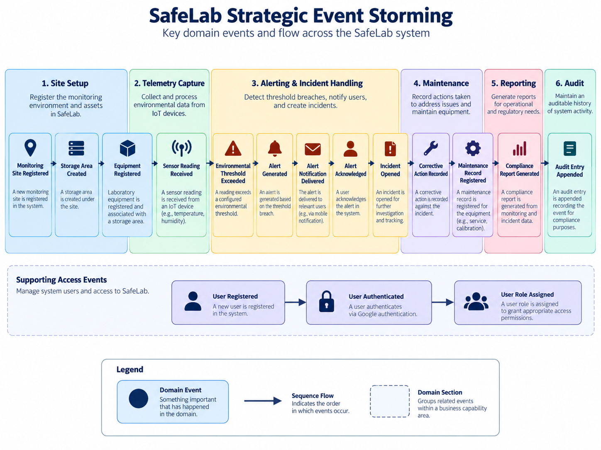

#### **2.5.1.1. Candidate Context Discovery**

La identificación de los Candidate Bounded Contexts combina las técnicas <b>start-with-value</b> y <b>look-for-pivotal-events</b>. Primero se agrupan los eventos que producen el valor principal de SafeLab, especialmente la recepción de lecturas ambientales, la detección de desviaciones, la atención de incidentes y la generación de evidencia regulatoria. Luego se utilizan los eventos que representan cambios importantes de estado para separar responsabilidades con reglas, vocabulario y ritmos de cambio diferentes.

<table border="1" style="width: 100%; border-collapse: collapse;">
  <thead>
    <tr>
      <th style="text-align:center; padding:6px;">Candidate Bounded Context</th>
      <th style="text-align:center; padding:6px;">Clasificación estratégica</th>
      <th style="text-align:center; padding:6px;">Responsabilidad principal</th>
      <th style="text-align:center; padding:6px;">Requisitos relacionados</th>
    </tr>
  </thead>
  <tbody>
    <tr><td style="text-align:center; padding:6px;">Identity & Access Management</td><td style="text-align:center; padding:6px;">Generic</td><td style="text-align:justify; padding:6px;">Registro, autenticación, recuperación de acceso y asignación de roles.</td><td style="text-align:justify; padding:6px;">EP07; US51-US55, US59 y US64.</td></tr>
    <tr><td style="text-align:center; padding:6px;">Monitoring Organization</td><td style="text-align:center; padding:6px;">Supporting</td><td style="text-align:justify; padding:6px;">Organización de sitios, áreas de almacenamiento y equipos monitoreados.</td><td style="text-align:justify; padding:6px;">EP01; US01-US08 y US60.</td></tr>
    <tr><td style="text-align:center; padding:6px;">Sensor Monitoring</td><td style="text-align:center; padding:6px;">Core</td><td style="text-align:justify; padding:6px;">Captura y consulta de temperatura, humedad, estado y continuidad de las lecturas.</td><td style="text-align:justify; padding:6px;">EP02; US09-US17 y US61.</td></tr>
    <tr><td style="text-align:center; padding:6px;">Alerts & Incident Management</td><td style="text-align:center; padding:6px;">Core</td><td style="text-align:justify; padding:6px;">Evaluación de desviaciones, alertas, notificaciones, reconocimiento e incidentes.</td><td style="text-align:justify; padding:6px;">EP03; US18-US26, US32, US44, US46 y US62.</td></tr>
    <tr><td style="text-align:center; padding:6px;">Equipment Condition & Maintenance</td><td style="text-align:center; padding:6px;">Supporting</td><td style="text-align:justify; padding:6px;">Estado, confiabilidad, rendimiento, uso e historial de mantenimiento.</td><td style="text-align:justify; padding:6px;">EP05; US35-US42.</td></tr>
    <tr><td style="text-align:center; padding:6px;">Reporting & Compliance</td><td style="text-align:center; padding:6px;">Core</td><td style="text-align:justify; padding:6px;">Históricos, comparaciones, exportaciones y generación de reportes para control y auditoría.</td><td style="text-align:justify; padding:6px;">EP04; US27-US34 y US63.</td></tr>
    <tr><td style="text-align:center; padding:6px;">Dashboard & Overview</td><td style="text-align:center; padding:6px;">Supporting</td><td style="text-align:justify; padding:6px;">Resumen operacional, totales, tendencias e información crítica para decisiones rápidas.</td><td style="text-align:justify; padding:6px;">EP06; US43-US50.</td></tr>
    <tr><td style="text-align:center; padding:6px;">Audit & Traceability</td><td style="text-align:center; padding:6px;">Supporting</td><td style="text-align:justify; padding:6px;">Registro inmutable de acciones, cambios, responsables y correlación de eventos para trazabilidad.</td><td style="text-align:justify; padding:6px;">Necesidades de entrevistas, Incident Log, Compliance Report y requisitos transversales de auditoría.</td></tr>
  </tbody>
</table>

La separación de responsabilidades prioriza los límites que aparecen de forma consistente en los requisitos actuales. Identity & Access Management concentra identidad, autenticación y roles; Reporting & Compliance reúne históricos, exportación y evidencia regulatoria; y Equipment Condition & Maintenance agrupa la evaluación de condición, confiabilidad e historial de mantenimiento. Esta organización mantiene cada capacidad dentro de un contexto con lenguaje y reglas de negocio coherentes.

  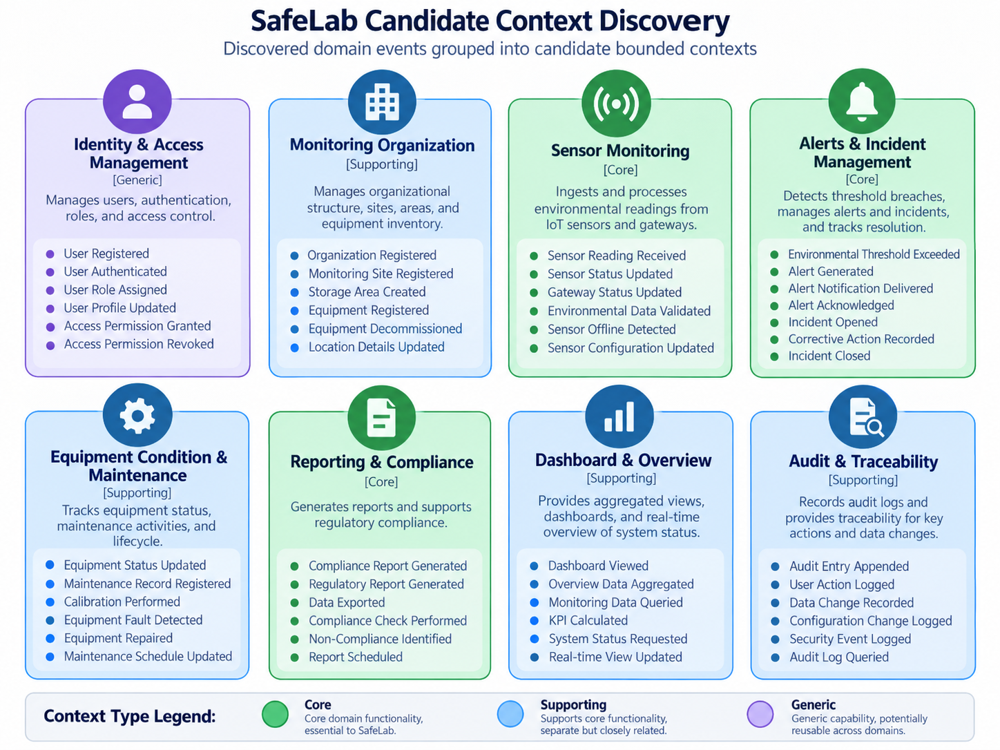

#### **2.5.1.2. Domain Message Flows Modeling**

El Domain Message Flows Modeling representa cómo los Bounded Contexts colaboran para completar los escenarios de negocio mediante Domain Storytelling. Los actores, objetos de dominio y mensajes permiten visualizar la secuencia de colaboración en los flujos principales de SafeLab.

<table border="1" style="width: 100%; border-collapse: collapse;">
  <thead>
    <tr>
      <th style="text-align:center; padding:6px;">Flujo</th>
      <th style="text-align:center; padding:6px;">Secuencia entre contextos</th>
      <th style="text-align:center; padding:6px;">Resultado</th>
    </tr>
  </thead>
  <tbody>
    <tr><td style="text-align:center; padding:6px;">F1 - Configuración del monitoreo</td><td style="text-align:justify; padding:6px;">Identity & Access Management → Monitoring Organization → Sensor Monitoring.</td><td style="text-align:justify; padding:6px;">Un usuario autorizado registra la ubicación y el equipo, y posteriormente vincula el origen de telemetría.</td></tr>
    <tr><td style="text-align:center; padding:6px;">F2 - Recepción de telemetría</td><td style="text-align:justify; padding:6px;">IoT Sensor/Gateway → Sensor Monitoring → Dashboard & Overview → Audit & Traceability.</td><td style="text-align:justify; padding:6px;">La lectura queda registrada, disponible para consulta y trazada.</td></tr>
    <tr><td style="text-align:center; padding:6px;">F3 - Desviación y alerta</td><td style="text-align:justify; padding:6px;">Sensor Monitoring → Alerts & Incident Management → servicio de notificaciones → usuario móvil.</td><td style="text-align:justify; padding:6px;">Una condición fuera de rango se convierte en alerta y es comunicada al responsable.</td></tr>
    <tr><td style="text-align:center; padding:6px;">F4 - Atención del incidente</td><td style="text-align:justify; padding:6px;">Alerts & Incident Management → Audit & Traceability → Reporting & Compliance.</td><td style="text-align:justify; padding:6px;">Quedan registrados el responsable, la atención y la acción correctiva para su posterior auditoría.</td></tr>
    <tr><td style="text-align:center; padding:6px;">F5 - Condición y mantenimiento</td><td style="text-align:justify; padding:6px;">Sensor Monitoring → Equipment Condition & Maintenance → Dashboard & Overview.</td><td style="text-align:justify; padding:6px;">Las tendencias y anomalías pueden utilizarse para evaluar la condición del equipo y registrar mantenimientos.</td></tr>
    <tr><td style="text-align:center; padding:6px;">F6 - Reporte regulatorio</td><td style="text-align:justify; padding:6px;">Reporting & Compliance consulta información de Sensor Monitoring, Alerts & Incident Management, Equipment Condition & Maintenance y Audit & Traceability.</td><td style="text-align:justify; padding:6px;">Se genera un reporte histórico consistente para control o auditoría.</td></tr>
  </tbody>
</table>

  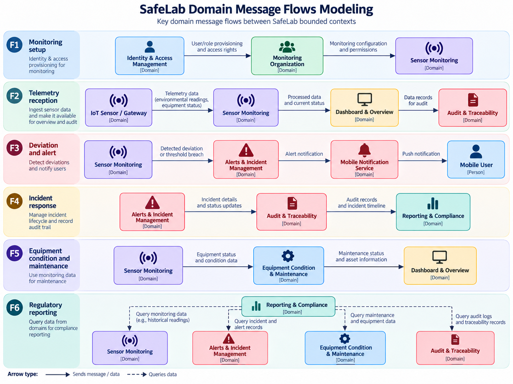

#### **2.5.1.3. Bounded Context Canvases**

Cada Candidate Bounded Context se documenta mediante un Bounded Context Canvas que reúne su Context Overview, Business Rules, Ubiquitous Language, Capabilities, Dependencies y Design Critique.

##### **Identity & Access Management - Canvas Base**

<table border="1" style="width:100%; border-collapse:collapse;">
<tr><th style="text-align:center;padding:6px;">Campo</th><th style="text-align:center;padding:6px;">Contenido propuesto</th></tr>
<tr><td style="text-align:center;padding:6px;">Purpose</td><td style="text-align:justify;padding:6px;">Garantizar que únicamente usuarios identificados y autorizados accedan a SafeLab y ejecuten operaciones compatibles con su rol.</td></tr>
<tr><td style="text-align:center;padding:6px;">Business Rules</td><td style="text-align:justify;padding:6px;">El correo debe identificar una cuenta válida; los roles determinan permisos; una sesión inválida o expirada no puede acceder a información protegida.</td></tr>
<tr><td style="text-align:center;padding:6px;">Capabilities</td><td style="text-align:justify;padding:6px;">Registro, login con correo, login con Google, recuperación de contraseña, logout y asignación de roles.</td></tr>
<tr><td style="text-align:center;padding:6px;">Key Terms</td><td style="text-align:justify;padding:6px;">User Account, Role, Authentication, Authorization, Session.</td></tr>
<tr><td style="text-align:center;padding:6px;">Dependencies</td><td style="text-align:justify;padding:6px;">Servicio externo de autenticación de Google; todos los demás contextos consumen la identidad y los permisos resueltos.</td></tr>
</table>

##### **Monitoring Organization - Canvas Base**

<table border="1" style="width:100%; border-collapse:collapse;">
<tr><th style="text-align:center;padding:6px;">Campo</th><th style="text-align:center;padding:6px;">Contenido propuesto</th></tr>
<tr><td style="text-align:center;padding:6px;">Purpose</td><td style="text-align:justify;padding:6px;">Representar la estructura física sobre la cual se realiza el monitoreo ambiental.</td></tr>
<tr><td style="text-align:center;padding:6px;">Business Rules</td><td style="text-align:justify;padding:6px;">Un Storage Area pertenece a un Monitoring Site; un Monitored Equipment debe estar asociado a un área antes de ser monitoreado.</td></tr>
<tr><td style="text-align:center;padding:6px;">Capabilities</td><td style="text-align:justify;padding:6px;">Registrar sitios, crear áreas, registrar equipos, asignar equipos y realizar búsquedas.</td></tr>
<tr><td style="text-align:center;padding:6px;">Key Terms</td><td style="text-align:justify;padding:6px;">Monitoring Site, Storage Area, Cold Storage Unit, Monitored Equipment.</td></tr>
<tr><td style="text-align:center;padding:6px;">Dependencies</td><td style="text-align:justify;padding:6px;">Proporciona identificadores y ubicación a Sensor Monitoring, Equipment Condition & Maintenance, Dashboard & Overview y Reporting & Compliance.</td></tr>
</table>

##### **Sensor Monitoring - Canvas Base**

<table border="1" style="width:100%; border-collapse:collapse;">
<tr><th style="text-align:center;padding:6px;">Campo</th><th style="text-align:center;padding:6px;">Contenido propuesto</th></tr>
<tr><td style="text-align:center;padding:6px;">Purpose</td><td style="text-align:justify;padding:6px;">Capturar y conservar lecturas ambientales confiables, actuales e históricas.</td></tr>
<tr><td style="text-align:center;padding:6px;">Business Rules</td><td style="text-align:justify;padding:6px;">Cada lectura debe incluir sensor, equipo, timestamp y valor; se debe identificar ausencia de lecturas recientes; la medición no debe perder trazabilidad con su origen.</td></tr>
<tr><td style="text-align:center;padding:6px;">Capabilities</td><td style="text-align:justify;padding:6px;">Recepción automática, consulta de temperatura/humedad, estado de equipos y detección de interrupciones.</td></tr>
<tr><td style="text-align:center;padding:6px;">Key Terms</td><td style="text-align:justify;padding:6px;">IoT Sensor, Temperature Reading, Humidity Reading, Cold Chain, Safe Temperature Threshold.</td></tr>
<tr><td style="text-align:center;padding:6px;">Dependencies</td><td style="text-align:justify;padding:6px;">Recibe datos de sensores/gateways y publica lecturas para Alerts & Incident Management, Dashboard & Overview y Reporting & Compliance.</td></tr>
</table>

##### **Alerts & Incident Management - Canvas Base**

<table border="1" style="width:100%; border-collapse:collapse;">
<tr><th style="text-align:center;padding:6px;">Campo</th><th style="text-align:center;padding:6px;">Contenido propuesto</th></tr>
<tr><td style="text-align:center;padding:6px;">Purpose</td><td style="text-align:justify;padding:6px;">Transformar desviaciones ambientales en alertas accionables y registrar su atención hasta el cierre del incidente.</td></tr>
<tr><td style="text-align:center;padding:6px;">Business Rules</td><td style="text-align:justify;padding:6px;">Una alerta se genera cuando se cumple una regla; una alerta reconocida conserva responsable y hora; un incidente crítico debe mantener acciones correctivas asociadas.</td></tr>
<tr><td style="text-align:center;padding:6px;">Capabilities</td><td style="text-align:justify;padding:6px;">Configurar límites, generar alertas, priorizar por severidad, notificar dispositivos móviles, reconocer alertas y registrar incidentes.</td></tr>
<tr><td style="text-align:center;padding:6px;">Key Terms</td><td style="text-align:justify;padding:6px;">Thermal Excursion, Preventive Alert, Severity, Incident, Corrective Action.</td></tr>
<tr><td style="text-align:center;padding:6px;">Dependencies</td><td style="text-align:justify;padding:6px;">Consume lecturas de Sensor Monitoring; publica eventos hacia Audit & Traceability, Dashboard & Overview y Reporting & Compliance.</td></tr>
</table>

##### **Equipment Condition & Maintenance - Canvas Base**

<table border="1" style="width:100%; border-collapse:collapse;">
<tr><th style="text-align:center;padding:6px;">Campo</th><th style="text-align:center;padding:6px;">Contenido propuesto</th></tr>
<tr><td style="text-align:center;padding:6px;">Purpose</td><td style="text-align:justify;padding:6px;">Mantener evidencia sobre la condición, confiabilidad y mantenimiento de los equipos de cadena de frío.</td></tr>
<tr><td style="text-align:center;padding:6px;">Business Rules</td><td style="text-align:justify;padding:6px;">Todo mantenimiento se asocia a un equipo; la condición puede derivarse de lecturas y fallas registradas; el historial no debe eliminarse al cambiar el estado actual.</td></tr>
<tr><td style="text-align:center;padding:6px;">Capabilities</td><td style="text-align:justify;padding:6px;">Consultar condición, identificar valores anómalos, registrar mantenimiento, consultar historial y evaluar confiabilidad.</td></tr>
<tr><td style="text-align:center;padding:6px;">Key Terms</td><td style="text-align:justify;padding:6px;">Equipment Condition, Maintenance Record, Reliability, Failure Indicator.</td></tr>
<tr><td style="text-align:center;padding:6px;">Dependencies</td><td style="text-align:justify;padding:6px;">Consume identificación del equipo y datos históricos; aporta estado y mantenimiento a Dashboard & Overview y Reporting & Compliance.</td></tr>
</table>

##### **Reporting & Compliance - Canvas Base**

<table border="1" style="width:100%; border-collapse:collapse;">
<tr><th style="text-align:center;padding:6px;">Campo</th><th style="text-align:center;padding:6px;">Contenido propuesto</th></tr>
<tr><td style="text-align:center;padding:6px;">Purpose</td><td style="text-align:justify;padding:6px;">Convertir el historial operacional de SafeLab en información útil para análisis y auditorías.</td></tr>
<tr><td style="text-align:center;padding:6px;">Business Rules</td><td style="text-align:justify;padding:6px;">Los reportes deben conservar el periodo, equipo y criterios utilizados; la información exportada debe corresponder a registros trazables; las comparaciones utilizan periodos válidos.</td></tr>
<tr><td style="text-align:center;padding:6px;">Capabilities</td><td style="text-align:justify;padding:6px;">Consultar históricos, seleccionar rangos, comparar periodos, generar reportes, descargar/exportar archivos y consultar historial de incidentes.</td></tr>
<tr><td style="text-align:center;padding:6px;">Key Terms</td><td style="text-align:justify;padding:6px;">Compliance Report, Historical Data, Reporting Period, Export, Regulatory Evidence.</td></tr>
<tr><td style="text-align:center;padding:6px;">Dependencies</td><td style="text-align:justify;padding:6px;">Consulta datos de Sensor Monitoring, Alerts & Incident Management, Equipment Condition & Maintenance y Audit & Traceability.</td></tr>
</table>

##### **Dashboard & Overview - Canvas Base**

<table border="1" style="width:100%; border-collapse:collapse;">
<tr><th style="text-align:center;padding:6px;">Campo</th><th style="text-align:center;padding:6px;">Contenido propuesto</th></tr>
<tr><td style="text-align:center;padding:6px;">Purpose</td><td style="text-align:justify;padding:6px;">Ofrecer una vista resumida del estado operacional para facilitar decisiones rápidas desde el dispositivo móvil.</td></tr>
<tr><td style="text-align:center;padding:6px;">Business Rules</td><td style="text-align:justify;padding:6px;">Los indicadores deben derivarse de datos vigentes; las tendencias no modifican los registros fuente; la ausencia de datos debe mostrarse como un estado conocido.</td></tr>
<tr><td style="text-align:center;padding:6px;">Capabilities</td><td style="text-align:justify;padding:6px;">Dashboard, totales, alertas críticas, equipos con alertas y tendencias de temperatura, humedad y alertas.</td></tr>
<tr><td style="text-align:center;padding:6px;">Key Terms</td><td style="text-align:justify;padding:6px;">Dashboard, Monitoring Summary, Trend, Critical Alert, Current Status.</td></tr>
<tr><td style="text-align:center;padding:6px;">Dependencies</td><td style="text-align:justify;padding:6px;">Consume información de los contextos operacionales mediante consultas o proyecciones de lectura.</td></tr>
</table>

##### **Audit & Traceability - Canvas Base**

<table border="1" style="width:100%; border-collapse:collapse;">
<tr><th style="text-align:center;padding:6px;">Campo</th><th style="text-align:center;padding:6px;">Contenido propuesto</th></tr>
<tr><td style="text-align:center;padding:6px;">Purpose</td><td style="text-align:justify;padding:6px;">Mantener evidencia inmutable de eventos relevantes, responsables, cambios y relaciones entre mediciones, alertas e incidentes.</td></tr>
<tr><td style="text-align:center;padding:6px;">Business Rules</td><td style="text-align:justify;padding:6px;">Una entrada de auditoría no se edita ni elimina; toda entrada identifica actor, acción, fecha/hora y objeto afectado; los eventos relacionados utilizan un Correlation ID.</td></tr>
<tr><td style="text-align:center;padding:6px;">Capabilities</td><td style="text-align:justify;padding:6px;">Registrar eventos de auditoría, consultar historial, reconstruir secuencias y exportar evidencia de trazabilidad.</td></tr>
<tr><td style="text-align:center;padding:6px;">Key Terms</td><td style="text-align:justify;padding:6px;">Incident Log, Audit Entry, Traceability Record, Actor, Correlation ID.</td></tr>
<tr><td style="text-align:center;padding:6px;">Dependencies</td><td style="text-align:justify;padding:6px;">Consume eventos publicados por todos los contextos que realicen operaciones auditables.</td></tr>
</table>

### **2.5.2. Context Mapping**

El Context Map organiza las dependencias de forma que los contextos core mantengan bajo acoplamiento. Las relaciones internas se modelan principalmente como <b>Customer/Supplier</b>, donde un upstream publica información que un downstream necesita para cumplir una capacidad. Las integraciones con sistemas externos se aíslan mediante <b>Anti-Corruption Layer</b>, evitando que los modelos externos condicionen el modelo interno de SafeLab. Los contextos core evolucionan de forma independiente y no comparten un Shared Kernel.

<table border="1" style="width:100%; border-collapse:collapse;">
<thead><tr><th style="text-align:center;padding:6px;">Upstream</th><th style="text-align:center;padding:6px;">Downstream</th><th style="text-align:center;padding:6px;">Patrón</th><th style="text-align:center;padding:6px;">Relación</th></tr></thead>
<tbody>
<tr><td style="text-align:center;padding:6px;">Google Authentication</td><td style="text-align:center;padding:6px;">Identity & Access Management</td><td style="text-align:center;padding:6px;">Anti-Corruption Layer</td><td style="text-align:justify;padding:6px;">El adaptador traduce identidad externa a User Account y permisos internos.</td></tr>
<tr><td style="text-align:center;padding:6px;">IoT Sensor / Gateway</td><td style="text-align:center;padding:6px;">Sensor Monitoring</td><td style="text-align:center;padding:6px;">Anti-Corruption Layer</td><td style="text-align:justify;padding:6px;">Se normalizan formatos, unidades y estados antes de crear lecturas del dominio.</td></tr>
<tr><td style="text-align:center;padding:6px;">Monitoring Organization</td><td style="text-align:center;padding:6px;">Sensor Monitoring</td><td style="text-align:center;padding:6px;">Customer/Supplier</td><td style="text-align:justify;padding:6px;">Sensor Monitoring necesita equipo, área y sitio válidos para asociar telemetría.</td></tr>
<tr><td style="text-align:center;padding:6px;">Sensor Monitoring</td><td style="text-align:center;padding:6px;">Alerts & Incident Management</td><td style="text-align:center;padding:6px;">Customer/Supplier</td><td style="text-align:justify;padding:6px;">Publica lecturas y estados utilizados para evaluar reglas de alerta.</td></tr>
<tr><td style="text-align:center;padding:6px;">Sensor Monitoring</td><td style="text-align:center;padding:6px;">Equipment Condition & Maintenance</td><td style="text-align:center;padding:6px;">Customer/Supplier</td><td style="text-align:justify;padding:6px;">Aporta señales e históricos utilizados para analizar condición y confiabilidad.</td></tr>
<tr><td style="text-align:center;padding:6px;">Alerts & Incident Management</td><td style="text-align:center;padding:6px;">Reporting & Compliance</td><td style="text-align:center;padding:6px;">Customer/Supplier</td><td style="text-align:justify;padding:6px;">Aporta alertas, incidentes, severidad, atención y acciones correctivas.</td></tr>
<tr><td style="text-align:center;padding:6px;">Sensor Monitoring</td><td style="text-align:center;padding:6px;">Reporting & Compliance</td><td style="text-align:center;padding:6px;">Customer/Supplier</td><td style="text-align:justify;padding:6px;">Aporta series históricas de temperatura y humedad.</td></tr>
<tr><td style="text-align:center;padding:6px;">Contextos operacionales</td><td style="text-align:center;padding:6px;">Dashboard & Overview</td><td style="text-align:center;padding:6px;">Conformist / Read Model</td><td style="text-align:justify;padding:6px;">El Dashboard consume representaciones publicadas sin redefinir las reglas transaccionales de los contextos fuente.</td></tr>
<tr><td style="text-align:center;padding:6px;">Todos los contextos auditables</td><td style="text-align:center;padding:6px;">Audit & Traceability</td><td style="text-align:center;padding:6px;">Customer/Supplier mediante eventos</td><td style="text-align:justify;padding:6px;">Los contextos publican eventos de negocio y auditoría para mantener un historial append-only.</td></tr>
</tbody>
</table>

  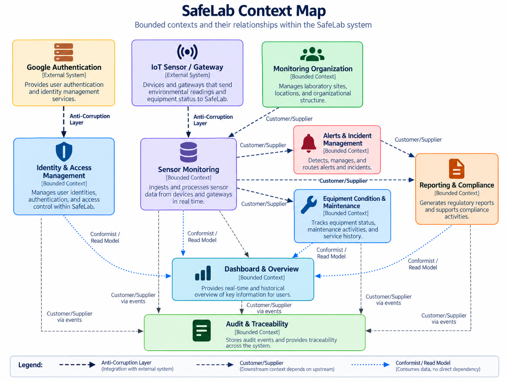

### **2.5.3. Software Architecture**

La arquitectura de SafeLab incluye una <b>Native Mobile Application</b>, una <b>Cross-Platform Mobile Application</b>, servicios <b>RESTful</b> de desarrollo interno, almacenamiento local en el dispositivo y un <b>Landing Page</b> estático. También incorpora los sensores o gateways que proporcionan lecturas ambientales y los servicios externos utilizados para autenticación y notificaciones.

#### **2.5.3.1. Software Architecture Context Level Diagrams**

El Context Diagram presenta a <b>SafeLab</b> como sistema central y muestra a las personas y sistemas externos con los que interactúa. Los usuarios principales son el personal de laboratorios hospitalarios y el personal de empresas farmacéuticas. Ambos consultan información ambiental, reciben alertas y revisan históricos y reportes; los perfiles con permisos de supervisión administran sitios, equipos, límites, mantenimiento y roles.

<table border="1" style="width:100%; border-collapse:collapse;">
<thead><tr><th style="text-align:center;padding:6px;">Elemento externo</th><th style="text-align:center;padding:6px;">Relación con SafeLab</th></tr></thead>
<tbody>
<tr><td style="text-align:center;padding:6px;">Hospital Laboratory Staff</td><td style="text-align:justify;padding:6px;">Consulta monitoreo, alertas, estado de equipos, históricos y reportes desde la aplicación móvil.</td></tr>
<tr><td style="text-align:center;padding:6px;">Pharmaceutical Company Staff</td><td style="text-align:justify;padding:6px;">Gestiona trazabilidad, monitoreo, alertas, mantenimiento y evidencia de cumplimiento.</td></tr>
<tr><td style="text-align:center;padding:6px;">IoT Sensors / Gateway</td><td style="text-align:justify;padding:6px;">Envía lecturas ambientales y estado de equipos hacia los servicios internos.</td></tr>
<tr><td style="text-align:center;padding:6px;">Google Authentication Service</td><td style="text-align:justify;padding:6px;">Proveedor externo utilizado para el flujo de autenticación con cuenta Google.</td></tr>
<tr><td style="text-align:center;padding:6px;">Mobile Notification Service</td><td style="text-align:justify;padding:6px;">Entrega notificaciones al dispositivo cuando SafeLab genera una alerta.</td></tr>
</tbody>
</table>

  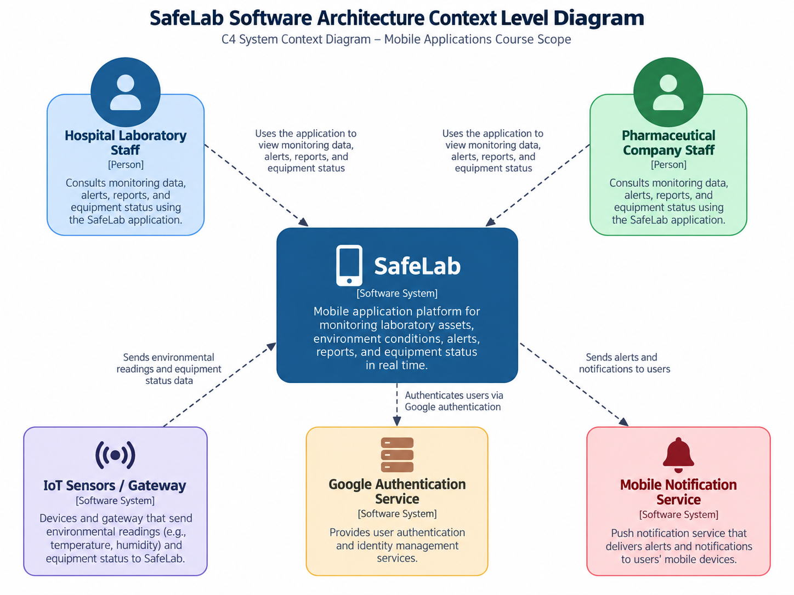

#### **2.5.3.2. Software Architecture Container Level Diagrams**

El Container Diagram muestra cómo se distribuyen las responsabilidades entre los productos digitales, los servicios internos y los almacenes de datos que conforman SafeLab.

<table border="1" style="width:100%; border-collapse:collapse;">
<thead><tr><th style="text-align:center;padding:6px;">Container</th><th style="text-align:center;padding:6px;">Responsabilidad</th><th style="text-align:center;padding:6px;">Tecnología</th></tr></thead>
<tbody>
<tr><td style="text-align:center;padding:6px;">Static Landing Page</td><td style="text-align:justify;padding:6px;">Presenta SafeLab, propuesta de valor, información del producto, términos y acceso al ecosistema.</td><td style="text-align:center;padding:6px;">Tecnologías web estáticas para publicación del Landing Page.</td></tr>
<tr><td style="text-align:center;padding:6px;">Native Mobile Application</td><td style="text-align:justify;padding:6px;">Experiencia móvil nativa para autenticación, monitoreo, alertas, dashboard, históricos y capacidades que requieran integración con el dispositivo.</td><td style="text-align:center;padding:6px;">SDK y componentes nativos de la plataforma móvil</td></tr>
<tr><td style="text-align:center;padding:6px;">Cross-Platform Mobile Application</td><td style="text-align:justify;padding:6px;">Experiencia multiplataforma equivalente alineada a los principales User Goals del producto.</td><td style="text-align:center;padding:6px;">Framework multiplataforma para dispositivos móviles</td></tr>
<tr><td style="text-align:center;padding:6px;">Local Mobile Storage</td><td style="text-align:justify;padding:6px;">Persistencia local de información seleccionada para mejorar continuidad y experiencia del usuario móvil.</td><td style="text-align:center;padding:6px;">Almacenamiento local seguro en el dispositivo</td></tr>
<tr><td style="text-align:center;padding:6px;">SafeLab RESTful API</td><td style="text-align:justify;padding:6px;">Expone casos de uso, coordina Bounded Contexts, valida reglas y proporciona información a las aplicaciones.</td><td style="text-align:center;padding:6px;">Servicios RESTful del backend de SafeLab</td></tr>
<tr><td style="text-align:center;padding:6px;">Operational Database</td><td style="text-align:justify;padding:6px;">Persistencia de usuarios, organización, equipos, lecturas, alertas, incidentes, mantenimientos, reportes y auditoría.</td><td style="text-align:center;padding:6px;">Base de datos operacional</td></tr>
</tbody>
</table>

Los sensores, Google Authentication y el proveedor de notificaciones móviles se representan como sistemas externos, no como containers internos de SafeLab. Las aplicaciones móviles consumen el RESTful API y mantienen únicamente la información local estrictamente necesaria según las User Stories y el alcance definido.

  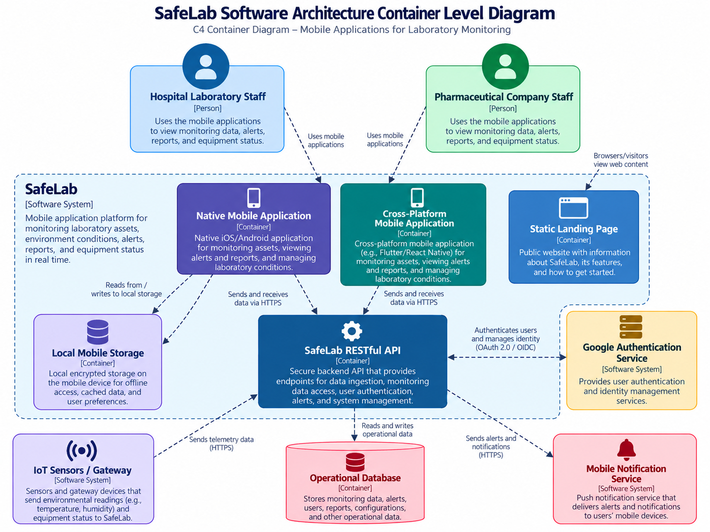

#### **2.5.3.3. Software Architecture Deployment Diagrams**

El Deployment Diagram representa la distribución física de SafeLab y las conexiones entre dispositivos y servicios. La arquitectura contempla <b>Mobile Device</b> para las aplicaciones móviles y el almacenamiento local, <b>IoT Sensor/Gateway</b> para la captura de datos ambientales, <b>Static Web Hosting</b> para el Landing Page, <b>Cloud Application Runtime</b> para el RESTful API, <b>Database Service</b> para la información operacional y <b>Third-Party Services</b> para autenticación y notificaciones.

<table border="1" style="width:100%; border-collapse:collapse;">
<thead><tr><th style="text-align:center;padding:6px;">Deployment Node</th><th style="text-align:center;padding:6px;">Artefactos desplegados</th><th style="text-align:center;padding:6px;">Comunicación principal</th></tr></thead>
<tbody>
<tr><td style="text-align:center;padding:6px;">User Mobile Device</td><td style="text-align:justify;padding:6px;">Native Mobile App / Cross-Platform Mobile App / Local Storage.</td><td style="text-align:justify;padding:6px;">HTTPS con RESTful API y comunicación con servicios del dispositivo.</td></tr>
<tr><td style="text-align:center;padding:6px;">IoT Sensor or Gateway</td><td style="text-align:justify;padding:6px;">Firmware o servicio de adquisición de telemetría.</td><td style="text-align:justify;padding:6px;">Canal seguro hacia el backend o adaptador de ingestión.</td></tr>
<tr><td style="text-align:center;padding:6px;">Static Web Hosting</td><td style="text-align:justify;padding:6px;">Landing Page.</td><td style="text-align:justify;padding:6px;">HTTPS desde navegador.</td></tr>
<tr><td style="text-align:center;padding:6px;">Cloud Application Runtime</td><td style="text-align:justify;padding:6px;">RESTful API y componentes de aplicación.</td><td style="text-align:justify;padding:6px;">HTTPS con móviles y conexiones privadas/seguras con base de datos y servicios externos.</td></tr>
<tr><td style="text-align:center;padding:6px;">Database Service</td><td style="text-align:justify;padding:6px;">Esquema operacional y registros de auditoría.</td><td style="text-align:justify;padding:6px;">Acceso restringido desde el backend.</td></tr>
<tr><td style="text-align:center;padding:6px;">Third-Party Services</td><td style="text-align:justify;padding:6px;">Autenticación Google y servicio de notificaciones móviles.</td><td style="text-align:justify;padding:6px;">APIs/SDKs seguros desde backend o aplicación según la integración elegida.</td></tr>
</tbody>
</table>

  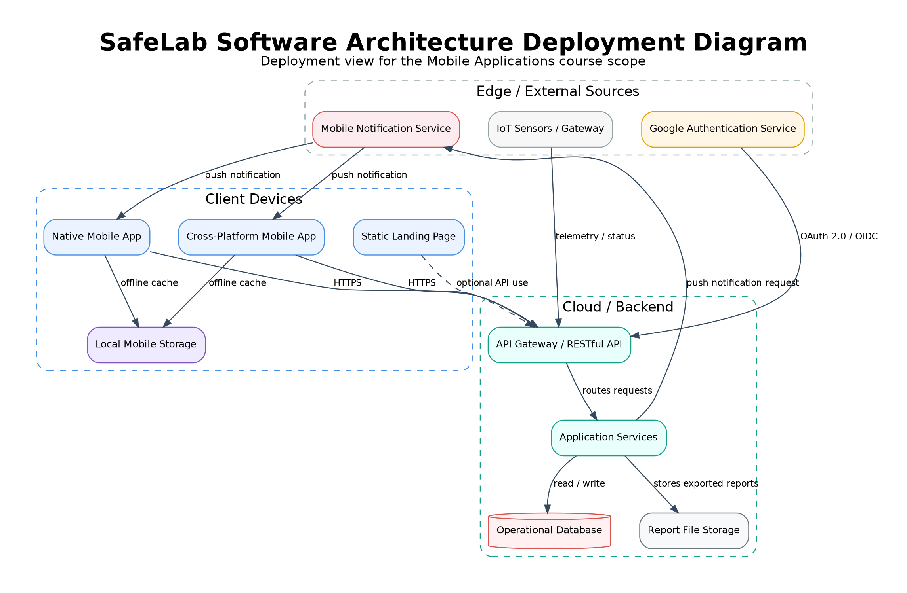

## **2.6. Tactical-Level Domain-Driven Design**

La perspectiva táctica define el modelo interno de cada Bounded Context a partir de las User Stories, las reglas de negocio y el Ubiquitous Language de SafeLab. La organización por Domain, Application, Interface e Infrastructure Layer mantiene separadas las reglas del dominio de los mecanismos de entrega, integración y persistencia.

### **2.6.1. Bounded Context: Identity & Access Management**

Este contexto controla el ciclo de vida de las cuentas, autenticación y autorización. Reúne las capacidades que en el Product Backlog corresponden al registro, login con correo y Google, recuperación de contraseña, cierre de sesión y asignación de roles.

#### **2.6.1.1. Domain Layer**

<table border="1" style="width:100%; border-collapse:collapse;">
<thead><tr><th style="text-align:center;padding:6px;">Elemento</th><th style="text-align:center;padding:6px;">Tipo</th><th style="text-align:center;padding:6px;">Atributos principales</th><th style="text-align:center;padding:6px;">Operaciones principales</th></tr></thead>
<tbody>
<tr><td style="text-align:center;padding:6px;">UserAccount</td><td style="text-align:center;padding:6px;">Aggregate Root / Entity</td><td style="text-align:justify;padding:6px;">userId, email, status, roles, createdAt.</td><td style="text-align:justify;padding:6px;">activate(), deactivate(), assignRole(), removeRole().</td></tr>
<tr><td style="text-align:center;padding:6px;">Role</td><td style="text-align:center;padding:6px;">Entity</td><td style="text-align:justify;padding:6px;">roleId, name, permissions.</td><td style="text-align:justify;padding:6px;">grants(permission).</td></tr>
<tr><td style="text-align:center;padding:6px;">EmailAddress</td><td style="text-align:center;padding:6px;">Value Object</td><td style="text-align:justify;padding:6px;">value.</td><td style="text-align:justify;padding:6px;">validate(), normalize().</td></tr>
<tr><td style="text-align:center;padding:6px;">UserRepository</td><td style="text-align:center;padding:6px;">Repository Interface</td><td style="text-align:justify;padding:6px;">-</td><td style="text-align:justify;padding:6px;">save(), findById(), findByEmail().</td></tr>
</tbody>
</table>

#### **2.6.1.2. Interface Layer**

La Interface Layer incluye <b>AuthController</b> para registro, autenticación, recuperación y logout, <b>UserAccessController</b> para consulta y asignación de roles, y <b>GoogleAuthenticationConsumer</b> para la integración con autenticación externa. Esta capa traduce las solicitudes hacia comandos y consultas de Application Layer.

#### **2.6.1.3. Application Layer**

La Application Layer utiliza <b>RegisterUserCommandHandler</b>, <b>AuthenticateUserCommandHandler</b>, <b>AuthenticateWithGoogleCommandHandler</b>, <b>RecoverPasswordCommandHandler</b>, <b>LogoutUserCommandHandler</b> y <b>AssignUserRoleCommandHandler</b>. Estas clases coordinan el agregado UserAccount y los puertos de seguridad sin contener detalles de persistencia.

#### **2.6.1.4 Infrastructure Layer**

La Infrastructure Layer incluye <b>UserRepositoryImpl</b>, <b>GoogleAuthenticationAdapter</b>, <b>PasswordHasher</b>, <b>TokenService</b> y el acceso al servicio de correo. La integración con Google se mantiene detrás de un Anti-Corruption Layer para que el modelo externo no determine la estructura de UserAccount.

#### **2.6.1.5. Bounded Context Software Architecture Component Level Diagrams**

El Component Diagram muestra Auth Controller, User Access Controller, Application Services/Handlers, Domain Model, Repository Port, Repository Adapter y External Authentication Adapter, evidenciando las dependencias entre las capas del contexto.

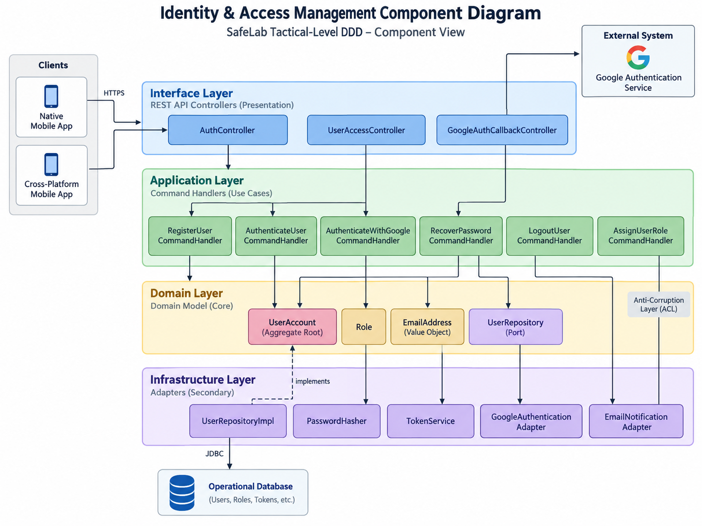

#### **2.6.1.6. Bounded Context Software Architecture Code Level Diagrams**

El nivel de código muestra cómo los componentes se materializan en clases e interfaces, manteniendo la dirección de dependencias desde Interface e Infrastructure hacia Application y Domain mediante puertos.

##### **2.6.1.6.1. Bounded Context Domain Layer Class Diagrams**

El Class Diagram integra UserAccount, Role, EmailAddress, identificadores, enumeraciones de estado, UserRepository y sus relaciones dentro del modelo de identidad y acceso.

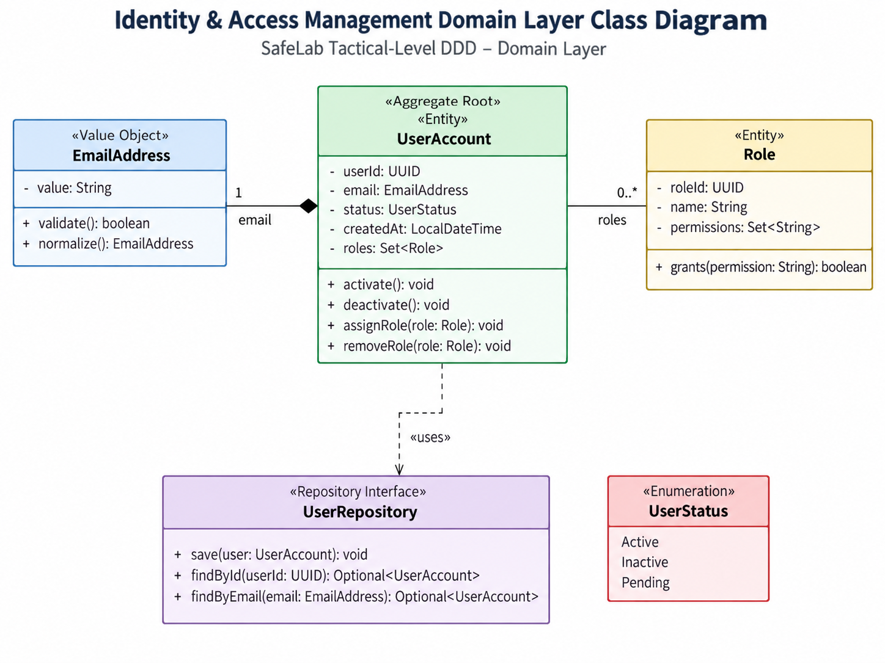

##### **2.6.1.6.2. Bounded Context Database Design Diagram**

El modelo relacional incluye <b>user_accounts</b>, <b>roles</b>, <b>user_roles</b>, <b>external_identities</b> y <b>password_recovery_requests</b>. Las relaciones representan las primary keys, foreign keys, la unicidad del correo y la asociación N:M entre usuarios y roles.

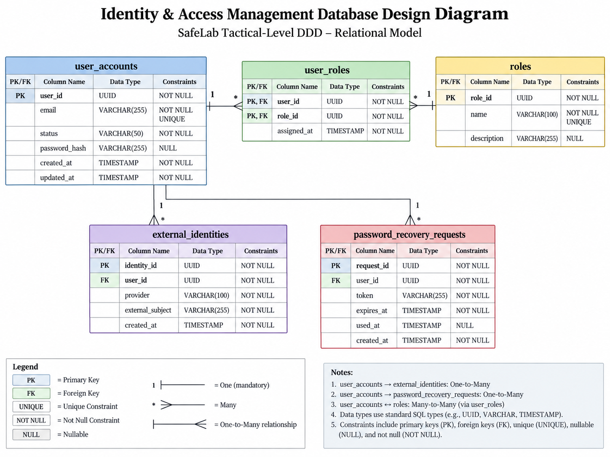

### **2.6.2. Bounded Context: Monitoring Organization**

Este contexto representa la estructura física y organizacional del monitoreo de SafeLab mediante sitios, áreas de almacenamiento y equipos asociados a cada ubicación.

#### **2.6.2.1. Domain Layer**

<table border="1" style="width:100%; border-collapse:collapse;">
<thead><tr><th style="text-align:center;padding:6px;">Elemento</th><th style="text-align:center;padding:6px;">Tipo</th><th style="text-align:center;padding:6px;">Atributos principales</th><th style="text-align:center;padding:6px;">Operaciones principales</th></tr></thead>
<tbody>
<tr><td style="text-align:center;padding:6px;">MonitoringSite</td><td style="text-align:center;padding:6px;">Aggregate Root</td><td style="text-align:justify;padding:6px;">siteId, name, location, status.</td><td style="text-align:justify;padding:6px;">rename(), relocate(), activate().</td></tr>
<tr><td style="text-align:center;padding:6px;">StorageArea</td><td style="text-align:center;padding:6px;">Entity</td><td style="text-align:justify;padding:6px;">areaId, siteId, name, type.</td><td style="text-align:justify;padding:6px;">changeType(), rename().</td></tr>
<tr><td style="text-align:center;padding:6px;">MonitoredEquipment</td><td style="text-align:center;padding:6px;">Aggregate Root</td><td style="text-align:justify;padding:6px;">equipmentId, name, type, identifier, areaId.</td><td style="text-align:justify;padding:6px;">assignToArea(), changeIdentifier().</td></tr>
<tr><td style="text-align:center;padding:6px;">EquipmentIdentifier</td><td style="text-align:center;padding:6px;">Value Object</td><td style="text-align:justify;padding:6px;">value.</td><td style="text-align:justify;padding:6px;">validate().</td></tr>
</tbody>
</table>

#### **2.6.2.2. Interface Layer**

La Interface Layer incluye <b>MonitoringSiteController</b>, <b>StorageAreaController</b> y <b>EquipmentController</b>, responsables de exponer operaciones para registrar, listar, buscar y asociar los elementos de la organización de monitoreo.

#### **2.6.2.3. Application Layer**

La Application Layer utiliza <b>RegisterMonitoringSiteHandler</b>, <b>CreateStorageAreaHandler</b>, <b>RegisterEquipmentHandler</b>, <b>AssignEquipmentToAreaHandler</b>, <b>SearchEquipmentHandler</b> y consultas para recuperar sitios, áreas y equipos.

#### **2.6.2.4 Infrastructure Layer**

La Infrastructure Layer implementa los repositorios de sitios, áreas y equipos, además de los mappers entre modelos de persistencia y objetos de dominio. La integración con identificadores externos de equipos se encapsula mediante un adapter.

#### **2.6.2.5. Bounded Context Software Architecture Component Level Diagrams**

El Component Diagram representa la separación entre controllers, application handlers, modelo de dominio, repositorios e integración de ubicación, manteniendo como responsabilidad central la organización del entorno monitoreado.

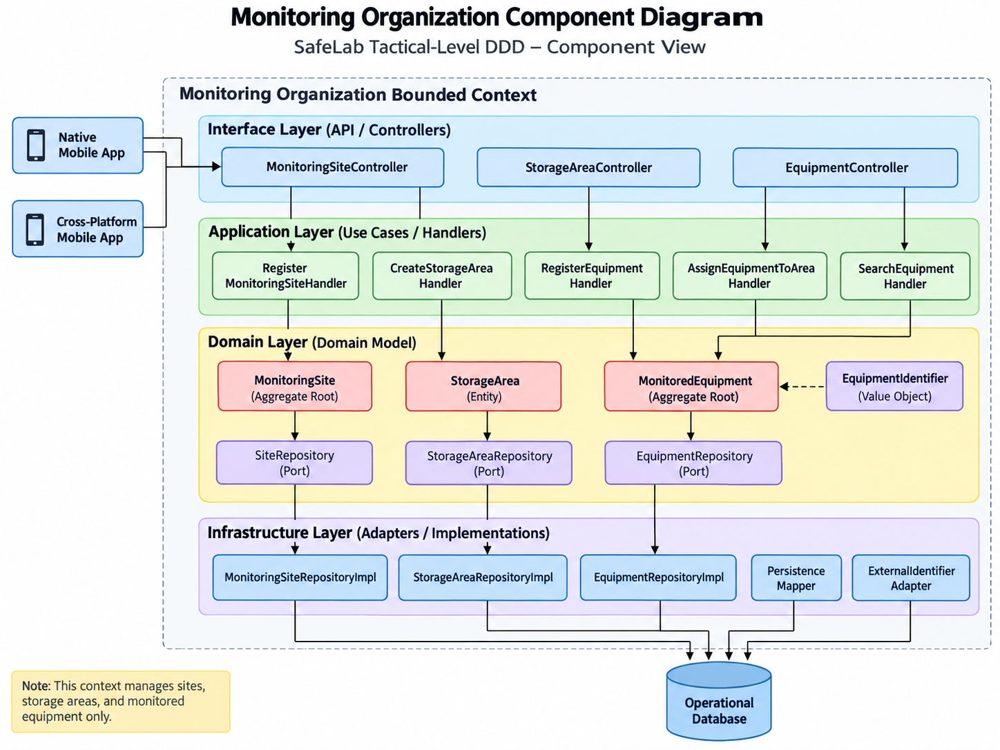

#### **2.6.2.6. Bounded Context Software Architecture Code Level Diagrams**

##### **2.6.2.6.1. Bounded Context Domain Layer Class Diagrams**

El Class Diagram muestra <b>MonitoringSite</b>, <b>StorageArea</b> y <b>MonitoredEquipment</b> con las relaciones Site 1..* Area y Area 1..* Equipment, además de sus identificadores e interfaces de repositorio.

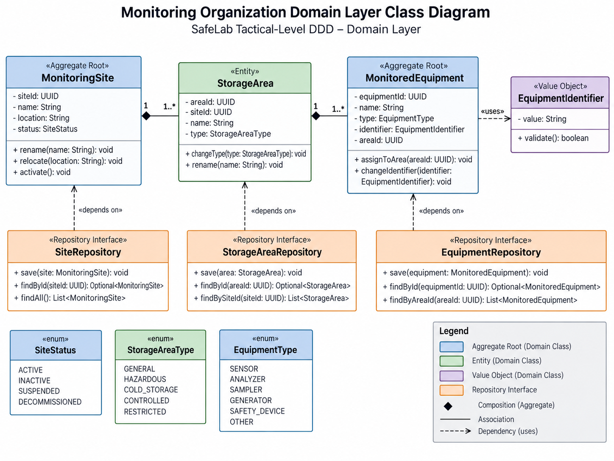

##### **2.6.2.6.2. Bounded Context Database Design Diagram**

El modelo de persistencia incluye las tablas <b>monitoring_sites</b>, <b>storage_areas</b> y <b>monitored_equipment</b>. <b>storage_areas</b> referencia a <b>monitoring_sites</b> y <b>monitored_equipment</b> referencia a <b>storage_areas</b>.

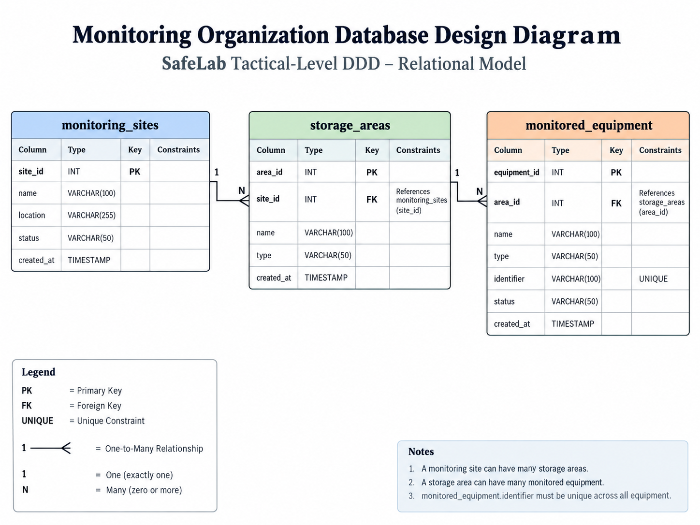

### **2.6.3. Bounded Context: Sensor Monitoring**

Este contexto contiene el núcleo de adquisición y consulta de telemetría. Su responsabilidad es mantener lecturas confiables y detectar la ausencia de datos recientes sin asumir la responsabilidad de decidir la respuesta operacional a una desviación.

#### **2.6.3.1. Domain Layer**

<table border="1" style="width:100%; border-collapse:collapse;">
<thead><tr><th style="text-align:center;padding:6px;">Elemento</th><th style="text-align:center;padding:6px;">Tipo</th><th style="text-align:center;padding:6px;">Atributos principales</th><th style="text-align:center;padding:6px;">Operaciones principales</th></tr></thead>
<tbody>
<tr><td style="text-align:center;padding:6px;">Sensor</td><td style="text-align:center;padding:6px;">Aggregate Root</td><td style="text-align:justify;padding:6px;">sensorId, equipmentId, type, status, lastSeenAt.</td><td style="text-align:justify;padding:6px;">markOnline(), markOffline(), updateLastSeen().</td></tr>
<tr><td style="text-align:center;padding:6px;">MonitoringReading</td><td style="text-align:center;padding:6px;">Entity</td><td style="text-align:justify;padding:6px;">readingId, sensorId, timestamp, temperature, humidity.</td><td style="text-align:justify;padding:6px;">isRecent(referenceTime).</td></tr>
<tr><td style="text-align:center;padding:6px;">Temperature</td><td style="text-align:center;padding:6px;">Value Object</td><td style="text-align:justify;padding:6px;">value, unit.</td><td style="text-align:justify;padding:6px;">convertTo(unit).</td></tr>
<tr><td style="text-align:center;padding:6px;">Humidity</td><td style="text-align:center;padding:6px;">Value Object</td><td style="text-align:justify;padding:6px;">percentage.</td><td style="text-align:justify;padding:6px;">validateRange().</td></tr>
</tbody>
</table>

#### **2.6.3.2. Interface Layer**

La Interface Layer incluye <b>MonitoringController</b> para las consultas de datos actuales e históricos y <b>SensorDataConsumer</b> para recibir lecturas desde sensores o gateways.

#### **2.6.3.3. Application Layer**

La Application Layer utiliza <b>RecordMonitoringReadingHandler</b>, <b>GetCurrentMonitoringHandler</b>, <b>GetEquipmentMonitoringDetailsHandler</b>, <b>IdentifyEquipmentWithoutRecentDataHandler</b> y <b>GetHistoricalReadingsHandler</b>. La recolección automática se coordina en esta capa sin acoplarla al protocolo físico del sensor.

#### **2.6.3.4 Infrastructure Layer**

Incluye <b>SensorRepositoryImpl</b>, <b>MonitoringReadingRepositoryImpl</b>, <b>IoTTelemetryAdapter</b> y, en las aplicaciones móviles, un <b>MonitoringLocalCache</b> para la información seleccionada que deba persistir localmente. El adapter de telemetría normaliza unidades y formatos externos.

#### **2.6.3.5. Bounded Context Software Architecture Component Level Diagrams**

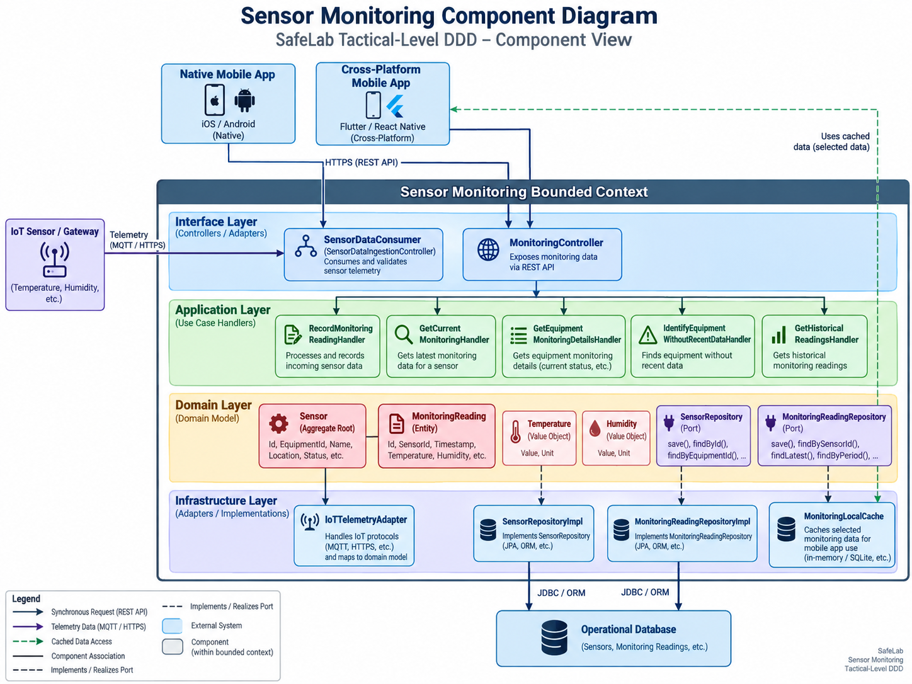

#### **2.6.3.6. Bounded Context Software Architecture Code Level Diagrams**

##### **2.6.3.6.1. Bounded Context Domain Layer Class Diagrams**

El Class Diagram integra <b>Sensor</b>, <b>MonitoringReading</b>, <b>Temperature</b>, <b>Humidity</b>, estados, enumeraciones, interfaces de repositorio y su relación con <b>EquipmentId</b>.

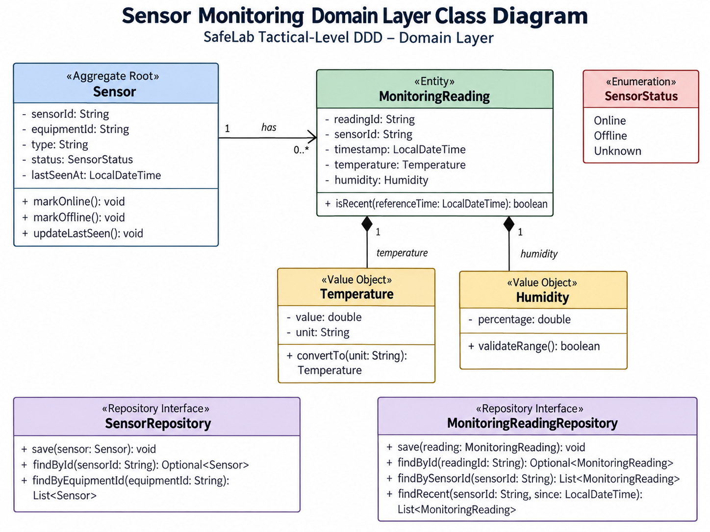

##### **2.6.3.6.2. Bounded Context Database Design Diagram**

El modelo de persistencia incluye <b>sensors</b>, <b>monitoring_readings</b> y <b>sensor_status_history</b>. Las lecturas se indexan por sensor, equipo y timestamp para soportar consultas históricas y generación de reportes.

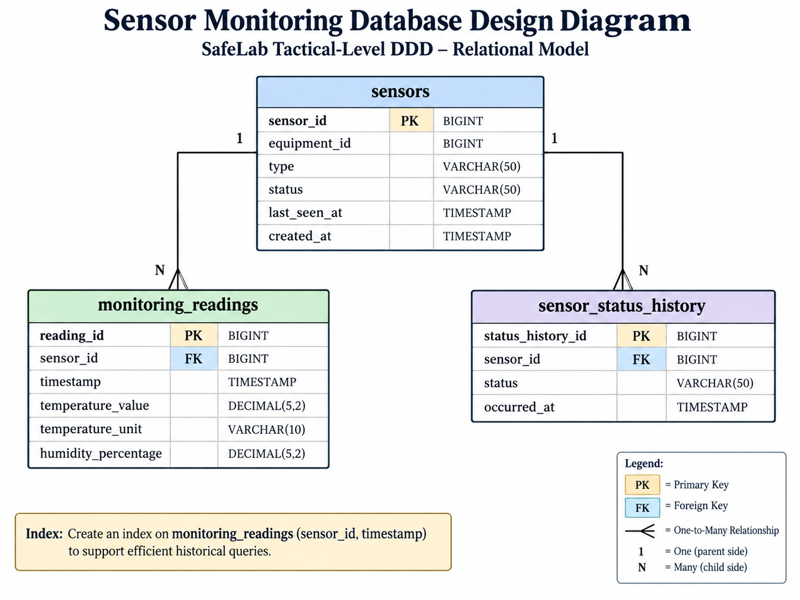

### **2.6.4. Bounded Context: Alerts & Incident Management**

Este contexto fusiona los antiguos Alerts & Notifications e Incident Management porque el Product Backlog móvil actual presenta un flujo continuo desde la detección de una desviación hasta su reconocimiento y revisión histórica. Mantener ambos modelos dentro de un mismo límite reduce coordinación innecesaria para un alcance académico de esta dimensión.

#### **2.6.4.1. Domain Layer**

<table border="1" style="width:100%; border-collapse:collapse;">
<thead><tr><th style="text-align:center;padding:6px;">Elemento</th><th style="text-align:center;padding:6px;">Tipo</th><th style="text-align:center;padding:6px;">Atributos principales</th><th style="text-align:center;padding:6px;">Operaciones principales</th></tr></thead>
<tbody>
<tr><td style="text-align:center;padding:6px;">AlertRule</td><td style="text-align:center;padding:6px;">Aggregate Root</td><td style="text-align:justify;padding:6px;">ruleId, equipmentId, variable, min, max, severity.</td><td style="text-align:justify;padding:6px;">evaluate(reading), changeThresholds().</td></tr>
<tr><td style="text-align:center;padding:6px;">Alert</td><td style="text-align:center;padding:6px;">Entity</td><td style="text-align:justify;padding:6px;">alertId, equipmentId, value, severity, status, createdAt, acknowledgedAt.</td><td style="text-align:justify;padding:6px;">acknowledge(userId), isActive().</td></tr>
<tr><td style="text-align:center;padding:6px;">Incident</td><td style="text-align:center;padding:6px;">Aggregate Root</td><td style="text-align:justify;padding:6px;">incidentId, alertId, status, openedAt, closedAt, correctiveActions.</td><td style="text-align:justify;padding:6px;">addCorrectiveAction(), close().</td></tr>
<tr><td style="text-align:center;padding:6px;">CorrectiveAction</td><td style="text-align:center;padding:6px;">Entity</td><td style="text-align:justify;padding:6px;">actionId, description, performedBy, performedAt.</td><td style="text-align:justify;padding:6px;">-</td></tr>
</tbody>
</table>

#### **2.6.4.2. Interface Layer**

La Interface Layer incluye <b>AlertController</b>, <b>IncidentController</b> y endpoints para configurar límites, listar alertas, consultar detalles, reconocer alertas, revisar incidentes y registrar acciones. También recibe las confirmaciones del servicio de notificaciones.

#### **2.6.4.3. Application Layer**

La Application Layer utiliza <b>EvaluateMonitoringReadingHandler</b>, <b>CreateAlertHandler</b>, <b>AcknowledgeAlertHandler</b>, <b>NotifyAlertHandler</b>, <b>OpenIncidentHandler</b>, <b>RegisterCorrectiveActionHandler</b> y <b>GetIncidentHistoryHandler</b>.

#### **2.6.4.4 Infrastructure Layer**

La infraestructura incluye repositorios de alertas e incidentes, <b>MobileNotificationAdapter</b>, mappers de persistencia y mecanismos para publicar eventos hacia Audit & Traceability. Las credenciales o detalles del proveedor de notificaciones no deben filtrarse al Domain Layer.

#### **2.6.4.5. Bounded Context Software Architecture Component Level Diagrams**

El Component Diagram muestra en un único modelo las responsabilidades internas de alertas e incidentes, desde la evaluación de lecturas y generación de alertas hasta la apertura de incidentes, el registro de acciones correctivas y la comunicación con los servicios de notificación y auditoría.

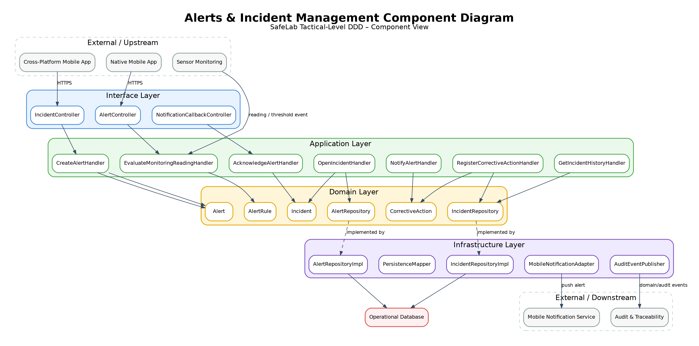

#### **2.6.4.6. Bounded Context Software Architecture Code Level Diagrams**

##### **2.6.4.6.1. Bounded Context Domain Layer Class Diagrams**

El Class Diagram integra <b>AlertRule</b>, <b>Alert</b>, <b>Incident</b>, <b>CorrectiveAction</b>, <b>Severity</b>, <b>AlertStatus</b>, <b>IncidentStatus</b> y sus repositorios dentro de un único modelo coherente.

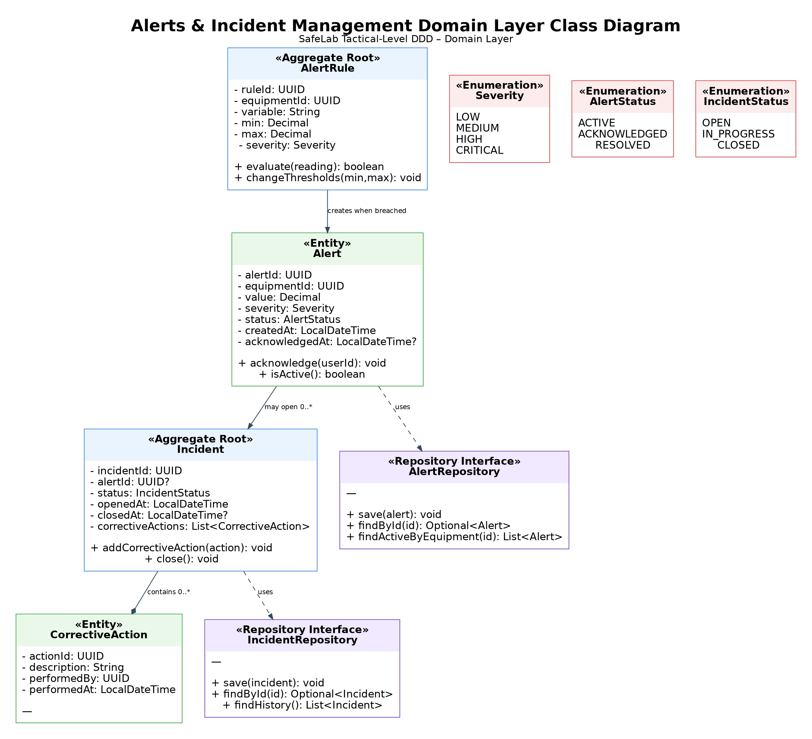

##### **2.6.4.6.2. Bounded Context Database Design Diagram**

El modelo de persistencia incluye <b>alert_rules</b>, <b>alerts</b>, <b>alert_acknowledgements</b>, <b>incidents</b> y <b>corrective_actions</b>. <b>incidents</b> referencia la alerta que originó el seguimiento y <b>corrective_actions</b> conserva el actor y timestamp de cada acción.

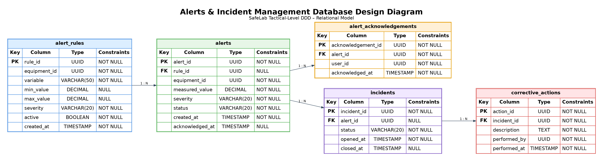

### **2.6.5. Bounded Context: Equipment Condition & Maintenance**

#### **2.6.5.1. Domain Layer**

<table border="1" style="width:100%; border-collapse:collapse;">
<thead><tr><th style="text-align:center;padding:6px;">Elemento</th><th style="text-align:center;padding:6px;">Tipo</th><th style="text-align:center;padding:6px;">Atributos principales</th><th style="text-align:center;padding:6px;">Operaciones principales</th></tr></thead>
<tbody>
<tr><td style="text-align:center;padding:6px;">EquipmentCondition</td><td style="text-align:center;padding:6px;">Entity / Snapshot</td><td style="text-align:justify;padding:6px;">equipmentId, condition, evaluatedAt, indicators.</td><td style="text-align:justify;padding:6px;">isAbnormal().</td></tr>
<tr><td style="text-align:center;padding:6px;">MaintenanceRecord</td><td style="text-align:center;padding:6px;">Aggregate Root</td><td style="text-align:justify;padding:6px;">maintenanceId, equipmentId, type, performedAt, notes, performedBy.</td><td style="text-align:justify;padding:6px;">complete(), addObservation().</td></tr>
<tr><td style="text-align:center;padding:6px;">ReliabilityAssessment</td><td style="text-align:center;padding:6px;">Value Object / Domain Result</td><td style="text-align:justify;padding:6px;">score, period, failureCount.</td><td style="text-align:justify;padding:6px;">classify().</td></tr>
</tbody>
</table>

#### **2.6.5.2. Interface Layer**

La Interface Layer incluye <b>EquipmentConditionController</b> y <b>MaintenanceController</b>, con operaciones para consultar condición, anomalías, rendimiento, confiabilidad, uso e historial de mantenimiento.

#### **2.6.5.3. Application Layer**

La Application Layer utiliza <b>EvaluateEquipmentConditionHandler</b>, <b>RegisterMaintenanceHandler</b>, <b>GetMaintenanceHistoryHandler</b>, <b>GetEquipmentReliabilityHandler</b> y <b>GetEquipmentPerformanceHandler</b>.

#### **2.6.5.4 Infrastructure Layer**

Incluye repositorios de mantenimiento y condición, además de queries/adapters para obtener históricos desde Sensor Monitoring sin copiar sus reglas internas. Cuando el cálculo requiera información de otros contextos, se utilizan DTOs o eventos publicados.

#### **2.6.5.5. Bounded Context Software Architecture Component Level Diagrams**

El Component Diagram organiza las responsabilidades de evaluación de condición, consulta de historial, mantenimiento y confiabilidad del equipo, manteniendo la separación entre Interface, Application, Domain e Infrastructure Layer.

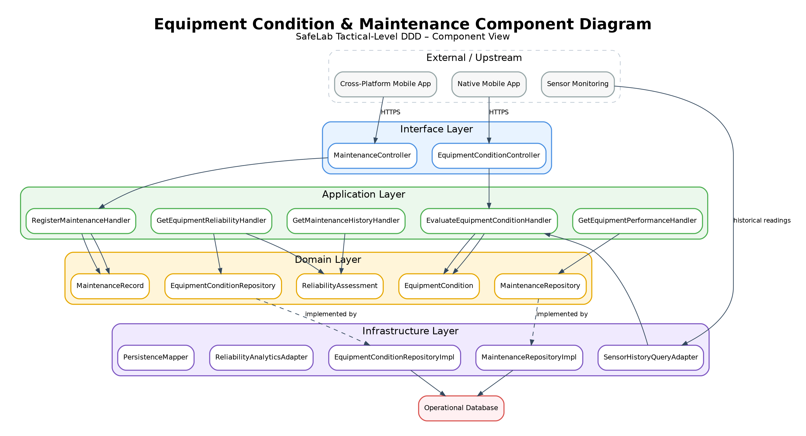

#### **2.6.5.6. Bounded Context Software Architecture Code Level Diagrams**

##### **2.6.5.6.1. Bounded Context Domain Layer Class Diagrams**

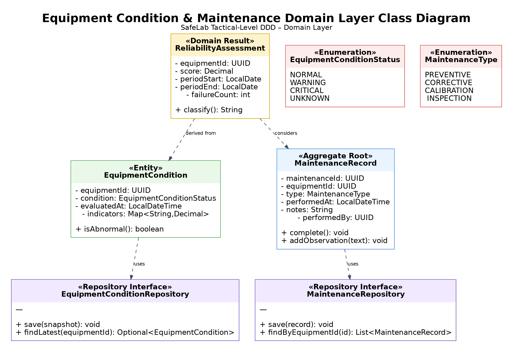

##### **2.6.5.6.2. Bounded Context Database Design Diagram**

El modelo de persistencia incluye <b>maintenance_records</b>, <b>equipment_condition_snapshots</b> y <b>equipment_reliability_metrics</b>, que conservan el historial de mantenimiento, los estados evaluados del equipo y sus métricas de confiabilidad.

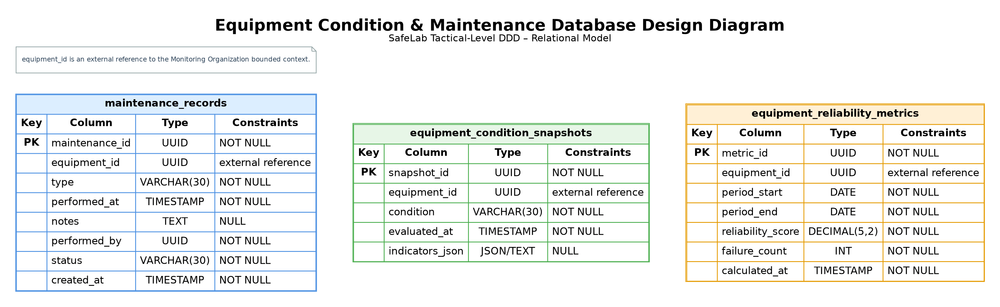

### **2.6.6. Bounded Context: Reporting & Compliance**

Este contexto concentra las capacidades de consulta histórica, comparación de periodos, generación de reportes, exportación de datos y preparación de evidencia para actividades de control y cumplimiento regulatorio.

#### **2.6.6.1. Domain Layer**

<table border="1" style="width:100%; border-collapse:collapse;">
<thead><tr><th style="text-align:center;padding:6px;">Elemento</th><th style="text-align:center;padding:6px;">Tipo</th><th style="text-align:center;padding:6px;">Atributos principales</th><th style="text-align:center;padding:6px;">Operaciones principales</th></tr></thead>
<tbody>
<tr><td style="text-align:center;padding:6px;">ReportRequest</td><td style="text-align:center;padding:6px;">Value Object / Command Model</td><td style="text-align:justify;padding:6px;">equipmentId, period, reportType, format.</td><td style="text-align:justify;padding:6px;">validate().</td></tr>
<tr><td style="text-align:center;padding:6px;">ComplianceReport</td><td style="text-align:center;padding:6px;">Aggregate Root</td><td style="text-align:justify;padding:6px;">reportId, period, generatedAt, generatedBy, status.</td><td style="text-align:justify;padding:6px;">markGenerated(), markFailed().</td></tr>
<tr><td style="text-align:center;padding:6px;">ReportingPeriod</td><td style="text-align:center;padding:6px;">Value Object</td><td style="text-align:justify;padding:6px;">startDate, endDate.</td><td style="text-align:justify;padding:6px;">contains(timestamp), overlaps(other).</td></tr>
</tbody>
</table>

#### **2.6.6.2. Interface Layer**

La Interface Layer incluye <b>ReportingController</b>, <b>HistoricalDataController</b> y <b>DataExportController</b> para solicitar históricos, comparaciones, reportes y archivos exportables.

#### **2.6.6.3. Application Layer**

La Application Layer utiliza <b>GetHistoricalDataHandler</b>, <b>ComparePeriodsHandler</b>, <b>GenerateComplianceReportHandler</b>, <b>DownloadReportHandler</b>, <b>ExportMonitoringDataHandler</b> y <b>GetIncidentHistoryForReportHandler</b>.

#### **2.6.6.4 Infrastructure Layer**

Incluye <b>ReportRepositoryImpl</b>, <b>ReportFileGenerator</b>, <b>HistoricalDataQueryAdapter</b> y adaptadores de exportación. El generador de archivos debe consumir modelos ya validados y no incorporar reglas de dominio propias.

#### **2.6.6.5. Bounded Context Software Architecture Component Level Diagrams**

El Component Diagram integra la consulta histórica, comparación de periodos, generación de reportes, exportación de datos y acceso a información de auditoría dentro del mismo Bounded Context.

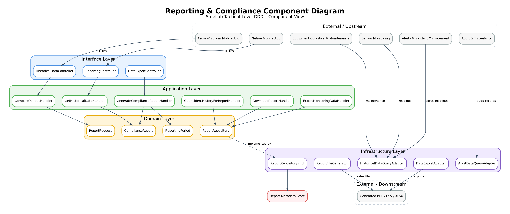

#### **2.6.6.6. Bounded Context Software Architecture Code Level Diagrams**

##### **2.6.6.6.1. Bounded Context Domain Layer Class Diagrams**

El Class Diagram integra <b>ComplianceReport</b>, <b>ReportRequest</b>, <b>ReportingPeriod</b>, formatos de exportación y repositorios asociados a la generación y consulta de reportes.

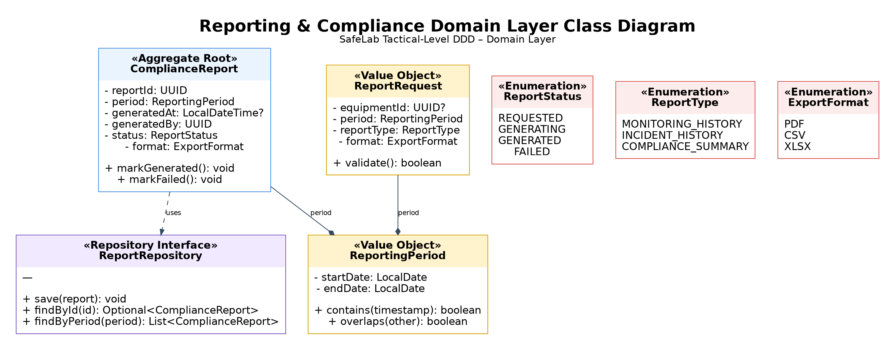

##### **2.6.6.6.2. Bounded Context Database Design Diagram**

El modelo de persistencia incluye <b>report_requests</b>, <b>generated_reports</b> y metadatos de exportación. La información fuente de lecturas, alertas, incidentes y mantenimiento permanece en sus contextos propietarios, mientras Reporting & Compliance conserva las solicitudes y artefactos generados.

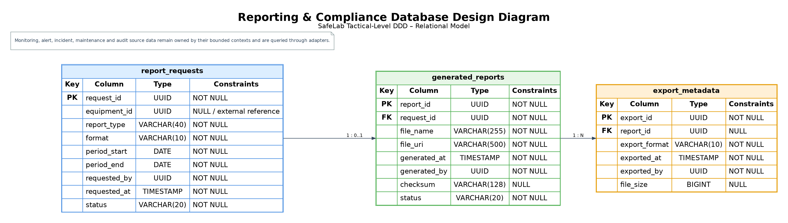

### **2.6.7. Bounded Context: Dashboard & Overview**

Este contexto está orientado principalmente a lectura. Su función es construir una vista agregada para el usuario móvil sin convertirse en propietario de los datos transaccionales de monitoreo, alertas o mantenimiento.

#### **2.6.7.1. Domain Layer**

<table border="1" style="width:100%; border-collapse:collapse;">
<thead><tr><th style="text-align:center;padding:6px;">Elemento</th><th style="text-align:center;padding:6px;">Tipo</th><th style="text-align:center;padding:6px;">Atributos principales</th><th style="text-align:center;padding:6px;">Operaciones principales</th></tr></thead>
<tbody>
<tr><td style="text-align:center;padding:6px;">MonitoringSummary</td><td style="text-align:center;padding:6px;">Read Model</td><td style="text-align:justify;padding:6px;">equipmentTotal, activeAlerts, criticalAlerts, offlineEquipment.</td><td style="text-align:justify;padding:6px;">-</td></tr>
<tr><td style="text-align:center;padding:6px;">TrendSeries</td><td style="text-align:center;padding:6px;">Read Model</td><td style="text-align:justify;padding:6px;">metric, period, points.</td><td style="text-align:justify;padding:6px;">-</td></tr>
<tr><td style="text-align:center;padding:6px;">DashboardSnapshot</td><td style="text-align:center;padding:6px;">Read Model</td><td style="text-align:justify;padding:6px;">generatedAt, summary, criticalItems, trends.</td><td style="text-align:justify;padding:6px;">-</td></tr>
</tbody>
</table>

#### **2.6.7.2. Interface Layer**

La Interface Layer incluye <b>DashboardController</b> y <b>TrendController</b>, que exponen información agregada para las vistas móviles.

#### **2.6.7.3. Application Layer**

La Application Layer utiliza <b>GetDashboardOverviewHandler</b>, <b>GetCriticalAlertsSummaryHandler</b>, <b>GetEquipmentWithActiveAlertsHandler</b> y <b>GetMonitoringTrendsHandler</b>.

#### **2.6.7.4 Infrastructure Layer**

La Infrastructure Layer utiliza query adapters, projections y vistas optimizadas para lectura. Las proyecciones se construyen a partir de la información publicada por los contextos fuente y se actualizan para mantener la vista general del sistema.

#### **2.6.7.5. Bounded Context Software Architecture Component Level Diagrams**

El Component Diagram separa los controllers de consulta, los application handlers, los read models y los adapters que recuperan información de monitoreo, alertas, mantenimiento y auditoría.

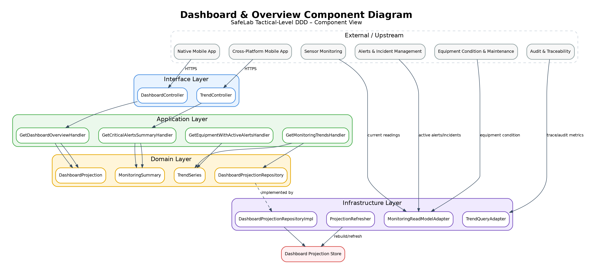

#### **2.6.7.6. Bounded Context Software Architecture Code Level Diagrams**

##### **2.6.7.6.1. Bounded Context Domain Layer Class Diagrams**

El modelo de dominio se mantiene ligero y orientado a lectura mediante <b>MonitoringSummary</b>, <b>TrendSeries</b> y <b>DashboardSnapshot</b>, que representan la información agregada necesaria para la vista general.

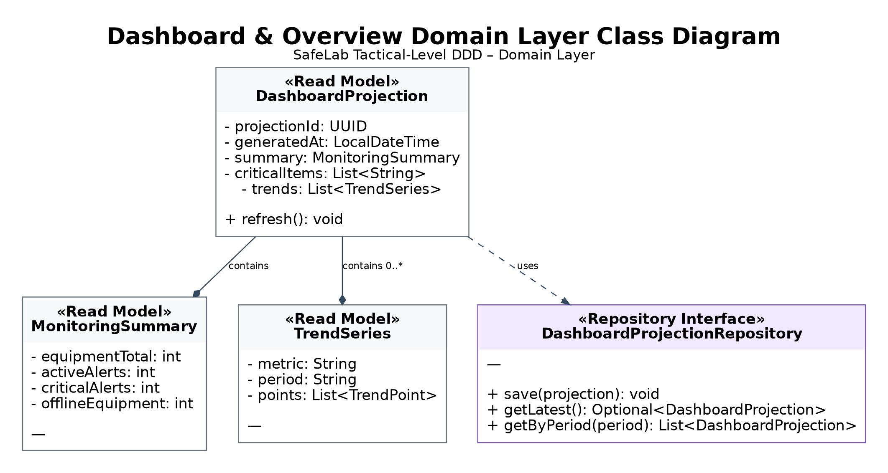

##### **2.6.7.6.2. Bounded Context Database Design Diagram**

La persistencia utiliza <b>dashboard_projections</b>, snapshots de tendencias y vistas materializadas orientadas a lectura. Estas estructuras contienen información derivada de otros Bounded Contexts y no reemplazan a los datos transaccionales de sus contextos propietarios.

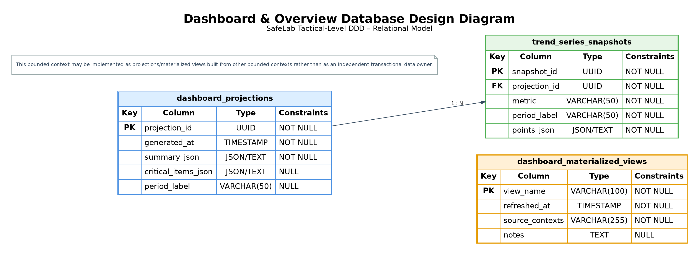

### **2.6.8. Bounded Context: Audit & Traceability**

Este contexto conserva la evidencia necesaria para reconstruir qué ocurrió, cuándo ocurrió y quién realizó o recibió una acción. Se mantiene separado porque las entrevistas farmacéuticas enfatizan la necesidad de registros inalterables para auditorías y porque el Ubiquitous Language ya identifica Incident Log y Compliance Report como conceptos centrales.

#### **2.6.8.1. Domain Layer**

<table border="1" style="width:100%; border-collapse:collapse;">
<thead><tr><th style="text-align:center;padding:6px;">Elemento</th><th style="text-align:center;padding:6px;">Tipo</th><th style="text-align:center;padding:6px;">Atributos principales</th><th style="text-align:center;padding:6px;">Operaciones principales</th></tr></thead>
<tbody>
<tr><td style="text-align:center;padding:6px;">AuditEntry</td><td style="text-align:center;padding:6px;">Entity</td><td style="text-align:justify;padding:6px;">auditId, actorId, action, targetType, targetId, timestamp, correlationId.</td><td style="text-align:justify;padding:6px;">-</td></tr>
<tr><td style="text-align:center;padding:6px;">TraceabilityRecord</td><td style="text-align:center;padding:6px;">Aggregate / Read Model</td><td style="text-align:justify;padding:6px;">correlationId, eventSequence, startedAt, completedAt.</td><td style="text-align:justify;padding:6px;">append(eventReference).</td></tr>
<tr><td style="text-align:center;padding:6px;">CorrelationId</td><td style="text-align:center;padding:6px;">Value Object</td><td style="text-align:justify;padding:6px;">value.</td><td style="text-align:justify;padding:6px;">generate(), validate().</td></tr>
</tbody>
</table>

#### **2.6.8.2. Interface Layer**

La Interface Layer incluye <b>AuditTrailController</b> para consultas autorizadas y <b>AuditEventConsumer</b> para recibir eventos generados por otros Bounded Contexts.

#### **2.6.8.3. Application Layer**

La Application Layer utiliza <b>AppendAuditEntryHandler</b>, <b>GetAuditTrailHandler</b>, <b>BuildTraceabilityRecordHandler</b> y <b>ExportTraceabilityEvidenceHandler</b>.

#### **2.6.8.4 Infrastructure Layer**

La Infrastructure Layer incluye <b>AuditRepositoryImpl</b>, almacenamiento append-only, serializers de eventos y consumers para registrar eventos provenientes de los demás Bounded Contexts sin modificar su contenido original.

#### **2.6.8.5. Bounded Context Software Architecture Component Level Diagrams**

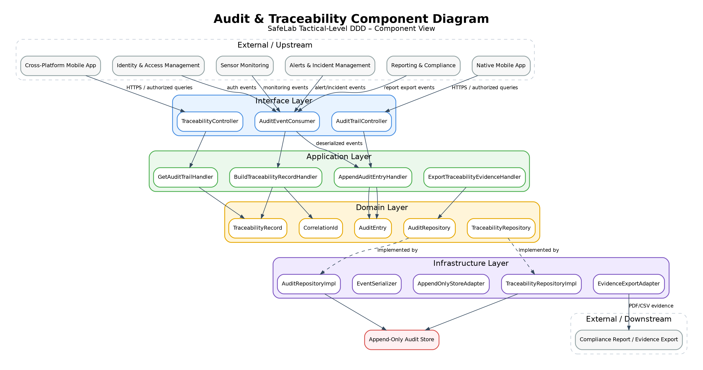

#### **2.6.8.6. Bounded Context Software Architecture Code Level Diagrams**

##### **2.6.8.6.1. Bounded Context Domain Layer Class Diagrams**

El Class Diagram integra <b>AuditEntry</b>, <b>TraceabilityRecord</b>, <b>CorrelationId</b> y los contratos de repositorio necesarios para consultar y reconstruir la evidencia de trazabilidad.

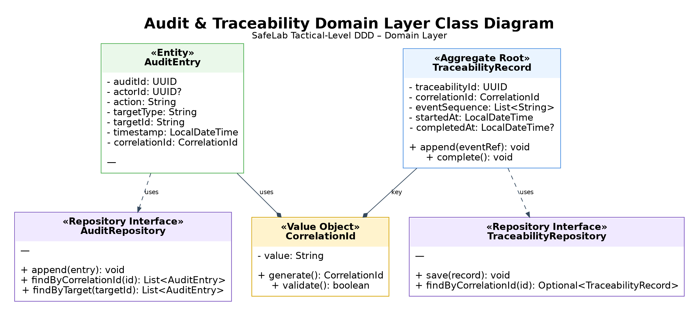

##### **2.6.8.6.2. Bounded Context Database Design Diagram**

El modelo de persistencia incluye <b>audit_entries</b> y <b>traceability_records</b>. <b>audit_entries</b> registra actor, acción, objeto, fecha/hora y correlation_id, mientras <b>traceability_records</b> agrupa la secuencia de eventos asociada a una misma trazabilidad. Los registros de auditoría se conservan como información append-only durante la operación normal del sistema.

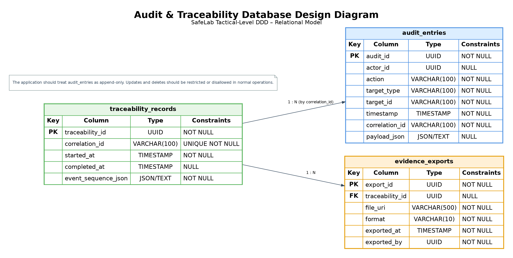

