# **Chapter III: Solution UI/UX Design**

## **3.1. Product design**

  En este capítulo se presentan las decisiones de diseño que guían la experiencia de usuario de SafeLab en sus dos puntos de contacto: la Landing Page, orientada a presentar el producto a laboratorios hospitalarios y empresas farmacéuticas, y las aplicaciones móviles para Android e iOS, utilizadas por el personal para supervisar sus equipos, atender alertas y obtener reportes. Las decisiones se basan en los hallazgos del capítulo II —User Personas, User Journey Maps y Empathy Maps—, en el Ubiquitous Language del dominio y en las épicas del Product Backlog, de modo que la interfaz utilice el mismo lenguaje y priorice las mismas tareas que el personal identificó como críticas.

### **3.1.1. Style Guidelines**

  
  Las guías de estilo establecen los lineamientos visuales y verbales que deben aplicarse de manera consistente en la Landing Page y en las aplicaciones móviles. Su objetivo es que el usuario reconozca SafeLab en cualquier plataforma y que la interfaz comunique con claridad el estado de los equipos monitoreados, aspecto central del producto. La guía se resume en la siguiente figura y se detalla en los apartados posteriores.

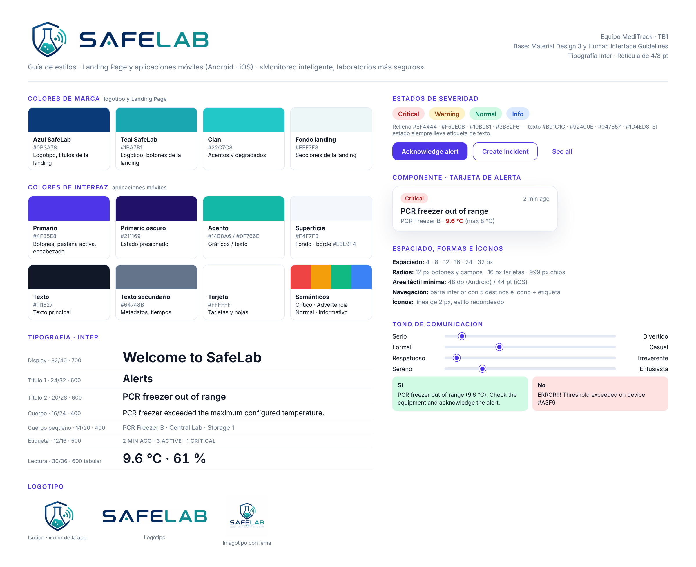

#### **3.1.1.1. General Style Guidelines**

##### **Design System de referencia y principios**

  La guía de estilos de SafeLab toma como referencia Material Design 3 (Google, s. f.) para la aplicación Android y las Human Interface Guidelines (Apple, s. f.) para iOS, y adapta sus componentes a la identidad de la marca. Las decisiones se sustentan en cuatro principios de diseño: <b>jerarquía visual</b>, para que lo urgente —una alerta crítica o un equipo fuera de rango— sea lo primero que se percibe; <b>consistencia</b>, para que los mismos colores, etiquetas y componentes signifiquen lo mismo en la Landing Page y en las aplicaciones; <b>contraste y accesibilidad</b>, para que la información sea legible en cualquier condición de luz del laboratorio; y <b>simplicidad</b>, para que el personal resuelva cada tarea con el menor número de pasos.

##### **Branding**

  SafeLab se presenta como un aliado confiable y preciso para el personal que protege recursos sensibles, resumido en su lema «Monitoreo inteligente, laboratorios más seguros». El logotipo cuenta con tres versiones: el isotipo, un escudo que contiene un matraz de laboratorio y ondas de señal inalámbrica, que representan la protección de los recursos y el monitoreo remoto; el logotipo, con «SAFE» en azul y «LAB» en teal; y el imagotipo, que combina ambos con el lema. El isotipo se utiliza como ícono de las aplicaciones y el logotipo e imagotipo en la Landing Page y en la pantalla de inicio de sesión. El logotipo se coloca sobre fondos claros, con un área libre mínima equivalente a la altura de la letra «S», y no se deforma, rota ni recolorea.

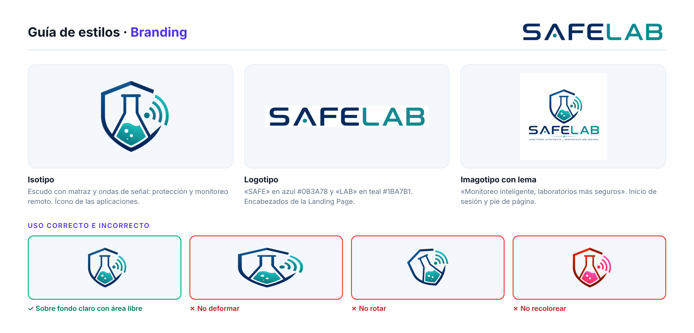

##### **Typography**

  Se utiliza <b>Inter</b> como familia tipográfica única en la Landing Page y en las aplicaciones móviles. Es una fuente sans serif de código abierto (Andersson, s. f.), diseñada para pantallas, con alta legibilidad en tamaños pequeños y cifras tabulares que alinean las lecturas de temperatura y humedad para compararlas con rapidez. En Android se incorpora como fuente descargable y en iOS se empaqueta con la aplicación.

<table border="1" style="width: 100%; border-collapse: collapse;">
  <thead>
    <tr>
      <th style="text-align: center; vertical-align: middle; padding: 6px;">Estilo</th>
      <th style="text-align: center; vertical-align: middle; padding: 6px;">Tamaño / interlineado</th>
      <th style="text-align: center; vertical-align: middle; padding: 6px;">Peso</th>
      <th style="text-align: center; vertical-align: middle; padding: 6px;">Uso</th>
    </tr>
  </thead>
  <tbody>
    <tr>
      <td style="text-align: justify; vertical-align: top; padding: 6px;">Display</td>
      <td style="text-align: justify; vertical-align: top; padding: 6px;">32 / 40 px</td>
      <td style="text-align: justify; vertical-align: top; padding: 6px;">Bold (700)</td>
      <td style="text-align: justify; vertical-align: top; padding: 6px;">Títulos principales de la Landing Page y bienvenida</td>
    </tr>
    <tr>
      <td style="text-align: justify; vertical-align: top; padding: 6px;">Título 1</td>
      <td style="text-align: justify; vertical-align: top; padding: 6px;">24 / 32 px</td>
      <td style="text-align: justify; vertical-align: top; padding: 6px;">Semibold (600)</td>
      <td style="text-align: justify; vertical-align: top; padding: 6px;">Título de cada pantalla de la aplicación</td>
    </tr>
    <tr>
      <td style="text-align: justify; vertical-align: top; padding: 6px;">Título 2</td>
      <td style="text-align: justify; vertical-align: top; padding: 6px;">20 / 28 px</td>
      <td style="text-align: justify; vertical-align: top; padding: 6px;">Semibold (600)</td>
      <td style="text-align: justify; vertical-align: top; padding: 6px;">Título de alertas, equipos y tarjetas</td>
    </tr>
    <tr>
      <td style="text-align: justify; vertical-align: top; padding: 6px;">Cuerpo</td>
      <td style="text-align: justify; vertical-align: top; padding: 6px;">16 / 24 px</td>
      <td style="text-align: justify; vertical-align: top; padding: 6px;">Regular (400)</td>
      <td style="text-align: justify; vertical-align: top; padding: 6px;">Descripciones y mensajes</td>
    </tr>
    <tr>
      <td style="text-align: justify; vertical-align: top; padding: 6px;">Cuerpo pequeño</td>
      <td style="text-align: justify; vertical-align: top; padding: 6px;">14 / 20 px</td>
      <td style="text-align: justify; vertical-align: top; padding: 6px;">Regular (400)</td>
      <td style="text-align: justify; vertical-align: top; padding: 6px;">Equipo, sitio y área asociados</td>
    </tr>
    <tr>
      <td style="text-align: justify; vertical-align: top; padding: 6px;">Etiqueta</td>
      <td style="text-align: justify; vertical-align: top; padding: 6px;">12 / 16 px</td>
      <td style="text-align: justify; vertical-align: top; padding: 6px;">Medium (500)</td>
      <td style="text-align: justify; vertical-align: top; padding: 6px;">Marcas de tiempo, contadores y chips</td>
    </tr>
    <tr>
      <td style="text-align: justify; vertical-align: top; padding: 6px;">Lectura</td>
      <td style="text-align: justify; vertical-align: top; padding: 6px;">30 / 36 px</td>
      <td style="text-align: justify; vertical-align: top; padding: 6px;">Semibold (600), cifras tabulares</td>
      <td style="text-align: justify; vertical-align: top; padding: 6px;">Valores de temperatura y humedad</td>
    </tr>
  </tbody>
</table>

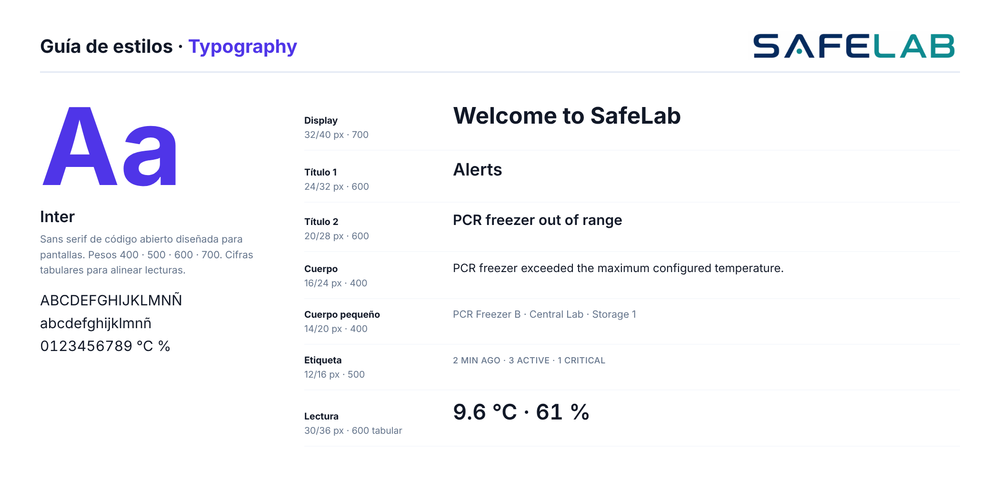

##### **Colors**

  La paleta se organiza en dos niveles. Los <b>colores de marca</b> provienen del logotipo y se aplican en la Landing Page, donde el objetivo es comunicar la identidad de SafeLab. Los <b>colores de interfaz</b> se aplican en las aplicaciones móviles, donde el objetivo es guiar la acción del usuario: el primario índigo identifica los elementos interactivos y el acento teal mantiene el vínculo con la marca. Los colores semánticos se reservan para los estados de severidad y siempre se acompañan de una etiqueta de texto, de modo que el estado no dependa solo del color. Los colores usados para texto alcanzan una relación de contraste mínima de 4,5:1 sobre fondo blanco, conforme al nivel AA de las WCAG 2.1 (World Wide Web Consortium [W3C], 2018).

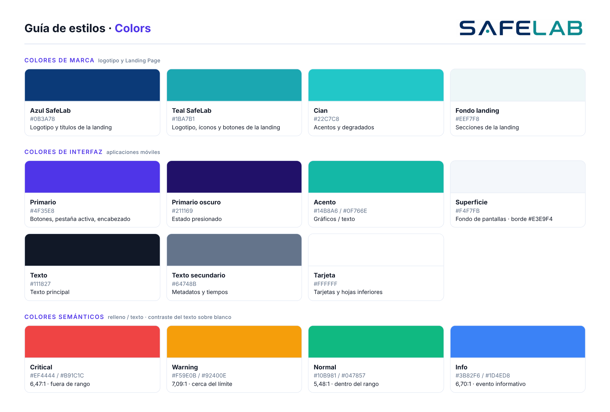

<table border="1" style="width: 100%; border-collapse: collapse;">
  <thead>
    <tr>
      <th style="text-align: center; vertical-align: middle; padding: 6px;">Nivel</th>
      <th style="text-align: center; vertical-align: middle; padding: 6px;">Color</th>
      <th style="text-align: center; vertical-align: middle; padding: 6px;">Código</th>
      <th style="text-align: center; vertical-align: middle; padding: 6px;">Contraste sobre blanco</th>
      <th style="text-align: center; vertical-align: middle; padding: 6px;">Uso</th>
    </tr>
  </thead>
  <tbody>
    <tr>
      <td style="text-align: justify; vertical-align: top; padding: 6px;">Marca</td>
      <td style="text-align: justify; vertical-align: top; padding: 6px;">Azul SafeLab</td>
      <td style="text-align: justify; vertical-align: top; padding: 6px;">#0B3A78</td>
      <td style="text-align: justify; vertical-align: top; padding: 6px;">11,11:1</td>
      <td style="text-align: justify; vertical-align: top; padding: 6px;">Logotipo y títulos de la Landing Page</td>
    </tr>
    <tr>
      <td style="text-align: justify; vertical-align: top; padding: 6px;">Marca</td>
      <td style="text-align: justify; vertical-align: top; padding: 6px;">Teal SafeLab</td>
      <td style="text-align: justify; vertical-align: top; padding: 6px;">#1BA7B1</td>
      <td style="text-align: justify; vertical-align: top; padding: 6px;">2,91:1</td>
      <td style="text-align: justify; vertical-align: top; padding: 6px;">Logotipo, íconos y fondos de botones de la Landing Page (no se usa para texto sobre blanco)</td>
    </tr>
    <tr>
      <td style="text-align: justify; vertical-align: top; padding: 6px;">Marca</td>
      <td style="text-align: justify; vertical-align: top; padding: 6px;">Cian</td>
      <td style="text-align: justify; vertical-align: top; padding: 6px;">#22C7C8</td>
      <td style="text-align: justify; vertical-align: top; padding: 6px;">—</td>
      <td style="text-align: justify; vertical-align: top; padding: 6px;">Acentos y degradados decorativos</td>
    </tr>
    <tr>
      <td style="text-align: justify; vertical-align: top; padding: 6px;">Marca</td>
      <td style="text-align: justify; vertical-align: top; padding: 6px;">Fondo landing</td>
      <td style="text-align: justify; vertical-align: top; padding: 6px;">#EEF7F8</td>
      <td style="text-align: justify; vertical-align: top; padding: 6px;">—</td>
      <td style="text-align: justify; vertical-align: top; padding: 6px;">Fondo de las secciones de la Landing Page</td>
    </tr>
    <tr>
      <td style="text-align: justify; vertical-align: top; padding: 6px;">Interfaz</td>
      <td style="text-align: justify; vertical-align: top; padding: 6px;">Primario</td>
      <td style="text-align: justify; vertical-align: top; padding: 6px;">#4F35E8</td>
      <td style="text-align: justify; vertical-align: top; padding: 6px;">6,98:1</td>
      <td style="text-align: justify; vertical-align: top; padding: 6px;">Botones principales, pestaña activa y encabezados</td>
    </tr>
    <tr>
      <td style="text-align: justify; vertical-align: top; padding: 6px;">Interfaz</td>
      <td style="text-align: justify; vertical-align: top; padding: 6px;">Primario oscuro</td>
      <td style="text-align: justify; vertical-align: top; padding: 6px;">#211169</td>
      <td style="text-align: justify; vertical-align: top; padding: 6px;">15,57:1</td>
      <td style="text-align: justify; vertical-align: top; padding: 6px;">Estado presionado de los botones</td>
    </tr>
    <tr>
      <td style="text-align: justify; vertical-align: top; padding: 6px;">Interfaz</td>
      <td style="text-align: justify; vertical-align: top; padding: 6px;">Acento</td>
      <td style="text-align: justify; vertical-align: top; padding: 6px;">#14B8A6 (relleno) / #0F766E (texto)</td>
      <td style="text-align: justify; vertical-align: top; padding: 6px;">5,47:1 (texto)</td>
      <td style="text-align: justify; vertical-align: top; padding: 6px;">Gráficos, indicadores de conexión y enlaces secundarios</td>
    </tr>
    <tr>
      <td style="text-align: justify; vertical-align: top; padding: 6px;">Interfaz</td>
      <td style="text-align: justify; vertical-align: top; padding: 6px;">Superficie</td>
      <td style="text-align: justify; vertical-align: top; padding: 6px;">#F4F7FB / #FFFFFF</td>
      <td style="text-align: justify; vertical-align: top; padding: 6px;">—</td>
      <td style="text-align: justify; vertical-align: top; padding: 6px;">Fondo de pantallas / tarjetas y hojas inferiores</td>
    </tr>
    <tr>
      <td style="text-align: justify; vertical-align: top; padding: 6px;">Interfaz</td>
      <td style="text-align: justify; vertical-align: top; padding: 6px;">Texto</td>
      <td style="text-align: justify; vertical-align: top; padding: 6px;">#111827</td>
      <td style="text-align: justify; vertical-align: top; padding: 6px;">17,74:1</td>
      <td style="text-align: justify; vertical-align: top; padding: 6px;">Texto principal</td>
    </tr>
    <tr>
      <td style="text-align: justify; vertical-align: top; padding: 6px;">Interfaz</td>
      <td style="text-align: justify; vertical-align: top; padding: 6px;">Texto secundario</td>
      <td style="text-align: justify; vertical-align: top; padding: 6px;">#64748B</td>
      <td style="text-align: justify; vertical-align: top; padding: 6px;">4,76:1</td>
      <td style="text-align: justify; vertical-align: top; padding: 6px;">Metadatos y marcas de tiempo (sobre blanco)</td>
    </tr>
    <tr>
      <td style="text-align: justify; vertical-align: top; padding: 6px;">Semántico</td>
      <td style="text-align: justify; vertical-align: top; padding: 6px;">Critical</td>
      <td style="text-align: justify; vertical-align: top; padding: 6px;">#EF4444 (relleno) / #B91C1C (texto)</td>
      <td style="text-align: justify; vertical-align: top; padding: 6px;">6,47:1 (texto)</td>
      <td style="text-align: justify; vertical-align: top; padding: 6px;">Lectura fuera de rango que requiere atención inmediata</td>
    </tr>
    <tr>
      <td style="text-align: justify; vertical-align: top; padding: 6px;">Semántico</td>
      <td style="text-align: justify; vertical-align: top; padding: 6px;">Warning</td>
      <td style="text-align: justify; vertical-align: top; padding: 6px;">#F59E0B (relleno) / #92400E (texto)</td>
      <td style="text-align: justify; vertical-align: top; padding: 6px;">7,09:1 (texto)</td>
      <td style="text-align: justify; vertical-align: top; padding: 6px;">Lectura cercana al límite o anomalía del equipo</td>
    </tr>
    <tr>
      <td style="text-align: justify; vertical-align: top; padding: 6px;">Semántico</td>
      <td style="text-align: justify; vertical-align: top; padding: 6px;">Normal</td>
      <td style="text-align: justify; vertical-align: top; padding: 6px;">#10B981 (relleno) / #047857 (texto)</td>
      <td style="text-align: justify; vertical-align: top; padding: 6px;">5,48:1 (texto)</td>
      <td style="text-align: justify; vertical-align: top; padding: 6px;">Equipo con lecturas dentro del rango</td>
    </tr>
    <tr>
      <td style="text-align: justify; vertical-align: top; padding: 6px;">Semántico</td>
      <td style="text-align: justify; vertical-align: top; padding: 6px;">Info</td>
      <td style="text-align: justify; vertical-align: top; padding: 6px;">#3B82F6 (relleno) / #1D4ED8 (texto)</td>
      <td style="text-align: justify; vertical-align: top; padding: 6px;">6,70:1 (texto)</td>
      <td style="text-align: justify; vertical-align: top; padding: 6px;">Eventos informativos, como la pérdida de conexión de un sensor</td>
    </tr>
  </tbody>
</table>

  Las aplicaciones incluyen un <b>modo oscuro</b>, que el usuario activa desde Profile &amp; settings y que por defecto sigue la configuración del sistema operativo. En este modo se mantienen los mismos roles de color, con valores ajustados para conservar el contraste sobre fondos oscuros:

<table border="1" style="width: 100%; border-collapse: collapse;">
  <thead>
    <tr>
      <th style="text-align: center; vertical-align: middle; padding: 6px;">Rol</th>
      <th style="text-align: center; vertical-align: middle; padding: 6px;">Modo claro</th>
      <th style="text-align: center; vertical-align: middle; padding: 6px;">Modo oscuro</th>
    </tr>
  </thead>
  <tbody>
    <tr>
      <td style="text-align: justify; vertical-align: top; padding: 6px;">Primario</td>
      <td style="text-align: justify; vertical-align: top; padding: 6px;">#4F35E8</td>
      <td style="text-align: justify; vertical-align: top; padding: 6px;">#7C6CFF</td>
    </tr>
    <tr>
      <td style="text-align: justify; vertical-align: top; padding: 6px;">Acento</td>
      <td style="text-align: justify; vertical-align: top; padding: 6px;">#14B8A6</td>
      <td style="text-align: justify; vertical-align: top; padding: 6px;">#2DD4BF</td>
    </tr>
    <tr>
      <td style="text-align: justify; vertical-align: top; padding: 6px;">Superficie</td>
      <td style="text-align: justify; vertical-align: top; padding: 6px;">#F4F7FB</td>
      <td style="text-align: justify; vertical-align: top; padding: 6px;">#0F172A</td>
    </tr>
    <tr>
      <td style="text-align: justify; vertical-align: top; padding: 6px;">Tarjeta</td>
      <td style="text-align: justify; vertical-align: top; padding: 6px;">#FFFFFF</td>
      <td style="text-align: justify; vertical-align: top; padding: 6px;">#111C31</td>
    </tr>
    <tr>
      <td style="text-align: justify; vertical-align: top; padding: 6px;">Texto</td>
      <td style="text-align: justify; vertical-align: top; padding: 6px;">#111827</td>
      <td style="text-align: justify; vertical-align: top; padding: 6px;">#E5EDF9</td>
    </tr>
    <tr>
      <td style="text-align: justify; vertical-align: top; padding: 6px;">Texto secundario</td>
      <td style="text-align: justify; vertical-align: top; padding: 6px;">#64748B</td>
      <td style="text-align: justify; vertical-align: top; padding: 6px;">#9CAEC8</td>
    </tr>
    <tr>
      <td style="text-align: justify; vertical-align: top; padding: 6px;">Borde</td>
      <td style="text-align: justify; vertical-align: top; padding: 6px;">#E3E9F4</td>
      <td style="text-align: justify; vertical-align: top; padding: 6px;">#24324A</td>
    </tr>
    <tr>
      <td style="text-align: justify; vertical-align: top; padding: 6px;">Critical / Warning / Normal / Info</td>
      <td style="text-align: justify; vertical-align: top; padding: 6px;">#EF4444 / #F59E0B / #10B981 / #3B82F6</td>
      <td style="text-align: justify; vertical-align: top; padding: 6px;">#FB7185 / #FBBF24 / #34D399 / #60A5FA</td>
    </tr>
  </tbody>
</table>

##### **Spacing**

  La interfaz se construye sobre una retícula de 4 y 8 pt, con valores de espaciado de 4, 8, 12, 16, 24 y 32 px. Los botones y campos de texto tienen un radio de 12 px, las tarjetas de 16 px y los chips de estado son completamente redondeados. El área táctil mínima es de 48 × 48 dp en Android y de 44 × 44 pt en iOS. La navegación principal se resuelve con una barra inferior de cinco destinos, cada uno con ícono y etiqueta, y los íconos son de línea de 2 px en estilo redondeado.

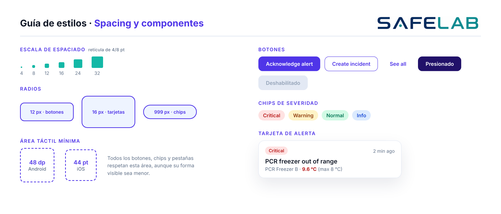

##### **Tono de comunicación**

  El tono de SafeLab se define en cuatro dimensiones, considerando que los mensajes acompañan decisiones críticas sobre la conservación de recursos sensibles:

<table border="1" style="width: 100%; border-collapse: collapse;">
  <thead>
    <tr>
      <th style="text-align: center; vertical-align: middle; padding: 6px;">Dimensión</th>
      <th style="text-align: center; vertical-align: middle; padding: 6px;">Posición de SafeLab</th>
      <th style="text-align: center; vertical-align: middle; padding: 6px;">Justificación</th>
    </tr>
  </thead>
  <tbody>
    <tr>
      <td style="text-align: justify; vertical-align: top; padding: 6px;">Divertido / Serio</td>
      <td style="text-align: justify; vertical-align: top; padding: 6px;">Serio</td>
      <td style="text-align: justify; vertical-align: top; padding: 6px;">Las alertas comunican riesgos para muestras, reactivos y medicamentos, por lo que no se usa humor.</td>
    </tr>
    <tr>
      <td style="text-align: justify; vertical-align: top; padding: 6px;">Formal / Casual</td>
      <td style="text-align: justify; vertical-align: top; padding: 6px;">Mayormente formal</td>
      <td style="text-align: justify; vertical-align: top; padding: 6px;">Se emplea un lenguaje profesional y cercano, sin tecnicismos del sistema, adecuado para el personal de laboratorio y de calidad.</td>
    </tr>
    <tr>
      <td style="text-align: justify; vertical-align: top; padding: 6px;">Respetuoso / Irreverente</td>
      <td style="text-align: justify; vertical-align: top; padding: 6px;">Respetuoso</td>
      <td style="text-align: justify; vertical-align: top; padding: 6px;">Los mensajes no culpan al usuario y se enfocan en la acción que debe realizar.</td>
    </tr>
    <tr>
      <td style="text-align: justify; vertical-align: top; padding: 6px;">Entusiasta / Sereno</td>
      <td style="text-align: justify; vertical-align: top; padding: 6px;">Sereno</td>
      <td style="text-align: justify; vertical-align: top; padding: 6px;">Ante un incidente, el tono transmite calma y control: se evitan las mayúsculas sostenidas y los signos de exclamación repetidos.</td>
    </tr>
  </tbody>
</table>

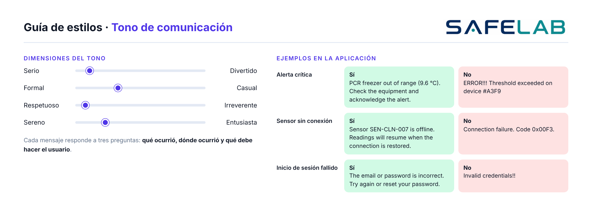

  Cada mensaje responde a tres preguntas: qué ocurrió, dónde ocurrió y qué debe hacer el usuario. Por ejemplo, la aplicación muestra «PCR freezer out of range (9.6 °C). Check the equipment and acknowledge the alert.» en lugar de «ERROR!!! Threshold exceeded on device #A3F9». Los textos de las aplicaciones están en inglés, idioma por defecto, y la Landing Page se presenta en inglés y español.

### **3.1.2. Information Architecture**

  La arquitectura de información define cómo se organiza, rotula y encuentra el contenido de SafeLab en la Landing Page y en las aplicaciones móviles. Se diseñó a partir de las tareas más frecuentes e importantes de la User Task Matrix —revisar el estado de los equipos, atender alertas, registrar incidentes y consultar lecturas históricas— y se refleja en las pantallas definidas en la sección 3.1.4, de modo que cada tarea crítica sea accesible en el menor número de pasos desde cualquier pantalla.

#### **3.1.2.1. Organization Systems**

  SafeLab utiliza esquemas de organización distintos según el tipo de contenido y el producto. La Landing Page se organiza de forma <b>secuencial</b>, como una sola página cuyas secciones conducen al visitante desde la propuesta de valor hasta la acción final: registrarse o solicitar una demostración. Su estructura sigue el orden de los wireframes y mock-ups de la sección 3.1.3.

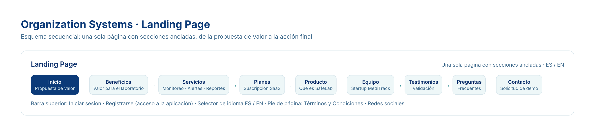

  La aplicación móvil se organiza de forma <b>jerárquica</b> en cinco destinos principales, accesibles desde la barra de navegación inferior: Home, Alerts, Sensors, Incidents y Control. El perfil y la configuración se abren desde el avatar del encabezado, para no ocupar un destino de la barra con funciones de uso poco frecuente. Dentro de cada destino, el contenido se ordena con el esquema de categorización que mejor responde a la tarea del usuario, y las acciones de varios pasos se presentan como flujos <b>secuenciales</b>.

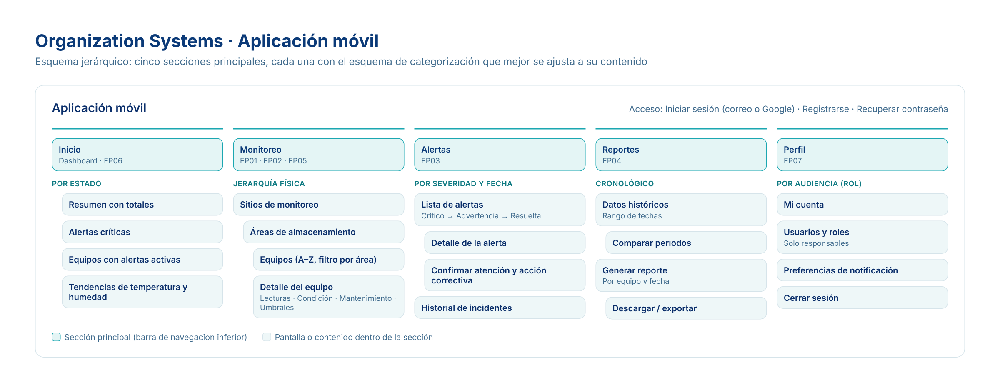

<table border="1" style="width: 100%; border-collapse: collapse;">
  <thead>
    <tr>
      <th style="text-align: center; vertical-align: middle; padding: 6px;">Grupo de información</th>
      <th style="text-align: center; vertical-align: middle; padding: 6px;">Organización visual</th>
      <th style="text-align: center; vertical-align: middle; padding: 6px;">Esquema de categorización</th>
      <th style="text-align: center; vertical-align: middle; padding: 6px;">Justificación</th>
    </tr>
  </thead>
  <tbody>
    <tr>
      <td style="text-align: justify; vertical-align: top; padding: 6px;">Landing Page</td>
      <td style="text-align: justify; vertical-align: top; padding: 6px;">Secuencial</td>
      <td style="text-align: justify; vertical-align: top; padding: 6px;">Por tópicos</td>
      <td style="text-align: justify; vertical-align: top; padding: 6px;">Las secciones Home, Benefits, Services, Plans, About Product, About Team, Testimonials, FAQ y Contact llevan al visitante del problema a la acción.</td>
    </tr>
    <tr>
      <td style="text-align: justify; vertical-align: top; padding: 6px;">Home (dashboard)</td>
      <td style="text-align: justify; vertical-align: top; padding: 6px;">Jerárquica</td>
      <td style="text-align: justify; vertical-align: top; padding: 6px;">Por estado y prioridad</td>
      <td style="text-align: justify; vertical-align: top; padding: 6px;">Los indicadores (Active alerts, Sensors online, Open incidents, Compliance) y la lista Needs your attention muestran primero lo que requiere acción.</td>
    </tr>
    <tr>
      <td style="text-align: justify; vertical-align: top; padding: 6px;">Alerts</td>
      <td style="text-align: justify; vertical-align: top; padding: 6px;">Jerárquica</td>
      <td style="text-align: justify; vertical-align: top; padding: 6px;">Por severidad y cronológico</td>
      <td style="text-align: justify; vertical-align: top; padding: 6px;">Las alertas se filtran por All, Critical, Warning y Resolved, y dentro de cada filtro se muestran de la más reciente a la más antigua.</td>
    </tr>
    <tr>
      <td style="text-align: justify; vertical-align: top; padding: 6px;">Sensors</td>
      <td style="text-align: justify; vertical-align: top; padding: 6px;">Jerárquica</td>
      <td style="text-align: justify; vertical-align: top; padding: 6px;">Por tópico (variable) y alfabético</td>
      <td style="text-align: justify; vertical-align: top; padding: 6px;">Las lecturas se filtran por Temperature, Humidity y Door, y los sensores se listan por nombre; el detalle agrupa la tendencia por periodo (1H, 24H, 7D, 30D).</td>
    </tr>
    <tr>
      <td style="text-align: justify; vertical-align: top; padding: 6px;">Incidents</td>
      <td style="text-align: justify; vertical-align: top; padding: 6px;">Secuencial</td>
      <td style="text-align: justify; vertical-align: top; padding: 6px;">Por estado del flujo</td>
      <td style="text-align: justify; vertical-align: top; padding: 6px;">Los incidentes se agrupan en Open, In progress y Closed, que reflejan su ciclo de atención; cada tarjeta indica su prioridad (Low, Medium, High).</td>
    </tr>
    <tr>
      <td style="text-align: justify; vertical-align: top; padding: 6px;">Control</td>
      <td style="text-align: justify; vertical-align: top; padding: 6px;">Jerárquica</td>
      <td style="text-align: justify; vertical-align: top; padding: 6px;">Por dispositivo</td>
      <td style="text-align: justify; vertical-align: top; padding: 6px;">Los actuadores (relés, compresores y deshumidificadores) se listan por equipo y ubicación, con su estado de conexión.</td>
    </tr>
    <tr>
      <td style="text-align: justify; vertical-align: top; padding: 6px;">Profile &amp; settings</td>
      <td style="text-align: justify; vertical-align: top; padding: 6px;">Jerárquica</td>
      <td style="text-align: justify; vertical-align: top; padding: 6px;">Por audiencia y tópico</td>
      <td style="text-align: justify; vertical-align: top; padding: 6px;">Agrupa las preferencias del usuario (notificaciones, huella digital, modo oscuro, idioma, datos sin conexión) y la suscripción de la organización.</td>
    </tr>
    <tr>
      <td style="text-align: justify; vertical-align: top; padding: 6px;">Flujos de varios pasos</td>
      <td style="text-align: justify; vertical-align: top; padding: 6px;">Secuencial</td>
      <td style="text-align: justify; vertical-align: top; padding: 6px;">—</td>
      <td style="text-align: justify; vertical-align: top; padding: 6px;">Scan asset → Asset detail → Live readings; Alert detail → Create incident → Submit incident; y Alert detail → Remote control → Confirm command, con validación de seguridad antes de ejecutar el comando.</td>
    </tr>
  </tbody>
</table>

#### **3.1.2.2. Labeling Systems**

  El sistema de rotulación traduce los términos del Ubiquitous Language a etiquetas breves, de una a tres palabras, que se usan igual en todas las pantallas y en las notificaciones. La interfaz de las aplicaciones está en inglés, su idioma por defecto, y cuenta con una versión en español que el usuario selecciona en Profile &amp; settings → Language. Cada etiqueta de navegación se acompaña de un ícono y cada estado se acompaña de un color semántico, sin depender únicamente de este.

##### **Etiquetas de navegación**

<table border="1" style="width: 100%; border-collapse: collapse;">
  <thead>
    <tr>
      <th style="text-align: center; vertical-align: middle; padding: 6px;">Etiqueta</th>
      <th style="text-align: center; vertical-align: middle; padding: 6px;">Versión en español</th>
      <th style="text-align: center; vertical-align: middle; padding: 6px;">Contenido que agrupa</th>
    </tr>
  </thead>
  <tbody>
    <tr>
      <td style="text-align: justify; vertical-align: top; padding: 6px;">Home</td>
      <td style="text-align: justify; vertical-align: top; padding: 6px;">Inicio</td>
      <td style="text-align: justify; vertical-align: top; padding: 6px;">Indicadores generales, alertas que requieren atención y accesos rápidos.</td>
    </tr>
    <tr>
      <td style="text-align: justify; vertical-align: top; padding: 6px;">Alerts</td>
      <td style="text-align: justify; vertical-align: top; padding: 6px;">Alertas</td>
      <td style="text-align: justify; vertical-align: top; padding: 6px;">Alertas generadas por lecturas fuera de rango o por anomalías del equipo.</td>
    </tr>
    <tr>
      <td style="text-align: justify; vertical-align: top; padding: 6px;">Sensors</td>
      <td style="text-align: justify; vertical-align: top; padding: 6px;">Sensores</td>
      <td style="text-align: justify; vertical-align: top; padding: 6px;">Lecturas en tiempo real y detalle de cada sensor.</td>
    </tr>
    <tr>
      <td style="text-align: justify; vertical-align: top; padding: 6px;">Incidents</td>
      <td style="text-align: justify; vertical-align: top; padding: 6px;">Incidentes</td>
      <td style="text-align: justify; vertical-align: top; padding: 6px;">Seguimiento formal de las desviaciones y sus acciones correctivas.</td>
    </tr>
    <tr>
      <td style="text-align: justify; vertical-align: top; padding: 6px;">Control</td>
      <td style="text-align: justify; vertical-align: top; padding: 6px;">Control</td>
      <td style="text-align: justify; vertical-align: top; padding: 6px;">Control remoto de los actuadores de los equipos.</td>
    </tr>
    <tr>
      <td style="text-align: justify; vertical-align: top; padding: 6px;">Profile</td>
      <td style="text-align: justify; vertical-align: top; padding: 6px;">Perfil</td>
      <td style="text-align: justify; vertical-align: top; padding: 6px;">Datos de la cuenta, preferencias y cierre de sesión (desde el avatar).</td>
    </tr>
  </tbody>
</table>

##### **Etiquetas del dominio**

<table border="1" style="width: 100%; border-collapse: collapse;">
  <thead>
    <tr>
      <th style="text-align: center; vertical-align: middle; padding: 6px;">Término del dominio</th>
      <th style="text-align: center; vertical-align: middle; padding: 6px;">Etiqueta en la interfaz</th>
      <th style="text-align: center; vertical-align: middle; padding: 6px;">Ejemplo en las pantallas</th>
    </tr>
  </thead>
  <tbody>
    <tr>
      <td style="text-align: justify; vertical-align: top; padding: 6px;">Monitoring Site</td>
      <td style="text-align: justify; vertical-align: top; padding: 6px;">Lab</td>
      <td style="text-align: justify; vertical-align: top; padding: 6px;">Central Lab</td>
    </tr>
    <tr>
      <td style="text-align: justify; vertical-align: top; padding: 6px;">Storage Area</td>
      <td style="text-align: justify; vertical-align: top; padding: 6px;">Storage</td>
      <td style="text-align: justify; vertical-align: top; padding: 6px;">Storage 1, Storage 2</td>
    </tr>
    <tr>
      <td style="text-align: justify; vertical-align: top; padding: 6px;">Monitored Equipment</td>
      <td style="text-align: justify; vertical-align: top; padding: 6px;">Asset</td>
      <td style="text-align: justify; vertical-align: top; padding: 6px;">Reagent Freezer A · ASSET-001</td>
    </tr>
    <tr>
      <td style="text-align: justify; vertical-align: top; padding: 6px;">Environmental Sensor</td>
      <td style="text-align: justify; vertical-align: top; padding: 6px;">Sensor</td>
      <td style="text-align: justify; vertical-align: top; padding: 6px;">Reagent Freezer Temperature · SEN-CLN-001</td>
    </tr>
    <tr>
      <td style="text-align: justify; vertical-align: top; padding: 6px;">Environmental Reading</td>
      <td style="text-align: justify; vertical-align: top; padding: 6px;">Reading / Live readings</td>
      <td style="text-align: justify; vertical-align: top; padding: 6px;">3.8 °C · Last reading 5 s ago</td>
    </tr>
    <tr>
      <td style="text-align: justify; vertical-align: top; padding: 6px;">Environmental Threshold</td>
      <td style="text-align: justify; vertical-align: top; padding: 6px;">Range / max</td>
      <td style="text-align: justify; vertical-align: top; padding: 6px;">range 2–8 °C · max 60 %</td>
    </tr>
    <tr>
      <td style="text-align: justify; vertical-align: top; padding: 6px;">Thermal Excursion</td>
      <td style="text-align: justify; vertical-align: top; padding: 6px;">Out of range</td>
      <td style="text-align: justify; vertical-align: top; padding: 6px;">PCR freezer out of range</td>
    </tr>
    <tr>
      <td style="text-align: justify; vertical-align: top; padding: 6px;">Alert</td>
      <td style="text-align: justify; vertical-align: top; padding: 6px;">Alert</td>
      <td style="text-align: justify; vertical-align: top; padding: 6px;">ALERT-001 · Critical</td>
    </tr>
    <tr>
      <td style="text-align: justify; vertical-align: top; padding: 6px;">Incident</td>
      <td style="text-align: justify; vertical-align: top; padding: 6px;">Incident</td>
      <td style="text-align: justify; vertical-align: top; padding: 6px;">INC-001 · PCR freezer deviation</td>
    </tr>
    <tr>
      <td style="text-align: justify; vertical-align: top; padding: 6px;">Corrective Action</td>
      <td style="text-align: justify; vertical-align: top; padding: 6px;">Description / Evidence</td>
      <td style="text-align: justify; vertical-align: top; padding: 6px;">Samples moved to Freezer A for quarantine validation.</td>
    </tr>
    <tr>
      <td style="text-align: justify; vertical-align: top; padding: 6px;">Actuator</td>
      <td style="text-align: justify; vertical-align: top; padding: 6px;">Relay / Compressor / Dehumidifier</td>
      <td style="text-align: justify; vertical-align: top; padding: 6px;">PCR Freezer B Relay · ACT-003</td>
    </tr>
    <tr>
      <td style="text-align: justify; vertical-align: top; padding: 6px;">Compliance Report</td>
      <td style="text-align: justify; vertical-align: top; padding: 6px;">Compliance</td>
      <td style="text-align: justify; vertical-align: top; padding: 6px;">Compliance 78 % · Compliant</td>
    </tr>
  </tbody>
</table>

##### **Etiquetas de acciones**

<table border="1" style="width: 100%; border-collapse: collapse;">
  <thead>
    <tr>
      <th style="text-align: center; vertical-align: middle; padding: 6px;">Contexto</th>
      <th style="text-align: center; vertical-align: middle; padding: 6px;">Etiqueta</th>
      <th style="text-align: center; vertical-align: middle; padding: 6px;">Resultado</th>
    </tr>
  </thead>
  <tbody>
    <tr>
      <td style="text-align: justify; vertical-align: top; padding: 6px;">Acceso</td>
      <td style="text-align: justify; vertical-align: top; padding: 6px;">Sign in / Sign in with fingerprint</td>
      <td style="text-align: justify; vertical-align: top; padding: 6px;">Inicia sesión con correo y contraseña o con huella digital.</td>
    </tr>
    <tr>
      <td style="text-align: justify; vertical-align: top; padding: 6px;">Acceso</td>
      <td style="text-align: justify; vertical-align: top; padding: 6px;">Register / Forgot password?</td>
      <td style="text-align: justify; vertical-align: top; padding: 6px;">Crea una cuenta o inicia la recuperación de contraseña.</td>
    </tr>
    <tr>
      <td style="text-align: justify; vertical-align: top; padding: 6px;">Detalle de alerta</td>
      <td style="text-align: justify; vertical-align: top; padding: 6px;">Acknowledge alert</td>
      <td style="text-align: justify; vertical-align: top; padding: 6px;">Confirma que el personal atendió la alerta.</td>
    </tr>
    <tr>
      <td style="text-align: justify; vertical-align: top; padding: 6px;">Detalle de alerta</td>
      <td style="text-align: justify; vertical-align: top; padding: 6px;">Create incident / Remote control</td>
      <td style="text-align: justify; vertical-align: top; padding: 6px;">Abre el registro de incidente o el control del equipo afectado.</td>
    </tr>
    <tr>
      <td style="text-align: justify; vertical-align: top; padding: 6px;">Incidentes</td>
      <td style="text-align: justify; vertical-align: top; padding: 6px;">Report / Submit incident</td>
      <td style="text-align: justify; vertical-align: top; padding: 6px;">Abre y envía el formulario de incidente con su evidencia.</td>
    </tr>
    <tr>
      <td style="text-align: justify; vertical-align: top; padding: 6px;">Accesos rápidos</td>
      <td style="text-align: justify; vertical-align: top; padding: 6px;">Scan asset / Enter asset code manually</td>
      <td style="text-align: justify; vertical-align: top; padding: 6px;">Identifica un equipo por su código QR o por su código.</td>
    </tr>
    <tr>
      <td style="text-align: justify; vertical-align: top; padding: 6px;">Detalle de equipo</td>
      <td style="text-align: justify; vertical-align: top; padding: 6px;">View live readings / Report incident</td>
      <td style="text-align: justify; vertical-align: top; padding: 6px;">Muestra las lecturas del equipo o registra un incidente.</td>
    </tr>
    <tr>
      <td style="text-align: justify; vertical-align: top; padding: 6px;">Control</td>
      <td style="text-align: justify; vertical-align: top; padding: 6px;">Start / Stop / Restart · Cancel</td>
      <td style="text-align: justify; vertical-align: top; padding: 6px;">Envía un comando al actuador, previa confirmación.</td>
    </tr>
    <tr>
      <td style="text-align: justify; vertical-align: top; padding: 6px;">Perfil</td>
      <td style="text-align: justify; vertical-align: top; padding: 6px;">Sign out</td>
      <td style="text-align: justify; vertical-align: top; padding: 6px;">Cierra la sesión.</td>
    </tr>
  </tbody>
</table>

##### **Etiquetas de estado**

<table border="1" style="width: 100%; border-collapse: collapse;">
  <thead>
    <tr>
      <th style="text-align: center; vertical-align: middle; padding: 6px;">Grupo</th>
      <th style="text-align: center; vertical-align: middle; padding: 6px;">Etiquetas</th>
      <th style="text-align: center; vertical-align: middle; padding: 6px;">Uso</th>
    </tr>
  </thead>
  <tbody>
    <tr>
      <td style="text-align: justify; vertical-align: top; padding: 6px;">Severidad de lecturas y alertas</td>
      <td style="text-align: justify; vertical-align: top; padding: 6px;">Critical · Warning · Normal · Info</td>
      <td style="text-align: justify; vertical-align: top; padding: 6px;">Estado de una lectura o alerta según los límites configurados.</td>
    </tr>
    <tr>
      <td style="text-align: justify; vertical-align: top; padding: 6px;">Prioridad de incidentes</td>
      <td style="text-align: justify; vertical-align: top; padding: 6px;">Low · Medium · High · Critical</td>
      <td style="text-align: justify; vertical-align: top; padding: 6px;">Urgencia asignada al registrar el incidente.</td>
    </tr>
    <tr>
      <td style="text-align: justify; vertical-align: top; padding: 6px;">Estado de incidentes</td>
      <td style="text-align: justify; vertical-align: top; padding: 6px;">Open · In progress · Closed</td>
      <td style="text-align: justify; vertical-align: top; padding: 6px;">Etapa de atención del incidente.</td>
    </tr>
    <tr>
      <td style="text-align: justify; vertical-align: top; padding: 6px;">Conexión de dispositivos</td>
      <td style="text-align: justify; vertical-align: top; padding: 6px;">Online · Offline · Running</td>
      <td style="text-align: justify; vertical-align: top; padding: 6px;">Disponibilidad del sensor o actuador.</td>
    </tr>
    <tr>
      <td style="text-align: justify; vertical-align: top; padding: 6px;">Cumplimiento del equipo</td>
      <td style="text-align: justify; vertical-align: top; padding: 6px;">Compliant</td>
      <td style="text-align: justify; vertical-align: top; padding: 6px;">El equipo se mantiene dentro de las condiciones requeridas.</td>
    </tr>
  </tbody>
</table>

  Las lecturas se muestran con un decimal y su unidad (por ejemplo, 9.6 °C o 61 %), los tiempos recientes de forma relativa (2 min ago, opened 5 h ago) y las fechas en formato AAAA-MM-DD (por ejemplo, 2026-06-17), lo que evita ambigüedades entre el formato de fecha peruano y el estadounidense.

#### **3.1.2.3. SEO Tags and Meta Tags**

#### **3.1.2.4. Searching Systems**

  Los sistemas de búsqueda de SafeLab buscan que el personal de laboratorios hospitalarios y de empresas farmacéuticas encuentre rápidamente un equipo, una alerta o un registro histórico, aun cuando la cantidad de sitios, áreas, equipos y lecturas aumente con el uso del sistema. Las decisiones se basan en las User Stories de la sección 2.4.1 y en lo señalado en las entrevistas de la sección 2.2: los usuarios necesitan identificar qué equipo presenta un problema sin recorrer físicamente las instalaciones y revisar lo ocurrido en fechas anteriores sin buscar en distintos archivos.

  El Landing Page no incorpora un buscador interno, ya que es una página informativa con contenido breve; el visitante accede a cada sección mediante la navegación descrita en la sección 3.1.2.5. En las aplicaciones móviles, la búsqueda se organiza por módulo. La siguiente tabla especifica las opciones de búsqueda, los filtros disponibles y la forma en que se presentan los resultados en cada caso.

<table border="1" style="width: 100%; border-collapse: collapse;">
  <thead>
    <tr>
      <th style="text-align: center; vertical-align: middle; padding: 6px;">Módulo</th>
      <th style="text-align: center; vertical-align: middle; padding: 6px;">Opción de búsqueda</th>
      <th style="text-align: center; vertical-align: middle; padding: 6px;">Filtros disponibles</th>
      <th style="text-align: center; vertical-align: middle; padding: 6px;">Presentación de los resultados</th>
      <th style="text-align: center; vertical-align: middle; padding: 6px;">User Stories</th>
    </tr>
  </thead>
  <tbody>
    <tr><td style="text-align: center; vertical-align: middle; padding: 6px;">Equipos</td><td style="text-align: justify; vertical-align: top; padding: 6px;">Búsqueda por nombre del equipo mediante un campo de texto que muestra coincidencias parciales mientras el usuario escribe.</td><td style="text-align: justify; vertical-align: top; padding: 6px;">Sitio de monitoreo, área de almacenamiento, estado operativo, equipos sin datos recientes y equipos con alertas activas.</td><td style="text-align: justify; vertical-align: top; padding: 6px;">Lista de equipos en la que se muestran primero los que tienen alertas activas. Cada elemento indica el nombre, el área, la temperatura y la humedad actuales, el estado operativo y la hora de la última lectura.</td><td style="text-align: center; vertical-align: middle; padding: 6px;">US08, US11, US13, US14, US15, US46</td></tr>
    <tr><td style="text-align: center; vertical-align: middle; padding: 6px;">Alertas</td><td style="text-align: justify; vertical-align: top; padding: 6px;">Consulta de alertas mediante filtros rápidos.</td><td style="text-align: justify; vertical-align: top; padding: 6px;">Severidad (crítica o advertencia), variable (temperatura o humedad), estado (pendiente o atendida) y equipo.</td><td style="text-align: justify; vertical-align: top; padding: 6px;">Lista ordenada por severidad y, luego, por fecha más reciente. Cada alerta muestra la severidad, el equipo, el valor registrado frente al límite permitido, la fecha, la hora y el estado.</td><td style="text-align: center; vertical-align: middle; padding: 6px;">US18, US19, US20, US22, US23, US44</td></tr>
    <tr><td style="text-align: center; vertical-align: middle; padding: 6px;">Historial de lecturas</td><td style="text-align: justify; vertical-align: top; padding: 6px;">Selección de un equipo y de un rango de fechas, con accesos rápidos para el día actual, los últimos 7 días y los últimos 30 días.</td><td style="text-align: justify; vertical-align: top; padding: 6px;">Variable (temperatura o humedad) y valores fuera de rango.</td><td style="text-align: justify; vertical-align: top; padding: 6px;">Gráfico de la evolución de la variable en el tiempo, acompañado de una lista de lecturas con fecha y hora en la que se resaltan los valores fuera de rango.</td><td style="text-align: center; vertical-align: middle; padding: 6px;">US27, US28, US36</td></tr>
    <tr><td style="text-align: center; vertical-align: middle; padding: 6px;">Reportes</td><td style="text-align: justify; vertical-align: top; padding: 6px;">Selección del equipo y del rango de fechas que se desea reportar.</td><td style="text-align: justify; vertical-align: top; padding: 6px;">Equipo y rango de fechas.</td><td style="text-align: justify; vertical-align: top; padding: 6px;">Vista previa del reporte con las opciones de descargarlo y exportar los datos.</td><td style="text-align: center; vertical-align: middle; padding: 6px;">US30, US31, US33</td></tr>
    <tr><td style="text-align: center; vertical-align: middle; padding: 6px;">Incidentes y mantenimiento</td><td style="text-align: justify; vertical-align: top; padding: 6px;">Consulta del historial de un equipo.</td><td style="text-align: justify; vertical-align: top; padding: 6px;">Rango de fechas.</td><td style="text-align: justify; vertical-align: top; padding: 6px;">Lista cronológica, de lo más reciente a lo más antiguo, con la fecha, la descripción del evento y el responsable del registro.</td><td style="text-align: center; vertical-align: middle; padding: 6px;">US32, US41</td></tr>
  </tbody>
</table>

  Además, todas las búsquedas de las aplicaciones siguen los siguientes criterios:

- **Búsqueda tolerante:** las coincidencias no distinguen mayúsculas, minúsculas ni tildes, y se consideran coincidencias parciales.
- **Filtros visibles:** los filtros activos se muestran sobre la lista de resultados, junto con la cantidad de resultados obtenidos y una opción para limpiarlos.
- **Resultados vacíos:** cuando no existen coincidencias, se muestra un mensaje que lo indica y se sugiere revisar el texto ingresado o quitar filtros.
- **Contexto conservado:** al abrir un resultado y regresar a la lista, se mantienen el texto de búsqueda, los filtros aplicados y la posición en la lista.
- **Información sin conexión:** cuando no hay conexión, la búsqueda se realiza sobre la última información sincronizada en el dispositivo y se indica la fecha y hora de la última actualización (US65).
- **Accesibilidad:** el campo de búsqueda y los filtros cuentan con etiquetas descriptivas para lectores de pantalla, y el estado de cada equipo o alerta se comunica con texto además del color.

#### **3.1.2.5. Navigation Systems**

  Los sistemas de navegación de SafeLab definen cómo los visitantes y usuarios recorren el Landing Page y las aplicaciones móviles para cumplir sus objetivos. Se consideró que el personal de laboratorios hospitalarios utiliza principalmente el celular durante sus rondas y que el personal de empresas farmacéuticas necesita pasar rápidamente de una vista general a la zona o equipo que presenta un problema.

##### **Landing Page**

- **Navegación global:** barra superior fija con el logotipo de SafeLab, que regresa al inicio de la página, y enlaces que desplazan al visitante hacia cada sección. En navegadores móviles, estos enlaces se agrupan en un menú desplegable.
- **Cambio de idioma:** selector ubicado en la barra superior que permite cambiar entre inglés y español sin perder la sección en la que se encuentra el visitante (US57).
- **Navegación secuencial:** el contenido se organiza en un recorrido vertical que lleva al visitante desde el problema que resuelve SafeLab hasta su propuesta de valor y la forma de comenzar a utilizarlo.
- **Llamadas a la acción:** botones ubicados en las secciones principales que guían al visitante hacia el siguiente paso, como conocer las aplicaciones o contactar al equipo.
- **Pie de página:** enlaces a los Términos y Condiciones del servicio (US58), a la información de contacto y a las redes sociales.

##### **Aplicaciones móviles**

  La aplicación nativa y la aplicación multiplataforma comparten el mismo esquema de navegación. La navegación global se resuelve mediante una barra inferior con cinco destinos principales, visibles desde cualquier pantalla principal. Cada destino agrupa las funcionalidades de uno o más Bounded Contexts definidos en la sección 2.5.

<table border="1" style="width: 100%; border-collapse: collapse;">
  <thead>
    <tr>
      <th style="text-align: center; vertical-align: middle; padding: 6px;">Destino</th>
      <th style="text-align: center; vertical-align: middle; padding: 6px;">Contenido</th>
      <th style="text-align: center; vertical-align: middle; padding: 6px;">Bounded Context</th>
    </tr>
  </thead>
  <tbody>
    <tr><td style="text-align: center; vertical-align: middle; padding: 6px;">Dashboard</td><td style="text-align: justify; vertical-align: top; padding: 6px;">Resumen general del monitoreo, alertas críticas y equipos con alertas activas.</td><td style="text-align: center; vertical-align: middle; padding: 6px;">Dashboard & Overview</td></tr>
    <tr><td style="text-align: center; vertical-align: middle; padding: 6px;">Equipos</td><td style="text-align: justify; vertical-align: top; padding: 6px;">Sitios de monitoreo, áreas de almacenamiento y equipos con sus lecturas actuales y su estado.</td><td style="text-align: center; vertical-align: middle; padding: 6px;">Monitoring Organization, Sensor Monitoring, Equipment Condition & Maintenance</td></tr>
    <tr><td style="text-align: center; vertical-align: middle; padding: 6px;">Alertas</td><td style="text-align: justify; vertical-align: top; padding: 6px;">Lista y detalle de las alertas generadas, y confirmación de su atención.</td><td style="text-align: center; vertical-align: middle; padding: 6px;">Alerts & Incident Management</td></tr>
    <tr><td style="text-align: center; vertical-align: middle; padding: 6px;">Reportes</td><td style="text-align: justify; vertical-align: top; padding: 6px;">Historial de lecturas, historial de incidentes, generación de reportes y exportación de datos.</td><td style="text-align: center; vertical-align: middle; padding: 6px;">Reporting & Compliance</td></tr>
    <tr><td style="text-align: center; vertical-align: middle; padding: 6px;">Perfil</td><td style="text-align: justify; vertical-align: top; padding: 6px;">Datos del usuario, gestión de roles y cierre de sesión.</td><td style="text-align: center; vertical-align: middle; padding: 6px;">Identity & Access Management</td></tr>
  </tbody>
</table>

  Adicionalmente, las aplicaciones aplican las siguientes técnicas de navegación:

- **Indicador de alertas pendientes:** el destino de alertas muestra un contador con la cantidad de alertas que aún no han sido atendidas.
- **Navegación jerárquica:** el usuario avanza de lo general a lo específico, de sitio de monitoreo a área de almacenamiento, de área a equipo y de equipo a su detalle. La barra superior muestra el título de la pantalla y un botón para regresar al nivel anterior.
- **Navegación contextual:** las tarjetas del dashboard llevan a listas ya filtradas, como los equipos con alertas activas, y desde una alerta se puede acceder al detalle del equipo afectado.
- **Acceso desde notificaciones:** al tocar una notificación, la aplicación abre directamente el detalle de la alerta, con la opción de confirmar su atención; al regresar, se muestra la lista de alertas (US22, US24).
- **Flujos paso a paso:** los registros de sitios, áreas, equipos, límites de alerta y mantenimientos se presentan como formularios secuenciales, con la opción de cancelar y volver a la pantalla de origen (US01, US03, US05, US07, US25, US40).
- **Navegación según el rol:** las opciones de administración, como registrar sitios o equipos y asignar roles, solo se muestran a los usuarios con permisos de supervisión (US55).
- **Inicio y cierre de sesión:** después de autenticarse, el usuario llega directamente al dashboard (US51, US52); el cierre de sesión se encuentra en el perfil (US54).
- **Retroceso del dispositivo:** el botón de retroceso del sistema operativo respeta la misma jerarquía de navegación de la aplicación.

### **3.1.3. Landing Page UI Design**

  La Landing Page de SafeLab fue diseñada para presentar de manera ordenada la propuesta de valor del producto y facilitar que los visitantes conozcan sus principales características. La página mantiene un recorrido vertical desde la presentación inicial de SafeLab hasta las secciones informativas y de contacto, considerando versiones desktop y mobile para adaptar correctamente la distribución del contenido según el tamaño de pantalla.

#### **3.1.3.1. Landing Page Wireframe**

  Los wireframes representan la estructura de la Landing Page antes de aplicar el diseño visual definitivo. En ellos se definieron la jerarquía de la información, la distribución de las tarjetas, la ubicación de los botones y el orden de las diferentes secciones. La estructura comienza con el Navbar y el Hero, continúa con Benefits, Services y Plans, y posteriormente presenta About Product, About Team, Testimonials, FAQ, Contact y Footer.

  En la versión desktop, los elementos aprovechan el espacio horizontal mediante columnas y grupos de tarjetas. En la versión mobile, las mismas secciones mantienen su orden, pero sus componentes se reorganizan verticalmente para facilitar la lectura y navegación desde pantallas pequeñas.

  <b>Landing Page Wireframe - Desktop</b>

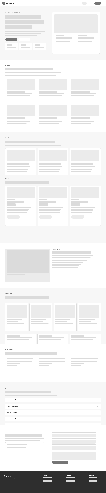

  <b>Landing Page Wireframe - Mobile</b>

  

#### **3.1.3.2. Landing Page Mockup**

  Los mockups muestran la versión de alta fidelidad de la Landing Page, incorporando la identidad visual de SafeLab sobre la estructura definida previamente en los wireframes. Se aplicaron los colores, tipografía, imágenes, tarjetas, botones y demás elementos visuales utilizados en la interfaz final.

  En Benefits se presentan las principales ventajas de SafeLab mediante tarjetas acompañadas de recursos visuales. Services muestra las soluciones orientadas a laboratorios clínicos, hospitales y farmacias clínicas, además de la plataforma de monitoreo. Plans presenta las alternativas Starter Lab, Professional y Enterprise. Las secciones posteriores complementan la presentación del producto mediante información sobre SafeLab, el equipo, testimonios, preguntas frecuentes y opciones de contacto.

  La versión mobile conserva el mismo contenido y jerarquía de la versión desktop, reorganizando las tarjetas y componentes en una sola columna para mantener la legibilidad y facilitar la interacción desde dispositivos móviles.

  <b>Landing Page Mockup - Desktop</b>

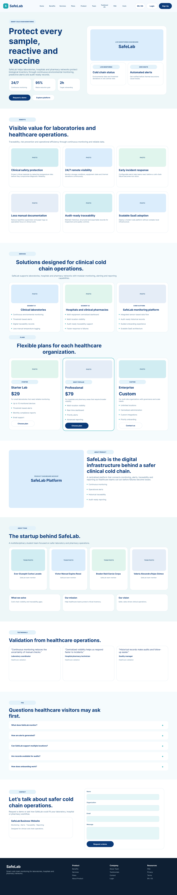

  <b>Landing Page Mockup - Mobile</b>

  

#### **3.1.4.2. Mobile Applications Wireflow Diagrams**

  Los wireflows muestran cómo cambian las pantallas a partir de las interacciones del usuario. Se elaboró un wireflow por cada user goal; en cada flecha se indica la acción que realiza el usuario para pasar a la siguiente pantalla.

  <b>User goal 1:</b> Como técnico de laboratorio, quiero iniciar sesión de forma rápida y segura para acceder al monitoreo del laboratorio. El usuario ingresa sus credenciales o utiliza su huella digital y, al autenticarse, llega directamente al dashboard.

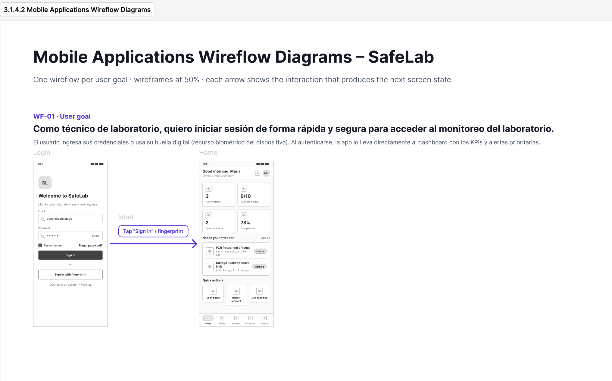

  <b>User goal 2:</b> Como técnico de laboratorio, quiero atender una alerta crítica y actuar sobre el equipo afectado para proteger las muestras. Desde la lista de alertas abre el detalle, compara el valor registrado con el rango permitido y pasa al control remoto, donde confirma el comando mediante un bottom sheet que muestra el resultado de la validación de seguridad.

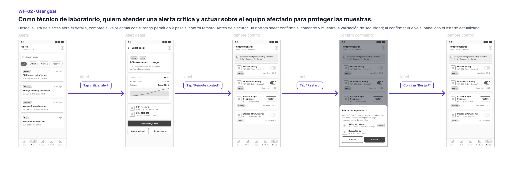

  <b>User goal 3:</b> Como técnico de laboratorio, quiero reportar un incidente con evidencia fotográfica para dejar trazabilidad de la desviación. Desde el detalle de la alerta crea el incidente, adjunta fotografías con la cámara y lo envía; el nuevo incidente aparece en la lista de incidentes abiertos.

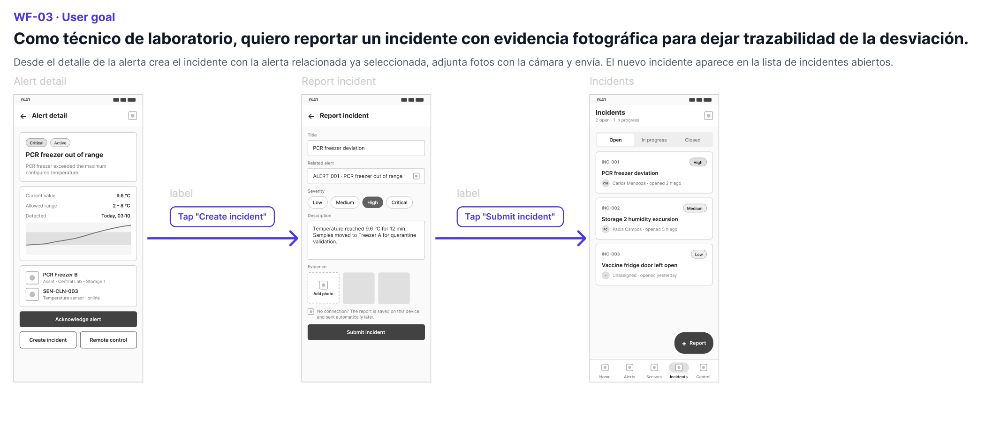

  <b>User goal 4:</b> Como técnico de laboratorio, quiero identificar un equipo escaneando su código QR para ver su estado sin buscarlo manualmente. Desde los accesos rápidos abre la cámara, el código se reconoce automáticamente y se muestra la ficha del equipo, desde donde accede a las lecturas de su sensor.

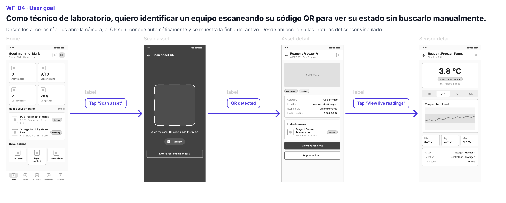

  <b>User goal 5:</b> Como jefa de laboratorio, quiero revisar las lecturas en tiempo real de un sensor para verificar que se mantiene dentro del rango permitido. Desde el dashboard abre las lecturas en vivo, filtra por tipo de sensor y entra al detalle, donde revisa la tendencia y las estadísticas del periodo.

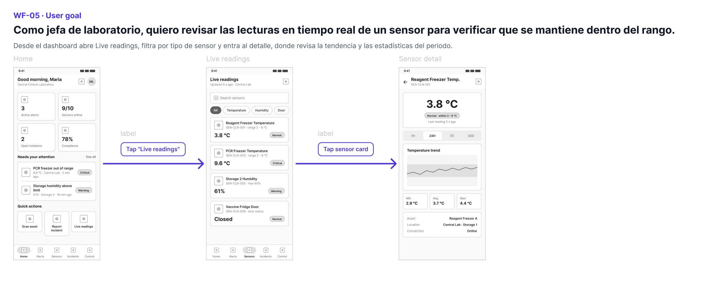

#### **3.1.4.3. Mobile Applications Mock-ups**

  Los mock-ups presentan el diseño en alta fidelidad de las pantallas, aplicando la guía de estilos de SafeLab: color primario #4F35E8, color de acento #14B8A6, fondos #F4F7FB y la tipografía Inter. Los estados de severidad (crítico, advertencia, normal e informativo) usan colores semánticos y siempre se acompañan de una etiqueta de texto, para no depender únicamente del color. Los textos de la interfaz están en inglés, idioma por defecto de la aplicación.

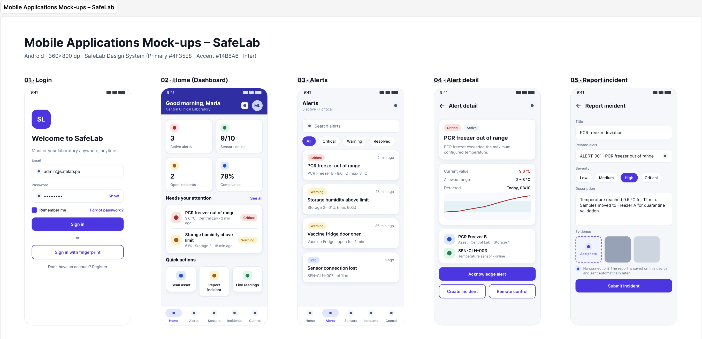

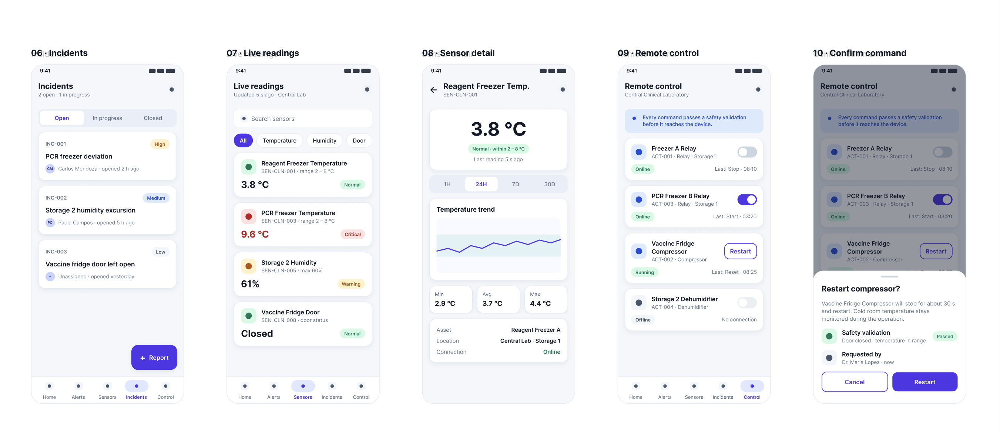

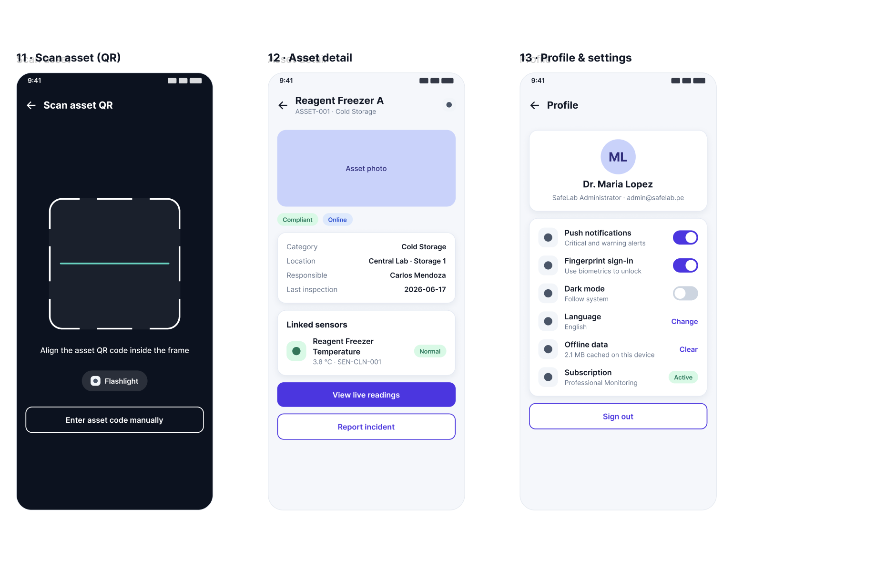

#### **3.1.4.4. Mobile Applications User Flow Diagrams**

  Los user flows representan el recorrido completo que sigue el usuario para cumplir cada user goal, utilizando los mock-ups. En cada diagrama se distingue el happy path (línea verde continua), en el que el usuario completa su objetivo sin inconvenientes, de los unhappy paths (línea roja discontinua), que muestran cómo responde la aplicación ante errores o situaciones alternativas. Los rombos representan los puntos de decisión.

  <b>User goal 1:</b> Como técnico de laboratorio, quiero iniciar sesión de forma rápida y segura para acceder al monitoreo del laboratorio. En el happy path, las credenciales son válidas y el usuario llega al dashboard. En el unhappy path, las credenciales son incorrectas: la aplicación muestra un mensaje de error junto al formulario, conserva el correo ingresado y el usuario vuelve a intentarlo.

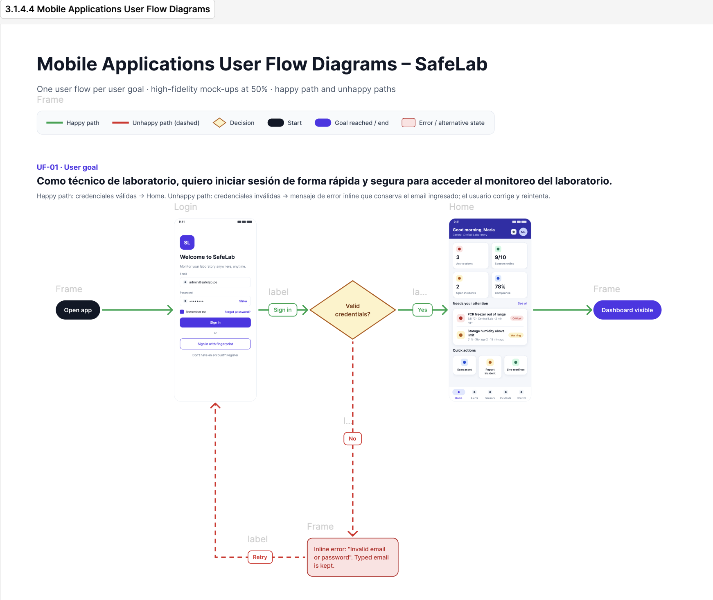

  <b>User goal 2:</b> Como técnico de laboratorio, quiero atender una alerta crítica y actuar sobre el equipo afectado para proteger las muestras. En el happy path, la validación de seguridad aprueba el comando y el estado del equipo se actualiza. En el unhappy path, el comando es bloqueado (por ejemplo, porque la puerta del equipo está abierta); la aplicación muestra el motivo y el usuario registra un incidente.

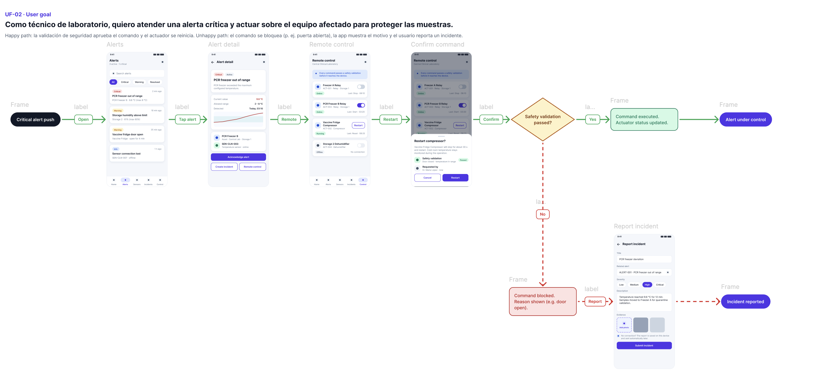

  <b>User goal 3:</b> Como técnico de laboratorio, quiero reportar un incidente con evidencia fotográfica para dejar trazabilidad de la desviación. En el happy path, el formulario está completo, el dispositivo tiene conexión y el incidente queda registrado. Se contemplan dos unhappy paths: si faltan campos obligatorios, se muestran errores de validación junto a cada campo; si no hay conexión, el reporte se guarda en el dispositivo y se envía automáticamente al recuperarla.

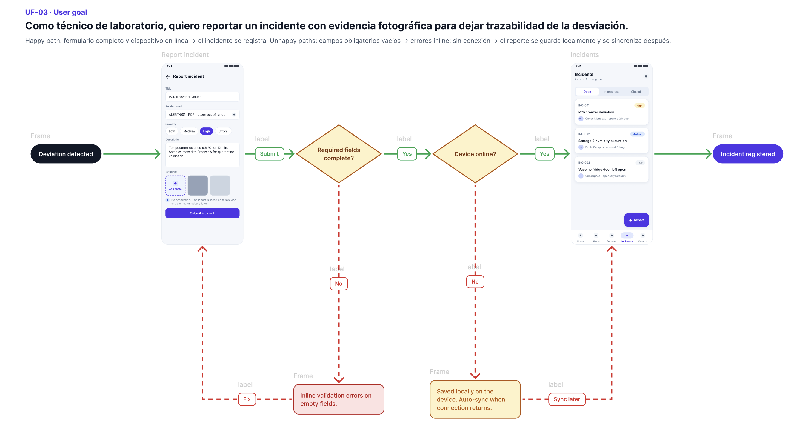

  <b>User goal 4:</b> Como técnico de laboratorio, quiero identificar un equipo escaneando su código QR para ver su estado sin buscarlo manualmente. En el happy path, el código se reconoce y se abre la ficha del equipo. En el unhappy path, el código no es legible y el usuario ingresa manualmente el código del equipo para llegar a la misma ficha.

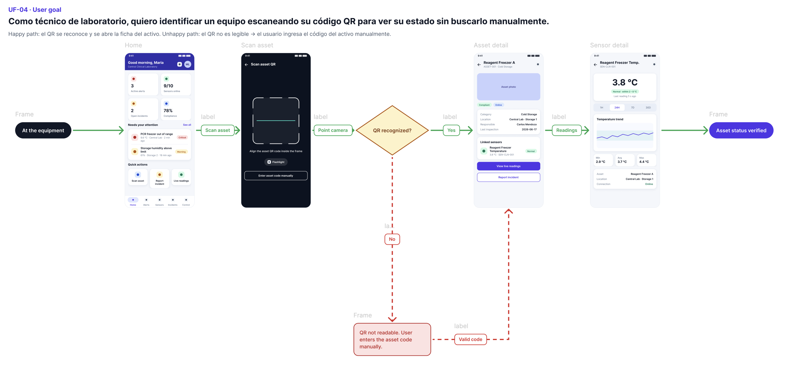

  <b>User goal 5:</b> Como jefa de laboratorio, quiero revisar las lecturas en tiempo real de un sensor para verificar que se mantiene dentro del rango permitido. En el happy path, el valor se encuentra dentro del rango y el monitoreo continúa. En el unhappy path, el valor está fuera del rango y la aplicación lleva al detalle de la alerta generada, desde donde continúa el flujo del user goal 2.

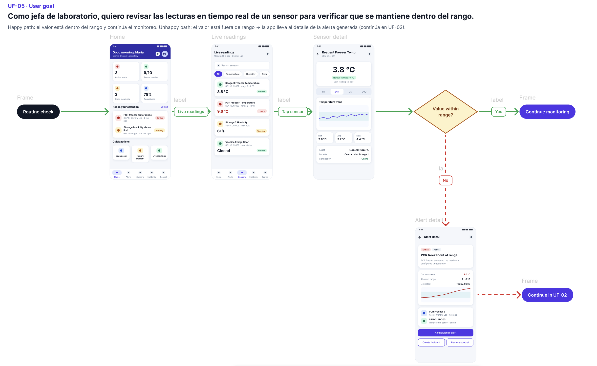

#### **3.1.4.5. Mobile Applications Prototyping**
