# **Chapter IV: Product Implementation & Validation**

<p style="text-align: justify;">
  El presente capítulo documenta la implementación y validación del primer incremento funcional de SafeLab correspondiente a la TB1. Durante esta etapa se trabajó de manera paralela sobre cuatro artefactos principales: el reporte académico (<code>safelab-report</code>), la Landing Page (<code>safelab-business-website</code>), la aplicación móvil nativa para Android (<code>safelab-mobile-app</code>) y los servicios RESTful del backend (<code>safelab-platform-api</code>). La implementación se organizó a partir de los Bounded Contexts definidos durante el diseño de la solución y se controló mediante repositorios Git independientes, ramas de integración y ramas <code>feature/*</code> por responsabilidad.
</p>

<p style="text-align: justify;">
  Para la TB1, la aplicación móvil se desarrolló como un frontend funcional con navegación, componentes reutilizables y datos locales de prueba, mientras que el backend se mantuvo como un producto separado, preparado y validado para una integración posterior. Esta separación permitió avanzar de forma paralela en la experiencia móvil, la Landing Page y los Web Services sin generar dependencia directa entre los entregables durante el Sprint 1.
</p>

## **4.1. Software Configuration Management**

<p style="text-align: justify;">
  La gestión de configuración de SafeLab se estableció con el objetivo de mantener trazabilidad entre los artefactos académicos, el código fuente, los entornos de desarrollo y las versiones liberadas. El equipo utilizó Git y GitHub como mecanismos centrales de control de versiones, aplicando una estrategia basada en <code>main</code>, <code>develop</code> y ramas <code>feature/*</code>. De esta manera, cada integrante pudo trabajar de forma aislada sobre su responsabilidad y posteriormente integrar sus cambios de manera controlada.
</p>

### **4.1.1. Software Development Environment Configuration**

<p style="text-align: justify;">
  El entorno de desarrollo se configuró de acuerdo con la naturaleza de cada producto de SafeLab. La aplicación móvil se implementó de manera nativa para Android; la Landing Page se construyó con tecnologías web estándar; el backend se mantuvo como una API independiente basada en Java y Spring Boot; y el reporte se desarrolló en Markdown para facilitar el control de versiones y la exportación posterior a PDF. La siguiente tabla resume los principales entornos y herramientas utilizados durante la TB1.
</p>

<table border="1" style="width: 100%; border-collapse: collapse; table-layout: fixed;">
  <thead>
    <tr>
      <th style="text-align: center; vertical-align: middle; padding: 6px;">Producto / Artefacto</th>
      <th style="text-align: center; vertical-align: middle; padding: 6px;">Entorno principal</th>
      <th style="text-align: center; vertical-align: middle; padding: 6px;">Tecnologías y herramientas</th>
      <th style="text-align: center; vertical-align: middle; padding: 6px;">Uso durante TB1</th>
    </tr>
  </thead>
  <tbody>
    <tr>
      <td style="text-align: left; vertical-align: top; padding: 6px;"><code>safelab-mobile-app</code></td>
      <td style="text-align: left; vertical-align: top; padding: 6px;">Android Studio</td>
      <td style="text-align: left; vertical-align: top; padding: 6px;">Kotlin, Jetpack Compose, Material 3, Gradle y Android Emulator</td>
      <td style="text-align: justify; vertical-align: top; padding: 6px;">Implementación de la navegación compartida, sidebar, topbar y pantallas de los Bounded Contexts con datos mock/locales.</td>
    </tr>
    <tr>
      <td style="text-align: left; vertical-align: top; padding: 6px;"><code>safelab-business-website</code></td>
      <td style="text-align: left; vertical-align: top; padding: 6px;">Visual Studio Code</td>
      <td style="text-align: left; vertical-align: top; padding: 6px;">HTML5, CSS3, JavaScript, JSON e internacionalización EN/ES</td>
      <td style="text-align: justify; vertical-align: top; padding: 6px;">Desarrollo de la Landing Page responsive, navegación, secciones informativas, internacionalización, modo claro/oscuro y mejoras de accesibilidad.</td>
    </tr>
    <tr>
      <td style="text-align: left; vertical-align: top; padding: 6px;"><code>safelab-platform-api</code></td>
      <td style="text-align: left; vertical-align: top; padding: 6px;">Entorno Java compatible con Maven</td>
      <td style="text-align: left; vertical-align: top; padding: 6px;">Java 21, Spring Boot 3.4, Maven, JPA, H2/PostgreSQL y Swagger/OpenAPI</td>
      <td style="text-align: justify; vertical-align: top; padding: 6px;">Adaptación y validación de servicios RESTful que serán consumidos por la aplicación móvil en una etapa posterior.</td>
    </tr>
    <tr>
      <td style="text-align: left; vertical-align: top; padding: 6px;"><code>safelab-report</code></td>
      <td style="text-align: left; vertical-align: top; padding: 6px;">Visual Studio Code</td>
      <td style="text-align: left; vertical-align: top; padding: 6px;">Markdown, HTML embebido, Git y extensión Markdown PDF</td>
      <td style="text-align: justify; vertical-align: top; padding: 6px;">Documentación de artefactos, evidencias, resultados del Sprint y preparación de la versión exportable a PDF.</td>
    </tr>
  </tbody>
</table>

<p style="text-align: justify;">
  Para la aplicación móvil se verificó la ejecución desde Android Studio utilizando un emulador Android. La estructura del proyecto se organizó por Bounded Context y, dentro de cada uno, por las capas <code>data</code>, <code>domain</code> y <code>presentation</code>. Esta organización facilita que cada módulo pueda evolucionar de forma independiente y que, posteriormente, los repositorios locales de datos sean sustituidos por implementaciones que consuman la API.
</p>

<p align="center">
  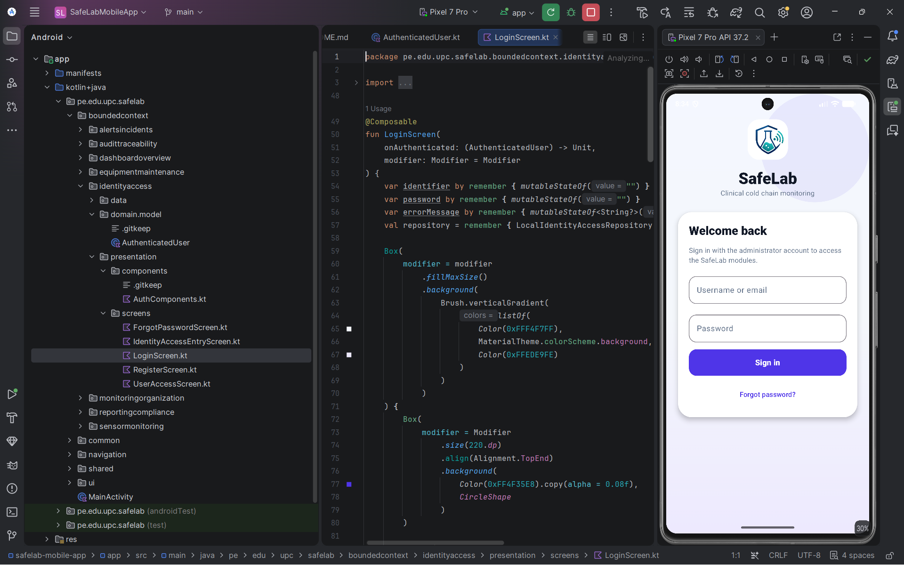
</p>

<p align="center"><i>Figura: Entorno de desarrollo de SafeLab Mobile App en Android Studio.</i></p>

<p style="text-align: justify;">
  Para la Landing Page se utilizó Visual Studio Code junto con un servidor local de desarrollo para verificar estilos, navegación, internacionalización y responsive design antes de integrar los cambios en <code>develop</code>. En el caso del backend, la validación local se realiza ejecutando Spring Boot mediante Maven, exponiendo la API en el puerto 8080 y verificando sus contratos mediante Swagger UI y las pruebas automatizadas.
</p>

<p align="center">
  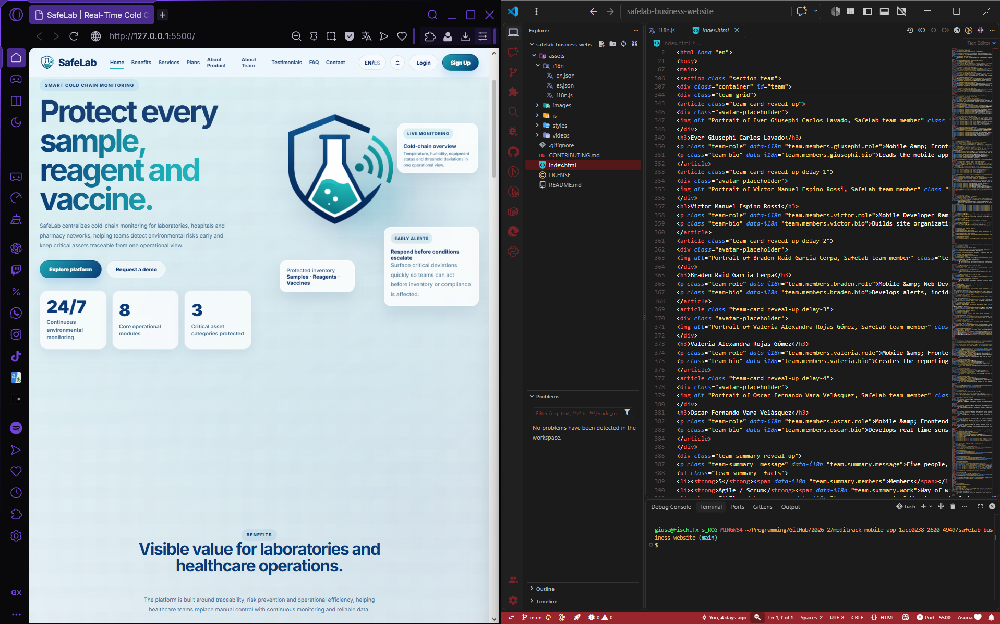
</p>

<p align="center"><i>Figura: Entorno de desarrollo de la Landing Page de SafeLab.</i></p>

### **4.1.2. Source Code Management**

<p style="text-align: justify;">
  El código fuente del proyecto se administró mediante GitHub dentro de la organización del equipo. Cada producto se mantuvo en un repositorio independiente con el fin de separar responsabilidades, facilitar el versionado y conservar un historial claro de cambios. La rama <code>main</code> representa la versión estable, mientras que <code>develop</code> funciona como rama de integración. Las funcionalidades se desarrollan en ramas <code>feature/*</code> creadas a partir de <code>develop</code> y se integran nuevamente mediante merge commits.
</p>

<table border="1" style="width: 100%; border-collapse: collapse; table-layout: fixed;">
  <thead>
    <tr>
      <th style="text-align: center; vertical-align: middle; padding: 6px;">Repositorio</th>
      <th style="text-align: center; vertical-align: middle; padding: 6px;">Propósito</th>
      <th style="text-align: center; vertical-align: middle; padding: 6px;">Ramas principales</th>
      <th style="text-align: center; vertical-align: middle; padding: 6px;">Estrategia de integración</th>
    </tr>
  </thead>
  <tbody>
    <tr>
      <td style="text-align: left; vertical-align: top; padding: 6px;"><code>safelab-report</code></td>
      <td style="text-align: justify; vertical-align: top; padding: 6px;">Documentación académica del proyecto y evidencias de los entregables.</td>
      <td style="text-align: left; vertical-align: top; padding: 6px;"><code>main</code>, <code>develop</code> y ramas de documentación.</td>
      <td style="text-align: justify; vertical-align: top; padding: 6px;">Integración por capítulos y artefactos, seguida de revisión del documento consolidado.</td>
    </tr>
    <tr>
      <td style="text-align: left; vertical-align: top; padding: 6px;"><code>safelab-business-website</code></td>
      <td style="text-align: justify; vertical-align: top; padding: 6px;">Landing Page pública de SafeLab.</td>
      <td style="text-align: left; vertical-align: top; padding: 6px;"><code>main</code>, <code>develop</code>, <code>feature/tb1-front-section</code>, <code>feature/tb1-core-content</code>, <code>feature/tb1-product-team</code>, <code>feature/tb1-engagement-section</code>, <code>feature/tb1-i18n</code> y <code>feature/tb1-site-quality</code>.</td>
      <td style="text-align: justify; vertical-align: top; padding: 6px;">Integración progresiva en <code>develop</code>; resolución de conflictos sobre archivos compartidos y consolidación final antes de pasar a <code>main</code>.</td>
    </tr>
    <tr>
      <td style="text-align: left; vertical-align: top; padding: 6px;"><code>safelab-mobile-app</code></td>
      <td style="text-align: justify; vertical-align: top; padding: 6px;">Aplicación móvil nativa para Android.</td>
      <td style="text-align: left; vertical-align: top; padding: 6px;"><code>main</code>, <code>develop</code> y una rama <code>feature/tb1-bc-*</code> por Bounded Context.</td>
      <td style="text-align: justify; vertical-align: top; padding: 6px;">Cada Bounded Context se implementó de forma aislada; los cambios compartidos de navegación se validaron al integrarse en <code>develop</code>.</td>
    </tr>
    <tr>
      <td style="text-align: left; vertical-align: top; padding: 6px;"><code>safelab-platform-api</code></td>
      <td style="text-align: justify; vertical-align: top; padding: 6px;">Backend RESTful y persistencia de la plataforma.</td>
      <td style="text-align: left; vertical-align: top; padding: 6px;"><code>main</code>, ramas de desarrollo y pruebas.</td>
      <td style="text-align: justify; vertical-align: top; padding: 6px;">Adaptación de endpoints existentes y validación mediante pruebas automatizadas antes de su futura integración con Android.</td>
    </tr>
  </tbody>
</table>

<p style="text-align: justify;">
  En la aplicación móvil se utilizaron las ramas <code>feature/tb1-bc-identity-access</code>, <code>feature/tb1-bc-dashboard-overview</code>, <code>feature/tb1-bc-monitoring-organization</code>, <code>feature/tb1-bc-sensor-monitoring</code>, <code>feature/tb1-bc-alerts-incidents</code>, <code>feature/tb1-bc-equipment-maintenance</code>, <code>feature/tb1-bc-reporting-compliance</code> y <code>feature/tb1-bc-audit-traceability</code>. Este esquema redujo el acoplamiento entre integrantes, ya que la mayoría de los cambios permanecieron dentro de la carpeta correspondiente a cada Bounded Context.
</p>

<p style="text-align: justify;">
  Para conservar la trazabilidad de las integraciones se utilizaron merge commits explícitos mediante <code>git merge --no-ff</code>. Cuando aparecieron conflictos, principalmente en archivos compartidos de la Landing Page como <code>index.html</code>, <code>styles.css</code> y <code>script.js</code>, estos se resolvieron desde el Merge Editor de Visual Studio Code y se validó posteriormente la versión consolidada en <code>develop</code>. Una vez estable, el incremento se integró a <code>main</code> y se identificó mediante un tag de versión TB1.
</p>

<p align="center">
  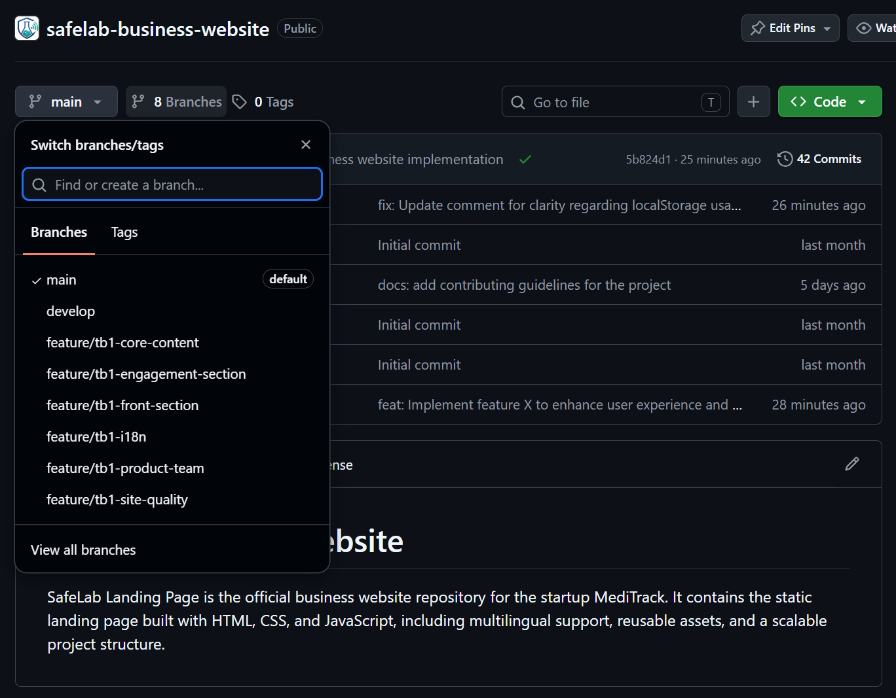
</p>

<p align="center"><i>Figura: Estrategia de ramas utilizada para la implementación de TB1.</i></p>

<p align="center">
  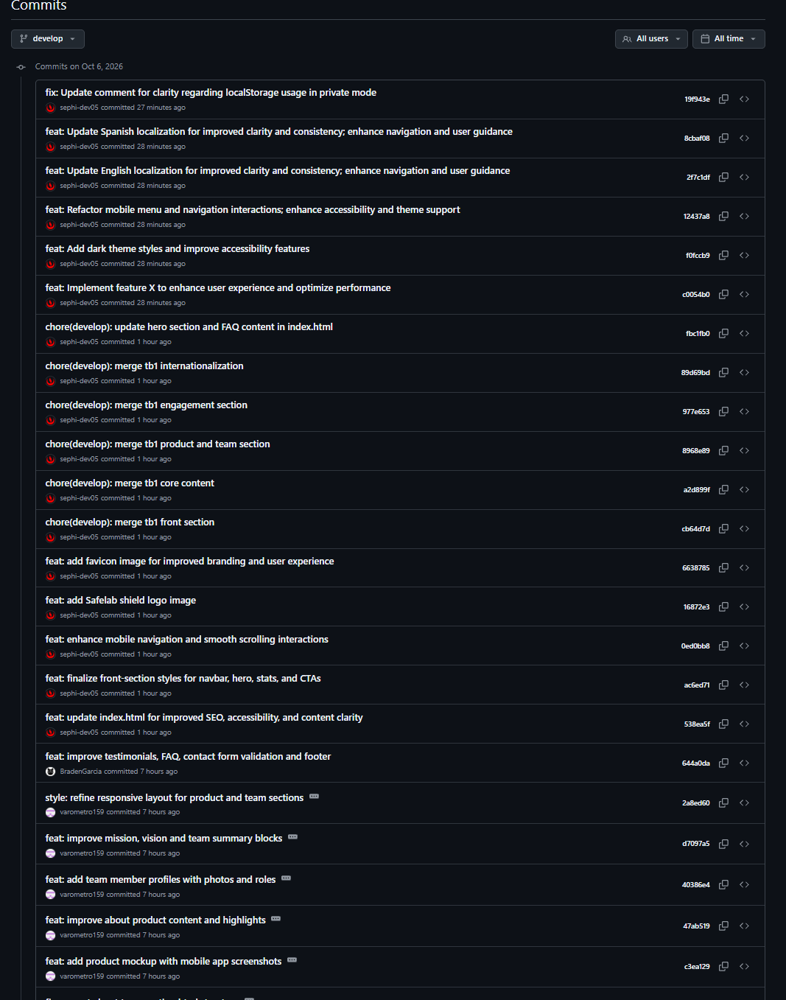
</p>

<p align="center"><i>Figura: Evidencia de integración y trazabilidad del código fuente.</i></p>

### **4.1.3. Source Code Style Guide & Conventions**

<p style="text-align: justify;">
  El equipo adoptó convenciones comunes para reducir inconsistencias entre repositorios y facilitar la revisión de código. Las reglas se aplicaron a nombres de ramas, mensajes de commit, estructura de archivos, nomenclatura de clases y componentes, así como a la documentación en Markdown.
</p>

<table border="1" style="width: 100%; border-collapse: collapse; table-layout: fixed;">
  <thead>
    <tr>
      <th style="text-align: center; vertical-align: middle; padding: 6px;">Ámbito</th>
      <th style="text-align: center; vertical-align: middle; padding: 6px;">Convención aplicada</th>
      <th style="text-align: center; vertical-align: middle; padding: 6px;">Ejemplo</th>
    </tr>
  </thead>
  <tbody>
    <tr>
      <td style="text-align: left; vertical-align: top; padding: 6px;">Ramas Git</td>
      <td style="text-align: justify; vertical-align: top; padding: 6px;">Nombres en minúsculas, separados por guiones y asociados al entregable o Bounded Context.</td>
      <td style="text-align: left; vertical-align: top; padding: 6px;"><code>feature/tb1-bc-dashboard-overview</code></td>
    </tr>
    <tr>
      <td style="text-align: left; vertical-align: top; padding: 6px;">Conventional Commits</td>
      <td style="text-align: justify; vertical-align: top; padding: 6px;">Uso de <code>feat</code>, <code>fix</code>, <code>docs</code>, <code>refactor</code>, <code>chore</code>, <code>style</code> y <code>test</code>, incluyendo scope cuando aporta contexto.</td>
      <td style="text-align: left; vertical-align: top; padding: 6px;"><code>feat(dashboard): implement operational dashboard screen</code></td>
    </tr>
    <tr>
      <td style="text-align: left; vertical-align: top; padding: 6px;">Kotlin / Compose</td>
      <td style="text-align: justify; vertical-align: top; padding: 6px;">Clases y Composables en PascalCase; funciones y variables en camelCase; paquetes en minúsculas; separación por <code>data</code>, <code>domain</code> y <code>presentation</code>.</td>
      <td style="text-align: left; vertical-align: top; padding: 6px;"><code>DashboardScreen.kt</code>, <code>MonitoringTrendsScreen.kt</code></td>
    </tr>
    <tr>
      <td style="text-align: left; vertical-align: top; padding: 6px;">HTML / CSS / JavaScript</td>
      <td style="text-align: justify; vertical-align: top; padding: 6px;">HTML semántico; clases CSS en kebab-case; variables y funciones JavaScript en camelCase; recursos organizados dentro de <code>assets/</code>.</td>
      <td style="text-align: left; vertical-align: top; padding: 6px;"><code>hero-stat</code>, <code>mobileMenu</code>, <code>assets/styles/styles.css</code></td>
    </tr>
    <tr>
      <td style="text-align: left; vertical-align: top; padding: 6px;">Java / Spring Boot</td>
      <td style="text-align: justify; vertical-align: top; padding: 6px;">Paquetes en minúsculas; clases en PascalCase; separación de responsabilidades entre controladores, servicios, persistencia y pruebas.</td>
      <td style="text-align: left; vertical-align: top; padding: 6px;"><code>SensorMonitoringController</code>, <code>BusinessEventService</code></td>
    </tr>
    <tr>
      <td style="text-align: left; vertical-align: top; padding: 6px;">Markdown del reporte</td>
      <td style="text-align: justify; vertical-align: top; padding: 6px;">Jerarquía consistente de encabezados, párrafos justificados mediante HTML, tablas con estilos embebidos y rutas relativas para imágenes.</td>
      <td style="text-align: left; vertical-align: top; padding: 6px;"><code>../assets/09-chapter-4/...</code></td>
    </tr>
  </tbody>
</table>

<p style="text-align: justify;">
  Para las evidencias gráficas del reporte se definió además que todas las imágenes deben incorporar un texto alternativo descriptivo mediante el atributo <code>alt</code>. El texto alternativo identifica el contenido visible de la captura y evita utilizar nombres genéricos como “imagen” o “captura”. Esta convención mantiene la documentación más clara y mejora la accesibilidad del contenido exportado.
</p>

<p style="text-align: justify;">
  Los merges entre ramas se registran como cambios de integración utilizando el tipo <code>chore</code>, mientras que las funcionalidades nuevas utilizan <code>feat</code> y las correcciones posteriores a una integración utilizan <code>fix</code>. Esta diferenciación permite interpretar el historial de cada repositorio sin necesidad de revisar individualmente todos los archivos modificados.
</p>

### **4.1.4. Software Deployment Configuration**

<p style="text-align: justify;">
  La configuración de despliegue se definió de forma independiente para cada producto. La Landing Page se publica como un sitio web estático; el backend puede ejecutarse localmente o desplegarse como un servicio web; y la aplicación móvil se ejecuta durante TB1 desde Android Studio en emuladores o dispositivos de prueba. En este incremento la aplicación móvil utiliza datos estáticos/mock y no mantiene todavía una conexión runtime con SafeLab Platform API.
</p>

<table border="1" style="width: 100%; border-collapse: collapse; table-layout: fixed;">
  <thead>
    <tr>
      <th style="text-align: center; vertical-align: middle; padding: 6px;">Producto</th>
      <th style="text-align: center; vertical-align: middle; padding: 6px;">Entorno / Plataforma</th>
      <th style="text-align: center; vertical-align: middle; padding: 6px;">Configuración TB1</th>
      <th style="text-align: center; vertical-align: middle; padding: 6px;">Estado de integración</th>
    </tr>
  </thead>
  <tbody>
    <tr>
      <td style="text-align: left; vertical-align: top; padding: 6px;">Landing Page</td>
      <td style="text-align: left; vertical-align: top; padding: 6px;">GitHub Pages</td>
      <td style="text-align: justify; vertical-align: top; padding: 6px;">Publicación desde la rama <code>main</code> y carpeta raíz del repositorio <code>safelab-business-website</code>.</td>
      <td style="text-align: justify; vertical-align: top; padding: 6px;">Versión integrada y preparada para acceso público.</td>
    </tr>
    <tr>
      <td style="text-align: left; vertical-align: top; padding: 6px;">SafeLab Mobile App</td>
      <td style="text-align: left; vertical-align: top; padding: 6px;">Android Studio / Android Emulator</td>
      <td style="text-align: justify; vertical-align: top; padding: 6px;">Compilación Gradle y ejecución local del APK de desarrollo sobre emulador o dispositivo Android.</td>
      <td style="text-align: justify; vertical-align: top; padding: 6px;">Frontend funcional con navegación y datos mock; sin consumo real del backend durante TB1.</td>
    </tr>
    <tr>
      <td style="text-align: left; vertical-align: top; padding: 6px;">SafeLab Platform API</td>
      <td style="text-align: left; vertical-align: top; padding: 6px;">Local / Render</td>
      <td style="text-align: justify; vertical-align: top; padding: 6px;">Ejecución local mediante Maven en <code>localhost:8080</code> y configuración de despliegue con Docker, PostgreSQL y variables de entorno.</td>
      <td style="text-align: justify; vertical-align: top; padding: 6px;">Backend validado como entregable independiente y preparado para futura integración con el cliente Android.</td>
    </tr>
  </tbody>
</table>

<p style="text-align: justify;">
  Para el desarrollo local del backend se utiliza la ruta base <code>http://localhost:8080/api/v1</code>. Cuando la aplicación móvil se conecte al servicio en una etapa posterior, el cliente Android deberá utilizar una URL accesible desde el dispositivo o emulador; por ejemplo, el emulador estándar de Android puede acceder al host de desarrollo mediante <code>10.0.2.2</code>. En producción, la aplicación utilizará la URL HTTPS pública del backend. La URL del servicio deberá mantenerse centralizada en la configuración del cliente para evitar cambios distribuidos en las pantallas o repositorios.
</p>

<p style="text-align: justify;">
  En el backend, la configuración de producción se desacopla del código fuente mediante variables de entorno, entre ellas el perfil activo de Spring, la URL de la base de datos, los orígenes permitidos y la configuración de los datos semilla. Esto permite conservar el mismo código entre desarrollo local y despliegue, modificando únicamente los parámetros del entorno.
</p>

<p align="center">
  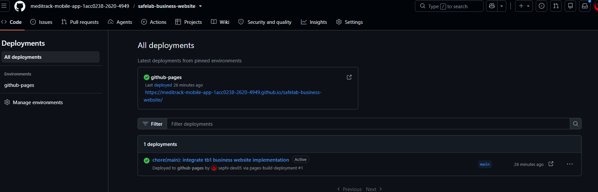
</p>

<p align="center"><i>Figura: Configuración de despliegue de los productos digitales de SafeLab.</i></p>

## **4.2. Landing Page & Mobile Application Implementation**

<p style="text-align: justify;">
  La implementación del Sprint 1 se desarrolló en paralelo sobre la Landing Page y la aplicación móvil. La Landing Page tiene como propósito presentar públicamente la propuesta de valor de SafeLab, comunicar sus beneficios, servicios y planes, mostrar información del producto y del equipo, y proporcionar mecanismos de interacción como testimonios, preguntas frecuentes, contacto e internacionalización EN/ES. Para organizar el trabajo se utilizaron ramas <code>feature/tb1-*</code> independientes y una etapa final de revisión transversal de calidad.
</p>

<p style="text-align: justify;">
  La aplicación móvil se implementó con Kotlin y Jetpack Compose siguiendo la separación por Bounded Contexts definida en la arquitectura del proyecto. En <code>develop</code> se prepararon los elementos compartidos, entre ellos la navegación general, la sidebar, la topbar y el tema visual. Posteriormente, cada Bounded Context se desarrolló en su propia rama y se integró en <code>develop</code>. Identity &amp; Access Management se utiliza como flujo de entrada mediante un usuario administrador local para la demostración de TB1 y no se expone como opción dentro de la sidebar.
</p>

<p style="text-align: justify;">
  Durante esta etapa, la aplicación móvil utiliza datos locales y repositorios en memoria con el fin de validar pantallas, flujos y consistencia visual sin depender todavía del backend. SafeLab Platform API se trabaja como un entregable técnico separado: sus endpoints y pruebas se preparan para que, en una etapa posterior, los datos mock del cliente Android puedan ser reemplazados por consumo de servicios RESTful sin rediseñar la interfaz ni la estructura de los Bounded Contexts.
</p>

### **4.2.1. Sprint 1**

#### **4.2.1.1. Sprint Planning 1**

<p style="text-align: justify;">
  En esta sección se presentan los principales aspectos definidos durante el Sprint Planning Meeting del Sprint 1 de SafeLab. La planificación establece el objetivo del Sprint, la capacidad del equipo y el alcance funcional seleccionado, priorizando las funcionalidades principales de organización y monitoreo ambiental, junto con la primera versión de la Landing Page.
</p>

<table border="1" style="width: 100%; border-collapse: collapse;">
  <tr>
    <th style="text-align: left; vertical-align: middle; padding: 6px; width: 35%;">Sprint #</th>
    <td style="text-align: left; vertical-align: middle; padding: 6px;">1</td>
  </tr>
  <tr>
    <th colspan="2" style="text-align: center; vertical-align: middle; padding: 6px;">Sprint Planning Background</th>
  </tr>
  <tr>
    <td style="text-align: left; vertical-align: middle; padding: 6px;"><b>Date</b></td>
    <td style="text-align: left; vertical-align: middle; padding: 6px;">2026-09-25</td>
  </tr>
  <tr>
    <td style="text-align: left; vertical-align: middle; padding: 6px;"><b>Time</b></td>
    <td style="text-align: left; vertical-align: middle; padding: 6px;">10:00 AM</td>
  </tr>
  <tr>
    <td style="text-align: left; vertical-align: middle; padding: 6px;"><b>Location</b></td>
    <td style="text-align: left; vertical-align: middle; padding: 6px;">UPC San Isidro</td>
  </tr>
  <tr>
    <td style="text-align: left; vertical-align: middle; padding: 6px;"><b>Prepared By</b></td>
    <td style="text-align: left; vertical-align: middle; padding: 6px;">Valeria Rojas</td>
  </tr>
  <tr>
    <td style="text-align: left; vertical-align: top; padding: 6px;"><b>Attendees (to planning meeting)</b></td>
    <td style="text-align: left; vertical-align: top; padding: 6px;">Braden Garcia / Victor Espino / Giusephi Carlos / Oscar Vara / Valeria Rojas</td>
  </tr>
  <tr>
    <td style="text-align: left; vertical-align: top; padding: 6px;"><b>Sprint 1 Review Summary</b></td>
    <td style="text-align: justify; vertical-align: top; padding: 6px;">The Sprint focused on organizing the SafeLab project, refining the requirements and Product Backlog, and preparing the Landing Page and the initial monitoring features required for the first product increment.</td>
  </tr>
  <tr>
    <td style="text-align: left; vertical-align: top; padding: 6px;"><b>Sprint 1 Retrospective Summary</b></td>
    <td style="text-align: justify; vertical-align: top; padding: 6px;">The team identified progress in the organization of requirements and project documentation, as well as opportunities to improve task coordination, distribution of responsibilities and consistency between the Product Backlog, Sprint Planning and implementation activities.</td>
  </tr>
  <tr>
    <th colspan="2" style="text-align: center; vertical-align: middle; padding: 6px;">Sprint Goal & User Stories</th>
  </tr>
  <tr>
    <td style="text-align: left; vertical-align: top; padding: 6px;"><b>Sprint 1 Goal</b></td>
    <td style="text-align: justify; vertical-align: top; padding: 6px;">
      Our focus is on enabling the initial monitoring flow of SafeLab by organizing monitoring sites, storage areas and equipment, collecting and consulting essential environmental information, and making the product information available through the Landing Page.<br><br>
      We believe it delivers greater visibility and initial control of monitored environments to hospital laboratory and pharmaceutical company personnel, while allowing potential users to understand the SafeLab solution.<br><br>
      This will be confirmed when users can register a monitoring site, create a storage area, register and assign equipment, automatically collect monitoring data, consult temperature, humidity and equipment operational status, identify equipment without recent data, and visitors can access the SafeLab Landing Page, its supported languages and Terms and Conditions.
    </td>
  </tr>
  <tr>
    <td style="text-align: left; vertical-align: middle; padding: 6px;"><b>Sprint 1 Velocity</b></td>
    <td style="text-align: left; vertical-align: middle; padding: 6px;">60 Story Points</td>
  </tr>
  <tr>
    <td style="text-align: left; vertical-align: middle; padding: 6px;"><b>Sum of Story Points</b></td>
    <td style="text-align: left; vertical-align: middle; padding: 6px;">57 Story Points</td>
  </tr>
</table>

#### **4.2.1.2. Aspect Leaders and Collaborators**

<p style="text-align: justify;">
  En el Sprint 1 se definieron tres aspectos de trabajo, que corresponden al alcance funcional del Sprint Backlog 1. El aspecto <b>Organización del monitoreo</b> agrupa el registro de sitios de monitoreo, áreas de almacenamiento y equipos, así como sus servicios RESTful (US01, US03, US05, US07 y US60). El aspecto <b>Monitoreo ambiental</b> agrupa la recolección automática de datos, la consulta de temperatura, humedad y estado operativo, y sus servicios (US09, US10, US11, US13, US15, US16 y US61). El aspecto <b>Landing Page</b> agrupa la presentación pública de SafeLab, el cambio de idioma y el acceso a los Términos y Condiciones (US56, US57 y US58).
</p>
<p style="text-align: justify;">
  Para cada aspecto se designó como líder (L) al integrante con mayor carga de horas asignadas en el Sprint Backlog 1, quien coordina el avance, define los criterios de terminado y verifica la integración del aspecto; los demás integrantes con tareas en el aspecto participan como colaboradores (C). La siguiente Leadership-and-Collaboration Matrix (LACX) resume esta distribución.
</p>
<table border="1" style="width: 100%; border-collapse: collapse;">
  <thead>
    <tr>
      <th style="text-align: center; vertical-align: middle; padding: 6px;">Team Member (Last Name, First Name)</th>
      <th style="text-align: center; vertical-align: middle; padding: 6px;">GitHub Username</th>
      <th style="text-align: center; vertical-align: middle; padding: 6px;">Organización del monitoreo</th>
      <th style="text-align: center; vertical-align: middle; padding: 6px;">Monitoreo ambiental</th>
      <th style="text-align: center; vertical-align: middle; padding: 6px;">Landing Page</th>
    </tr>
  </thead>
  <tbody>
    <tr>
      <td style="text-align: left; vertical-align: top; padding: 6px;">Carlos Lavado, Ever Giusephi</td>
      <td style="text-align: center; vertical-align: middle; padding: 6px;">sephi-dev05</td>
      <td style="text-align: center; vertical-align: middle; padding: 6px;">L</td>
      <td style="text-align: center; vertical-align: middle; padding: 6px;">C</td>
      <td style="text-align: center; vertical-align: middle; padding: 6px;">—</td>
    </tr>
    <tr>
      <td style="text-align: left; vertical-align: top; padding: 6px;">Espino Rossi, Victor Manuel</td>
      <td style="text-align: center; vertical-align: middle; padding: 6px;">Vmer140</td>
      <td style="text-align: center; vertical-align: middle; padding: 6px;">C</td>
      <td style="text-align: center; vertical-align: middle; padding: 6px;">C</td>
      <td style="text-align: center; vertical-align: middle; padding: 6px;">—</td>
    </tr>
    <tr>
      <td style="text-align: left; vertical-align: top; padding: 6px;">Garcia Cerpa, Braden Raid</td>
      <td style="text-align: center; vertical-align: middle; padding: 6px;">BradenGarcia</td>
      <td style="text-align: center; vertical-align: middle; padding: 6px;">—</td>
      <td style="text-align: center; vertical-align: middle; padding: 6px;">L</td>
      <td style="text-align: center; vertical-align: middle; padding: 6px;">—</td>
    </tr>
    <tr>
      <td style="text-align: left; vertical-align: top; padding: 6px;">Rojas Gomez, Valeria Alexandra</td>
      <td style="text-align: center; vertical-align: middle; padding: 6px;">ValeriaAler</td>
      <td style="text-align: center; vertical-align: middle; padding: 6px;">—</td>
      <td style="text-align: center; vertical-align: middle; padding: 6px;">C</td>
      <td style="text-align: center; vertical-align: middle; padding: 6px;">L</td>
    </tr>
    <tr>
      <td style="text-align: left; vertical-align: top; padding: 6px;">Vara Velásquez, Oscar Fernando</td>
      <td style="text-align: center; vertical-align: middle; padding: 6px;">varometro159</td>
      <td style="text-align: center; vertical-align: middle; padding: 6px;">C</td>
      <td style="text-align: center; vertical-align: middle; padding: 6px;">C</td>
      <td style="text-align: center; vertical-align: middle; padding: 6px;">C</td>
    </tr>
  </tbody>
</table>

#### **4.2.1.3. Sprint Backlog 1**

<p style="text-align: justify;">
  El Sprint Backlog 1 reúne las User Stories y Work-items definidos para alcanzar el objetivo del primer Sprint de SafeLab. El trabajo se enfoca en establecer la organización inicial del entorno de monitoreo, permitir la recolección y consulta de información ambiental y desarrollar las funcionalidades correspondientes a la Landing Page. Las actividades se distribuyen entre los integrantes del equipo Meditrack y se estiman en horas para facilitar el seguimiento de su avance durante el Sprint.
</p>

<table border="1" style="width: 100%; border-collapse: collapse;">
  <thead>
    <tr>
      <th colspan="8" style="text-align: left; vertical-align: middle; padding: 6px;">Sprint # &nbsp;&nbsp; Sprint 1</th>
    </tr>
    <tr>
      <th style="text-align: center; vertical-align: middle; padding: 6px;">User Story Id</th>
      <th style="text-align: center; vertical-align: middle; padding: 6px;">Title</th>
      <th style="text-align: center; vertical-align: middle; padding: 6px;">Work-Item / Task Id</th>
      <th style="text-align: center; vertical-align: middle; padding: 6px;">Title</th>
      <th style="text-align: center; vertical-align: middle; padding: 6px;">Description</th>
      <th style="text-align: center; vertical-align: middle; padding: 6px;">Estimation (Hours)</th>
      <th style="text-align: center; vertical-align: middle; padding: 6px;">Assigned To</th>
      <th style="text-align: center; vertical-align: middle; padding: 6px;">Status</th>
    </tr>
  </thead>
  <tbody>
    <tr><td style="text-align:center; padding:6px;">US01</td><td style="padding:6px;">Registrar sitio de monitoreo</td><td style="text-align:center; padding:6px;">UT01</td><td style="padding:6px;">Implementar registro de sitio</td><td style="padding:6px;">Implementar el registro de un sitio de monitoreo con nombre y ubicación.</td><td style="text-align:center; padding:6px;">3</td><td style="padding:6px;">Victor Espino</td><td style="text-align:center; padding:6px;">To-Do</td></tr>
    <tr><td style="text-align:center; padding:6px;">US01</td><td style="padding:6px;">Registrar sitio de monitoreo</td><td style="text-align:center; padding:6px;">UT02</td><td style="padding:6px;">Validar datos del sitio</td><td style="padding:6px;">Validar que el registro requiera nombre y ubicación antes de almacenar el sitio.</td><td style="text-align:center; padding:6px;">3</td><td style="padding:6px;">Victor Espino</td><td style="text-align:center; padding:6px;">To-Do</td></tr>
    <tr><td style="text-align:center; padding:6px;">US03</td><td style="padding:6px;">Crear área de almacenamiento</td><td style="text-align:center; padding:6px;">UT03</td><td style="padding:6px;">Implementar creación de área</td><td style="padding:6px;">Implementar la creación de áreas de almacenamiento con nombre y tipo.</td><td style="text-align:center; padding:6px;">3</td><td style="padding:6px;">Giusephi Carlos</td><td style="text-align:center; padding:6px;">To-Do</td></tr>
    <tr><td style="text-align:center; padding:6px;">US03</td><td style="padding:6px;">Crear área de almacenamiento</td><td style="text-align:center; padding:6px;">UT04</td><td style="padding:6px;">Validar datos del área</td><td style="padding:6px;">Validar que el área cuente con nombre y tipo antes de registrarse.</td><td style="text-align:center; padding:6px;">3</td><td style="padding:6px;">Giusephi Carlos</td><td style="text-align:center; padding:6px;">To-Do</td></tr>
    <tr><td style="text-align:center; padding:6px;">US05</td><td style="padding:6px;">Registrar equipo</td><td style="text-align:center; padding:6px;">UT05</td><td style="padding:6px;">Implementar registro de equipo</td><td style="padding:6px;">Implementar el registro de equipos con nombre, tipo e identificador.</td><td style="text-align:center; padding:6px;">4</td><td style="padding:6px;">Oscar Vara</td><td style="text-align:center; padding:6px;">To-Do</td></tr>
    <tr><td style="text-align:center; padding:6px;">US05</td><td style="padding:6px;">Registrar equipo</td><td style="text-align:center; padding:6px;">UT06</td><td style="padding:6px;">Validar información del equipo</td><td style="padding:6px;">Validar los datos requeridos del equipo antes de completar su registro.</td><td style="text-align:center; padding:6px;">4</td><td style="padding:6px;">Oscar Vara</td><td style="text-align:center; padding:6px;">To-Do</td></tr>
    <tr><td style="text-align:center; padding:6px;">US07</td><td style="padding:6px;">Asignar equipo a un área</td><td style="text-align:center; padding:6px;">UT07</td><td style="padding:6px;">Implementar asignación de equipo</td><td style="padding:6px;">Implementar la asociación de un equipo registrado con un área de almacenamiento registrada.</td><td style="text-align:center; padding:6px;">3</td><td style="padding:6px;">Victor Espino</td><td style="text-align:center; padding:6px;">To-Do</td></tr>
    <tr><td style="text-align:center; padding:6px;">US07</td><td style="padding:6px;">Asignar equipo a un área</td><td style="text-align:center; padding:6px;">UT08</td><td style="padding:6px;">Validar asociación equipo-área</td><td style="padding:6px;">Verificar que la asignación conserve correctamente la relación entre el equipo y el área seleccionada.</td><td style="text-align:center; padding:6px;">3</td><td style="padding:6px;">Victor Espino</td><td style="text-align:center; padding:6px;">To-Do</td></tr>
    <tr><td style="text-align:center; padding:6px;">US60</td><td style="padding:6px;">Proporcionar servicios de organización del monitoreo</td><td style="text-align:center; padding:6px;">UT09</td><td style="padding:6px;">Implementar servicios de organización</td><td style="padding:6px;">Implementar las operaciones RESTful requeridas para sitios, áreas de almacenamiento y equipos.</td><td style="text-align:center; padding:6px;">5</td><td style="padding:6px;">Giusephi Carlos</td><td style="text-align:center; padding:6px;">To-Do</td></tr>
    <tr><td style="text-align:center; padding:6px;">US60</td><td style="padding:6px;">Proporcionar servicios de organización del monitoreo</td><td style="text-align:center; padding:6px;">UT10</td><td style="padding:6px;">Validar respuestas de organización</td><td style="padding:6px;">Validar las respuestas de las operaciones de organización y el manejo de recursos no disponibles.</td><td style="text-align:center; padding:6px;">5</td><td style="padding:6px;">Giusephi Carlos</td><td style="text-align:center; padding:6px;">To-Do</td></tr>
    <tr><td style="text-align:center; padding:6px;">US16</td><td style="padding:6px;">Recolección automática de datos</td><td style="text-align:center; padding:6px;">UT11</td><td style="padding:6px;">Implementar recolección automática</td><td style="padding:6px;">Implementar el registro automático de nuevas lecturas de monitoreo recibidas por SafeLab.</td><td style="text-align:center; padding:6px;">5</td><td style="padding:6px;">Valeria Rojas</td><td style="text-align:center; padding:6px;">To-Do</td></tr>
    <tr><td style="text-align:center; padding:6px;">US16</td><td style="padding:6px;">Recolección automática de datos</td><td style="text-align:center; padding:6px;">UT12</td><td style="padding:6px;">Asociar lecturas con equipos</td><td style="padding:6px;">Verificar que cada lectura recolectada quede asociada al equipo de monitoreo correspondiente.</td><td style="text-align:center; padding:6px;">5</td><td style="padding:6px;">Valeria Rojas</td><td style="text-align:center; padding:6px;">To-Do</td></tr>
    <tr><td style="text-align:center; padding:6px;">US61</td><td style="padding:6px;">Proporcionar servicios de monitoreo ambiental</td><td style="text-align:center; padding:6px;">UT13</td><td style="padding:6px;">Exponer datos ambientales</td><td style="padding:6px;">Implementar servicios RESTful para proporcionar temperatura, humedad y estado de los equipos.</td><td style="text-align:center; padding:6px;">4</td><td style="padding:6px;">Braden Garcia</td><td style="text-align:center; padding:6px;">To-Do</td></tr>
    <tr><td style="text-align:center; padding:6px;">US61</td><td style="padding:6px;">Proporcionar servicios de monitoreo ambiental</td><td style="text-align:center; padding:6px;">UT14</td><td style="padding:6px;">Validar consultas de monitoreo</td><td style="padding:6px;">Validar las consultas de monitoreo cuando los datos o el equipo solicitado no se encuentran disponibles.</td><td style="text-align:center; padding:6px;">4</td><td style="padding:6px;">Braden Garcia</td><td style="text-align:center; padding:6px;">To-Do</td></tr>
    <tr><td style="text-align:center; padding:6px;">US09</td><td style="padding:6px;">Visualizar valores de temperatura</td><td style="text-align:center; padding:6px;">UT15</td><td style="padding:6px;">Mostrar temperatura del equipo</td><td style="padding:6px;">Implementar la consulta y visualización del valor de temperatura disponible para un equipo.</td><td style="text-align:center; padding:6px;">3</td><td style="padding:6px;">Braden Garcia</td><td style="text-align:center; padding:6px;">To-Do</td></tr>
    <tr><td style="text-align:center; padding:6px;">US09</td><td style="padding:6px;">Visualizar valores de temperatura</td><td style="text-align:center; padding:6px;">UT16</td><td style="padding:6px;">Gestionar temperatura no disponible</td><td style="padding:6px;">Identificar correctamente cuando un equipo no dispone de una lectura de temperatura.</td><td style="text-align:center; padding:6px;">3</td><td style="padding:6px;">Braden Garcia</td><td style="text-align:center; padding:6px;">To-Do</td></tr>
    <tr><td style="text-align:center; padding:6px;">US10</td><td style="padding:6px;">Visualizar valores de humedad</td><td style="text-align:center; padding:6px;">UT17</td><td style="padding:6px;">Mostrar humedad del equipo</td><td style="padding:6px;">Implementar la consulta y visualización del valor de humedad disponible para un equipo.</td><td style="text-align:center; padding:6px;">3</td><td style="padding:6px;">Braden Garcia</td><td style="text-align:center; padding:6px;">To-Do</td></tr>
    <tr><td style="text-align:center; padding:6px;">US10</td><td style="padding:6px;">Visualizar valores de humedad</td><td style="text-align:center; padding:6px;">UT18</td><td style="padding:6px;">Gestionar humedad no disponible</td><td style="padding:6px;">Identificar correctamente cuando un equipo no dispone de una lectura de humedad.</td><td style="text-align:center; padding:6px;">3</td><td style="padding:6px;">Braden Garcia</td><td style="text-align:center; padding:6px;">To-Do</td></tr>
    <tr><td style="text-align:center; padding:6px;">US11</td><td style="padding:6px;">Visualizar estado operativo del equipo</td><td style="text-align:center; padding:6px;">UT19</td><td style="padding:6px;">Determinar estado operativo</td><td style="padding:6px;">Implementar la consulta del estado operativo de un equipo a partir de la información de monitoreo disponible.</td><td style="text-align:center; padding:6px;">3</td><td style="padding:6px;">Oscar Vara</td><td style="text-align:center; padding:6px;">To-Do</td></tr>
    <tr><td style="text-align:center; padding:6px;">US11</td><td style="padding:6px;">Visualizar estado operativo del equipo</td><td style="text-align:center; padding:6px;">UT20</td><td style="padding:6px;">Validar interrupción de monitoreo</td><td style="padding:6px;">Verificar el comportamiento cuando un equipo deja de proporcionar datos de monitoreo.</td><td style="text-align:center; padding:6px;">3</td><td style="padding:6px;">Oscar Vara</td><td style="text-align:center; padding:6px;">To-Do</td></tr>
    <tr><td style="text-align:center; padding:6px;">US13</td><td style="padding:6px;">Visualizar lista de equipos con datos en tiempo real</td><td style="text-align:center; padding:6px;">UT21</td><td style="padding:6px;">Mostrar equipos con valores actuales</td><td style="padding:6px;">Implementar la lista de equipos junto con sus valores actuales de monitoreo.</td><td style="text-align:center; padding:6px;">3</td><td style="padding:6px;">Giusephi Carlos</td><td style="text-align:center; padding:6px;">To-Do</td></tr>
    <tr><td style="text-align:center; padding:6px;">US13</td><td style="padding:6px;">Visualizar lista de equipos con datos en tiempo real</td><td style="text-align:center; padding:6px;">UT22</td><td style="padding:6px;">Identificar valores actuales faltantes</td><td style="padding:6px;">Verificar que la lista permita identificar equipos que no disponen de datos actuales.</td><td style="text-align:center; padding:6px;">3</td><td style="padding:6px;">Giusephi Carlos</td><td style="text-align:center; padding:6px;">To-Do</td></tr>
    <tr><td style="text-align:center; padding:6px;">US15</td><td style="padding:6px;">Identificar equipos sin datos recientes</td><td style="text-align:center; padding:6px;">UT23</td><td style="padding:6px;">Detectar equipos sin datos recientes</td><td style="padding:6px;">Implementar la identificación de equipos que no disponen de datos recientes de monitoreo.</td><td style="text-align:center; padding:6px;">3</td><td style="padding:6px;">Victor Espino</td><td style="text-align:center; padding:6px;">To-Do</td></tr>
    <tr><td style="text-align:center; padding:6px;">US15</td><td style="padding:6px;">Identificar equipos sin datos recientes</td><td style="text-align:center; padding:6px;">UT24</td><td style="padding:6px;">Validar identificación de equipos</td><td style="padding:6px;">Verificar que únicamente los equipos sin datos recientes sean identificados por esta funcionalidad.</td><td style="text-align:center; padding:6px;">3</td><td style="padding:6px;">Victor Espino</td><td style="text-align:center; padding:6px;">To-Do</td></tr>
    <tr><td style="text-align:center; padding:6px;">US56</td><td style="padding:6px;">Visualizar la Landing Page de SafeLab</td><td style="text-align:center; padding:6px;">UT25</td><td style="padding:6px;">Implementar contenido principal de Landing Page</td><td style="padding:6px;">Implementar el contenido principal necesario para presentar SafeLab públicamente.</td><td style="text-align:center; padding:6px;">3</td><td style="padding:6px;">Valeria Rojas</td><td style="text-align:center; padding:6px;">To-Do</td></tr>
    <tr><td style="text-align:center; padding:6px;">US56</td><td style="padding:6px;">Visualizar la Landing Page de SafeLab</td><td style="text-align:center; padding:6px;">UT26</td><td style="padding:6px;">Validar acceso público a Landing Page</td><td style="padding:6px;">Verificar que la Landing Page y su información principal puedan consultarse públicamente.</td><td style="text-align:center; padding:6px;">2</td><td style="padding:6px;">Valeria Rojas</td><td style="text-align:center; padding:6px;">To-Do</td></tr>
    <tr><td style="text-align:center; padding:6px;">US57</td><td style="padding:6px;">Cambiar el idioma de la Landing Page</td><td style="text-align:center; padding:6px;">UT27</td><td style="padding:6px;">Implementar contenido en inglés</td><td style="padding:6px;">Implementar el contenido en inglés (en_US) como idioma predeterminado de la Landing Page.</td><td style="text-align:center; padding:6px;">3</td><td style="padding:6px;">Valeria Rojas</td><td style="text-align:center; padding:6px;">To-Do</td></tr>
    <tr><td style="text-align:center; padding:6px;">US57</td><td style="padding:6px;">Cambiar el idioma de la Landing Page</td><td style="text-align:center; padding:6px;">UT28</td><td style="padding:6px;">Implementar cambio a español</td><td style="padding:6px;">Implementar el cambio de contenido a español latinoamericano (es_419).</td><td style="text-align:center; padding:6px;">3</td><td style="padding:6px;">Valeria Rojas</td><td style="text-align:center; padding:6px;">To-Do</td></tr>
    <tr><td style="text-align:center; padding:6px;">US58</td><td style="padding:6px;">Acceder a los Términos y Condiciones</td><td style="text-align:center; padding:6px;">UT29</td><td style="padding:6px;">Implementar acceso a Términos y Condiciones</td><td style="padding:6px;">Implementar el acceso a los Términos y Condiciones desde la Landing Page.</td><td style="text-align:center; padding:6px;">3</td><td style="padding:6px;">Oscar Vara</td><td style="text-align:center; padding:6px;">To-Do</td></tr>
    <tr><td style="text-align:center; padding:6px;">US58</td><td style="padding:6px;">Acceder a los Términos y Condiciones</td><td style="text-align:center; padding:6px;">UT30</td><td style="padding:6px;">Validar contenido de Términos y Condiciones</td><td style="padding:6px;">Verificar que el contenido correspondiente a los Términos y Condiciones pueda consultarse desde SafeLab.</td><td style="text-align:center; padding:6px;">2</td><td style="padding:6px;">Oscar Vara</td><td style="text-align:center; padding:6px;">To-Do</td></tr>
  </tbody>
</table>

<p style="text-align: justify;">
  El Sprint Backlog 1 de SafeLab se gestiona mediante Jira, donde se encuentran organizadas las User Stories seleccionadas para el Sprint, sus estimaciones en Story Points, responsables y Work-items asociados. El tablero permite al equipo Meditrack realizar el seguimiento de las actividades y su estado durante el desarrollo del Sprint.
</p>

<p align="center">
  
</p>

<p align="center"><i>Figura: Sprint Backlog 1 de SafeLab en Jira.</i></p>

**Board URL:** [SafeLab - Sprint 1](https://varojasg19.atlassian.net/jira/software/projects/SL/boards/35/backlog?atlOrigin=eyJpIjoiMzI0NTliNmQ5ZjRhNDcxMjhkNWJhYjFkM2RmZjQ3ZjYiLCJwIjoiaiJ9)

#### **4.2.1.4. Development Evidence for Sprint Review**

Durante el Sprint 1 el equipo concentró el trabajo de implementación en la aplicación móvil de SafeLab, desarrollada de forma nativa para Android con Kotlin y Jetpack Compose (Material 3). El repositorio `safelab-mobile-app` se organizó siguiendo el flujo de trabajo GitFlow: la rama `main` contiene la versión estable, la rama `develop` concentra la integración y cada bounded context se desarrolla en su propia rama `feature/tb1-bc-<bounded-context>`, de modo que cada integrante trabajó de manera independiente sobre el módulo que tenía asignado.

En primer lugar se construyó en `develop` la estructura base del proyecto: el shell de la aplicación con el menú lateral (sidebar) y la barra superior, el tema visual con la paleta de colores de SafeLab, la navegación entre módulos y la estructura de carpetas por bounded context organizada en capas (`domain`, `data` y `presentation`). Sobre esa base, cada bounded context se implementó con un patrón común: modelos de dominio en Kotlin, datos de prueba (mock data) cargados en un repositorio en memoria, componentes de interfaz reutilizables propios del módulo y pantallas con navegación interna. En este sprint la aplicación funciona con datos locales; la integración con los Web Services se realizará en el siguiente sprint.

Los principales avances por bounded context fueron los siguientes:

- **Dashboard Overview:** dashboard operativo con los indicadores generales y pantalla de tendencias de monitoreo.
- **Monitoring Organization:** gestión de sedes de monitoreo, áreas de almacenamiento y registro de equipos.
- **Equipment Maintenance:** condición de los equipos, registro de mantenimientos, historial de mantenimiento y confiabilidad de los equipos.
- **Reporting & Compliance:** reportes, datos históricos, generación y exportación de reportes, y monitoreo de cumplimiento normativo.
- **Sensor Monitoring:** monitoreo en vivo de sensores con búsqueda y filtros, detalle del sensor con umbrales y calibraciones, historial de lecturas con gráfica y sensores fuera de línea.
- **Alerts & Incidents:** listado y detalle de alertas, reglas de alerta, y listado y detalle de incidentes.
- **Audit & Traceability:** registro de auditoría (audit trail) y línea de trazabilidad.
  En total se implementaron 25 pantallas funcionales distribuidas en 7 bounded contexts. La siguiente tabla presenta los commits del repositorio de la aplicación móvil relacionados con la implementación durante el Sprint 1.

| Repository                                                 | Branch                                 | Commit Id | Commit Message                                                                  | Commit Message Body | Committed on (Date) |
| ---------------------------------------------------------- | -------------------------------------- | --------- | ------------------------------------------------------------------------------- | ------------------- | ------------------- |
| meditrack-mobile-app-1acc0238-2620-4949/safelab-mobile-app | main                                   | 8999796   | Initial commit                                                                  | —                   | 02/10/2026          |
| meditrack-mobile-app-1acc0238-2620-4949/safelab-mobile-app | develop                                | a00e60d   | feat: add initial structure for mobile-app                                      | —                   | 03/10/2026          |
| meditrack-mobile-app-1acc0238-2620-4949/safelab-mobile-app | develop                                | 9d6c0e9   | feat: add new proyect base form for mobile-app                                  | —                   | 03/10/2026          |
| meditrack-mobile-app-1acc0238-2620-4949/safelab-mobile-app | feature/tb1-bc-dashboard-overview      | d199a71   | feat(dashboard): add dashboard domain models                                    | —                   | 03/10/2026          |
| meditrack-mobile-app-1acc0238-2620-4949/safelab-mobile-app | feature/tb1-bc-dashboard-overview      | 5d0cace   | feat(dashboard): add mock data for dashboard overview                           | —                   | 03/10/2026          |
| meditrack-mobile-app-1acc0238-2620-4949/safelab-mobile-app | feature/tb1-bc-dashboard-overview      | b1611ee   | feat(dashboard): add reusable dashboard UI components                           | —                   | 03/10/2026          |
| meditrack-mobile-app-1acc0238-2620-4949/safelab-mobile-app | feature/tb1-bc-dashboard-overview      | 3d6437b   | feat(dashboard): implement operational dashboard screen                         | —                   | 03/10/2026          |
| meditrack-mobile-app-1acc0238-2620-4949/safelab-mobile-app | feature/tb1-bc-dashboard-overview      | 298087b   | feat(dashboard): implement monitoring trends screen                             | —                   | 03/10/2026          |
| meditrack-mobile-app-1acc0238-2620-4949/safelab-mobile-app | feature/tb1-bc-dashboard-overview      | 460b5de   | feat(dashboard): connect dashboard overview entry screen                        | —                   | 03/10/2026          |
| meditrack-mobile-app-1acc0238-2620-4949/safelab-mobile-app | feature/tb1-bc-dashboard-overview      | c4a745b   | fix(navigation): remove identity access from sidebar                            | —                   | 03/10/2026          |
| meditrack-mobile-app-1acc0238-2620-4949/safelab-mobile-app | feature/tb1-bc-monitoring-organization | 6b63b5a   | feat(monitoring-organization): add domain models for sites, areas and equipment | —                   | 05/10/2026          |
| meditrack-mobile-app-1acc0238-2620-4949/safelab-mobile-app | feature/tb1-bc-monitoring-organization | dcf8800   | feat(monitoring-organization): add mock data and in-memory repository           | —                   | 05/10/2026          |
| meditrack-mobile-app-1acc0238-2620-4949/safelab-mobile-app | feature/tb1-bc-monitoring-organization | d7228ad   | feat(monitoring-organization): add reusable UI components                       | —                   | 05/10/2026          |
| meditrack-mobile-app-1acc0238-2620-4949/safelab-mobile-app | feature/tb1-bc-monitoring-organization | 7c321b4   | feat(monitoring-organization): implement monitoring sites screen                | —                   | 05/10/2026          |
| meditrack-mobile-app-1acc0238-2620-4949/safelab-mobile-app | feature/tb1-bc-monitoring-organization | 5f28e88   | feat(monitoring-organization): implement storage areas screen                   | —                   | 05/10/2026          |
| meditrack-mobile-app-1acc0238-2620-4949/safelab-mobile-app | feature/tb1-bc-monitoring-organization | 9f43d09   | feat(monitoring-organization): implement equipment registry screen              | —                   | 05/10/2026          |
| meditrack-mobile-app-1acc0238-2620-4949/safelab-mobile-app | feature/tb1-bc-monitoring-organization | 2eff849   | feat(monitoring-organization): connect module entry navigation                  | —                   | 05/10/2026          |
| meditrack-mobile-app-1acc0238-2620-4949/safelab-mobile-app | feature/tb1-bc-equipment-maintenance   | 9f35e19   | feat(equipment-maintenance): add condition, maintenance and reliability models  | —                   | 05/10/2026          |
| meditrack-mobile-app-1acc0238-2620-4949/safelab-mobile-app | feature/tb1-bc-equipment-maintenance   | 7901a54   | feat(equipment-maintenance): add mock data and in-memory repository             | —                   | 05/10/2026          |
| meditrack-mobile-app-1acc0238-2620-4949/safelab-mobile-app | feature/tb1-bc-equipment-maintenance   | d78224a   | feat(equipment-maintenance): add reusable UI components                         | —                   | 05/10/2026          |
| meditrack-mobile-app-1acc0238-2620-4949/safelab-mobile-app | feature/tb1-bc-equipment-maintenance   | cff54bc   | feat(equipment-maintenance): implement equipment condition screen               | —                   | 05/10/2026          |
| meditrack-mobile-app-1acc0238-2620-4949/safelab-mobile-app | feature/tb1-bc-equipment-maintenance   | 51d754f   | feat(equipment-maintenance): implement maintenance history screen               | —                   | 05/10/2026          |
| meditrack-mobile-app-1acc0238-2620-4949/safelab-mobile-app | feature/tb1-bc-equipment-maintenance   | 84cb4af   | feat(equipment-maintenance): implement maintenance record screen                | —                   | 05/10/2026          |
| meditrack-mobile-app-1acc0238-2620-4949/safelab-mobile-app | feature/tb1-bc-equipment-maintenance   | 8d1296e   | feat(equipment-maintenance): implement equipment reliability screen             | —                   | 05/10/2026          |
| meditrack-mobile-app-1acc0238-2620-4949/safelab-mobile-app | feature/tb1-bc-equipment-maintenance   | 692fba3   | feat(equipment-maintenance): connect module entry navigation                    | —                   | 05/10/2026          |
| meditrack-mobile-app-1acc0238-2620-4949/safelab-mobile-app | feature/tb1-bc-reporting-compliance    | cd5babc   | feat(reporting): implement reports and historical data screens                  | —                   | 05/10/2026          |
| meditrack-mobile-app-1acc0238-2620-4949/safelab-mobile-app | feature/tb1-bc-reporting-compliance    | 2ca92ba   | feat(reporting): add report generation and export screens                       | —                   | 05/10/2026          |
| meditrack-mobile-app-1acc0238-2620-4949/safelab-mobile-app | feature/tb1-bc-reporting-compliance    | b1e3683   | feat(compliance): implement compliance monitoring screen                        | —                   | 05/10/2026          |
| meditrack-mobile-app-1acc0238-2620-4949/safelab-mobile-app | feature/tb1-bc-reporting-compliance    | 23fc082   | feat(reporting): connect reporting compliance navigation                        | —                   | 05/10/2026          |
| meditrack-mobile-app-1acc0238-2620-4949/safelab-mobile-app | feature/tb1-bc-sensor-monitoring       | f9587cc   | feat(sensor-monitoring): add sensor, reading, threshold and calibration models  | —                   | 05/10/2026          |
| meditrack-mobile-app-1acc0238-2620-4949/safelab-mobile-app | feature/tb1-bc-sensor-monitoring       | fbc2c6a   | feat(sensor-monitoring): add mock data and in-memory repository                 | —                   | 05/10/2026          |
| meditrack-mobile-app-1acc0238-2620-4949/safelab-mobile-app | feature/tb1-bc-sensor-monitoring       | 4558685   | feat(sensor-monitoring): add reusable UI components                             | —                   | 05/10/2026          |
| meditrack-mobile-app-1acc0238-2620-4949/safelab-mobile-app | feature/tb1-bc-sensor-monitoring       | d2596ff   | feat(sensor-monitoring): implement live monitoring screen                       | —                   | 05/10/2026          |
| meditrack-mobile-app-1acc0238-2620-4949/safelab-mobile-app | feature/tb1-bc-sensor-monitoring       | dacc8e1   | feat(sensor-monitoring): implement sensor detail screen                         | —                   | 05/10/2026          |
| meditrack-mobile-app-1acc0238-2620-4949/safelab-mobile-app | feature/tb1-bc-sensor-monitoring       | 3d0f08d   | feat(sensor-monitoring): implement historical readings screen                   | —                   | 05/10/2026          |
| meditrack-mobile-app-1acc0238-2620-4949/safelab-mobile-app | feature/tb1-bc-sensor-monitoring       | a544a07   | feat(sensor-monitoring): implement offline sensors screen                       | —                   | 05/10/2026          |
| meditrack-mobile-app-1acc0238-2620-4949/safelab-mobile-app | feature/tb1-bc-sensor-monitoring       | 73ad49b   | feat(sensor-monitoring): connect module entry navigation                        | —                   | 05/10/2026          |
| meditrack-mobile-app-1acc0238-2620-4949/safelab-mobile-app | feature/tb1-bc-alerts-incidents        | 6bf3113   | feat: add alerts and incidents bounded context                                  | —                   | 05/10/2026          |
| meditrack-mobile-app-1acc0238-2620-4949/safelab-mobile-app | feature/tb1-bc-audit-traceability      | c4f8e1a   | feat: add audit and traceability bounded context                                | —                   | 05/10/2026          |
| meditrack-mobile-app-1acc0238-2620-4949/safelab-mobile-app | feature/tb1-bc-audit-traceability      | c0e347f   | fix: move audit traceability files to bounded context root                      | —                   | 05/10/2026          |

#### **4.2.1.5. Testing Suite Evidence for Sprint Review**

<p style="text-align: justify;">
  En esta sección se presenta el conjunto de pruebas automatizadas elaborado para los Web Services de la <i>SafeLab Platform API</i> relacionados con las User Stories del Sprint 1: <b>US60 - Proporcionar servicios de organización del monitoreo</b>, <b>US61 - Proporcionar servicios de monitoreo ambiental</b> y <b>US16 - Recolección automática de datos</b>. El conjunto incluye Unit Tests, Integration Tests y Acceptance Tests bajo el enfoque BDD, desarrollados con JUnit 5, Mockito, AssertJ, Spring Boot Test (MockMvc) y Cucumber 7.20.1. Las pruebas de integración y aceptación se ejecutan sobre una base de datos H2 en memoria con el perfil <code>test</code>, y cada caso inicia desde los datos semilla de la API para garantizar resultados reproducibles.
</p>

<p style="text-align: justify;">
  Los proyectos de testing se encuentran en el repositorio del backend <b>safelab-platform-api</b>, en las rutas <code>src/test/java/com/safelab/platform</code> (clases de prueba y Steps) y <code>src/test/resources/features</code> (archivos <code>.feature</code>).
</p>

<p align="center">
  
</p>

<p align="center"><i>Figura: Estructura del proyecto de testing de la SafeLab Platform API.</i></p>

##### **Unit Tests**

<p style="text-align: justify;">
  Los Unit Tests verifican de forma aislada el comportamiento de las clases que soportan los servicios del Sprint 1. Las dependencias de cada clase se reemplazan con <i>mocks</i> de Mockito, por lo que estas pruebas no levantan el servidor ni acceden a la base de datos. La siguiente tabla relaciona cada clase de prueba con la clase evaluada, los comportamientos verificados y las User Stories asociadas.
</p>

<table border="1" style="width: 100%; border-collapse: collapse;">
  <thead>
    <tr>
      <th style="text-align: center; vertical-align: middle; padding: 6px;">Test Class</th>
      <th style="text-align: center; vertical-align: middle; padding: 6px;">Clase evaluada</th>
      <th style="text-align: center; vertical-align: middle; padding: 6px;">Tests y comportamientos verificados</th>
      <th style="text-align: center; vertical-align: middle; padding: 6px;">User Story</th>
    </tr>
  </thead>
  <tbody>
    <tr><td style="text-align:center; vertical-align: top; padding:6px;">JsonCollectionServiceTest</td><td style="text-align: justify; vertical-align: top; padding:6px;"><code>JsonCollectionService</code></td><td style="text-align: justify; vertical-align: top; padding:6px;"><code>findByIdReturnsTheEquipmentWhenItExists</code>: retorna el equipo solicitado.<br><code>findByIdThrowsNotFoundWhenTheItemDoesNotExist</code>: responde 404 si el recurso no existe.<br><code>getThrowsNotFoundWhenTheCollectionDoesNotExist</code>: responde 404 si la colección no existe.<br><code>createGeneratesAPrefixedIdAndCreationDate</code>: genera el id con prefijo y la fecha de creación.<br><code>createKeepsTheIdSentByTheClient</code>: conserva el id enviado.<br><code>patchUpdatesOnlyTheSentFields</code>: actualiza solo los campos enviados.<br><code>deleteThrowsNotFoundWhenTheItemDoesNotExist</code>: no elimina ni guarda si el recurso no existe.<br><code>numberReturnsFallbackWhenTheValueIsNotNumeric</code>: interpreta lecturas numéricas y no numéricas.</td><td style="text-align:center; vertical-align: top; padding:6px;">US60, US61</td></tr>
    <tr><td style="text-align:center; vertical-align: top; padding:6px;">BusinessEventServiceTest</td><td style="text-align: justify; vertical-align: top; padding:6px;"><code>BusinessEventService</code></td><td style="text-align: justify; vertical-align: top; padding:6px;"><code>createAlertRegistersAnActiveAlert</code>: registra la alerta activa con severidad normalizada, notificación y entrada de auditoría.<br><code>createAlertUsesDefaultsWhenDataIsMissing</code>: aplica severidad <i>warning</i> y responsable por defecto.<br><code>auditUsesSystemAsActorWhenTheActorIsBlank</code>: registra la auditoría con actor <i>System</i>.<br><code>createIncidentFromAlertOpensALinkedIncident</code>: abre un incidente vinculado a la alerta, sensor y equipo.</td><td style="text-align:center; vertical-align: top; padding:6px;">US16</td></tr>
    <tr><td style="text-align:center; vertical-align: top; padding:6px;">SensorMonitoringControllerTest</td><td style="text-align: justify; vertical-align: top; padding:6px;"><code>SensorMonitoringController</code></td><td style="text-align: justify; vertical-align: top; padding:6px;"><code>recordReadingKeepsNormalStatusInsideTheRange</code>: registra la lectura sin generar alerta.<br><code>recordReadingCreatesACriticalAlertAboveTheMaximumTemperature</code>: genera alerta crítica por temperatura.<br><code>recordReadingDetectsValuesBelowTheMinimum</code>: detecta valores bajo el mínimo.<br><code>recordReadingCreatesAWarningAlertForHumidity</code>: genera alerta de advertencia por humedad.<br><code>disconnectMarksTheSensorOffline</code>: detecta la ausencia de datos y genera alerta de conectividad.<br><code>registerAppliesDefaultConnectionAndStatus</code>: registra el sensor en línea y en estado normal.</td><td style="text-align:center; vertical-align: top; padding:6px;">US16, US61</td></tr>
    <tr><td style="text-align:center; vertical-align: top; padding:6px;">AssetInventoryControllerTest</td><td style="text-align: justify; vertical-align: top; padding:6px;"><code>AssetInventoryController</code></td><td style="text-align: justify; vertical-align: top; padding:6px;"><code>createAssignsCompliantStatusByDefault</code>: registra el equipo con estado <i>compliant</i> y lo audita.<br><code>createKeepsTheStatusSentByTheClient</code>: conserva el estado enviado.<br><code>updateAuditsTheChangedEquipment</code>: actualiza el equipo y registra la auditoría.<br><code>deleteRemovesTheEquipmentAndNotifiesAWarning</code>: elimina el equipo y notifica el cambio.</td><td style="text-align:center; vertical-align: top; padding:6px;">US60</td></tr>
  </tbody>
</table>

<p align="center">
  
</p>

<p align="center"><i>Figura: Ejecución de los Unit Tests (22 tests aprobados).</i></p>

##### **Integration Tests**

<p style="text-align: justify;">
  Los Integration Tests levantan el contexto completo de Spring Boot y consumen los endpoints de la RESTful API mediante MockMvc, verificando la interacción entre controladores, servicios y persistencia. Cada clase agrupa los escenarios de una User Story.
</p>

<table border="1" style="width: 100%; border-collapse: collapse;">
  <thead>
    <tr>
      <th style="text-align: center; vertical-align: middle; padding: 6px;">Test Class</th>
      <th style="text-align: center; vertical-align: middle; padding: 6px;">Endpoints evaluados</th>
      <th style="text-align: center; vertical-align: middle; padding: 6px;">Comportamientos verificados</th>
      <th style="text-align: center; vertical-align: middle; padding: 6px;">User Story</th>
    </tr>
  </thead>
  <tbody>
    <tr><td style="text-align:center; vertical-align: top; padding:6px;">MonitoringOrganizationIntegrationTest</td><td style="text-align: justify; vertical-align: top; padding:6px;"><code>GET /api/v1/facilities</code><br><code>GET /api/v1/asset-inventory/assets</code><br><code>GET /api/v1/assets/{id}</code><br><code>POST /api/v1/asset-inventory/assets</code></td><td style="text-align: justify; vertical-align: top; padding:6px;">Lista los sitios de monitoreo registrados; lista todos los equipos; retorna un equipo por id; registra un nuevo equipo; responde 404 para un equipo inexistente y para un recurso no expuesto.</td><td style="text-align:center; vertical-align: top; padding:6px;">US60</td></tr>
    <tr><td style="text-align:center; vertical-align: top; padding:6px;">EnvironmentalMonitoringIntegrationTest</td><td style="text-align: justify; vertical-align: top; padding:6px;"><code>GET /api/v1/sensors/{id}</code><br><code>GET /api/v1/sensor-monitoring/sensors</code></td><td style="text-align: justify; vertical-align: top; padding:6px;">Retorna la temperatura y la humedad del equipo; retorna el estado operativo de cada equipo (conexión y estado de lectura); responde 404 si el equipo de monitoreo no está registrado.</td><td style="text-align:center; vertical-align: top; padding:6px;">US61</td></tr>
    <tr><td style="text-align:center; vertical-align: top; padding:6px;">AutomaticDataCollectionIntegrationTest</td><td style="text-align: justify; vertical-align: top; padding:6px;"><code>PATCH /api/v1/sensor-monitoring/sensors/{id}/reading</code><br><code>POST /api/v1/sensor-monitoring/sensors/{id}/disconnect</code><br><code>GET /api/v1/alerts</code></td><td style="text-align: justify; vertical-align: top; padding:6px;">Registra automáticamente una nueva lectura asociada a su equipo; asocia lecturas de distintos equipos a cada uno; genera una alerta crítica ante una lectura fuera de rango; detecta que el equipo dejó de enviar datos; responde 404 si el sensor no existe.</td><td style="text-align:center; vertical-align: top; padding:6px;">US16</td></tr>
  </tbody>
</table>

<p align="center">
  
</p>

<p align="center"><i>Figura: Ejecución de los Integration Tests (15 tests aprobados).</i></p>

##### **Acceptance Tests (BDD)**

<p style="text-align: justify;">
  Los Acceptance Tests se elaboraron bajo el enfoque BDD con Cucumber. Cada archivo <code>.feature</code> está escrito en lenguaje Gherkin a partir de los criterios de aceptación de la User Story correspondiente, y sus pasos se implementan en la clase de Steps <code>MonitoringApiSteps</code>, que ejecuta las solicitudes contra la RESTful API. La clase <code>CucumberAcceptanceTest</code> ejecuta los escenarios y <code>CucumberSpringConfiguration</code> inicia el contexto de Spring Boot para las pruebas.
</p>

<p style="text-align: justify;">
  <b>US60 - Proporcionar servicios de organización del monitoreo.</b> Verifica que la API proporcione las operaciones de sitios de monitoreo y de equipos, y que responda que el recurso no fue encontrado cuando este no existe. Archivo: <code>us60-monitoring-organization-services.feature</code>.
</p>

```gherkin
@US60
Feature: US60 - Provide monitoring organization services
  As a Developer
  I want the RESTful API to provide operations for monitoring sites, storage areas and equipment
  So that the SafeLab applications can use the monitoring organization information

  Scenario: Provide monitoring site operations
    Given the RESTful API has registered monitoring sites
    When a client requests the monitoring sites
    Then the service responds with status 200
    And the response contains the monitoring site "fac-central"

  Scenario: Provide equipment operations
    Given the equipment "asset-002" is registered
    When a client requests the equipment "asset-002"
    Then the service responds with status 200
    And the response field "name" is "PCR Reagent Rack"
    And the response field "facilityId" is "fac-central"

  Scenario: Non-existent monitoring organization resource
    Given the equipment "asset-999" is not registered
    When a client requests the equipment "asset-999"
    Then the service responds with status 404
```

<p style="text-align: justify;">
  <b>US61 - Proporcionar servicios de monitoreo ambiental.</b> Verifica que la API proporcione la temperatura, la humedad y el estado del equipo solicitado, y que responda que el equipo no fue encontrado cuando no está registrado. Archivo: <code>us61-environmental-monitoring-services.feature</code>.
</p>

```gherkin
@US61
Feature: US61 - Provide environmental monitoring services
  As a Developer
  I want the RESTful API to provide environmental monitoring data
  So that the SafeLab applications can consume temperature, humidity and equipment status information

  Scenario Outline: Provide temperature and humidity
    Given the sensor "<sensor>" is registered
    When a client requests the monitoring data of sensor "<sensor>"
    Then the service responds with status 200
    And the response field "type" is "<type>"
    And the response field "value" is "<value>"
    And the response field "assetId" is "<equipment>"

    Examples:
      | sensor  | type        | value | equipment |
      | sen-001 | temperature | 3.8   | asset-001 |
      | sen-002 | humidity    | 46    | asset-003 |

  Scenario: Provide equipment status
    Given the sensor "sen-009" is registered
    When a client requests the monitoring data of sensor "sen-009"
    Then the service responds with status 200
    And the response field "connection" is "offline"
    And the response field "status" is "invalid"

  Scenario: Non-existent monitoring equipment
    Given the sensor "sen-999" is not registered
    When a client requests the monitoring data of sensor "sen-999"
    Then the service responds with status 404
```

<p style="text-align: justify;">
  <b>US16 - Recolección automática de datos.</b> Verifica que una nueva lectura se registre automáticamente, que las lecturas de distintos equipos queden asociadas a su equipo correspondiente y que el sistema identifique cuando un equipo deja de proporcionar datos. Archivo: <code>us16-automatic-data-collection.feature</code>.
</p>

```gherkin
@US16
Feature: US16 - Automatic data collection
  As a hospital laboratory or pharmaceutical company staff member
  I want monitoring data to be collected automatically
  So that I do not have to register it manually

  Scenario: Automatically register a new reading
    Given the sensor "sen-001" is providing data
    When the system receives a reading of 5.2 for sensor "sen-001"
    Then the service responds with status 200
    And the response field "value" is "5.2"
    And the response field "status" is "normal"
    And the response field "assetId" is "asset-001"

  Scenario Outline: Register readings from different equipment
    Given the sensor "<sensor>" is providing data
    When the system receives a reading of <value> for sensor "<sensor>"
    Then the service responds with status 200
    And the response field "assetId" is "<equipment>"

    Examples:
      | sensor  | value | equipment |
      | sen-002 | 50.0  | asset-003 |
      | sen-005 | 4.5   | asset-005 |

  Scenario: Detect the absence of a new reading
    Given the sensor "sen-001" is providing data
    When the sensor "sen-001" stops providing data
    Then the service responds with status 200
    And the response field "connection" is "offline"
    And an alert of type "Connectivity" is registered for sensor "sen-001"
```

<p align="center">
  
</p>

<p align="center"><i>Figura: Ejecución de los Acceptance Tests BDD (11 escenarios aprobados).</i></p>

<p align="center">
  
</p>

<p align="center"><i>Figura: Reporte de Cucumber con los escenarios de US16, US60 y US61.</i></p>

##### **Resultados**

<p style="text-align: justify;">
  La ejecución de la suite mediante <code>mvn test</code> finalizó con éxito: los 22 Unit Tests y los 15 Integration Tests se aprobaron sin fallos ni errores, y los 11 escenarios BDD de Cucumber se ejecutaron satisfactoriamente, según se muestra en el reporte de Cucumber. Con ello se valida el comportamiento de los Web Services asociados a las User Stories US16, US60 y US61 del Sprint 1.
</p>

<p align="center">
  
</p>

<p align="center"><i>Figura: Resumen de la ejecución de la suite con Maven.</i></p>

#### **4.2.1.6. Execution Evidence for Sprint Review**

Al finalizar el Sprint 1, la aplicación móvil de SafeLab cuenta con su estructura de navegación completa y con las pantallas core de siete bounded contexts funcionando con datos de prueba. Al iniciar la aplicación, el usuario accede a un shell común compuesto por una barra superior y un menú lateral desde el cual navega entre los módulos de la plataforma. Cada módulo tiene su propia navegación interna: desde una vista principal el usuario puede acceder al detalle de un elemento y a sus vistas relacionadas, y regresar con el botón atrás del dispositivo. Todas las vistas comparten el mismo lenguaje visual basado en Material Design 3 y en la paleta de SafeLab, en la que los colores verde, ámbar y rojo comunican de forma consistente el estado normal, de advertencia y crítico de sensores, equipos y alertas. Además, son compatibles con el modo claro y el modo oscuro.

A continuación se presentan las principales vistas implementadas, agrupadas por bounded context.

##### Dashboard Overview

La aplicación presenta un menú lateral con acceso a los módulos de SafeLab y una barra superior que identifica el módulo activo. El dashboard operativo es la vista de inicio y resume el estado general de la operación mediante indicadores clave.

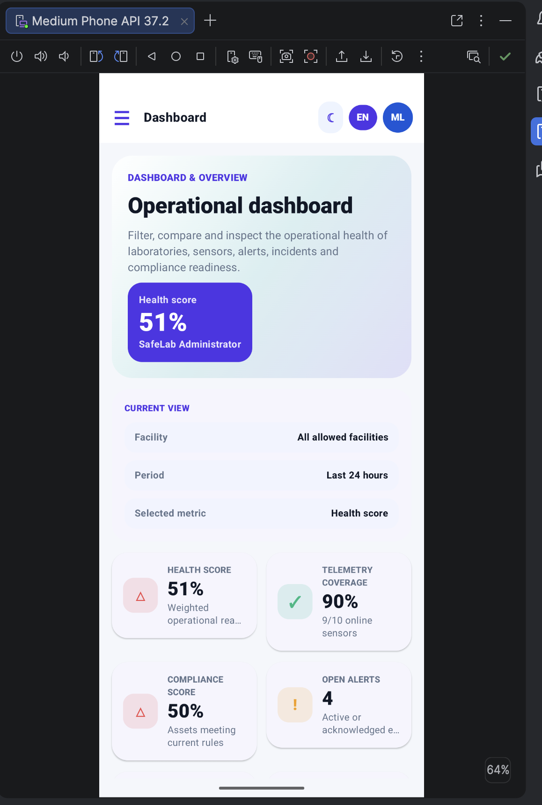

##### Monitoring Organization

Permite consultar las sedes de monitoreo con sus áreas de almacenamiento y el registro de equipos asociados a cada sede.

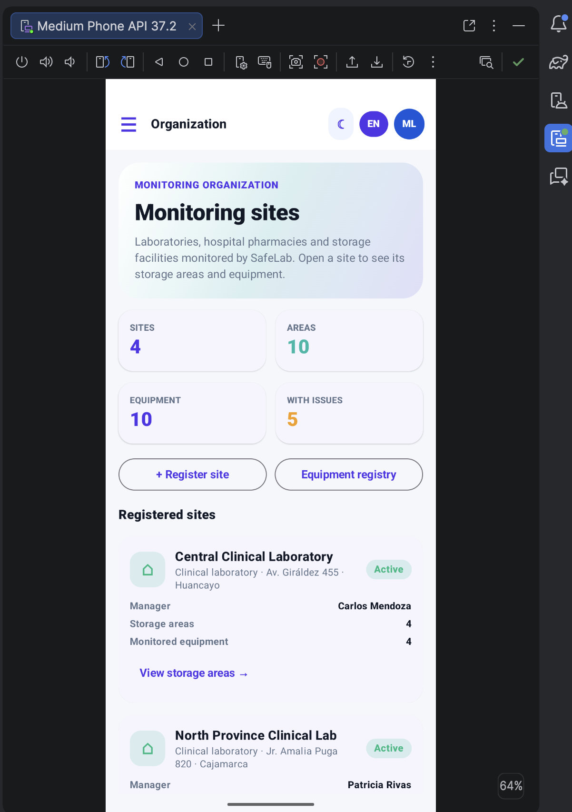

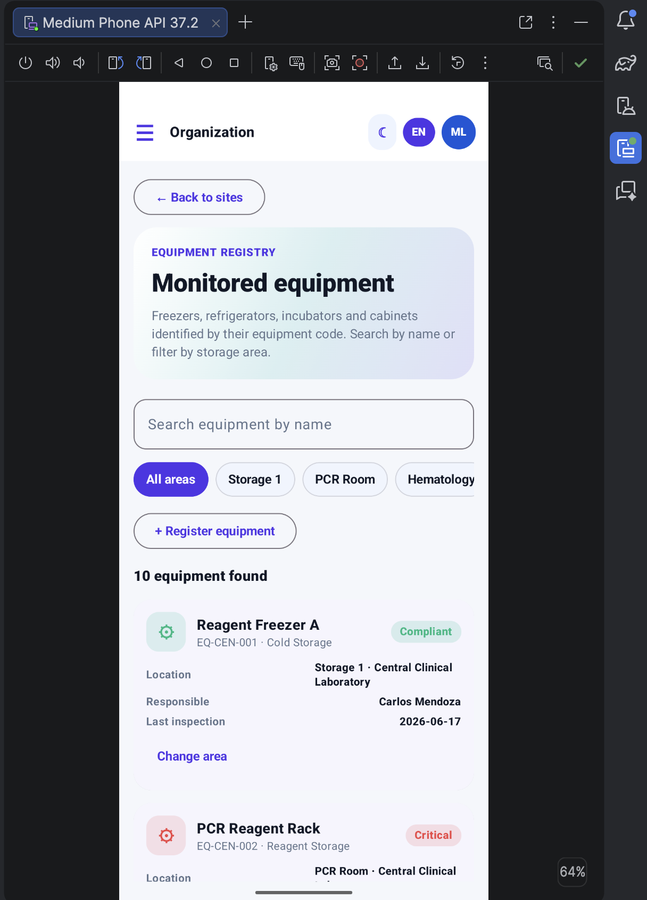

##### Equipment Maintenance

Permite revisar la condición de los equipos a partir de sus indicadores y consultar el historial de mantenimientos realizados.

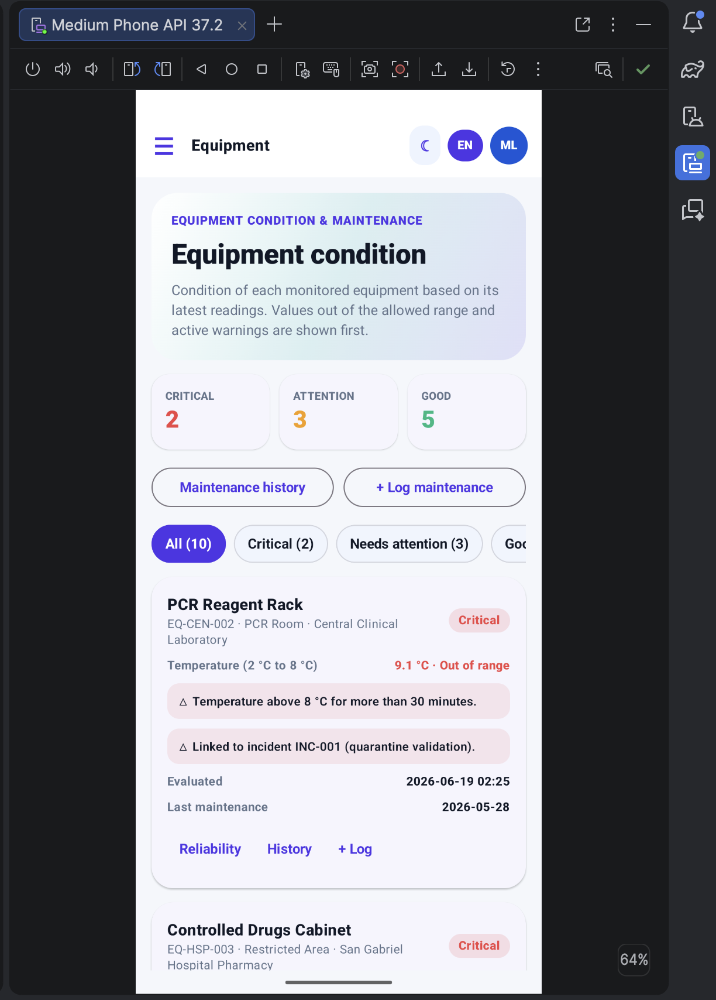

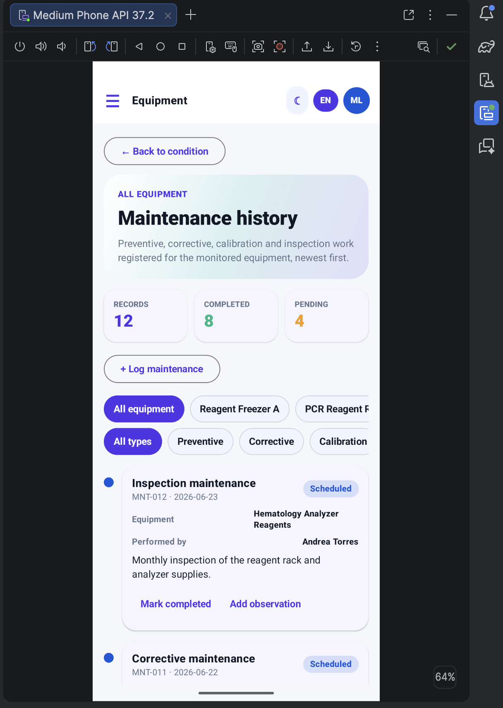

##### Reporting & Compliance

Permite consultar, generar y exportar reportes de la operación, y monitorear el cumplimiento de las normas aplicables.

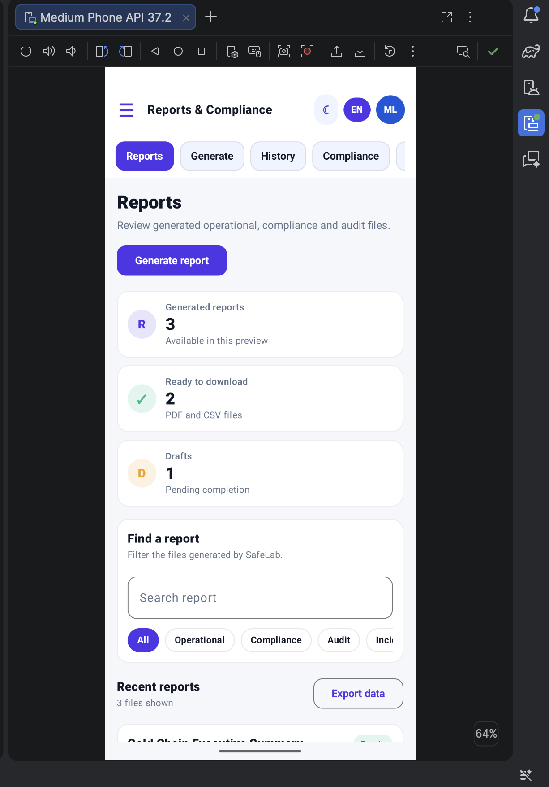

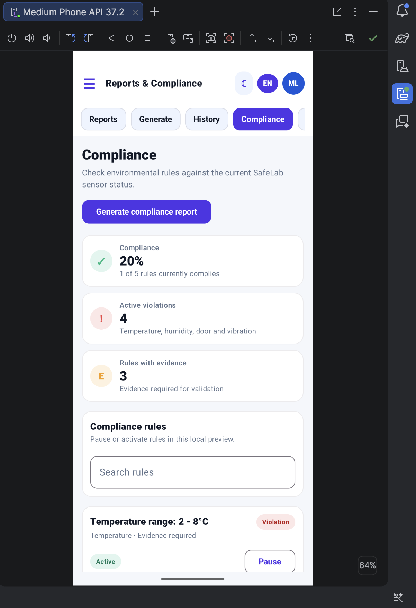

##### Sensor Monitoring

La vista de monitoreo en vivo muestra un resumen del estado de los sensores (total, normales, fuera de rango y fuera de línea) y una tarjeta por sensor con su lectura actual, rango objetivo, conexión y responsable. Además, permite buscar y filtrar por tipo y estado. Desde cada tarjeta el usuario accede al detalle del sensor, donde visualiza la lectura frente al umbral configurado, las calibraciones y los lotes de telemetría, y desde donde puede registrar lecturas y calibraciones o consultar el historial de lecturas.

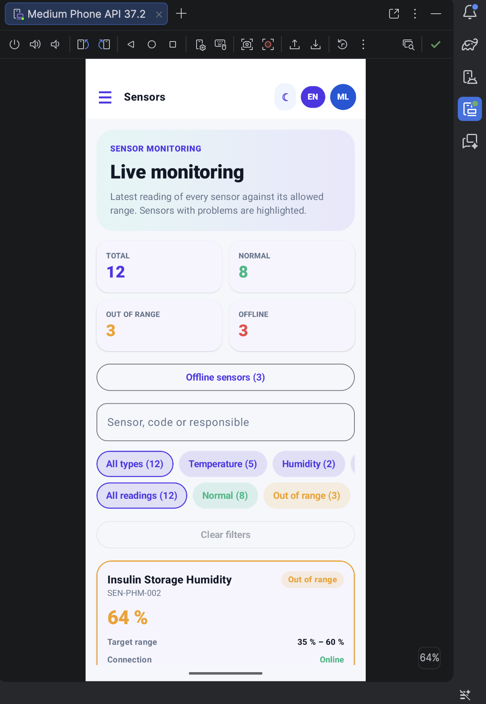

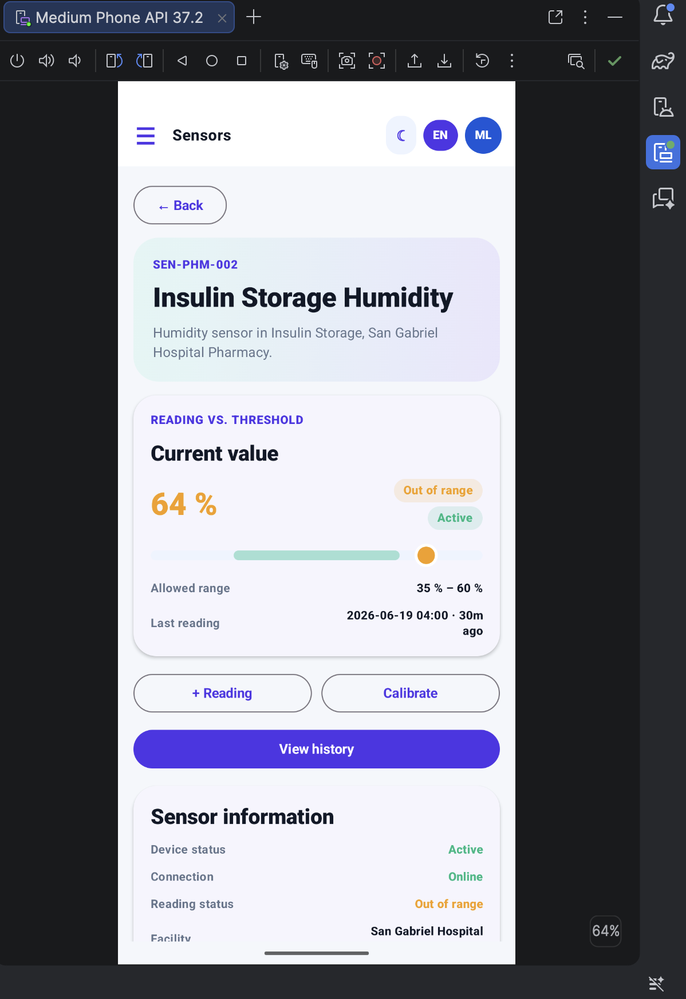

##### Alerts & Incidents

Muestra las alertas generadas con su severidad y estado, y el seguimiento de los incidentes asociados.

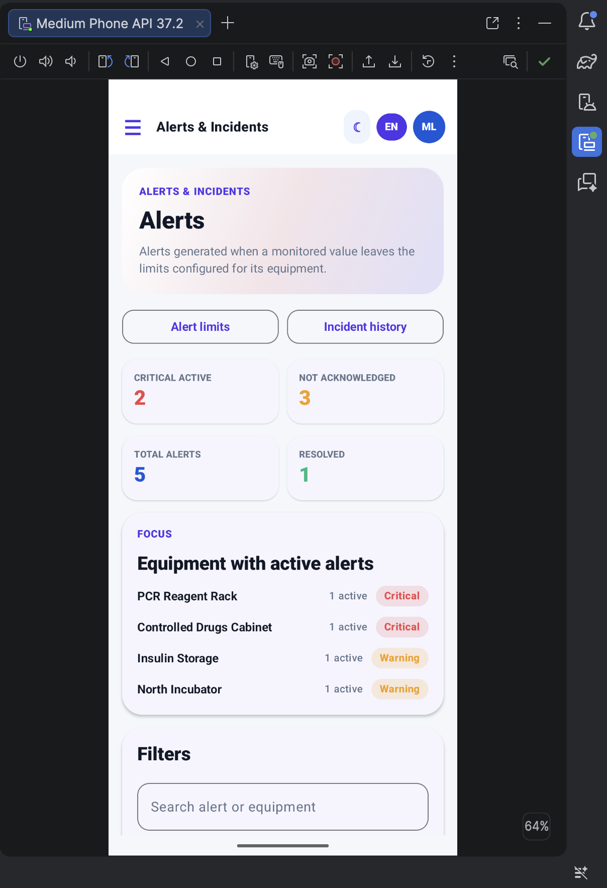

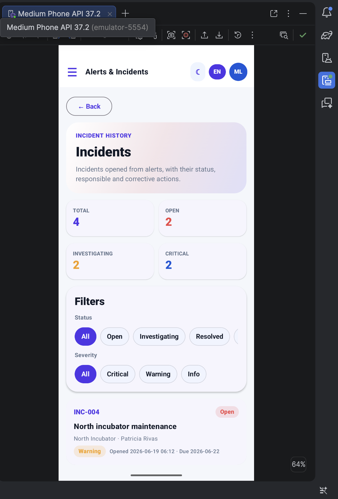

##### Audit & Traceability

Presenta el registro de auditoría con las acciones realizadas en la plataforma y la línea de trazabilidad de los eventos.

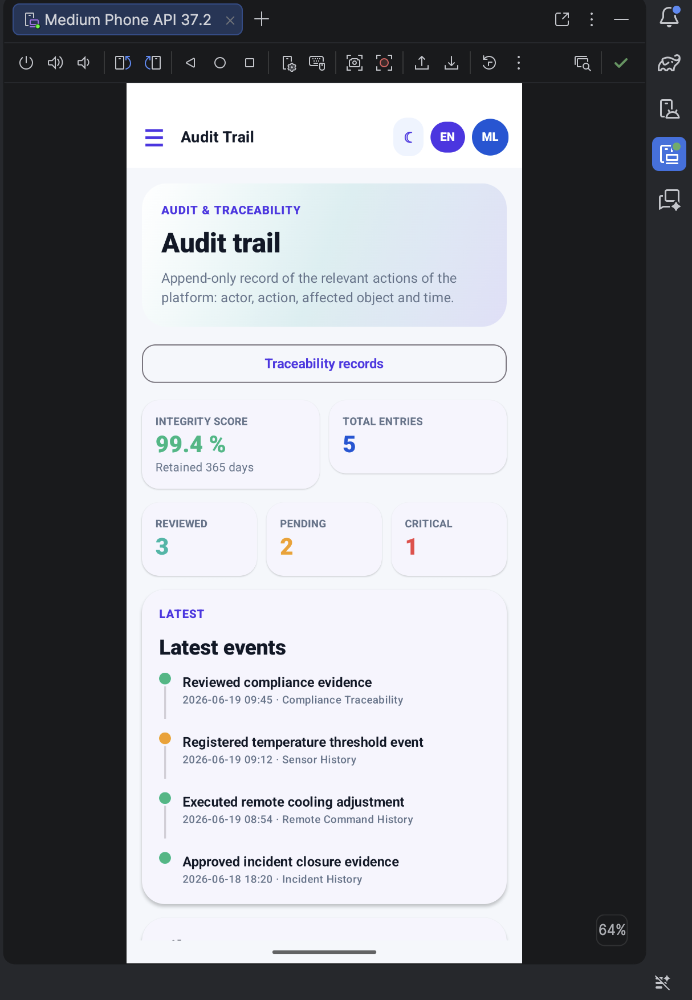

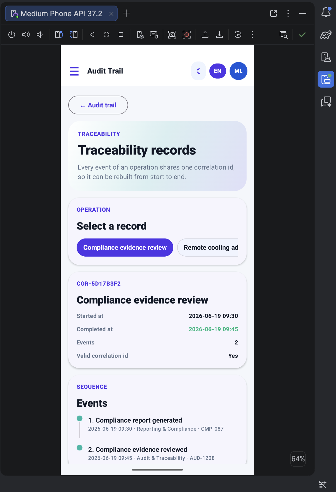

#### **4.2.1.7. Services Documentation Evidence for Sprint Review**

<p style="text-align: justify;">
  En el Sprint 1 se habilitaron los servicios web que soportan la organización y el monitoreo ambiental de SafeLab (US60 y US61). Para ello se reutilizó y adaptó <b>SafeLab Platform API</b>, un backend desarrollado con Java 21 y Spring Boot 3.4 que expone servicios RESTful bajo la ruta base <code>/api/v1</code>, persiste la información en PostgreSQL y documenta sus endpoints con la especificación OpenAPI mediante springdoc, publicada en Swagger UI. La siguiente tabla resume los endpoints relacionados con el alcance del Sprint, con su verbo HTTP, la sintaxis de llamada, sus parámetros y un ejemplo de respuesta obtenido con los datos de muestra del servicio.
</p>
<table border="1" style="width: 100%; border-collapse: collapse; table-layout: fixed; word-break: break-word;">
  <colgroup>
    <col style="width: 13%;">
    <col style="width: 21%;">
    <col style="width: 8%;">
    <col style="width: 15%;">
    <col style="width: 16%;">
    <col style="width: 27%;">
  </colgroup>
  <thead>
    <tr>
      <th style="text-align: center; vertical-align: middle; padding: 6px;">Bounded Context</th>
      <th style="text-align: center; vertical-align: middle; padding: 6px;">Endpoint</th>
      <th style="text-align: center; vertical-align: middle; padding: 6px;">Verbo HTTP</th>
      <th style="text-align: center; vertical-align: middle; padding: 6px;">Acción</th>
      <th style="text-align: center; vertical-align: middle; padding: 6px;">Parámetros</th>
      <th style="text-align: center; vertical-align: middle; padding: 6px;">Ejemplo y explicación del response</th>
    </tr>
  </thead>
  <tbody>
    <tr>
      <td style="text-align: left; vertical-align: top; padding: 6px;">Identity &amp; Access Management</td>
      <td style="text-align: left; vertical-align: top; padding: 6px;"><code>/api/v1/auth/sign-in</code></td>
      <td style="text-align: center; vertical-align: middle; padding: 6px;">POST</td>
      <td style="text-align: left; vertical-align: top; padding: 6px;">Iniciar sesión</td>
      <td style="text-align: left; vertical-align: top; padding: 6px;">Body: <code>email</code> (o <code>username</code>), <code>password</code></td>
      <td style="text-align: left; vertical-align: top; padding: 6px;"><code>200 OK</code>: <code>{"accessToken": "demo-…", "tokenType": "Bearer", "user": {"id": "usr-admin-001", "fullName": "Dr. Maria Lopez", "role": "safeLabAdministrator"}}</code>. Devuelve el token de sesión y el usuario autenticado. Con credenciales inválidas responde <code>401 Unauthorized</code>.</td>
    </tr>
    <tr>
      <td style="text-align: left; vertical-align: top; padding: 6px;">Identity &amp; Access Management</td>
      <td style="text-align: left; vertical-align: top; padding: 6px;"><code>/api/v1/auth/me</code></td>
      <td style="text-align: center; vertical-align: middle; padding: 6px;">GET</td>
      <td style="text-align: left; vertical-align: top; padding: 6px;">Consultar usuario autenticado</td>
      <td style="text-align: left; vertical-align: top; padding: 6px;">—</td>
      <td style="text-align: left; vertical-align: top; padding: 6px;"><code>200 OK</code>: datos del usuario de la sesión actual (nombre, rol, sitio y contextos permitidos).</td>
    </tr>
    <tr>
      <td style="text-align: left; vertical-align: top; padding: 6px;">Monitoring Organization</td>
      <td style="text-align: left; vertical-align: top; padding: 6px;"><code>/api/v1/facilities</code></td>
      <td style="text-align: center; vertical-align: middle; padding: 6px;">GET</td>
      <td style="text-align: left; vertical-align: top; padding: 6px;">Listar sitios de monitoreo</td>
      <td style="text-align: left; vertical-align: top; padding: 6px;">—</td>
      <td style="text-align: left; vertical-align: top; padding: 6px;"><code>200 OK</code>: <code>[{"id": "fac-central", "name": "Central Clinical Laboratory", "type": "Clinical laboratory", "city": "Huancayo", "manager": "Carlos Mendoza"}, …]</code></td>
    </tr>
    <tr>
      <td style="text-align: left; vertical-align: top; padding: 6px;">Monitoring Organization</td>
      <td style="text-align: left; vertical-align: top; padding: 6px;"><code>/api/v1/facilities</code></td>
      <td style="text-align: center; vertical-align: middle; padding: 6px;">POST</td>
      <td style="text-align: left; vertical-align: top; padding: 6px;">Registrar sitio de monitoreo (US01)</td>
      <td style="text-align: left; vertical-align: top; padding: 6px;">Body: <code>name</code>, <code>type</code>, <code>city</code>, <code>manager</code></td>
      <td style="text-align: left; vertical-align: top; padding: 6px;"><code>200 OK</code>: el sitio creado con su <code>id</code> generado.</td>
    </tr>
    <tr>
      <td style="text-align: left; vertical-align: top; padding: 6px;">Monitoring Organization</td>
      <td style="text-align: left; vertical-align: top; padding: 6px;"><code>/api/v1/facilities/{id}</code></td>
      <td style="text-align: center; vertical-align: middle; padding: 6px;">GET</td>
      <td style="text-align: left; vertical-align: top; padding: 6px;">Consultar un sitio</td>
      <td style="text-align: left; vertical-align: top; padding: 6px;">Path: <code>id</code></td>
      <td style="text-align: left; vertical-align: top; padding: 6px;"><code>200 OK</code>: el sitio solicitado; <code>404 Not Found</code> si no existe.</td>
    </tr>
    <tr>
      <td style="text-align: left; vertical-align: top; padding: 6px;">Asset &amp; Inventory</td>
      <td style="text-align: left; vertical-align: top; padding: 6px;"><code>/api/v1/asset-inventory/assets</code></td>
      <td style="text-align: center; vertical-align: middle; padding: 6px;">GET</td>
      <td style="text-align: left; vertical-align: top; padding: 6px;">Listar equipos</td>
      <td style="text-align: left; vertical-align: top; padding: 6px;">—</td>
      <td style="text-align: left; vertical-align: top; padding: 6px;"><code>200 OK</code>: <code>[{"id": "asset-001", "name": "Reagent Freezer A", "category": "Cold Storage", "storageUnit": "Freezer A", "location": "Central Lab - Storage 1", "status": "compliant"}, …]</code></td>
    </tr>
    <tr>
      <td style="text-align: left; vertical-align: top; padding: 6px;">Asset &amp; Inventory</td>
      <td style="text-align: left; vertical-align: top; padding: 6px;"><code>/api/v1/asset-inventory/assets</code></td>
      <td style="text-align: center; vertical-align: middle; padding: 6px;">POST</td>
      <td style="text-align: left; vertical-align: top; padding: 6px;">Registrar equipo (US05)</td>
      <td style="text-align: left; vertical-align: top; padding: 6px;">Body: <code>name</code>, <code>category</code>, <code>facilityId</code>, <code>storageUnit</code>, <code>location</code>, <code>responsible</code></td>
      <td style="text-align: left; vertical-align: top; padding: 6px;"><code>200 OK</code>: el equipo creado; si no se envía <code>status</code>, se registra como <code>compliant</code>.</td>
    </tr>
    <tr>
      <td style="text-align: left; vertical-align: top; padding: 6px;">Asset &amp; Inventory</td>
      <td style="text-align: left; vertical-align: top; padding: 6px;"><code>/api/v1/asset-inventory/assets/{id}</code></td>
      <td style="text-align: center; vertical-align: middle; padding: 6px;">PATCH</td>
      <td style="text-align: left; vertical-align: top; padding: 6px;">Asignar equipo a un área de almacenamiento (US07)</td>
      <td style="text-align: left; vertical-align: top; padding: 6px;">Path: <code>id</code>. Body: <code>storageUnit</code>, <code>location</code></td>
      <td style="text-align: left; vertical-align: top; padding: 6px;"><code>200 OK</code>: el equipo actualizado con su nueva área de almacenamiento.</td>
    </tr>
    <tr>
      <td style="text-align: left; vertical-align: top; padding: 6px;">Asset &amp; Inventory</td>
      <td style="text-align: left; vertical-align: top; padding: 6px;"><code>/api/v1/asset-inventory/assets/{id}</code></td>
      <td style="text-align: center; vertical-align: middle; padding: 6px;">DELETE</td>
      <td style="text-align: left; vertical-align: top; padding: 6px;">Eliminar equipo</td>
      <td style="text-align: left; vertical-align: top; padding: 6px;">Path: <code>id</code></td>
      <td style="text-align: left; vertical-align: top; padding: 6px;"><code>200 OK</code> sin contenido.</td>
    </tr>
    <tr>
      <td style="text-align: left; vertical-align: top; padding: 6px;">Sensor Monitoring</td>
      <td style="text-align: left; vertical-align: top; padding: 6px;"><code>/api/v1/sensor-monitoring/sensors</code></td>
      <td style="text-align: center; vertical-align: middle; padding: 6px;">GET</td>
      <td style="text-align: left; vertical-align: top; padding: 6px;">Listar sensores con su lectura actual (US09, US10, US13)</td>
      <td style="text-align: left; vertical-align: top; padding: 6px;">—</td>
      <td style="text-align: left; vertical-align: top; padding: 6px;"><code>200 OK</code>: <code>[{"id": "sen-001", "code": "SEN-CLN-001", "name": "Reagent Freezer Temperature", "type": "temperature", "unit": "°C", "value": 3.8, "min": 2, "max": 8, "status": "normal", "connection": "online"}, …]</code></td>
    </tr>
    <tr>
      <td style="text-align: left; vertical-align: top; padding: 6px;">Sensor Monitoring</td>
      <td style="text-align: left; vertical-align: top; padding: 6px;"><code>/api/v1/sensor-monitoring/sensors</code></td>
      <td style="text-align: center; vertical-align: middle; padding: 6px;">POST</td>
      <td style="text-align: left; vertical-align: top; padding: 6px;">Registrar sensor de un equipo</td>
      <td style="text-align: left; vertical-align: top; padding: 6px;">Body: <code>code</code>, <code>name</code>, <code>assetId</code>, <code>type</code>, <code>unit</code>, <code>min</code>, <code>max</code></td>
      <td style="text-align: left; vertical-align: top; padding: 6px;"><code>200 OK</code>: el sensor creado, con <code>connection: online</code> y <code>status: normal</code> por defecto.</td>
    </tr>
    <tr>
      <td style="text-align: left; vertical-align: top; padding: 6px;">Sensor Monitoring</td>
      <td style="text-align: left; vertical-align: top; padding: 6px;"><code>/api/v1/sensor-monitoring/sensors/{id}/reading</code></td>
      <td style="text-align: center; vertical-align: middle; padding: 6px;">PATCH</td>
      <td style="text-align: left; vertical-align: top; padding: 6px;">Registrar una nueva lectura (US16)</td>
      <td style="text-align: left; vertical-align: top; padding: 6px;">Path: <code>id</code>. Body: <code>value</code></td>
      <td style="text-align: left; vertical-align: top; padding: 6px;"><code>200 OK</code>: el sensor con el nuevo <code>value</code> y su <code>status</code> recalculado (<code>normal</code> u <code>out-of-range</code>). Si la lectura sale del rango, el servicio genera automáticamente una alerta.</td>
    </tr>
    <tr>
      <td style="text-align: left; vertical-align: top; padding: 6px;">Sensor Monitoring</td>
      <td style="text-align: left; vertical-align: top; padding: 6px;"><code>/api/v1/sensor-monitoring/sensors/{id}/disconnect</code></td>
      <td style="text-align: center; vertical-align: middle; padding: 6px;">POST</td>
      <td style="text-align: left; vertical-align: top; padding: 6px;">Marcar sensor sin datos recientes (US15)</td>
      <td style="text-align: left; vertical-align: top; padding: 6px;">Path: <code>id</code></td>
      <td style="text-align: left; vertical-align: top; padding: 6px;"><code>200 OK</code>: el sensor con <code>connection: offline</code> y <code>status: invalid</code>; además se genera una alerta de conectividad.</td>
    </tr>
    <tr>
      <td style="text-align: left; vertical-align: top; padding: 6px;">Dashboard &amp; Overview</td>
      <td style="text-align: left; vertical-align: top; padding: 6px;"><code>/api/v1/dashboard/overview</code></td>
      <td style="text-align: center; vertical-align: middle; padding: 6px;">GET</td>
      <td style="text-align: left; vertical-align: top; padding: 6px;">Consultar resumen del monitoreo (US11)</td>
      <td style="text-align: left; vertical-align: top; padding: 6px;">Query: <code>facilityId</code> (opcional, por defecto <code>global</code>)</td>
      <td style="text-align: left; vertical-align: top; padding: 6px;"><code>200 OK</code>: indicadores agregados (<code>activeSensors</code>, <code>totalSensors</code>, <code>openAlerts</code>, <code>complianceScore</code>, <code>telemetryScore</code>) y las alertas prioritarias.</td>
    </tr>
  </tbody>
</table>

##### **Documentación desplegada**

<table border="1" style="width: 100%; border-collapse: collapse;">
  <thead>
    <tr>
      <th style="text-align: center; vertical-align: middle; padding: 6px;">Recurso</th>
      <th style="text-align: center; vertical-align: middle; padding: 6px;">URL</th>
    </tr>
  </thead>
  <tbody>
    <tr>
      <td style="text-align: left; vertical-align: top; padding: 6px;">Swagger UI (local)</td>
      <td style="text-align: left; vertical-align: top; padding: 6px;"><code>http://localhost:8080/swagger-ui.html</code></td>
    </tr>
    <tr>
      <td style="text-align: left; vertical-align: top; padding: 6px;">Especificación OpenAPI (local)</td>
      <td style="text-align: left; vertical-align: top; padding: 6px;"><code>http://localhost:8080/v3/api-docs</code></td>
    </tr>
    
  </tbody>
</table

##### **Interacción con la documentación**

<p style="text-align: justify;">
  A continuación se muestran capturas de la interacción con Swagger UI utilizando los datos de muestra: el inicio de sesión con <code>POST /auth/sign-in</code>, la consulta de sensores con <code>GET /sensor-monitoring/sensors</code> y el registro de una lectura fuera de rango con <code>PATCH /sensor-monitoring/sensors/{id}/reading</code>, que genera una alerta automática.
</p>

<!-- PENDIENTE: agregar 3 capturas de Swagger en assets/09-chapter-4/sprint-1/services/ (sign-in, listado de sensores y registro de lectura). -->

#### **4.2.1.8. Software Deployment Evidence for Sprint Review**

<p style="text-align: justify;">
  Durante el Sprint 1 se configuraron los entornos de despliegue de los productos digitales de SafeLab. La Landing Page se publica como sitio estático en GitHub Pages desde el repositorio <i>safelab-business-website</i> de la organización del equipo, y los servicios web se despliegan en Render como un Web Service basado en Docker, conectado a una base de datos PostgreSQL administrada en la misma plataforma. Las aplicaciones móviles se ejecutan en emuladores y dispositivos de prueba durante este Sprint y no se publican en tiendas de aplicaciones.
</p>
<table border="1" style="width: 100%; border-collapse: collapse;">
  <thead>
    <tr>
      <th style="text-align: center; vertical-align: middle; padding: 6px;">Producto</th>
      <th style="text-align: center; vertical-align: middle; padding: 6px;">Plataforma</th>
      <th style="text-align: center; vertical-align: middle; padding: 6px;">Configuración</th>
      <th style="text-align: center; vertical-align: middle; padding: 6px;">Evidencia</th>
    </tr>
  </thead>
  <tbody>
    <tr>
      <td style="text-align: left; vertical-align: top; padding: 6px;">Landing Page</td>
      <td style="text-align: left; vertical-align: top; padding: 6px;">GitHub Pages</td>
      <td style="text-align: left; vertical-align: top; padding: 6px;">Rama <code>main</code>, carpeta raíz (<code>/</code>)</td>
      <td style="text-align: left; vertical-align: top; padding: 6px;">Configuración de Pages y página publicada</td>
    </tr>
    <tr>
      <td style="text-align: left; vertical-align: top; padding: 6px;">Web Services (SafeLab Platform API)</td>
      <td style="text-align: left; vertical-align: top; padding: 6px;">Render · Web Service</td>
      <td style="text-align: left; vertical-align: top; padding: 6px;">Runtime Docker, plan free, región Oregon, health check <code>/actuator/health</code></td>
      <td style="text-align: left; vertical-align: top; padding: 6px;">Servicio creado, variables de entorno, despliegue exitoso y Swagger UI accesible</td>
    </tr>
    <tr>
      <td style="text-align: left; vertical-align: top; padding: 6px;">Base de datos</td>
      <td style="text-align: left; vertical-align: top; padding: 6px;">Render · PostgreSQL</td>
      <td style="text-align: left; vertical-align: top; padding: 6px;">Misma región que el Web Service; conexión mediante la Internal Database URL</td>
      <td style="text-align: left; vertical-align: top; padding: 6px;">Instancia creada y conexión verificada por el health check</td>
    </tr>
  </tbody>
</table>

##### **Landing Page**

<p style="text-align: justify;">
  Para desplegar la Landing Page se realizaron las siguientes actividades:
</p>
<ul style="text-align: justify;">
  <li>Integración del contenido de la Landing Page en la rama <code>main</code> del repositorio <i>safelab-business-website</i>.</li>
  <li>Configuración de GitHub Pages en <b>Settings → Pages</b>, con la opción <b>Deploy from a branch</b>, la rama <code>main</code> y la carpeta raíz.</li>
  <li>Verificación del acceso público a la página y de la correcta carga de estilos, imágenes y logotipos.</li>
  <li>Revisión de la visualización en navegadores de escritorio y en dispositivos móviles.</li>
</ul>

##### **Web Services**

<p style="text-align: justify;">
  Para desplegar SafeLab Platform API se realizaron las siguientes actividades:
</p>
<ul style="text-align: justify;">
  <li>Creación de la base de datos <b>PostgreSQL</b> en Render, en la región Oregon.</li>
  <li>Creación del <b>Web Service</b> a partir del repositorio del backend, con runtime Docker y el <code>Dockerfile</code> del proyecto.</li>
  <li>Configuración del health check en <code>/actuator/health</code>, que Render utiliza para verificar que el servicio está disponible.</li>
  <li>Configuración de las variables de entorno del servicio, detalladas en la siguiente tabla.</li>
  <li>Verificación del despliegue mediante el health check y el acceso a Swagger UI.</li>
</ul>
<table border="1" style="width: 100%; border-collapse: collapse;">
  <thead>
    <tr>
      <th style="text-align: center; vertical-align: middle; padding: 6px;">Variable de entorno</th>
      <th style="text-align: center; vertical-align: middle; padding: 6px;">Valor</th>
      <th style="text-align: center; vertical-align: middle; padding: 6px;">Propósito</th>
    </tr>
  </thead>
  <tbody>
    <tr>
      <td style="text-align: left; vertical-align: top; padding: 6px;"><code>SPRING_PROFILES_ACTIVE</code></td>
      <td style="text-align: left; vertical-align: top; padding: 6px;"><code>postgres</code></td>
      <td style="text-align: left; vertical-align: top; padding: 6px;">Activa la configuración de persistencia en PostgreSQL.</td>
    </tr>
    <tr>
      <td style="text-align: left; vertical-align: top; padding: 6px;"><code>DATABASE_URL</code></td>
      <td style="text-align: left; vertical-align: top; padding: 6px;">Internal Database URL de Render</td>
      <td style="text-align: left; vertical-align: top; padding: 6px;">Conecta el servicio con la base de datos; el backend la convierte al formato JDBC.</td>
    </tr>
    <tr>
      <td style="text-align: left; vertical-align: top; padding: 6px;"><code>CORS_ALLOWED_ORIGINS</code></td>
      <td style="text-align: left; vertical-align: top; padding: 6px;">Orígenes permitidos de los clientes</td>
      <td style="text-align: left; vertical-align: top; padding: 6px;">Autoriza las solicitudes de los clientes de SafeLab.</td>
    </tr>
    <tr>
      <td style="text-align: left; vertical-align: top; padding: 6px;"><code>SEED_RESET_ON_START</code></td>
      <td style="text-align: left; vertical-align: top; padding: 6px;"><code>false</code></td>
      <td style="text-align: left; vertical-align: top; padding: 6px;">Evita reiniciar los datos de muestra en cada despliegue.</td>
    </tr>
    <tr>
      <td style="text-align: left; vertical-align: top; padding: 6px;"><code>JAVA_OPTS</code></td>
      <td style="text-align: left; vertical-align: top; padding: 6px;"><code>-XX:MaxRAMPercentage=75.0</code></td>
      <td style="text-align: left; vertical-align: top; padding: 6px;">Ajusta el uso de memoria de la JVM al plan del servicio.</td>
    </tr>
  </tbody>
</table>

<p style="text-align: justify;">
  Con estas configuraciones, la Landing Page y los servicios web quedan disponibles públicamente para la validación del Sprint, mientras que las aplicaciones móviles consumen los servicios desplegados durante su ejecución en emuladores y dispositivos de prueba.
</p>

#### **4.2.1.9. Team Collaboration Insights during Sprint**

<p style="text-align: justify;">
  Durante el Sprint 1, el equipo Meditrack organizó el trabajo mediante una estrategia de responsabilidades distribuidas entre el reporte, la Landing Page y la aplicación móvil. La división por repositorios y ramas permitió que los cinco integrantes desarrollaran funcionalidades en paralelo, manteniendo <code>develop</code> como punto de integración y <code>main</code> como versión estable. En la aplicación móvil, la separación por Bounded Contexts redujo los conflictos entre integrantes porque cada rama modificaba principalmente los archivos de su propio módulo; en la Landing Page, en cambio, fue necesario coordinar con mayor cuidado los cambios sobre archivos compartidos como <code>index.html</code>, <code>styles.css</code> y <code>script.js</code>.
</p>

<table border="1" style="width: 100%; border-collapse: collapse; table-layout: fixed;">
  <thead>
    <tr>
      <th style="text-align: center; vertical-align: middle; padding: 6px;">Integrante</th>
      <th style="text-align: center; vertical-align: middle; padding: 6px;">Contribución principal en TB1</th>
      <th style="text-align: center; vertical-align: middle; padding: 6px;">Resultado colaborativo</th>
    </tr>
  </thead>
  <tbody>
    <tr>
      <td style="text-align: left; vertical-align: top; padding: 6px;">Carlos Lavado, Ever Giusephi</td>
      <td style="text-align: justify; vertical-align: top; padding: 6px;">Configuración e integración técnica; sección inicial de la Landing Page; Identity &amp; Access Management y Dashboard &amp; Overview en Mobile.</td>
      <td style="text-align: justify; vertical-align: top; padding: 6px;">Consolidación de la estructura compartida, navegación y trazabilidad entre repositorios, ramas y documentación.</td>
    </tr>
    <tr>
      <td style="text-align: left; vertical-align: top; padding: 6px;">Espino Rossi, Victor Manuel</td>
      <td style="text-align: justify; vertical-align: top; padding: 6px;">Internacionalización EN/ES de la Landing Page; Monitoring Organization y Equipment Condition &amp; Maintenance en Mobile; revisión de Style Guidelines e Information Architecture.</td>
      <td style="text-align: justify; vertical-align: top; padding: 6px;">Alineación de la experiencia multilingüe y de los módulos asociados a organización y mantenimiento.</td>
    </tr>
    <tr>
      <td style="text-align: left; vertical-align: top; padding: 6px;">Garcia Cerpa, Braden Raid</td>
      <td style="text-align: justify; vertical-align: top; padding: 6px;">Secciones de interacción de la Landing Page; Alerts &amp; Incident Management y Audit &amp; Traceability en Mobile; soporte a testing y validación.</td>
      <td style="text-align: justify; vertical-align: top; padding: 6px;">Integración de flujos de alertas, incidentes y trazabilidad con los componentes de interacción y validación del producto.</td>
    </tr>
    <tr>
      <td style="text-align: left; vertical-align: top; padding: 6px;">Rojas Gomez, Valeria Alexandra</td>
      <td style="text-align: justify; vertical-align: top; padding: 6px;">Benefits, Services y Plans de la Landing Page; Reporting &amp; Compliance en Mobile; Sprint Planning y Product Backlog.</td>
      <td style="text-align: justify; vertical-align: top; padding: 6px;">Correspondencia entre planificación del Sprint, contenido comercial y funcionalidades de reportes y cumplimiento.</td>
    </tr>
    <tr>
      <td style="text-align: left; vertical-align: top; padding: 6px;">Vara Velásquez, Oscar Fernando</td>
      <td style="text-align: justify; vertical-align: top; padding: 6px;">About Product y About Team de la Landing Page; Sensor Monitoring en Mobile; documentación UX/UI de la aplicación móvil.</td>
      <td style="text-align: justify; vertical-align: top; padding: 6px;">Coherencia entre diseño UX/UI, presentación del producto y experiencia de monitoreo de sensores.</td>
    </tr>
  </tbody>
</table>

<p style="text-align: justify;">
  La principal dificultad de integración se presentó en la Landing Page, debido a que varias ramas debían modificar simultáneamente archivos globales. Los conflictos se resolvieron durante los merges hacia <code>develop</code> utilizando el Merge Editor de Visual Studio Code. Después de integrar todas las ramas, se realizó una revisión consolidada para eliminar contenido duplicado, corregir inconsistencias en HTML, CSS y JavaScript, comprobar la carga de recursos y verificar nuevamente la navegación, internacionalización y responsive design.
</p>

<p style="text-align: justify;">
  En la aplicación móvil, el equipo adoptó una estrategia diferente: primero se preparó en <code>develop</code> el shell compartido con sidebar, topbar, navegación y tema visual; después, cada integrante implementó sus Bounded Contexts en ramas independientes. Los módulos que afectaban navegación compartida, como Dashboard &amp; Overview e Identity &amp; Access Management, se integraron al final. Esta decisión redujo el riesgo de sobrescribir cambios de otros módulos y facilitó que todos los Bounded Contexts pudieran reunirse posteriormente en una única versión estable.
</p>

<p style="text-align: justify;">
  Como aprendizaje del Sprint, el equipo identificó la importancia de integrar periódicamente los cambios de <code>develop</code>, reservar los archivos transversales para una etapa de consolidación, utilizar commits pequeños y descriptivos, y mantener la separación entre frontend móvil y backend. El uso de datos mock en Android permitió validar la experiencia y los flujos de navegación de forma independiente, mientras que la API pudo ser adaptada y probada en paralelo para su futura integración.
</p>

<table border="1" style="width: 100%; border-collapse: collapse; table-layout: fixed;">
  <thead>
    <tr>
      <th style="text-align: center; vertical-align: middle; padding: 6px;">Insight</th>
      <th style="text-align: center; vertical-align: middle; padding: 6px;">Evidencia observada</th>
      <th style="text-align: center; vertical-align: middle; padding: 6px;">Acción para el siguiente Sprint</th>
    </tr>
  </thead>
  <tbody>
    <tr>
      <td style="text-align: left; vertical-align: top; padding: 6px;">Separar funcionalidades por Bounded Context reduce conflictos.</td>
      <td style="text-align: justify; vertical-align: top; padding: 6px;">Las ramas de Mobile modificaron principalmente sus propios paquetes y pantallas.</td>
      <td style="text-align: justify; vertical-align: top; padding: 6px;">Mantener una rama por BC y limitar los cambios compartidos a responsables coordinados.</td>
    </tr>
    <tr>
      <td style="text-align: left; vertical-align: top; padding: 6px;">Los archivos globales requieren integración temprana.</td>
      <td style="text-align: justify; vertical-align: top; padding: 6px;">La Landing Page presentó conflictos en <code>index.html</code>, <code>styles.css</code> y <code>script.js</code>.</td>
      <td style="text-align: justify; vertical-align: top; padding: 6px;">Sincronizar las ramas con <code>develop</code> antes de cambios extensos y reservar la revisión de calidad para el final.</td>
    </tr>
    <tr>
      <td style="text-align: left; vertical-align: top; padding: 6px;">Los datos mock permiten desacoplar frontend y backend.</td>
      <td style="text-align: justify; vertical-align: top; padding: 6px;">La app móvil pudo completar sus pantallas y navegación sin depender de disponibilidad de la API.</td>
      <td style="text-align: justify; vertical-align: top; padding: 6px;">Reemplazar gradualmente repositorios locales por implementaciones REST manteniendo las mismas interfaces de dominio.</td>
    </tr>
    <tr>
      <td style="text-align: left; vertical-align: top; padding: 6px;">La trazabilidad mejora con commits y merge commits descriptivos.</td>
      <td style="text-align: justify; vertical-align: top; padding: 6px;">Los commits por capas y funcionalidades permiten identificar qué cambio introdujo cada rama.</td>
      <td style="text-align: justify; vertical-align: top; padding: 6px;">Mantener Conventional Commits, merges <code>--no-ff</code> y tags por entrega.</td>
    </tr>
  </tbody>
</table>

<p align="center">
  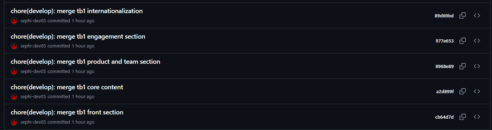
</p>

<p align="center"><i>Figura: Evidencia de colaboración e integración de ramas durante el Sprint 1.</i></p>

## **4.3. Validation Interviews**

<p style="text-align: justify;">
  En esta sección se registran y explican las entrevistas de validación, en las que usuarios de los dos segmentos objetivo interactúan con el Landing Page y la aplicación móvil de SafeLab para verificar si el producto les permite cumplir sus objetivos. La sección incluye el diseño de las sesiones, el registro de cada entrevista y la evaluación de los hallazgos según heurísticas de usabilidad, arquitectura de información y diseño inclusivo, siguiendo el formato de evaluación indicado para el proyecto.
</p>

### **4.3.1. Interview Design**

### **4.3.2. Interview Recording**

### **4.3.3. Evaluations Based on Heuristics**
