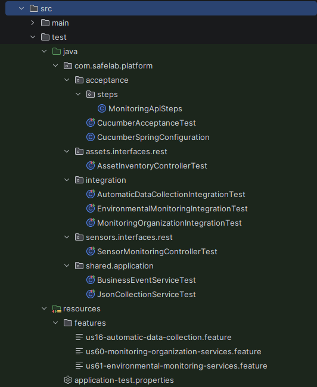
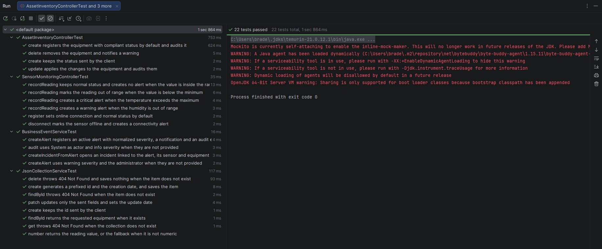
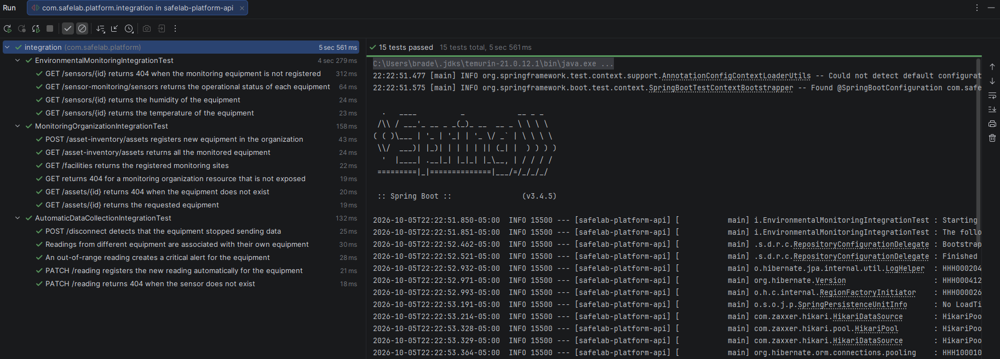
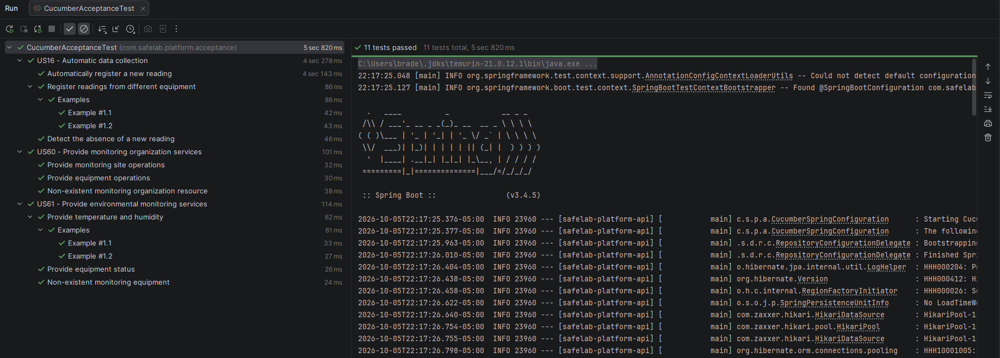
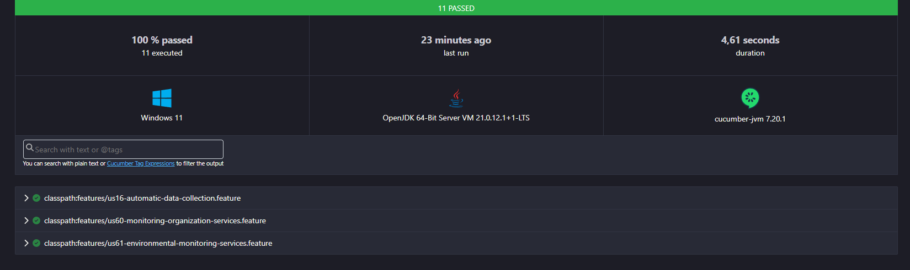
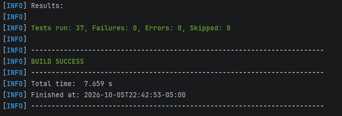

# **Chapter IV: Product Implementation & Validation**

## **4.1. Configuration Management Software**

### **4.1.1. Software Development Environment Configuration**

### **4.1.2. Source Code Management**

### **4.1.3. Source Code Style Guide & Conventions**

### **4.1.4. Software Deployment Configuration**

## **4.2. Landing Page & Mobile Application Implementation**

### **4.2.1. Sprint 1**

#### **4.2.1.1. Sprint Planning 1**

<p style="text-align: justify;">
  En esta sección se presentan los principales aspectos definidos durante el Sprint Planning Meeting del Sprint 1 de SafeLab. La planificación establece el objetivo del Sprint, la capacidad del equipo y el alcance funcional seleccionado, priorizando las funcionalidades principales de organización y monitoreo ambiental, junto con la primera versión de la Landing Page.
</p>

<table border="1" style="width: 100%; border-collapse: collapse;">
  <tr>
    <th style="text-align: left; vertical-align: middle; padding: 6px; width: 35%;">Sprint #</th>
    <td style="text-align: left; vertical-align: middle; padding: 6px;">1</td>
  </tr>
  <tr>
    <th colspan="2" style="text-align: center; vertical-align: middle; padding: 6px;">Sprint Planning Background</th>
  </tr>
  <tr>
    <td style="text-align: left; vertical-align: middle; padding: 6px;"><b>Date</b></td>
    <td style="text-align: left; vertical-align: middle; padding: 6px;">2026-09-25</td>
  </tr>
  <tr>
    <td style="text-align: left; vertical-align: middle; padding: 6px;"><b>Time</b></td>
    <td style="text-align: left; vertical-align: middle; padding: 6px;">10:00 AM</td>
  </tr>
  <tr>
    <td style="text-align: left; vertical-align: middle; padding: 6px;"><b>Location</b></td>
    <td style="text-align: left; vertical-align: middle; padding: 6px;">UPC San Isidro</td>
  </tr>
  <tr>
    <td style="text-align: left; vertical-align: middle; padding: 6px;"><b>Prepared By</b></td>
    <td style="text-align: left; vertical-align: middle; padding: 6px;">Valeria Rojas</td>
  </tr>
  <tr>
    <td style="text-align: left; vertical-align: top; padding: 6px;"><b>Attendees (to planning meeting)</b></td>
    <td style="text-align: left; vertical-align: top; padding: 6px;">Braden Garcia / Victor Espino / Giusephi Carlos / Oscar Vara / Valeria Rojas</td>
  </tr>
  <tr>
    <td style="text-align: left; vertical-align: top; padding: 6px;"><b>Sprint 1 Review Summary</b></td>
    <td style="text-align: justify; vertical-align: top; padding: 6px;">The Sprint focused on organizing the SafeLab project, refining the requirements and Product Backlog, and preparing the Landing Page and the initial monitoring features required for the first product increment.</td>
  </tr>
  <tr>
    <td style="text-align: left; vertical-align: top; padding: 6px;"><b>Sprint 1 Retrospective Summary</b></td>
    <td style="text-align: justify; vertical-align: top; padding: 6px;">The team identified progress in the organization of requirements and project documentation, as well as opportunities to improve task coordination, distribution of responsibilities and consistency between the Product Backlog, Sprint Planning and implementation activities.</td>
  </tr>
  <tr>
    <th colspan="2" style="text-align: center; vertical-align: middle; padding: 6px;">Sprint Goal & User Stories</th>
  </tr>
  <tr>
    <td style="text-align: left; vertical-align: top; padding: 6px;"><b>Sprint 1 Goal</b></td>
    <td style="text-align: justify; vertical-align: top; padding: 6px;">
      Our focus is on enabling the initial monitoring flow of SafeLab by organizing monitoring sites, storage areas and equipment, collecting and consulting essential environmental information, and making the product information available through the Landing Page.<br><br>
      We believe it delivers greater visibility and initial control of monitored environments to hospital laboratory and pharmaceutical company personnel, while allowing potential users to understand the SafeLab solution.<br><br>
      This will be confirmed when users can register a monitoring site, create a storage area, register and assign equipment, automatically collect monitoring data, consult temperature, humidity and equipment operational status, identify equipment without recent data, and visitors can access the SafeLab Landing Page, its supported languages and Terms and Conditions.
    </td>
  </tr>
  <tr>
    <td style="text-align: left; vertical-align: middle; padding: 6px;"><b>Sprint 1 Velocity</b></td>
    <td style="text-align: left; vertical-align: middle; padding: 6px;">60 Story Points</td>
  </tr>
  <tr>
    <td style="text-align: left; vertical-align: middle; padding: 6px;"><b>Sum of Story Points</b></td>
    <td style="text-align: left; vertical-align: middle; padding: 6px;">57 Story Points</td>
  </tr>
</table>

#### **4.2.1.2. Aspect Leaders and Collaborators**

<p style="text-align: justify;">
  En el Sprint 1 se definieron tres aspectos de trabajo, que corresponden al alcance funcional del Sprint Backlog 1. El aspecto <b>Organización del monitoreo</b> agrupa el registro de sitios de monitoreo, áreas de almacenamiento y equipos, así como sus servicios RESTful (US01, US03, US05, US07 y US60). El aspecto <b>Monitoreo ambiental</b> agrupa la recolección automática de datos, la consulta de temperatura, humedad y estado operativo, y sus servicios (US09, US10, US11, US13, US15, US16 y US61). El aspecto <b>Landing Page</b> agrupa la presentación pública de SafeLab, el cambio de idioma y el acceso a los Términos y Condiciones (US56, US57 y US58).
</p>
<p style="text-align: justify;">
  Para cada aspecto se designó como líder (L) al integrante con mayor carga de horas asignadas en el Sprint Backlog 1, quien coordina el avance, define los criterios de terminado y verifica la integración del aspecto; los demás integrantes con tareas en el aspecto participan como colaboradores (C). La siguiente Leadership-and-Collaboration Matrix (LACX) resume esta distribución.
</p>
<table border="1" style="width: 100%; border-collapse: collapse;">
  <thead>
    <tr>
      <th style="text-align: center; vertical-align: middle; padding: 6px;">Team Member (Last Name, First Name)</th>
      <th style="text-align: center; vertical-align: middle; padding: 6px;">GitHub Username</th>
      <th style="text-align: center; vertical-align: middle; padding: 6px;">Organización del monitoreo</th>
      <th style="text-align: center; vertical-align: middle; padding: 6px;">Monitoreo ambiental</th>
      <th style="text-align: center; vertical-align: middle; padding: 6px;">Landing Page</th>
    </tr>
  </thead>
  <tbody>
    <tr>
      <td style="text-align: left; vertical-align: top; padding: 6px;">Carlos Lavado, Ever Giusephi</td>
      <td style="text-align: center; vertical-align: middle; padding: 6px;">sephi-dev05</td>
      <td style="text-align: center; vertical-align: middle; padding: 6px;">L</td>
      <td style="text-align: center; vertical-align: middle; padding: 6px;">C</td>
      <td style="text-align: center; vertical-align: middle; padding: 6px;">—</td>
    </tr>
    <tr>
      <td style="text-align: left; vertical-align: top; padding: 6px;">Espino Rossi, Victor Manuel</td>
      <td style="text-align: center; vertical-align: middle; padding: 6px;">Vmer140</td>
      <td style="text-align: center; vertical-align: middle; padding: 6px;">C</td>
      <td style="text-align: center; vertical-align: middle; padding: 6px;">C</td>
      <td style="text-align: center; vertical-align: middle; padding: 6px;">—</td>
    </tr>
    <tr>
      <td style="text-align: left; vertical-align: top; padding: 6px;">Garcia Cerpa, Braden Raid</td>
      <td style="text-align: center; vertical-align: middle; padding: 6px;">BradenGarcia</td>
      <td style="text-align: center; vertical-align: middle; padding: 6px;">—</td>
      <td style="text-align: center; vertical-align: middle; padding: 6px;">L</td>
      <td style="text-align: center; vertical-align: middle; padding: 6px;">—</td>
    </tr>
    <tr>
      <td style="text-align: left; vertical-align: top; padding: 6px;">Rojas Gomez, Valeria Alexandra</td>
      <td style="text-align: center; vertical-align: middle; padding: 6px;">ValeriaAler</td>
      <td style="text-align: center; vertical-align: middle; padding: 6px;">—</td>
      <td style="text-align: center; vertical-align: middle; padding: 6px;">C</td>
      <td style="text-align: center; vertical-align: middle; padding: 6px;">L</td>
    </tr>
    <tr>
      <td style="text-align: left; vertical-align: top; padding: 6px;">Vara Velásquez, Oscar Fernando</td>
      <td style="text-align: center; vertical-align: middle; padding: 6px;">varometro159</td>
      <td style="text-align: center; vertical-align: middle; padding: 6px;">C</td>
      <td style="text-align: center; vertical-align: middle; padding: 6px;">C</td>
      <td style="text-align: center; vertical-align: middle; padding: 6px;">C</td>
    </tr>
  </tbody>
</table>

#### **4.2.1.3. Sprint Backlog 1**

<p style="text-align: justify;">
  El Sprint Backlog 1 reúne las User Stories y Work-items definidos para alcanzar el objetivo del primer Sprint de SafeLab. El trabajo se enfoca en establecer la organización inicial del entorno de monitoreo, permitir la recolección y consulta de información ambiental y desarrollar las funcionalidades correspondientes a la Landing Page. Las actividades se distribuyen entre los integrantes del equipo Meditrack y se estiman en horas para facilitar el seguimiento de su avance durante el Sprint.
</p>

<table border="1" style="width: 100%; border-collapse: collapse;">
  <thead>
    <tr>
      <th colspan="8" style="text-align: left; vertical-align: middle; padding: 6px;">Sprint # &nbsp;&nbsp; Sprint 1</th>
    </tr>
    <tr>
      <th style="text-align: center; vertical-align: middle; padding: 6px;">User Story Id</th>
      <th style="text-align: center; vertical-align: middle; padding: 6px;">Title</th>
      <th style="text-align: center; vertical-align: middle; padding: 6px;">Work-Item / Task Id</th>
      <th style="text-align: center; vertical-align: middle; padding: 6px;">Title</th>
      <th style="text-align: center; vertical-align: middle; padding: 6px;">Description</th>
      <th style="text-align: center; vertical-align: middle; padding: 6px;">Estimation (Hours)</th>
      <th style="text-align: center; vertical-align: middle; padding: 6px;">Assigned To</th>
      <th style="text-align: center; vertical-align: middle; padding: 6px;">Status</th>
    </tr>
  </thead>
  <tbody>
    <tr><td style="text-align:center; padding:6px;">US01</td><td style="padding:6px;">Registrar sitio de monitoreo</td><td style="text-align:center; padding:6px;">UT01</td><td style="padding:6px;">Implementar registro de sitio</td><td style="padding:6px;">Implementar el registro de un sitio de monitoreo con nombre y ubicación.</td><td style="text-align:center; padding:6px;">3</td><td style="padding:6px;">Victor Espino</td><td style="text-align:center; padding:6px;">To-Do</td></tr>
    <tr><td style="text-align:center; padding:6px;">US01</td><td style="padding:6px;">Registrar sitio de monitoreo</td><td style="text-align:center; padding:6px;">UT02</td><td style="padding:6px;">Validar datos del sitio</td><td style="padding:6px;">Validar que el registro requiera nombre y ubicación antes de almacenar el sitio.</td><td style="text-align:center; padding:6px;">3</td><td style="padding:6px;">Victor Espino</td><td style="text-align:center; padding:6px;">To-Do</td></tr>
    <tr><td style="text-align:center; padding:6px;">US03</td><td style="padding:6px;">Crear área de almacenamiento</td><td style="text-align:center; padding:6px;">UT03</td><td style="padding:6px;">Implementar creación de área</td><td style="padding:6px;">Implementar la creación de áreas de almacenamiento con nombre y tipo.</td><td style="text-align:center; padding:6px;">3</td><td style="padding:6px;">Giusephi Carlos</td><td style="text-align:center; padding:6px;">To-Do</td></tr>
    <tr><td style="text-align:center; padding:6px;">US03</td><td style="padding:6px;">Crear área de almacenamiento</td><td style="text-align:center; padding:6px;">UT04</td><td style="padding:6px;">Validar datos del área</td><td style="padding:6px;">Validar que el área cuente con nombre y tipo antes de registrarse.</td><td style="text-align:center; padding:6px;">3</td><td style="padding:6px;">Giusephi Carlos</td><td style="text-align:center; padding:6px;">To-Do</td></tr>
    <tr><td style="text-align:center; padding:6px;">US05</td><td style="padding:6px;">Registrar equipo</td><td style="text-align:center; padding:6px;">UT05</td><td style="padding:6px;">Implementar registro de equipo</td><td style="padding:6px;">Implementar el registro de equipos con nombre, tipo e identificador.</td><td style="text-align:center; padding:6px;">4</td><td style="padding:6px;">Oscar Vara</td><td style="text-align:center; padding:6px;">To-Do</td></tr>
    <tr><td style="text-align:center; padding:6px;">US05</td><td style="padding:6px;">Registrar equipo</td><td style="text-align:center; padding:6px;">UT06</td><td style="padding:6px;">Validar información del equipo</td><td style="padding:6px;">Validar los datos requeridos del equipo antes de completar su registro.</td><td style="text-align:center; padding:6px;">4</td><td style="padding:6px;">Oscar Vara</td><td style="text-align:center; padding:6px;">To-Do</td></tr>
    <tr><td style="text-align:center; padding:6px;">US07</td><td style="padding:6px;">Asignar equipo a un área</td><td style="text-align:center; padding:6px;">UT07</td><td style="padding:6px;">Implementar asignación de equipo</td><td style="padding:6px;">Implementar la asociación de un equipo registrado con un área de almacenamiento registrada.</td><td style="text-align:center; padding:6px;">3</td><td style="padding:6px;">Victor Espino</td><td style="text-align:center; padding:6px;">To-Do</td></tr>
    <tr><td style="text-align:center; padding:6px;">US07</td><td style="padding:6px;">Asignar equipo a un área</td><td style="text-align:center; padding:6px;">UT08</td><td style="padding:6px;">Validar asociación equipo-área</td><td style="padding:6px;">Verificar que la asignación conserve correctamente la relación entre el equipo y el área seleccionada.</td><td style="text-align:center; padding:6px;">3</td><td style="padding:6px;">Victor Espino</td><td style="text-align:center; padding:6px;">To-Do</td></tr>
    <tr><td style="text-align:center; padding:6px;">US60</td><td style="padding:6px;">Proporcionar servicios de organización del monitoreo</td><td style="text-align:center; padding:6px;">UT09</td><td style="padding:6px;">Implementar servicios de organización</td><td style="padding:6px;">Implementar las operaciones RESTful requeridas para sitios, áreas de almacenamiento y equipos.</td><td style="text-align:center; padding:6px;">5</td><td style="padding:6px;">Giusephi Carlos</td><td style="text-align:center; padding:6px;">To-Do</td></tr>
    <tr><td style="text-align:center; padding:6px;">US60</td><td style="padding:6px;">Proporcionar servicios de organización del monitoreo</td><td style="text-align:center; padding:6px;">UT10</td><td style="padding:6px;">Validar respuestas de organización</td><td style="padding:6px;">Validar las respuestas de las operaciones de organización y el manejo de recursos no disponibles.</td><td style="text-align:center; padding:6px;">5</td><td style="padding:6px;">Giusephi Carlos</td><td style="text-align:center; padding:6px;">To-Do</td></tr>
    <tr><td style="text-align:center; padding:6px;">US16</td><td style="padding:6px;">Recolección automática de datos</td><td style="text-align:center; padding:6px;">UT11</td><td style="padding:6px;">Implementar recolección automática</td><td style="padding:6px;">Implementar el registro automático de nuevas lecturas de monitoreo recibidas por SafeLab.</td><td style="text-align:center; padding:6px;">5</td><td style="padding:6px;">Valeria Rojas</td><td style="text-align:center; padding:6px;">To-Do</td></tr>
    <tr><td style="text-align:center; padding:6px;">US16</td><td style="padding:6px;">Recolección automática de datos</td><td style="text-align:center; padding:6px;">UT12</td><td style="padding:6px;">Asociar lecturas con equipos</td><td style="padding:6px;">Verificar que cada lectura recolectada quede asociada al equipo de monitoreo correspondiente.</td><td style="text-align:center; padding:6px;">5</td><td style="padding:6px;">Valeria Rojas</td><td style="text-align:center; padding:6px;">To-Do</td></tr>
    <tr><td style="text-align:center; padding:6px;">US61</td><td style="padding:6px;">Proporcionar servicios de monitoreo ambiental</td><td style="text-align:center; padding:6px;">UT13</td><td style="padding:6px;">Exponer datos ambientales</td><td style="padding:6px;">Implementar servicios RESTful para proporcionar temperatura, humedad y estado de los equipos.</td><td style="text-align:center; padding:6px;">4</td><td style="padding:6px;">Braden Garcia</td><td style="text-align:center; padding:6px;">To-Do</td></tr>
    <tr><td style="text-align:center; padding:6px;">US61</td><td style="padding:6px;">Proporcionar servicios de monitoreo ambiental</td><td style="text-align:center; padding:6px;">UT14</td><td style="padding:6px;">Validar consultas de monitoreo</td><td style="padding:6px;">Validar las consultas de monitoreo cuando los datos o el equipo solicitado no se encuentran disponibles.</td><td style="text-align:center; padding:6px;">4</td><td style="padding:6px;">Braden Garcia</td><td style="text-align:center; padding:6px;">To-Do</td></tr>
    <tr><td style="text-align:center; padding:6px;">US09</td><td style="padding:6px;">Visualizar valores de temperatura</td><td style="text-align:center; padding:6px;">UT15</td><td style="padding:6px;">Mostrar temperatura del equipo</td><td style="padding:6px;">Implementar la consulta y visualización del valor de temperatura disponible para un equipo.</td><td style="text-align:center; padding:6px;">3</td><td style="padding:6px;">Braden Garcia</td><td style="text-align:center; padding:6px;">To-Do</td></tr>
    <tr><td style="text-align:center; padding:6px;">US09</td><td style="padding:6px;">Visualizar valores de temperatura</td><td style="text-align:center; padding:6px;">UT16</td><td style="padding:6px;">Gestionar temperatura no disponible</td><td style="padding:6px;">Identificar correctamente cuando un equipo no dispone de una lectura de temperatura.</td><td style="text-align:center; padding:6px;">3</td><td style="padding:6px;">Braden Garcia</td><td style="text-align:center; padding:6px;">To-Do</td></tr>
    <tr><td style="text-align:center; padding:6px;">US10</td><td style="padding:6px;">Visualizar valores de humedad</td><td style="text-align:center; padding:6px;">UT17</td><td style="padding:6px;">Mostrar humedad del equipo</td><td style="padding:6px;">Implementar la consulta y visualización del valor de humedad disponible para un equipo.</td><td style="text-align:center; padding:6px;">3</td><td style="padding:6px;">Braden Garcia</td><td style="text-align:center; padding:6px;">To-Do</td></tr>
    <tr><td style="text-align:center; padding:6px;">US10</td><td style="padding:6px;">Visualizar valores de humedad</td><td style="text-align:center; padding:6px;">UT18</td><td style="padding:6px;">Gestionar humedad no disponible</td><td style="padding:6px;">Identificar correctamente cuando un equipo no dispone de una lectura de humedad.</td><td style="text-align:center; padding:6px;">3</td><td style="padding:6px;">Braden Garcia</td><td style="text-align:center; padding:6px;">To-Do</td></tr>
    <tr><td style="text-align:center; padding:6px;">US11</td><td style="padding:6px;">Visualizar estado operativo del equipo</td><td style="text-align:center; padding:6px;">UT19</td><td style="padding:6px;">Determinar estado operativo</td><td style="padding:6px;">Implementar la consulta del estado operativo de un equipo a partir de la información de monitoreo disponible.</td><td style="text-align:center; padding:6px;">3</td><td style="padding:6px;">Oscar Vara</td><td style="text-align:center; padding:6px;">To-Do</td></tr>
    <tr><td style="text-align:center; padding:6px;">US11</td><td style="padding:6px;">Visualizar estado operativo del equipo</td><td style="text-align:center; padding:6px;">UT20</td><td style="padding:6px;">Validar interrupción de monitoreo</td><td style="padding:6px;">Verificar el comportamiento cuando un equipo deja de proporcionar datos de monitoreo.</td><td style="text-align:center; padding:6px;">3</td><td style="padding:6px;">Oscar Vara</td><td style="text-align:center; padding:6px;">To-Do</td></tr>
    <tr><td style="text-align:center; padding:6px;">US13</td><td style="padding:6px;">Visualizar lista de equipos con datos en tiempo real</td><td style="text-align:center; padding:6px;">UT21</td><td style="padding:6px;">Mostrar equipos con valores actuales</td><td style="padding:6px;">Implementar la lista de equipos junto con sus valores actuales de monitoreo.</td><td style="text-align:center; padding:6px;">3</td><td style="padding:6px;">Giusephi Carlos</td><td style="text-align:center; padding:6px;">To-Do</td></tr>
    <tr><td style="text-align:center; padding:6px;">US13</td><td style="padding:6px;">Visualizar lista de equipos con datos en tiempo real</td><td style="text-align:center; padding:6px;">UT22</td><td style="padding:6px;">Identificar valores actuales faltantes</td><td style="padding:6px;">Verificar que la lista permita identificar equipos que no disponen de datos actuales.</td><td style="text-align:center; padding:6px;">3</td><td style="padding:6px;">Giusephi Carlos</td><td style="text-align:center; padding:6px;">To-Do</td></tr>
    <tr><td style="text-align:center; padding:6px;">US15</td><td style="padding:6px;">Identificar equipos sin datos recientes</td><td style="text-align:center; padding:6px;">UT23</td><td style="padding:6px;">Detectar equipos sin datos recientes</td><td style="padding:6px;">Implementar la identificación de equipos que no disponen de datos recientes de monitoreo.</td><td style="text-align:center; padding:6px;">3</td><td style="padding:6px;">Victor Espino</td><td style="text-align:center; padding:6px;">To-Do</td></tr>
    <tr><td style="text-align:center; padding:6px;">US15</td><td style="padding:6px;">Identificar equipos sin datos recientes</td><td style="text-align:center; padding:6px;">UT24</td><td style="padding:6px;">Validar identificación de equipos</td><td style="padding:6px;">Verificar que únicamente los equipos sin datos recientes sean identificados por esta funcionalidad.</td><td style="text-align:center; padding:6px;">3</td><td style="padding:6px;">Victor Espino</td><td style="text-align:center; padding:6px;">To-Do</td></tr>
    <tr><td style="text-align:center; padding:6px;">US56</td><td style="padding:6px;">Visualizar la Landing Page de SafeLab</td><td style="text-align:center; padding:6px;">UT25</td><td style="padding:6px;">Implementar contenido principal de Landing Page</td><td style="padding:6px;">Implementar el contenido principal necesario para presentar SafeLab públicamente.</td><td style="text-align:center; padding:6px;">3</td><td style="padding:6px;">Valeria Rojas</td><td style="text-align:center; padding:6px;">To-Do</td></tr>
    <tr><td style="text-align:center; padding:6px;">US56</td><td style="padding:6px;">Visualizar la Landing Page de SafeLab</td><td style="text-align:center; padding:6px;">UT26</td><td style="padding:6px;">Validar acceso público a Landing Page</td><td style="padding:6px;">Verificar que la Landing Page y su información principal puedan consultarse públicamente.</td><td style="text-align:center; padding:6px;">2</td><td style="padding:6px;">Valeria Rojas</td><td style="text-align:center; padding:6px;">To-Do</td></tr>
    <tr><td style="text-align:center; padding:6px;">US57</td><td style="padding:6px;">Cambiar el idioma de la Landing Page</td><td style="text-align:center; padding:6px;">UT27</td><td style="padding:6px;">Implementar contenido en inglés</td><td style="padding:6px;">Implementar el contenido en inglés (en_US) como idioma predeterminado de la Landing Page.</td><td style="text-align:center; padding:6px;">3</td><td style="padding:6px;">Valeria Rojas</td><td style="text-align:center; padding:6px;">To-Do</td></tr>
    <tr><td style="text-align:center; padding:6px;">US57</td><td style="padding:6px;">Cambiar el idioma de la Landing Page</td><td style="text-align:center; padding:6px;">UT28</td><td style="padding:6px;">Implementar cambio a español</td><td style="padding:6px;">Implementar el cambio de contenido a español latinoamericano (es_419).</td><td style="text-align:center; padding:6px;">3</td><td style="padding:6px;">Valeria Rojas</td><td style="text-align:center; padding:6px;">To-Do</td></tr>
    <tr><td style="text-align:center; padding:6px;">US58</td><td style="padding:6px;">Acceder a los Términos y Condiciones</td><td style="text-align:center; padding:6px;">UT29</td><td style="padding:6px;">Implementar acceso a Términos y Condiciones</td><td style="padding:6px;">Implementar el acceso a los Términos y Condiciones desde la Landing Page.</td><td style="text-align:center; padding:6px;">3</td><td style="padding:6px;">Oscar Vara</td><td style="text-align:center; padding:6px;">To-Do</td></tr>
    <tr><td style="text-align:center; padding:6px;">US58</td><td style="padding:6px;">Acceder a los Términos y Condiciones</td><td style="text-align:center; padding:6px;">UT30</td><td style="padding:6px;">Validar contenido de Términos y Condiciones</td><td style="padding:6px;">Verificar que el contenido correspondiente a los Términos y Condiciones pueda consultarse desde SafeLab.</td><td style="text-align:center; padding:6px;">2</td><td style="padding:6px;">Oscar Vara</td><td style="text-align:center; padding:6px;">To-Do</td></tr>
  </tbody>
</table>

<p style="text-align: justify;">
  El Sprint Backlog 1 de SafeLab se gestiona mediante Jira, donde se encuentran organizadas las User Stories seleccionadas para el Sprint, sus estimaciones en Story Points, responsables y Work-items asociados. El tablero permite al equipo Meditrack realizar el seguimiento de las actividades y su estado durante el desarrollo del Sprint.
</p>

<p align="center">
  
</p>

<p align="center"><i>Figura: Sprint Backlog 1 de SafeLab en Jira.</i></p>

**Board URL:** [SafeLab - Sprint 1](https://varojasg19.atlassian.net/jira/software/projects/SL/boards/35/backlog?atlOrigin=eyJpIjoiMzI0NTliNmQ5ZjRhNDcxMjhkNWJhYjFkM2RmZjQ3ZjYiLCJwIjoiaiJ9)

#### **4.2.1.4. Development Evidence for Sprint Review**

#### **4.2.1.5. Testing Suite Evidence for Sprint Review**


<p style="text-align: justify;">
  En esta sección se presenta el conjunto de pruebas automatizadas elaborado para los Web Services de la <i>SafeLab Platform API</i> relacionados con las User Stories del Sprint 1: <b>US60 - Proporcionar servicios de organización del monitoreo</b>, <b>US61 - Proporcionar servicios de monitoreo ambiental</b> y <b>US16 - Recolección automática de datos</b>. El conjunto incluye Unit Tests, Integration Tests y Acceptance Tests bajo el enfoque BDD, desarrollados con JUnit 5, Mockito, AssertJ, Spring Boot Test (MockMvc) y Cucumber 7.20.1. Las pruebas de integración y aceptación se ejecutan sobre una base de datos H2 en memoria con el perfil <code>test</code>, y cada caso inicia desde los datos semilla de la API para garantizar resultados reproducibles.
</p>

<p style="text-align: justify;">
  Los proyectos de testing se encuentran en el repositorio del backend <b>safelab-platform-api</b>, en las rutas <code>src/test/java/com/safelab/platform</code> (clases de prueba y Steps) y <code>src/test/resources/features</code> (archivos <code>.feature</code>).
</p>

<p align="center">
  
</p>

<p align="center"><i>Figura: Estructura del proyecto de testing de la SafeLab Platform API.</i></p>


##### **Unit Tests**

<p style="text-align: justify;">
  Los Unit Tests verifican de forma aislada el comportamiento de las clases que soportan los servicios del Sprint 1. Las dependencias de cada clase se reemplazan con <i>mocks</i> de Mockito, por lo que estas pruebas no levantan el servidor ni acceden a la base de datos. La siguiente tabla relaciona cada clase de prueba con la clase evaluada, los comportamientos verificados y las User Stories asociadas.
</p>

<table border="1" style="width: 100%; border-collapse: collapse;">
  <thead>
    <tr>
      <th style="text-align: center; vertical-align: middle; padding: 6px;">Test Class</th>
      <th style="text-align: center; vertical-align: middle; padding: 6px;">Clase evaluada</th>
      <th style="text-align: center; vertical-align: middle; padding: 6px;">Tests y comportamientos verificados</th>
      <th style="text-align: center; vertical-align: middle; padding: 6px;">User Story</th>
    </tr>
  </thead>
  <tbody>
    <tr><td style="text-align:center; vertical-align: top; padding:6px;">JsonCollectionServiceTest</td><td style="text-align: justify; vertical-align: top; padding:6px;"><code>JsonCollectionService</code></td><td style="text-align: justify; vertical-align: top; padding:6px;"><code>findByIdReturnsTheEquipmentWhenItExists</code>: retorna el equipo solicitado.<br><code>findByIdThrowsNotFoundWhenTheItemDoesNotExist</code>: responde 404 si el recurso no existe.<br><code>getThrowsNotFoundWhenTheCollectionDoesNotExist</code>: responde 404 si la colección no existe.<br><code>createGeneratesAPrefixedIdAndCreationDate</code>: genera el id con prefijo y la fecha de creación.<br><code>createKeepsTheIdSentByTheClient</code>: conserva el id enviado.<br><code>patchUpdatesOnlyTheSentFields</code>: actualiza solo los campos enviados.<br><code>deleteThrowsNotFoundWhenTheItemDoesNotExist</code>: no elimina ni guarda si el recurso no existe.<br><code>numberReturnsFallbackWhenTheValueIsNotNumeric</code>: interpreta lecturas numéricas y no numéricas.</td><td style="text-align:center; vertical-align: top; padding:6px;">US60, US61</td></tr>
    <tr><td style="text-align:center; vertical-align: top; padding:6px;">BusinessEventServiceTest</td><td style="text-align: justify; vertical-align: top; padding:6px;"><code>BusinessEventService</code></td><td style="text-align: justify; vertical-align: top; padding:6px;"><code>createAlertRegistersAnActiveAlert</code>: registra la alerta activa con severidad normalizada, notificación y entrada de auditoría.<br><code>createAlertUsesDefaultsWhenDataIsMissing</code>: aplica severidad <i>warning</i> y responsable por defecto.<br><code>auditUsesSystemAsActorWhenTheActorIsBlank</code>: registra la auditoría con actor <i>System</i>.<br><code>createIncidentFromAlertOpensALinkedIncident</code>: abre un incidente vinculado a la alerta, sensor y equipo.</td><td style="text-align:center; vertical-align: top; padding:6px;">US16</td></tr>
    <tr><td style="text-align:center; vertical-align: top; padding:6px;">SensorMonitoringControllerTest</td><td style="text-align: justify; vertical-align: top; padding:6px;"><code>SensorMonitoringController</code></td><td style="text-align: justify; vertical-align: top; padding:6px;"><code>recordReadingKeepsNormalStatusInsideTheRange</code>: registra la lectura sin generar alerta.<br><code>recordReadingCreatesACriticalAlertAboveTheMaximumTemperature</code>: genera alerta crítica por temperatura.<br><code>recordReadingDetectsValuesBelowTheMinimum</code>: detecta valores bajo el mínimo.<br><code>recordReadingCreatesAWarningAlertForHumidity</code>: genera alerta de advertencia por humedad.<br><code>disconnectMarksTheSensorOffline</code>: detecta la ausencia de datos y genera alerta de conectividad.<br><code>registerAppliesDefaultConnectionAndStatus</code>: registra el sensor en línea y en estado normal.</td><td style="text-align:center; vertical-align: top; padding:6px;">US16, US61</td></tr>
    <tr><td style="text-align:center; vertical-align: top; padding:6px;">AssetInventoryControllerTest</td><td style="text-align: justify; vertical-align: top; padding:6px;"><code>AssetInventoryController</code></td><td style="text-align: justify; vertical-align: top; padding:6px;"><code>createAssignsCompliantStatusByDefault</code>: registra el equipo con estado <i>compliant</i> y lo audita.<br><code>createKeepsTheStatusSentByTheClient</code>: conserva el estado enviado.<br><code>updateAuditsTheChangedEquipment</code>: actualiza el equipo y registra la auditoría.<br><code>deleteRemovesTheEquipmentAndNotifiesAWarning</code>: elimina el equipo y notifica el cambio.</td><td style="text-align:center; vertical-align: top; padding:6px;">US60</td></tr>
  </tbody>
</table>

<p align="center">
  
</p>

<p align="center"><i>Figura: Ejecución de los Unit Tests (22 tests aprobados).</i></p>


##### **Integration Tests**

<p style="text-align: justify;">
  Los Integration Tests levantan el contexto completo de Spring Boot y consumen los endpoints de la RESTful API mediante MockMvc, verificando la interacción entre controladores, servicios y persistencia. Cada clase agrupa los escenarios de una User Story.
</p>

<table border="1" style="width: 100%; border-collapse: collapse;">
  <thead>
    <tr>
      <th style="text-align: center; vertical-align: middle; padding: 6px;">Test Class</th>
      <th style="text-align: center; vertical-align: middle; padding: 6px;">Endpoints evaluados</th>
      <th style="text-align: center; vertical-align: middle; padding: 6px;">Comportamientos verificados</th>
      <th style="text-align: center; vertical-align: middle; padding: 6px;">User Story</th>
    </tr>
  </thead>
  <tbody>
    <tr><td style="text-align:center; vertical-align: top; padding:6px;">MonitoringOrganizationIntegrationTest</td><td style="text-align: justify; vertical-align: top; padding:6px;"><code>GET /api/v1/facilities</code><br><code>GET /api/v1/asset-inventory/assets</code><br><code>GET /api/v1/assets/{id}</code><br><code>POST /api/v1/asset-inventory/assets</code></td><td style="text-align: justify; vertical-align: top; padding:6px;">Lista los sitios de monitoreo registrados; lista todos los equipos; retorna un equipo por id; registra un nuevo equipo; responde 404 para un equipo inexistente y para un recurso no expuesto.</td><td style="text-align:center; vertical-align: top; padding:6px;">US60</td></tr>
    <tr><td style="text-align:center; vertical-align: top; padding:6px;">EnvironmentalMonitoringIntegrationTest</td><td style="text-align: justify; vertical-align: top; padding:6px;"><code>GET /api/v1/sensors/{id}</code><br><code>GET /api/v1/sensor-monitoring/sensors</code></td><td style="text-align: justify; vertical-align: top; padding:6px;">Retorna la temperatura y la humedad del equipo; retorna el estado operativo de cada equipo (conexión y estado de lectura); responde 404 si el equipo de monitoreo no está registrado.</td><td style="text-align:center; vertical-align: top; padding:6px;">US61</td></tr>
    <tr><td style="text-align:center; vertical-align: top; padding:6px;">AutomaticDataCollectionIntegrationTest</td><td style="text-align: justify; vertical-align: top; padding:6px;"><code>PATCH /api/v1/sensor-monitoring/sensors/{id}/reading</code><br><code>POST /api/v1/sensor-monitoring/sensors/{id}/disconnect</code><br><code>GET /api/v1/alerts</code></td><td style="text-align: justify; vertical-align: top; padding:6px;">Registra automáticamente una nueva lectura asociada a su equipo; asocia lecturas de distintos equipos a cada uno; genera una alerta crítica ante una lectura fuera de rango; detecta que el equipo dejó de enviar datos; responde 404 si el sensor no existe.</td><td style="text-align:center; vertical-align: top; padding:6px;">US16</td></tr>
  </tbody>
</table>

<p align="center">
  
</p>

<p align="center"><i>Figura: Ejecución de los Integration Tests (15 tests aprobados).</i></p>


##### **Acceptance Tests (BDD)**

<p style="text-align: justify;">
  Los Acceptance Tests se elaboraron bajo el enfoque BDD con Cucumber. Cada archivo <code>.feature</code> está escrito en lenguaje Gherkin a partir de los criterios de aceptación de la User Story correspondiente, y sus pasos se implementan en la clase de Steps <code>MonitoringApiSteps</code>, que ejecuta las solicitudes contra la RESTful API. La clase <code>CucumberAcceptanceTest</code> ejecuta los escenarios y <code>CucumberSpringConfiguration</code> inicia el contexto de Spring Boot para las pruebas.
</p>

<p style="text-align: justify;">
  <b>US60 - Proporcionar servicios de organización del monitoreo.</b> Verifica que la API proporcione las operaciones de sitios de monitoreo y de equipos, y que responda que el recurso no fue encontrado cuando este no existe. Archivo: <code>us60-monitoring-organization-services.feature</code>.
</p>

```gherkin
@US60
Feature: US60 - Provide monitoring organization services
  As a Developer
  I want the RESTful API to provide operations for monitoring sites, storage areas and equipment
  So that the SafeLab applications can use the monitoring organization information

  Scenario: Provide monitoring site operations
    Given the RESTful API has registered monitoring sites
    When a client requests the monitoring sites
    Then the service responds with status 200
    And the response contains the monitoring site "fac-central"

  Scenario: Provide equipment operations
    Given the equipment "asset-002" is registered
    When a client requests the equipment "asset-002"
    Then the service responds with status 200
    And the response field "name" is "PCR Reagent Rack"
    And the response field "facilityId" is "fac-central"

  Scenario: Non-existent monitoring organization resource
    Given the equipment "asset-999" is not registered
    When a client requests the equipment "asset-999"
    Then the service responds with status 404
```

<p style="text-align: justify;">
  <b>US61 - Proporcionar servicios de monitoreo ambiental.</b> Verifica que la API proporcione la temperatura, la humedad y el estado del equipo solicitado, y que responda que el equipo no fue encontrado cuando no está registrado. Archivo: <code>us61-environmental-monitoring-services.feature</code>.
</p>

```gherkin
@US61
Feature: US61 - Provide environmental monitoring services
  As a Developer
  I want the RESTful API to provide environmental monitoring data
  So that the SafeLab applications can consume temperature, humidity and equipment status information

  Scenario Outline: Provide temperature and humidity
    Given the sensor "<sensor>" is registered
    When a client requests the monitoring data of sensor "<sensor>"
    Then the service responds with status 200
    And the response field "type" is "<type>"
    And the response field "value" is "<value>"
    And the response field "assetId" is "<equipment>"

    Examples:
      | sensor  | type        | value | equipment |
      | sen-001 | temperature | 3.8   | asset-001 |
      | sen-002 | humidity    | 46    | asset-003 |

  Scenario: Provide equipment status
    Given the sensor "sen-009" is registered
    When a client requests the monitoring data of sensor "sen-009"
    Then the service responds with status 200
    And the response field "connection" is "offline"
    And the response field "status" is "invalid"

  Scenario: Non-existent monitoring equipment
    Given the sensor "sen-999" is not registered
    When a client requests the monitoring data of sensor "sen-999"
    Then the service responds with status 404
```

<p style="text-align: justify;">
  <b>US16 - Recolección automática de datos.</b> Verifica que una nueva lectura se registre automáticamente, que las lecturas de distintos equipos queden asociadas a su equipo correspondiente y que el sistema identifique cuando un equipo deja de proporcionar datos. Archivo: <code>us16-automatic-data-collection.feature</code>.
</p>

```gherkin
@US16
Feature: US16 - Automatic data collection
  As a hospital laboratory or pharmaceutical company staff member
  I want monitoring data to be collected automatically
  So that I do not have to register it manually

  Scenario: Automatically register a new reading
    Given the sensor "sen-001" is providing data
    When the system receives a reading of 5.2 for sensor "sen-001"
    Then the service responds with status 200
    And the response field "value" is "5.2"
    And the response field "status" is "normal"
    And the response field "assetId" is "asset-001"

  Scenario Outline: Register readings from different equipment
    Given the sensor "<sensor>" is providing data
    When the system receives a reading of <value> for sensor "<sensor>"
    Then the service responds with status 200
    And the response field "assetId" is "<equipment>"

    Examples:
      | sensor  | value | equipment |
      | sen-002 | 50.0  | asset-003 |
      | sen-005 | 4.5   | asset-005 |

  Scenario: Detect the absence of a new reading
    Given the sensor "sen-001" is providing data
    When the sensor "sen-001" stops providing data
    Then the service responds with status 200
    And the response field "connection" is "offline"
    And an alert of type "Connectivity" is registered for sensor "sen-001"
```

<p align="center">
  
</p>

<p align="center"><i>Figura: Ejecución de los Acceptance Tests BDD (11 escenarios aprobados).</i></p>

<p align="center">
  
</p>

<p align="center"><i>Figura: Reporte de Cucumber con los escenarios de US16, US60 y US61.</i></p>


##### **Resultados**

<p style="text-align: justify;">
  La ejecución de la suite mediante <code>mvn test</code> finalizó con éxito: los 22 Unit Tests y los 15 Integration Tests se aprobaron sin fallos ni errores, y los 11 escenarios BDD de Cucumber se ejecutaron satisfactoriamente, según se muestra en el reporte de Cucumber. Con ello se valida el comportamiento de los Web Services asociados a las User Stories US16, US60 y US61 del Sprint 1.
</p>

<p align="center">
  
</p>

<p align="center"><i>Figura: Resumen de la ejecución de la suite con Maven.</i></p>


#### **4.2.1.6. Execution Evidence for Sprint Review**

#### **4.2.1.7. Services Documentation Evidence for Sprint Review**

#### **4.2.1.8. Software Deployment Evidence for Sprint Review**

#### **4.2.1.9. Team Collaboration Insights during Sprint**

## **4.3. Validation Interviews**

<p style="text-align: justify;">
  En esta sección se registran y explican las entrevistas de validación, en las que usuarios de los dos segmentos objetivo interactúan con el Landing Page y la aplicación móvil de SafeLab para verificar si el producto les permite cumplir sus objetivos. La sección incluye el diseño de las sesiones, el registro de cada entrevista y la evaluación de los hallazgos según heurísticas de usabilidad, arquitectura de información y diseño inclusivo, siguiendo el formato de evaluación indicado para el proyecto.
</p>

### **4.3.1. Interview Design**

### **4.3.2. Interview Recording**

### **4.3.3. Evaluations Based on Heuristics**
