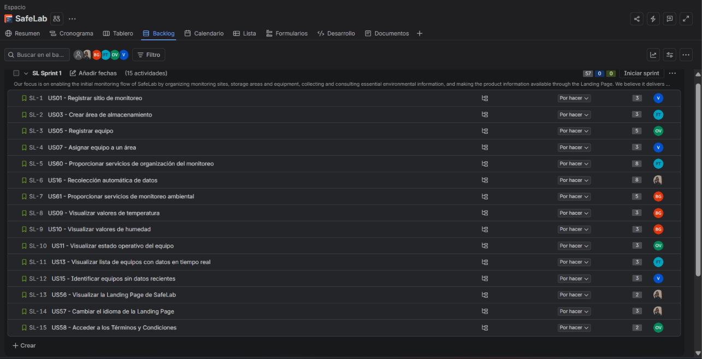

# **Chapter IV: Product Implementation & Validation**

## **4.1. Configuration Management Software**

### **4.1.1. Software Development Environment Configuration**

### **4.1.2. Source Code Management**

### **4.1.3. Source Code Style Guide & Conventions**

### **4.1.4. Software Deployment Configuration**

## **4.2. Landing Page & Mobile Application Implementation**

### **4.2.1. Sprint 1**

#### **4.2.1.1. Sprint Planning 1**

  En esta sección se presentan los principales aspectos definidos durante el Sprint Planning Meeting del Sprint 1 de SafeLab. La planificación establece el objetivo del Sprint, la capacidad del equipo y el alcance funcional seleccionado, priorizando las funcionalidades principales de organización y monitoreo ambiental, junto con la primera versión de la Landing Page.

<table border="1" style="width: 100%; border-collapse: collapse;">
  <tr>
    <th style="text-align: left; vertical-align: middle; padding: 6px; width: 35%;">Sprint #</th>
    <td style="text-align: left; vertical-align: middle; padding: 6px;">1</td>
  </tr>
  <tr>
    <th colspan="2" style="text-align: center; vertical-align: middle; padding: 6px;">Sprint Planning Background</th>
  </tr>
  <tr>
    <td style="text-align: left; vertical-align: middle; padding: 6px;"><b>Date</b></td>
    <td style="text-align: left; vertical-align: middle; padding: 6px;">2026-09-25</td>
  </tr>
  <tr>
    <td style="text-align: left; vertical-align: middle; padding: 6px;"><b>Time</b></td>
    <td style="text-align: left; vertical-align: middle; padding: 6px;">10:00 AM</td>
  </tr>
  <tr>
    <td style="text-align: left; vertical-align: middle; padding: 6px;"><b>Location</b></td>
    <td style="text-align: left; vertical-align: middle; padding: 6px;">UPC San Isidro</td>
  </tr>
  <tr>
    <td style="text-align: left; vertical-align: middle; padding: 6px;"><b>Prepared By</b></td>
    <td style="text-align: left; vertical-align: middle; padding: 6px;">Valeria Rojas</td>
  </tr>
  <tr>
    <td style="text-align: left; vertical-align: top; padding: 6px;"><b>Attendees (to planning meeting)</b></td>
    <td style="text-align: left; vertical-align: top; padding: 6px;">Braden Garcia / Victor Espino / Giusephi Carlos / Oscar Vara / Valeria Rojas</td>
  </tr>
  <tr>
    <td style="text-align: left; vertical-align: top; padding: 6px;"><b>Sprint 1 Review Summary</b></td>
    <td style="text-align: justify; vertical-align: top; padding: 6px;">The Sprint focused on organizing the SafeLab project, refining the requirements and Product Backlog, and preparing the Landing Page and the initial monitoring features required for the first product increment.</td>
  </tr>
  <tr>
    <td style="text-align: left; vertical-align: top; padding: 6px;"><b>Sprint 1 Retrospective Summary</b></td>
    <td style="text-align: justify; vertical-align: top; padding: 6px;">The team identified progress in the organization of requirements and project documentation, as well as opportunities to improve task coordination, distribution of responsibilities and consistency between the Product Backlog, Sprint Planning and implementation activities.</td>
  </tr>
  <tr>
    <th colspan="2" style="text-align: center; vertical-align: middle; padding: 6px;">Sprint Goal & User Stories</th>
  </tr>
  <tr>
    <td style="text-align: left; vertical-align: top; padding: 6px;"><b>Sprint 1 Goal</b></td>
    <td style="text-align: justify; vertical-align: top; padding: 6px;">
      Our focus is on enabling the initial monitoring flow of SafeLab by organizing monitoring sites, storage areas and equipment, collecting and consulting essential environmental information, and making the product information available through the Landing Page.  
      We believe it delivers greater visibility and initial control of monitored environments to hospital laboratory and pharmaceutical company personnel, while allowing potential users to understand the SafeLab solution.  
      This will be confirmed when users can register a monitoring site, create a storage area, register and assign equipment, automatically collect monitoring data, consult temperature, humidity and equipment operational status, identify equipment without recent data, and visitors can access the SafeLab Landing Page, its supported languages and Terms and Conditions.
    </td>
  </tr>
  <tr>
    <td style="text-align: left; vertical-align: middle; padding: 6px;"><b>Sprint 1 Velocity</b></td>
    <td style="text-align: left; vertical-align: middle; padding: 6px;">60 Story Points</td>
  </tr>
  <tr>
    <td style="text-align: left; vertical-align: middle; padding: 6px;"><b>Sum of Story Points</b></td>
    <td style="text-align: left; vertical-align: middle; padding: 6px;">57 Story Points</td>
  </tr>
</table>

#### **4.2.1.2. Aspect Leaders and Collaborators**

  En el Sprint 1 se definieron tres aspectos de trabajo, que corresponden al alcance funcional del Sprint Backlog 1. El aspecto <b>Organización del monitoreo</b> agrupa el registro de sitios de monitoreo, áreas de almacenamiento y equipos, así como sus servicios RESTful (US01, US03, US05, US07 y US60). El aspecto <b>Monitoreo ambiental</b> agrupa la recolección automática de datos, la consulta de temperatura, humedad y estado operativo, y sus servicios (US09, US10, US11, US13, US15, US16 y US61). El aspecto <b>Landing Page</b> agrupa la presentación pública de SafeLab, el cambio de idioma y el acceso a los Términos y Condiciones (US56, US57 y US58).

  Para cada aspecto se designó como líder (L) al integrante con mayor carga de horas asignadas en el Sprint Backlog 1, quien coordina el avance, define los criterios de terminado y verifica la integración del aspecto; los demás integrantes con tareas en el aspecto participan como colaboradores (C). La siguiente Leadership-and-Collaboration Matrix (LACX) resume esta distribución.

<table border="1" style="width: 100%; border-collapse: collapse;">
  <thead>
    <tr>
      <th style="text-align: center; vertical-align: middle; padding: 6px;">Team Member (Last Name, First Name)</th>
      <th style="text-align: center; vertical-align: middle; padding: 6px;">GitHub Username</th>
      <th style="text-align: center; vertical-align: middle; padding: 6px;">Organización del monitoreo</th>
      <th style="text-align: center; vertical-align: middle; padding: 6px;">Monitoreo ambiental</th>
      <th style="text-align: center; vertical-align: middle; padding: 6px;">Landing Page</th>
    </tr>
  </thead>
  <tbody>
    <tr>
      <td style="text-align: left; vertical-align: top; padding: 6px;">Carlos Lavado, Ever Giusephi</td>
      <td style="text-align: center; vertical-align: middle; padding: 6px;">sephi-dev05</td>
      <td style="text-align: center; vertical-align: middle; padding: 6px;">L</td>
      <td style="text-align: center; vertical-align: middle; padding: 6px;">C</td>
      <td style="text-align: center; vertical-align: middle; padding: 6px;">—</td>
    </tr>
    <tr>
      <td style="text-align: left; vertical-align: top; padding: 6px;">Espino Rossi, Victor Manuel</td>
      <td style="text-align: center; vertical-align: middle; padding: 6px;">Vmer140</td>
      <td style="text-align: center; vertical-align: middle; padding: 6px;">C</td>
      <td style="text-align: center; vertical-align: middle; padding: 6px;">C</td>
      <td style="text-align: center; vertical-align: middle; padding: 6px;">—</td>
    </tr>
    <tr>
      <td style="text-align: left; vertical-align: top; padding: 6px;">Garcia Cerpa, Braden Raid</td>
      <td style="text-align: center; vertical-align: middle; padding: 6px;">BradenGarcia</td>
      <td style="text-align: center; vertical-align: middle; padding: 6px;">—</td>
      <td style="text-align: center; vertical-align: middle; padding: 6px;">L</td>
      <td style="text-align: center; vertical-align: middle; padding: 6px;">—</td>
    </tr>
    <tr>
      <td style="text-align: left; vertical-align: top; padding: 6px;">Rojas Gomez, Valeria Alexandra</td>
      <td style="text-align: center; vertical-align: middle; padding: 6px;">ValeriaAler</td>
      <td style="text-align: center; vertical-align: middle; padding: 6px;">—</td>
      <td style="text-align: center; vertical-align: middle; padding: 6px;">C</td>
      <td style="text-align: center; vertical-align: middle; padding: 6px;">L</td>
    </tr>
    <tr>
      <td style="text-align: left; vertical-align: top; padding: 6px;">Vara Velásquez, Oscar Fernando</td>
      <td style="text-align: center; vertical-align: middle; padding: 6px;">varometro159</td>
      <td style="text-align: center; vertical-align: middle; padding: 6px;">C</td>
      <td style="text-align: center; vertical-align: middle; padding: 6px;">C</td>
      <td style="text-align: center; vertical-align: middle; padding: 6px;">C</td>
    </tr>
  </tbody>
</table>

#### **4.2.1.3. Sprint Backlog 1**

  El Sprint Backlog 1 reúne las User Stories y Work-items definidos para alcanzar el objetivo del primer Sprint de SafeLab. El trabajo se enfoca en establecer la organización inicial del entorno de monitoreo, permitir la recolección y consulta de información ambiental y desarrollar las funcionalidades correspondientes a la Landing Page. Las actividades se distribuyen entre los integrantes del equipo Meditrack y se estiman en horas para facilitar el seguimiento de su avance durante el Sprint.

<table border="1" style="width: 100%; border-collapse: collapse;">
  <thead>
    <tr>
      <th colspan="8" style="text-align: left; vertical-align: middle; padding: 6px;">Sprint # &nbsp;&nbsp; Sprint 1</th>
    </tr>
    <tr>
      <th style="text-align: center; vertical-align: middle; padding: 6px;">User Story Id</th>
      <th style="text-align: center; vertical-align: middle; padding: 6px;">Title</th>
      <th style="text-align: center; vertical-align: middle; padding: 6px;">Work-Item / Task Id</th>
      <th style="text-align: center; vertical-align: middle; padding: 6px;">Title</th>
      <th style="text-align: center; vertical-align: middle; padding: 6px;">Description</th>
      <th style="text-align: center; vertical-align: middle; padding: 6px;">Estimation (Hours)</th>
      <th style="text-align: center; vertical-align: middle; padding: 6px;">Assigned To</th>
      <th style="text-align: center; vertical-align: middle; padding: 6px;">Status</th>
    </tr>
  </thead>
  <tbody>
    <tr><td style="text-align:center; padding:6px;">US01</td><td style="padding:6px;">Registrar sitio de monitoreo</td><td style="text-align:center; padding:6px;">UT01</td><td style="padding:6px;">Implementar registro de sitio</td><td style="padding:6px;">Implementar el registro de un sitio de monitoreo con nombre y ubicación.</td><td style="text-align:center; padding:6px;">3</td><td style="padding:6px;">Victor Espino</td><td style="text-align:center; padding:6px;">To-Do</td></tr>
    <tr><td style="text-align:center; padding:6px;">US01</td><td style="padding:6px;">Registrar sitio de monitoreo</td><td style="text-align:center; padding:6px;">UT02</td><td style="padding:6px;">Validar datos del sitio</td><td style="padding:6px;">Validar que el registro requiera nombre y ubicación antes de almacenar el sitio.</td><td style="text-align:center; padding:6px;">3</td><td style="padding:6px;">Victor Espino</td><td style="text-align:center; padding:6px;">To-Do</td></tr>
    <tr><td style="text-align:center; padding:6px;">US03</td><td style="padding:6px;">Crear área de almacenamiento</td><td style="text-align:center; padding:6px;">UT03</td><td style="padding:6px;">Implementar creación de área</td><td style="padding:6px;">Implementar la creación de áreas de almacenamiento con nombre y tipo.</td><td style="text-align:center; padding:6px;">3</td><td style="padding:6px;">Giusephi Carlos</td><td style="text-align:center; padding:6px;">To-Do</td></tr>
    <tr><td style="text-align:center; padding:6px;">US03</td><td style="padding:6px;">Crear área de almacenamiento</td><td style="text-align:center; padding:6px;">UT04</td><td style="padding:6px;">Validar datos del área</td><td style="padding:6px;">Validar que el área cuente con nombre y tipo antes de registrarse.</td><td style="text-align:center; padding:6px;">3</td><td style="padding:6px;">Giusephi Carlos</td><td style="text-align:center; padding:6px;">To-Do</td></tr>
    <tr><td style="text-align:center; padding:6px;">US05</td><td style="padding:6px;">Registrar equipo</td><td style="text-align:center; padding:6px;">UT05</td><td style="padding:6px;">Implementar registro de equipo</td><td style="padding:6px;">Implementar el registro de equipos con nombre, tipo e identificador.</td><td style="text-align:center; padding:6px;">4</td><td style="padding:6px;">Oscar Vara</td><td style="text-align:center; padding:6px;">To-Do</td></tr>
    <tr><td style="text-align:center; padding:6px;">US05</td><td style="padding:6px;">Registrar equipo</td><td style="text-align:center; padding:6px;">UT06</td><td style="padding:6px;">Validar información del equipo</td><td style="padding:6px;">Validar los datos requeridos del equipo antes de completar su registro.</td><td style="text-align:center; padding:6px;">4</td><td style="padding:6px;">Oscar Vara</td><td style="text-align:center; padding:6px;">To-Do</td></tr>
    <tr><td style="text-align:center; padding:6px;">US07</td><td style="padding:6px;">Asignar equipo a un área</td><td style="text-align:center; padding:6px;">UT07</td><td style="padding:6px;">Implementar asignación de equipo</td><td style="padding:6px;">Implementar la asociación de un equipo registrado con un área de almacenamiento registrada.</td><td style="text-align:center; padding:6px;">3</td><td style="padding:6px;">Victor Espino</td><td style="text-align:center; padding:6px;">To-Do</td></tr>
    <tr><td style="text-align:center; padding:6px;">US07</td><td style="padding:6px;">Asignar equipo a un área</td><td style="text-align:center; padding:6px;">UT08</td><td style="padding:6px;">Validar asociación equipo-área</td><td style="padding:6px;">Verificar que la asignación conserve correctamente la relación entre el equipo y el área seleccionada.</td><td style="text-align:center; padding:6px;">3</td><td style="padding:6px;">Victor Espino</td><td style="text-align:center; padding:6px;">To-Do</td></tr>
    <tr><td style="text-align:center; padding:6px;">US60</td><td style="padding:6px;">Proporcionar servicios de organización del monitoreo</td><td style="text-align:center; padding:6px;">UT09</td><td style="padding:6px;">Implementar servicios de organización</td><td style="padding:6px;">Implementar las operaciones RESTful requeridas para sitios, áreas de almacenamiento y equipos.</td><td style="text-align:center; padding:6px;">5</td><td style="padding:6px;">Giusephi Carlos</td><td style="text-align:center; padding:6px;">To-Do</td></tr>
    <tr><td style="text-align:center; padding:6px;">US60</td><td style="padding:6px;">Proporcionar servicios de organización del monitoreo</td><td style="text-align:center; padding:6px;">UT10</td><td style="padding:6px;">Validar respuestas de organización</td><td style="padding:6px;">Validar las respuestas de las operaciones de organización y el manejo de recursos no disponibles.</td><td style="text-align:center; padding:6px;">5</td><td style="padding:6px;">Giusephi Carlos</td><td style="text-align:center; padding:6px;">To-Do</td></tr>
    <tr><td style="text-align:center; padding:6px;">US16</td><td style="padding:6px;">Recolección automática de datos</td><td style="text-align:center; padding:6px;">UT11</td><td style="padding:6px;">Implementar recolección automática</td><td style="padding:6px;">Implementar el registro automático de nuevas lecturas de monitoreo recibidas por SafeLab.</td><td style="text-align:center; padding:6px;">5</td><td style="padding:6px;">Valeria Rojas</td><td style="text-align:center; padding:6px;">To-Do</td></tr>
    <tr><td style="text-align:center; padding:6px;">US16</td><td style="padding:6px;">Recolección automática de datos</td><td style="text-align:center; padding:6px;">UT12</td><td style="padding:6px;">Asociar lecturas con equipos</td><td style="padding:6px;">Verificar que cada lectura recolectada quede asociada al equipo de monitoreo correspondiente.</td><td style="text-align:center; padding:6px;">5</td><td style="padding:6px;">Valeria Rojas</td><td style="text-align:center; padding:6px;">To-Do</td></tr>
    <tr><td style="text-align:center; padding:6px;">US61</td><td style="padding:6px;">Proporcionar servicios de monitoreo ambiental</td><td style="text-align:center; padding:6px;">UT13</td><td style="padding:6px;">Exponer datos ambientales</td><td style="padding:6px;">Implementar servicios RESTful para proporcionar temperatura, humedad y estado de los equipos.</td><td style="text-align:center; padding:6px;">4</td><td style="padding:6px;">Braden Garcia</td><td style="text-align:center; padding:6px;">To-Do</td></tr>
    <tr><td style="text-align:center; padding:6px;">US61</td><td style="padding:6px;">Proporcionar servicios de monitoreo ambiental</td><td style="text-align:center; padding:6px;">UT14</td><td style="padding:6px;">Validar consultas de monitoreo</td><td style="padding:6px;">Validar las consultas de monitoreo cuando los datos o el equipo solicitado no se encuentran disponibles.</td><td style="text-align:center; padding:6px;">4</td><td style="padding:6px;">Braden Garcia</td><td style="text-align:center; padding:6px;">To-Do</td></tr>
    <tr><td style="text-align:center; padding:6px;">US09</td><td style="padding:6px;">Visualizar valores de temperatura</td><td style="text-align:center; padding:6px;">UT15</td><td style="padding:6px;">Mostrar temperatura del equipo</td><td style="padding:6px;">Implementar la consulta y visualización del valor de temperatura disponible para un equipo.</td><td style="text-align:center; padding:6px;">3</td><td style="padding:6px;">Braden Garcia</td><td style="text-align:center; padding:6px;">To-Do</td></tr>
    <tr><td style="text-align:center; padding:6px;">US09</td><td style="padding:6px;">Visualizar valores de temperatura</td><td style="text-align:center; padding:6px;">UT16</td><td style="padding:6px;">Gestionar temperatura no disponible</td><td style="padding:6px;">Identificar correctamente cuando un equipo no dispone de una lectura de temperatura.</td><td style="text-align:center; padding:6px;">3</td><td style="padding:6px;">Braden Garcia</td><td style="text-align:center; padding:6px;">To-Do</td></tr>
    <tr><td style="text-align:center; padding:6px;">US10</td><td style="padding:6px;">Visualizar valores de humedad</td><td style="text-align:center; padding:6px;">UT17</td><td style="padding:6px;">Mostrar humedad del equipo</td><td style="padding:6px;">Implementar la consulta y visualización del valor de humedad disponible para un equipo.</td><td style="text-align:center; padding:6px;">3</td><td style="padding:6px;">Braden Garcia</td><td style="text-align:center; padding:6px;">To-Do</td></tr>
    <tr><td style="text-align:center; padding:6px;">US10</td><td style="padding:6px;">Visualizar valores de humedad</td><td style="text-align:center; padding:6px;">UT18</td><td style="padding:6px;">Gestionar humedad no disponible</td><td style="padding:6px;">Identificar correctamente cuando un equipo no dispone de una lectura de humedad.</td><td style="text-align:center; padding:6px;">3</td><td style="padding:6px;">Braden Garcia</td><td style="text-align:center; padding:6px;">To-Do</td></tr>
    <tr><td style="text-align:center; padding:6px;">US11</td><td style="padding:6px;">Visualizar estado operativo del equipo</td><td style="text-align:center; padding:6px;">UT19</td><td style="padding:6px;">Determinar estado operativo</td><td style="padding:6px;">Implementar la consulta del estado operativo de un equipo a partir de la información de monitoreo disponible.</td><td style="text-align:center; padding:6px;">3</td><td style="padding:6px;">Oscar Vara</td><td style="text-align:center; padding:6px;">To-Do</td></tr>
    <tr><td style="text-align:center; padding:6px;">US11</td><td style="padding:6px;">Visualizar estado operativo del equipo</td><td style="text-align:center; padding:6px;">UT20</td><td style="padding:6px;">Validar interrupción de monitoreo</td><td style="padding:6px;">Verificar el comportamiento cuando un equipo deja de proporcionar datos de monitoreo.</td><td style="text-align:center; padding:6px;">3</td><td style="padding:6px;">Oscar Vara</td><td style="text-align:center; padding:6px;">To-Do</td></tr>
    <tr><td style="text-align:center; padding:6px;">US13</td><td style="padding:6px;">Visualizar lista de equipos con datos en tiempo real</td><td style="text-align:center; padding:6px;">UT21</td><td style="padding:6px;">Mostrar equipos con valores actuales</td><td style="padding:6px;">Implementar la lista de equipos junto con sus valores actuales de monitoreo.</td><td style="text-align:center; padding:6px;">3</td><td style="padding:6px;">Giusephi Carlos</td><td style="text-align:center; padding:6px;">To-Do</td></tr>
    <tr><td style="text-align:center; padding:6px;">US13</td><td style="padding:6px;">Visualizar lista de equipos con datos en tiempo real</td><td style="text-align:center; padding:6px;">UT22</td><td style="padding:6px;">Identificar valores actuales faltantes</td><td style="padding:6px;">Verificar que la lista permita identificar equipos que no disponen de datos actuales.</td><td style="text-align:center; padding:6px;">3</td><td style="padding:6px;">Giusephi Carlos</td><td style="text-align:center; padding:6px;">To-Do</td></tr>
    <tr><td style="text-align:center; padding:6px;">US15</td><td style="padding:6px;">Identificar equipos sin datos recientes</td><td style="text-align:center; padding:6px;">UT23</td><td style="padding:6px;">Detectar equipos sin datos recientes</td><td style="padding:6px;">Implementar la identificación de equipos que no disponen de datos recientes de monitoreo.</td><td style="text-align:center; padding:6px;">3</td><td style="padding:6px;">Victor Espino</td><td style="text-align:center; padding:6px;">To-Do</td></tr>
    <tr><td style="text-align:center; padding:6px;">US15</td><td style="padding:6px;">Identificar equipos sin datos recientes</td><td style="text-align:center; padding:6px;">UT24</td><td style="padding:6px;">Validar identificación de equipos</td><td style="padding:6px;">Verificar que únicamente los equipos sin datos recientes sean identificados por esta funcionalidad.</td><td style="text-align:center; padding:6px;">3</td><td style="padding:6px;">Victor Espino</td><td style="text-align:center; padding:6px;">To-Do</td></tr>
    <tr><td style="text-align:center; padding:6px;">US56</td><td style="padding:6px;">Visualizar la Landing Page de SafeLab</td><td style="text-align:center; padding:6px;">UT25</td><td style="padding:6px;">Implementar contenido principal de Landing Page</td><td style="padding:6px;">Implementar el contenido principal necesario para presentar SafeLab públicamente.</td><td style="text-align:center; padding:6px;">3</td><td style="padding:6px;">Valeria Rojas</td><td style="text-align:center; padding:6px;">To-Do</td></tr>
    <tr><td style="text-align:center; padding:6px;">US56</td><td style="padding:6px;">Visualizar la Landing Page de SafeLab</td><td style="text-align:center; padding:6px;">UT26</td><td style="padding:6px;">Validar acceso público a Landing Page</td><td style="padding:6px;">Verificar que la Landing Page y su información principal puedan consultarse públicamente.</td><td style="text-align:center; padding:6px;">2</td><td style="padding:6px;">Valeria Rojas</td><td style="text-align:center; padding:6px;">To-Do</td></tr>
    <tr><td style="text-align:center; padding:6px;">US57</td><td style="padding:6px;">Cambiar el idioma de la Landing Page</td><td style="text-align:center; padding:6px;">UT27</td><td style="padding:6px;">Implementar contenido en inglés</td><td style="padding:6px;">Implementar el contenido en inglés (en_US) como idioma predeterminado de la Landing Page.</td><td style="text-align:center; padding:6px;">3</td><td style="padding:6px;">Valeria Rojas</td><td style="text-align:center; padding:6px;">To-Do</td></tr>
    <tr><td style="text-align:center; padding:6px;">US57</td><td style="padding:6px;">Cambiar el idioma de la Landing Page</td><td style="text-align:center; padding:6px;">UT28</td><td style="padding:6px;">Implementar cambio a español</td><td style="padding:6px;">Implementar el cambio de contenido a español latinoamericano (es_419).</td><td style="text-align:center; padding:6px;">3</td><td style="padding:6px;">Valeria Rojas</td><td style="text-align:center; padding:6px;">To-Do</td></tr>
    <tr><td style="text-align:center; padding:6px;">US58</td><td style="padding:6px;">Acceder a los Términos y Condiciones</td><td style="text-align:center; padding:6px;">UT29</td><td style="padding:6px;">Implementar acceso a Términos y Condiciones</td><td style="padding:6px;">Implementar el acceso a los Términos y Condiciones desde la Landing Page.</td><td style="text-align:center; padding:6px;">3</td><td style="padding:6px;">Oscar Vara</td><td style="text-align:center; padding:6px;">To-Do</td></tr>
    <tr><td style="text-align:center; padding:6px;">US58</td><td style="padding:6px;">Acceder a los Términos y Condiciones</td><td style="text-align:center; padding:6px;">UT30</td><td style="padding:6px;">Validar contenido de Términos y Condiciones</td><td style="padding:6px;">Verificar que el contenido correspondiente a los Términos y Condiciones pueda consultarse desde SafeLab.</td><td style="text-align:center; padding:6px;">2</td><td style="padding:6px;">Oscar Vara</td><td style="text-align:center; padding:6px;">To-Do</td></tr>
  </tbody>
</table>

  El Sprint Backlog 1 de SafeLab se gestiona mediante Jira, donde se encuentran organizadas las User Stories seleccionadas para el Sprint, sus estimaciones en Story Points, responsables y Work-items asociados. El tablero permite al equipo Meditrack realizar el seguimiento de las actividades y su estado durante el desarrollo del Sprint.

  

<i>Figura: Sprint Backlog 1 de SafeLab en Jira.</i>

**Board URL:** [SafeLab - Sprint 1](https://varojasg19.atlassian.net/jira/software/projects/SL/boards/35/backlog?atlOrigin=eyJpIjoiMzI0NTliNmQ5ZjRhNDcxMjhkNWJhYjFkM2RmZjQ3ZjYiLCJwIjoiaiJ9)

#### **4.2.1.4. Development Evidence for Sprint Review**

#### **4.2.1.5. Testing Suite Evidence for Sprint Review**

#### **4.2.1.6. Execution Evidence for Sprint Review**

#### **4.2.1.7. Services Documentation Evidence for Sprint Review**

#### **4.2.1.8. Software Deployment Evidence for Sprint Review**

  Durante el Sprint 1 se configuraron los entornos de despliegue de los productos digitales de SafeLab. La Landing Page se publica como sitio estático en GitHub Pages desde el repositorio <i>safelab-business-website</i> de la organización del equipo, y los servicios web se despliegan en Render como un Web Service basado en Docker, conectado a una base de datos PostgreSQL administrada en la misma plataforma. Las aplicaciones móviles se ejecutan en emuladores y dispositivos de prueba durante este Sprint y no se publican en tiendas de aplicaciones.

<table border="1" style="width: 100%; border-collapse: collapse;">
  <thead>
    <tr>
      <th style="text-align: center; vertical-align: middle; padding: 6px;">Producto</th>
      <th style="text-align: center; vertical-align: middle; padding: 6px;">Plataforma</th>
      <th style="text-align: center; vertical-align: middle; padding: 6px;">Configuración</th>
      <th style="text-align: center; vertical-align: middle; padding: 6px;">Evidencia</th>
    </tr>
  </thead>
  <tbody>
    <tr>
      <td style="text-align: left; vertical-align: top; padding: 6px;">Landing Page</td>
      <td style="text-align: left; vertical-align: top; padding: 6px;">GitHub Pages</td>
      <td style="text-align: left; vertical-align: top; padding: 6px;">Rama <code>main</code>, carpeta raíz (<code>/</code>)</td>
      <td style="text-align: left; vertical-align: top; padding: 6px;">Configuración de Pages y página publicada</td>
    </tr>
    <tr>
      <td style="text-align: left; vertical-align: top; padding: 6px;">Web Services (SafeLab Platform API)</td>
      <td style="text-align: left; vertical-align: top; padding: 6px;">Render · Web Service</td>
      <td style="text-align: left; vertical-align: top; padding: 6px;">Runtime Docker, plan free, región Oregon, health check <code>/actuator/health</code></td>
      <td style="text-align: left; vertical-align: top; padding: 6px;">Servicio creado, variables de entorno, despliegue exitoso y Swagger UI accesible</td>
    </tr>
    <tr>
      <td style="text-align: left; vertical-align: top; padding: 6px;">Base de datos</td>
      <td style="text-align: left; vertical-align: top; padding: 6px;">Render · PostgreSQL</td>
      <td style="text-align: left; vertical-align: top; padding: 6px;">Misma región que el Web Service; conexión mediante la Internal Database URL</td>
      <td style="text-align: left; vertical-align: top; padding: 6px;">Instancia creada y conexión verificada por el health check</td>
    </tr>
  </tbody>
</table>

##### **Landing Page**

  Para desplegar la Landing Page se realizaron las siguientes actividades:

<ul style="text-align: justify;">
  <li>Integración del contenido de la Landing Page en la rama <code>main</code> del repositorio <i>safelab-business-website</i>.</li>
  <li>Configuración de GitHub Pages en <b>Settings → Pages</b>, con la opción <b>Deploy from a branch</b>, la rama <code>main</code> y la carpeta raíz.</li>
  <li>Verificación del acceso público a la página y de la correcta carga de estilos, imágenes y logotipos.</li>
  <li>Revisión de la visualización en navegadores de escritorio y en dispositivos móviles.</li>
</ul>

##### **Web Services**

  Para desplegar SafeLab Platform API se realizaron las siguientes actividades:

<ul style="text-align: justify;">
  <li>Creación de la base de datos <b>PostgreSQL</b> en Render, en la región Oregon.</li>
  <li>Creación del <b>Web Service</b> a partir del repositorio del backend, con runtime Docker y el <code>Dockerfile</code> del proyecto.</li>
  <li>Configuración del health check en <code>/actuator/health</code>, que Render utiliza para verificar que el servicio está disponible.</li>
  <li>Configuración de las variables de entorno del servicio, detalladas en la siguiente tabla.</li>
  <li>Verificación del despliegue mediante el health check y el acceso a Swagger UI.</li>
</ul>
<table border="1" style="width: 100%; border-collapse: collapse;">
  <thead>
    <tr>
      <th style="text-align: center; vertical-align: middle; padding: 6px;">Variable de entorno</th>
      <th style="text-align: center; vertical-align: middle; padding: 6px;">Valor</th>
      <th style="text-align: center; vertical-align: middle; padding: 6px;">Propósito</th>
    </tr>
  </thead>
  <tbody>
    <tr>
      <td style="text-align: left; vertical-align: top; padding: 6px;"><code>SPRING_PROFILES_ACTIVE</code></td>
      <td style="text-align: left; vertical-align: top; padding: 6px;"><code>postgres</code></td>
      <td style="text-align: left; vertical-align: top; padding: 6px;">Activa la configuración de persistencia en PostgreSQL.</td>
    </tr>
    <tr>
      <td style="text-align: left; vertical-align: top; padding: 6px;"><code>DATABASE_URL</code></td>
      <td style="text-align: left; vertical-align: top; padding: 6px;">Internal Database URL de Render</td>
      <td style="text-align: left; vertical-align: top; padding: 6px;">Conecta el servicio con la base de datos; el backend la convierte al formato JDBC.</td>
    </tr>
    <tr>
      <td style="text-align: left; vertical-align: top; padding: 6px;"><code>CORS_ALLOWED_ORIGINS</code></td>
      <td style="text-align: left; vertical-align: top; padding: 6px;">Orígenes permitidos de los clientes</td>
      <td style="text-align: left; vertical-align: top; padding: 6px;">Autoriza las solicitudes de los clientes de SafeLab.</td>
    </tr>
    <tr>
      <td style="text-align: left; vertical-align: top; padding: 6px;"><code>SEED_RESET_ON_START</code></td>
      <td style="text-align: left; vertical-align: top; padding: 6px;"><code>false</code></td>
      <td style="text-align: left; vertical-align: top; padding: 6px;">Evita reiniciar los datos de muestra en cada despliegue.</td>
    </tr>
    <tr>
      <td style="text-align: left; vertical-align: top; padding: 6px;"><code>JAVA_OPTS</code></td>
      <td style="text-align: left; vertical-align: top; padding: 6px;"><code>-XX:MaxRAMPercentage=75.0</code></td>
      <td style="text-align: left; vertical-align: top; padding: 6px;">Ajusta el uso de memoria de la JVM al plan del servicio.</td>
    </tr>
  </tbody>
</table>

  Con estas configuraciones, la Landing Page y los servicios web quedan disponibles públicamente para la validación del Sprint, mientras que las aplicaciones móviles consumen los servicios desplegados durante su ejecución en emuladores y dispositivos de prueba.

#### **4.2.1.9. Team Collaboration Insights during Sprint**

## **4.3. Validation Interviews**

  En esta sección se registran y explican las entrevistas de validación, en las que usuarios de los dos segmentos objetivo interactúan con el Landing Page y la aplicación móvil de SafeLab para verificar si el producto les permite cumplir sus objetivos. La sección incluye el diseño de las sesiones, el registro de cada entrevista y la evaluación de los hallazgos según heurísticas de usabilidad, arquitectura de información y diseño inclusivo, siguiendo el formato de evaluación indicado para el proyecto.

### **4.3.1. Interview Design**

### **4.3.2. Interview Recording**

### **4.3.3. Evaluations Based on Heuristics**
